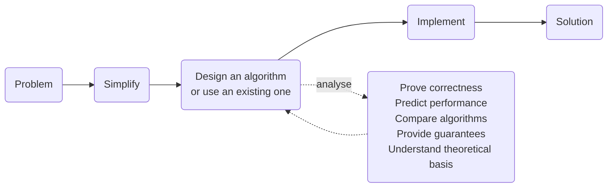

import SearchDemo from '@components/SearchDemo.astro';
import RecursionDemo from '@components/RecursionDemo.astro';
import ParallelSumDemo from '@components/ParallelSumDemo.astro';

> The **first topic** of the course. It raises the two questions the remaining
> fourteen topics keep coming back to: **what do you give up to get what**, and
> **what happens as the input grows**.

## What an algorithm does \{#what}

An [[algorithm|algorithm]] is a procedure for solving a problem, written out as
a finite number of unambiguous steps. The same input yields the same output,
and it must terminate.

But "it solves the problem" is not enough. There are usually several procedures
that solve the same problem, and what this course teaches is **how to judge
which one to pick**.

### Algorithms and data structures \{#with-data-structures}

Algorithms cannot be discussed on their own. A [[data-structure|data structure]]
is a way of storing information and getting it back, and the two need each
other.

- **An algorithm runs on top of a fitting data structure.** Binary search in
  this very topic is the example: it can only throw away half the array because
  a sorted array is a structure.
- **Implementing a data structure takes algorithms in turn.** A hash table has
  a hash function inside it; a heap has its sift-up and sift-down procedures.

Niklaus Wirth's line puts the relationship in a sentence.

> "Algorithms + Data Structures = Programs"  
> (Niklaus Wirth)

This course leans towards the algorithm side, but whenever a data structure
comes up we will name which of the two is holding the other up.

There are two reasons to need algorithms at all.

- To solve problems no other approach can solve
- To solve problems we already solve, **in less time and less space**

Nearly every area of computer science leans on this. Web search and routing,
the genome project, circuit layout and compilers, codecs and compression and
face recognition, recommendation and advertising, physical simulation — all of
it is algorithmic work.

### Problem · input · instance \{#problem}

Three words to separate first. If they blur together, the discussion later
tangles.

| Word | Meaning | Example |
| --- | --- | --- |
| **Problem** | The question you want answered | "Find one value in a sorted array" |
| **Input (parameters)** | What the problem takes | array `A`, search key `key` |
| **Instance** | The input filled in with concrete values | `A = [6, 13, 14, …]`, `key = 51` |

An algorithm is designed to solve a **problem**, but its performance is measured
on an **instance**. One fast instance does not make an algorithm fast. This
distinction is what later splits into "best, average, worst".

### What we actually do \{#what-we-do}



Design and analysis are not two stages you pass through once; they feed each
other. The analysis says it is slow, so you redesign, and analyse again. Half
of this course is practice at going round that loop.

**Not every problem needs a new algorithm.** Choosing an existing one is the
commoner job, and doing that means knowing what exists and what each one
demands. That is why this course walks through fourteen topics.

Analysis does five things.

| What it does | What it answers |
| --- | --- |
| Prove correctness | Does this procedure give the right answer **every** time |
| Predict performance | How long does it take as the input grows |
| Compare algorithms | Which of the two fits this problem |
| Provide guarantees | Is there a line it will not cross even in the worst case |
| Understand theoretical basis | Can we say no faster method exists at all |

The first three get used in this topic. The last two come back all semester as
we work through [[big-o|Big-O]] and lower bounds.

## What you give up to get what \{#trade-off}

A [[trade-off|trade-off]] is the frame that runs through the whole course.
**There is usually no "best algorithm".** There is only deciding what to give up.

### Choosing a tablet \{#tablet}

Say you are buying a tablet. Several things matter.

- Screen: resolution, refresh rate
- CPU
- Storage
- Pen sensitivity
- Price

As the specs go up, so does the price. Nothing is best at everything, and if it
were, you could not afford it. So it comes down to **deciding what to give up**.

Algorithms are the same. You spend memory to save time, give up the worst case
to make the average fast, or put a condition on the input (sorted, say) to buy
speed.

### Two ways to subtract \{#subtraction}

Here is one calculation done two ways: `361 - 192`.

- Borrowing

```plaintext
    361
-   192
-------
    169
```

You work right to left. `1 - 2` will not do, so you borrow from the digit
above. What you borrowed changes the next column, so this **has to be done in
order**.

- Allowing negative digits

```plaintext
    361
-   192
-------
    (2)(-3)(-1)     each column subtracted independently
```

Subtract each column as it stands: `3-1=2`, `6-9=-3`, `1-2=-1`. No column waits
on another, so **all three can be computed at the same time.**

That result is not the answer yet, though. The negative digits have to go
before it reads as a number, and they go by carrying a 10 leftwards, starting
from the right.

```plaintext
(2)(-3)(-1)      ones: -1 + 10 = 9, borrow 1 from the tens
(2)(-4)( 9)      tens: -4 + 10 = 6, borrow 1 from the hundreds
(1)( 6)( 9)  =  169
```

**This tidying is sequential.** The left digit is only settled once the right
one has been dealt with. So the shape is **compute in parallel, tidy up in
sequence**.

One more, `301 - 192`, where the tidying spreads one place further.

```plaintext
    301                    301
-   192                -   192
-------                -------
    109                    (2)(-9)(-1)  →  (2)(-10)(9)  →  (1)(0)(9)  =  109
```

`0 - 9 = -9`. With the left-hand method you would have to borrow from the digit
above, and since that digit is `0` you must go **one further up still**. The
right-hand method just writes `-9` and moves on. Having no dependency between
columns is what this method is worth.

But the dependency comes back during the tidying. The tens digit becomes `-10`
and reaches into the hundreds again. **It was deferred, not removed.**

| | Borrowing | Negative digits |
| --- | --- | --- |
| Per-column work | must be sequential | **can be parallel** |
| Dependency between columns | yes (the borrow propagates) | none |
| What is carried along | borrow information | a negative value per column |
| Finishing | none | one more pass to combine |

Both give the right answer. Which is better depends on **what you want to
save**. If you have hardware that can work on the columns at once, the right one
wins; if you handle one column at a time anyway, there is no reason to add a
cleanup pass, so the left one wins.

**This example is not about subtraction.** It is about several procedures giving
the same answer, and which is better depending on **where you are going to run
it**.

### Where parallelism actually wins \{#parallel}

The subtraction above does not show the payoff well. The per-column subtraction
finishes at once, but the carry propagation is sequential again, so at three
digits the step counts tie, three against three.

Other operations keep the payoff. **Adding up many values** is one. Adding
sixteen numbers one at a time takes 15 steps, because each addition needs the
previous sum. Adding them in pairs and climbing takes 4.

<ParallelSumDemo />

**The number of additions is the same, 15.** That is 8 + 4 + 2 + 1. Only the
time shrank, and it cost eight workers in the first step. The
[[trade-off|trade-off]] of spending resources to buy time is here too.

Adding n values takes $$n-1$$ steps in sequence and $$\log_2 n$$ steps in
pairs. **That is the same shape as sequential versus binary search, which this
topic reaches shortly.** One halves the input, the other halves the work in
each round, and they arrive at the same place.

One thing decides whether parallelism is available: **what waits on what**.

#### Even with many cores \{#cores}

None of this is only on paper. A modern CPU has several cores, each running its
own thread, so eight additions really can happen at the same moment.

**And yet running the sequential sum on eight cores keeps one core busy.** The
other seven wait for the previous sum. Move to sixteen cores and it is still 15
steps, **because the waiting is in the algorithm, not in the hardware**.

Adding in pairs does not use all eight the whole way either. It falls
8 → 4 → 2 → 1 and the last addition is done alone. Whatever stays sequential is
the floor, however many cores you add.

So the road forks.

- **Reshape the algorithm to fit the hardware.** Knowing there are many cores,
  rewrite the procedure so nothing waits.
- **Build hardware to fit the algorithm.** GPUs exist to run thousands of the
  same computation at once; NPUs exist to do little but matrix multiplication.
  The deferred carry we saw earlier (carry-save) sits inside multipliers for the
  same reason.

**Algorithms run on machines.** The question the subtraction example asked,
where are you going to run it, comes back here. Which side to change is also a
choice.

### Accuracy and speed \{#accuracy-speed}

The same story shows up in deep learning. Say you are choosing between three
models.

| | Model 1 | Model 2 | Model 3 |
| --- | --- | --- | --- |
| Accuracy | 0.8 | 0.7 | **0.9** |
| Speed | 0.5 s | **0.1 s** | 10 min |

Model 3 is the most accurate but takes ten minutes. For a service that has to
answer in real time, model 2 is the answer. For diagnostic support where
accuracy matters, model 3 is.
**You can only choose once you know what the problem demands.**

## Example 1. Two searches \{#search}

Now two real algorithms, side by side. They are different procedures for the
same problem, and where the performance difference comes from is the point of
the example.

**Problem**: find the position of one value in a sorted array.

```plaintext
index    0   1   2   3   4   5   6   7   8   9  10  11  12  13  14
value    6  13  14  25  33  43  51  53  64  72  84  93  95  96 101
```

The value to find is `51`. It sits at index 6.

### Sequential search \{#sequential}

[[sequential-search|Sequential search]] compares one element at a time from the
front.

```plaintext
ALGORITHM SequentialSearch(A, n, key)
    for i <- 0 to n-1 do
        if A[i] = key then
            return i
    return -1
```

`51` is at index 6, so it takes **7 comparisons** to find, having looked at
indices 0 through 6 one by one.

- Run

```sh
cd src/topic-01-intro-search/01_sequential_search
make -f /work/Makefile sequentialSearch.out && ./sequentialSearch.out
```

- Output

```console
n = 15, key = 51
index = 6, comparisons = 7
```

The comparison count depends on where the value sits.

| | Comparisons | Time | When |
| --- | --- | --- | --- |
| Best | $$1$$ | $$O(1)$$ | the first element is `key` |
| Average | $$\dfrac{n+1}{2}$$ | $$O(n)$$ | **the value is in the array** and its position is evenly distributed |
| Worst | $$n$$ | $$O(n)$$ | it is the last element, or not there at all |

Here is why the average carries a condition. Looking for a value that is not
there always costs all n comparisons. So once "it might not be there" is in the
mix, the average rises above $$\frac{n+1}{2}$$.
**When you state a performance, state which instances you are assuming.**

**Space is $$O(1)$$ in all three cases.** The only extra memory is one index
variable, so it does not change with where the value sits.

Stating the algorithm in one line means stating the worst case: **time
$$O(n)$$ · space $$O(1)$$.** That is the line it can be guaranteed not to
cross.

### Binary search \{#binary}

[[binary-search|Binary search]] looks at the middle first. It uses the fact that
**the array is sorted**.

```plaintext
ALGORITHM BinarySearch(A, n, key)
    lo <- 0
    hi <- n - 1
    while lo <= hi do
        mid <- lo + (hi - lo) / 2
        if A[mid] = key then return mid
        else if A[mid] < key then lo <- mid + 1
        else hi <- mid - 1
    return -1
```

Compare with the middle value: if the key is larger, **throw away the whole left
half**. If it is smaller, throw away the right half. Every comparison halves the
candidates.

Finding `51` goes like this.

| Comparison | lo | hi | mid | `A[mid]` | Decision |
| --- | --- | --- | --- | --- | --- |
| 1 | 0 | 14 | 7 | 53 | 53 > 51 → go left |
| 2 | 0 | 6 | 3 | 25 | 25 < 51 → go right |
| 3 | 4 | 6 | 5 | 43 | 43 < 51 → go right |
| 4 | 6 | 6 | 6 | **51** | found |

**Four comparisons**, against sequential search's seven.

- Output

```console
n = 15, key = 51
index = 6, comparisons = 4
```

**Time** $$O(\log n)$$ · **space** $$O(1)$$. Starting from n and halving until
one is left takes $$\log_2 n$$ steps.

### The two searches side by side \{#demo}

Both look for `51` in the same array. Press **step** to take one comparison at a
time. While sequential search crawls one cell forward, binary search erases half
the candidates.

<SearchDemo values={[6, 13, 14, 25, 33, 43, 51, 53, 64, 72, 84, 93, 95, 96, 101]} target={51} />

The dimmed cells are **the range there is no longer any reason to look at**.
Binary search erases half of what is left with every comparison. That is what
$$O(\log n)$$ actually is.

Searching for a value that is not in the array widens the gap. Try `50`.

<SearchDemo values={[6, 13, 14, 25, 33, 43, 51, 53, 64, 72, 84, 93, 95, 96, 101]} target={50} />

Sequential search has to **count all fifteen** before it can say the value is
absent. Binary search takes four.

### The difference shows as n grows \{#comparison}

Seven against four on a fifteen-element array is not much. Grow the input and it
changes.

| Elements | Sequential | Binary | Measured ratio | Theoretical $$n / \lceil \log_2 n \rceil$$ |
| --- | --- | --- | --- | --- |
| 1,000 | 23.88 μs | 2.27 μs | 10.5× | 100 |
| 10,000 | 202.31 μs | 2.23 μs | 90.9× | 714 |
| 100,000 | 1,847.54 μs | 6.40 μs | 288.7× | 5,882 |
| 1,000,000 | 24,519.73 μs | 9.15 μs | **2,679.8×** | 50,000 |

Ten times the elements costs sequential search roughly ten times the time,
because it is $$O(n)$$. Ten times the elements costs binary search three or four
more comparisons, because it is $$O(\log n)$$.

**Notice too that the measured ratio is below the theoretical one.** At a
million elements theory says fifty thousand times; the measurement says 2,680.
Binary search jumps around the array and the cache does not help it much, while
sequential search sweeps memory front to back and the cache helps a great deal.
**Big-O describes growth, not time.** Even so, the fact that the gap widens with
n is plain in the measurement too.

This is why the course keeps returning to [[big-o|Big-O]].
**On small inputs anything works. Algorithms differ once the input is large.**

### It is not free \{#binary-cost}

None of this means binary search is always better. **The array has to be
sorted.**

- Run binary search on an unsorted array and you get a **wrong answer**.
  Sequential search is right either way.
- Sorting itself costs. Sorting in order to search once is usually a loss.
  If you will search many times, sorting first pays.

**It is a trade-off.** Binary search buys speed by putting a condition on its
input. Shuffle the array in the practice code and see for yourself.

## Example 2. Recursion and iteration \{#fibonacci}

The second example implements the same formula two ways. The point is to see
**how the shape of the code changes the performance**.

The Fibonacci sequence is defined like this.

$$
F(n) = \begin{cases}
0 & n = 0 \\
1 & n = 1 \\
F(n-1) + F(n-2) & n > 1
\end{cases}
$$

It runs 0, 1, 1, 2, 3, 5, 8, 13, 21, 34, and so on.

### Transcribing the definition \{#recursive}

Written with [[recursion|recursion]], the code and the definition look almost
the same.

```plaintext
ALGORITHM FibonacciRecursive(n)
    if n <= 1 then return n
    return FibonacciRecursive(n-1) + FibonacciRecursive(n-2)
```

It reads well and is faithful to the definition. Unfold the computation of
`F(5)`, though, and the problem shows. Press **step** and follow the call stack
as it deepens and drains.

<RecursionDemo n={5} />

Two things are visible at once. **The depth of the stack** only grows in
proportion to n, which is why recursion costs $$O(n)$$ space. **The number of
calls**, on the other hand, multiplies every time the tree branches, which is
why the time is $$O(2^n)$$.

A red cell marks **a value computed again after it was already known**. `F(3)`
is computed twice and `F(2)` three times, and across fifteen calls there are
only six distinct values. As n grows this duplication explodes.

### Carrying only the last two terms \{#iterative}

Written as a loop, each term is computed exactly once.

```plaintext
ALGORITHM FibonacciIterative(n)
    if n <= 1 then return n
    prev <- 0
    curr <- 1
    for i <- 2 to n do
        next <- prev + curr
        prev <- curr
        curr <- next
    return curr
```

All the next term needs is **the two before it**. Carry those two and walk
forward.

### How far apart they get \{#fib-comparison}

The practice code counts calls as well as timing them. The count explains the
cause better than the clock does.

**The call count is the same wherever you run it; the time is not.** The
milliseconds below are one run in the practice container, so different numbers
on your machine are fine. What is worth comparing is not the absolute value but
**the factor per ten steps of n**.

The program prints its column headers in Korean; the same run reads like this.

| n | Recursive calls | Recursive (ms) | Iterative (ms) | F(n) |
| --- | --- | --- | --- | --- |
| 10 | 177 | 0.00 | 0.0010 | 55 |
| 20 | 21,891 | 0.03 | 0.0010 | 6,765 |
| 30 | 2,692,537 | 5.59 | 0.0020 | 832,040 |
| 40 | **331,160,281** | 363.86 | 0.0010 | 102,334,155 |

Every ten steps of n multiply the call count by **roughly 100**, and the
recursive time follows it from 0.00 to 363.86 ms. The iterative column stays
around 0.001 ms while n quadruples — too fast for milliseconds to show the
difference at all.

| | Time | Space |
| --- | --- | --- |
| Recursion | $$O(2^n)$$ | $$O(n)$$ (call stack) |
| Iteration | $$O(n)$$ | $$O(1)$$ |

### How many terms get computed \{#terms}

$$O(2^n)$$ and $$O(n)$$ are conclusions, and they follow from **how many terms
each one computes**.

- **Iteration computes $$n + 1$$ terms**, one each from $$F(0)$$ to $$F(n)$$.
- **Recursion computes at least $$2^{n/2}$$.** Writing $$C(n)$$ for the number
  of calls, $$C(n) = 2F(n+1) - 1$$, and since $$F(n) \ge 2^{n/2 - 1}$$ for
  $$n \ge 2$$, the call count grows faster than $$2^{n/2}$$.

The numbers in the table above are exactly this $$C(n)$$: $$C(10) = 177$$ and
$$C(40) = 331{,}160{,}281$$.

At $$n = 100$$ it comes to this.

```plaintext
C(100) = 2 × F(101) - 1
       = 1,146,295,688,027,634,168,201        about 1.1 × 10^21 calls
```

At one nanosecond per call that is **36,000 years**. Counting the few additions
and comparisons inside each call pushes it past 50,000. Iteration, meanwhile,
computes 101 terms and stops.

**Same formula, same answer, different shape of code.** What separated them was
neither the language nor the hardware but the number of terms computed.

### Is recursion bad, then \{#recursion-verdict}

No. **What is slow here is the duplicated work, not the recursion.**

Store the values you have already computed and recursion is $$O(n)$$ too. That
technique is [[memoization|memoization]], one half of
[[dynamic-programming|dynamic programming]]. Topic 14 comes back to this exact
code.

Plenty of problems are natural to write recursively, too. Splitting a problem
into smaller problems of the same shape is [[divide-and-conquer|divide and
conquer]]; merge sort and quicksort live there, and topic 03 covers them.

Some languages compile tail recursion into a loop. Where that happens, a
recursive version runs as fast as an iterative one.

**So the summary is this.** Recursion versus iteration is not what decides the
performance. **How many times you do the same work** is.

## What to take away \{#takeaway}

1. **There is usually no best algorithm.** There is only deciding what to give up.
2. **The difference shows once the input is large.** On small inputs anything works.
3. **Speed comes with conditions.** Binary search demands a sorted array. Use it
   without checking and you get a wrong answer.
4. **The shape of the code changes the performance.** The same formula splits
   into $$O(2^n)$$ and $$O(n)$$ depending on how you write it.

## How to follow this course \{#how-to-study}

Since this is the first week, a word about how things will run.

**The pseudocode is the reference.** Every example is one `.pseudo` file with a
C and a Python implementation beside it. Both use the same function names and
produce the same result. The goal is not to learn a language but to see **what
the same procedure looks like in two of them**.

**Do not stop at reading the code.** Most examples in this course print a
comparison count or a call count alongside the answer. Change the numbers, run
it again, and the complexity written in the table turns into something you can
feel. Each example's README ends with **things to change**, so start there.

**When you are stuck, check inside the container.** Questions are answered
against the practice container. If a locally installed environment gives a
different result, run it once more in the container before asking.

## Practice code \{#code}

It lives in the `src/topic-01-intro-search/` folder of the
[lec-algorithm/algorithm-code](https://github.com/lec-algorithm/algorithm-code/tree/main)
repository. Each example is one piece of pseudocode with a C and a Python
implementation beside it.

```plaintext
src/topic-01-intro-search/
├── 01_sequential_search/    # sequential search, 7 comparisons
├── 02_binary_search/        # binary search, 4 comparisons
└── 03_fibonacci/            # recursion vs iteration, call counts
```

Open a file and press the **▶ button** at the top right of the editor to run it.
For how to set that up, see [preparing the practice environment](/article/setup-guide/).

**Things to try**

- Shuffle the array in binary search and run it. Watch how the answer goes wrong.
- Change the search key to a value that is not in the array and compare the two
  comparison counts.
- Raise Fibonacci's `n` to 45 and then 50. You will see where recursion stops
  being practical.

## History \{#changelog}

The slides and this note are versioned together. The current version is
**v1**, shown at the bottom left of the slides.

| Version | Date | Changes |
| --- | --- | --- |
| v1 | 2026-09-01 | First release |
