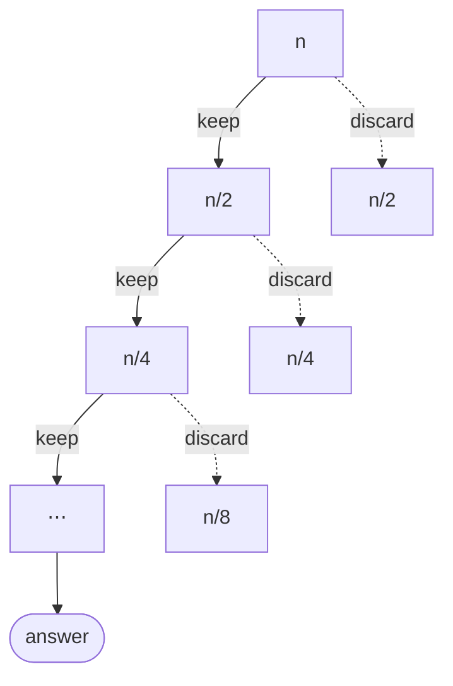

import QuickDemo from '@components/QuickDemo.astro';

> Topic 03 called splitting and combining a seesaw. Merge sort got the
> split for free and worked in the combine. This topic sits on the other
> end: **a sort that works while splitting, with a free combine.** And
> to guard that split, **randomness** enters as an ingredient.

## Ingredient: randomness \{#random}

Before quicksort, one ingredient. Where does a computer's randomness
come from?

What `rand()` produces is in fact **pseudorandom**. It takes an input
called a **seed**, runs it through **a function**, and a function means
**same input, same output.** Instead of the library, the practice code
builds the same kind of generator (minstd) to show it.

```c
static int64_t state = 1;

/* Change the seed, like srand. */
void setSeed(int64_t seed) {
    state = seed;
}

/* Produce the next number, like rand. x <- x * 16807 mod (2^31 - 1) */
int64_t nextRandom(void) {
    state = state * 16807 % 2147483647;
    return state;
}
```

- Run

```sh
cd src/topic-04-quick-sort/01_random
make -f /work/Makefile randomProgram.out && ./randomProgram.out
```

- Result

```console
seed = 1 : 16807 282475249 1622650073
seed = 1 : 16807 282475249 1622650073
seed = 2 : 33614 564950498 1097816499
```

Feed seed 1 twice and you get **exactly the same sequence** twice.
Things change only when the seed changes. That is why real programs
seed with something hard to predict, like the clock: `srand(time(NULL))`
is the C idiom.

### Where randomness is needed \{#random-why}

Why is a YouTube video ID not a sequential number like `10500`,
`10501`? Every second, videos land on many servers and many databases
(sharding), and IDs must never collide. Sequential numbers would demand
coordination between servers, so they are out; IDs are built on
randomness instead. Unpredictability of the next ID comes as a bonus.

In this topic randomness has its own job: **choosing the pivot.** Why
that job needs randomness becomes clear after we meet quicksort's worst
case.

## Example 1. Quicksort \{#quick-sort}

The idea comes from Topic 03's seesaw. **Pick one reference value (the
pivot), send smaller elements left and larger ones right. The pivot
lands in its final place, and sorting each side finishes the job.** The
split was by value, so combining is concatenation: free.

### The engine is the partition \{#partition}

As the merge was merge sort's engine, the **partition** is
quicksort's. Take the first element as the pivot, sweep the rest, and
gather everything smaller (the teal zone) on the left. At the end, drop
the pivot at the boundary.

<QuickDemo mode="partition" />

One partition costs 9 comparisons and **settles one final position**.
This pivot, `2`, is nearly the minimum, so the left zone ended up with
only `1` in it. The story of good and bad pivots starts right here.

### The full sort \{#quick-sort-demo}

Put that partition on recursion and you have the full sort. The
`qs(0, 9)` chip names the current call. Settled pivots pile up in
green.

<QuickDemo mode="sort" />

### As a procedure \{#quick-pseudo}

```plaintext
ALGORITHM QuickSort(A, lo, hi)
    if lo >= hi then return          // one element: already sorted
    p <- Partition(A, lo, hi)        // put the pivot in its place
    QuickSort(A, lo, p-1)            // left of the pivot (smaller)
    QuickSort(A, p+1, hi)            // right of the pivot (larger or equal)

ALGORITHM Partition(A, lo, hi)
    pivot <- A[lo]
    i <- lo                          // i: end of the smaller zone
    for j <- lo+1 to hi do
        if A[j] < pivot then
            i <- i + 1
            swap A[i], A[j]
    swap A[lo], A[i]                 // pivot to the boundary
    return i                         // the pivot's final position
```

The recursion skeleton matches merge sort. What differs is where the
work happens: merge sort worked **after returning** (combine),
quicksort works **before recursing** (divide).

### As code \{#quick-code}

```c
static int partition(int a[], int lo, int hi, int *comparisons, int *moves) {
    int pivot = a[lo];
    int i = lo;
    for (int j = lo + 1; j <= hi; j++) {
        (*comparisons)++;
        if (a[j] < pivot) {
            i++;
            swap(a, i, j, moves);
        }
    }
    swap(a, lo, i, moves);
    return i;
}

void quickSort(int a[], int lo, int hi, int *comparisons, int *moves) {
    if (lo >= hi) {
        return;
    }
    int p = partition(a, lo, hi, comparisons, moves);
    quickSort(a, lo, p - 1, comparisons, moves);
    quickSort(a, p + 1, hi, comparisons, moves);
}
```

- Run

```sh
cd src/topic-04-quick-sort/02_quick_sort
make -f /work/Makefile quickSort.out && ./quickSort.out
```

- Result

```console
before: 2 8 5 9 1 10 7 6 4 3
after : 1 2 3 4 5 6 7 8 9 10
comparisons = 25, moves = 21
```

The demo's counters land on the same numbers.

### Analysis \{#quick-analysis}

When the pivot keeps landing near the middle, the array splits roughly
in half, and the picture becomes merge sort's: partition costs sum to
$$n$$ per level, $$\log n$$ levels, so the **average is
$$O(n \log n)$$.**

The trouble is a bad pivot. Measured on our array:

| Input | Comparisons | Moves |
| --- | --- | --- |
| Sample array | $$25$$ | $$21$$ |
| Already sorted | $$45$$ | $$0$$ |
| Reversed | $$45$$ | $$15$$ |

**Already-sorted input is the worst case.** The first-element pivot is
the minimum every time, so the left side is empty and the right side
shrinks by one. Levels number $$n$$ instead of $$\log n$$, and
comparisons hit $$\frac{n(n-1)}{2} = 45$$, that is, $$O(n^2)$$.
Insertion sort had sorted input as its best case (9 comparisons);
quicksort is its exact opposite. **Which inputs are good inputs also
differs by algorithm.**

Put merge sort next to it and each one's price shows.

| | Comparisons | Moves | Extra space | Worst | Stability |
| --- | --- | --- | --- | --- | --- |
| Merge sort | 22 | 68 | temp array $$O(n)$$ | $$O(n \log n)$$ | Stable |
| Quicksort | 25 | 21 | recursion stack $$O(\log n)$$ | $$O(n^2)$$ | Unstable |

Quicksort spends three more comparisons but moves a third as much, and
works inside the given array with no temp. Nothing round-trips
wholesale as in merge sort. In exchange it gave up the $$O(n^2)$$ risk
and stability: swapping distant elements means equal keys keep no
guaranteed order. Why practical libraries favor quicksort variants as
their default sort is written in this table: fast on average, few
moves, thrifty with memory.

### How to choose the pivot \{#pivot}

The key to dodging the worst case is pivot choice.

- **Option 1. Random.** Pick the pivot at random in every partition.
  Then for any input, even an adversarial one built on purpose, the
  **expected time is $$O(n \log n)$$.** The worst case stops being "a
  particular input" and becomes "a particular input meeting particular
  random numbers", which in practice never happens. This is where the
  ingredient we prepared gets used.
- **Option 2. Median of three.** Look at the first, middle, and last
  elements and take their median as the pivot. Median-of-3 dodges the
  sorted-input trap cheaply.

Since the median came up, three terms worth separating: the **mean** is
the sum divided by the count, the **median** is the middle of the
lineup, and the **mode** is the most frequent value. The ideal pivot is
the median, because it cuts the array exactly in half.

## Example 2. Quickselect \{#quick-select}

Change the question. When you need just **the k-th smallest value**,
like a class rank, must you sort everything? Sorting costs
$$O(n \log n)$$. There is a cheaper way.

Look again at what the partition guarantees: **the pivot's position is
final.** If the pivot stands in the $$k$$-th slot, its value is the
answer. If it stands earlier, the answer is on the right; later, on the
left. **The side without the answer is discarded whole.**

<QuickDemo mode="select" k={5} />

### As a procedure \{#select-pseudo}

```plaintext
ALGORITHM QuickSelection(A, n, k)
    lo <- 0, hi <- n-1
    loop
        p <- Partition(A, lo, hi)    // the same partition as quicksort
        if p = k-1 then              // the pivot is exactly k-th
            return A[p]
        else if p > k-1 then
            hi <- p-1                // answer on the left; discard the right
        else
            lo <- p+1                // answer on the right; discard the left
```

The partition is quicksort's. Only one thing differs: quicksort dug
into **both sides**, quickselect digs into **one**. It is the same move
binary search made against sequential search: throw half away.

### As code \{#select-code}

```c
int quickSelection(int a[], int n, int k, int *comparisons, int *moves) {
    int lo = 0;
    int hi = n - 1;
    while (1) {
        int p = partition(a, lo, hi, comparisons, moves);
        if (p == k - 1) {
            return a[p];
        }
        if (p > k - 1) {
            hi = p - 1;
        } else {
            lo = p + 1;
        }
    }
}
```

- Run

```sh
cd src/topic-04-quick-sort/03_quick_selection
make -f /work/Makefile quickSelection.out && ./quickSelection.out
```

- Result

```console
before: 2 8 5 9 1 10 7 6 4 3
after : 1 2 3 4 5 10 7 6 9 8
k = 5 -> value = 5
comparisons = 16, moves = 15
```

**Look at the after line.** Only the first five slots settled; the rest
is still shuffled. The answer arrived without sorting everything.
Fully sorting the same array takes 25 comparisons; selection took
**16**.

### Analysis \{#select-analysis}

Why one-sided digging pays this well shows in the tree. A discarded
side is never touched again.



Quicksort walked every branch, paying $$n$$ per level for $$\log n$$
levels. Quickselect rides a single lane down, so the cost halves each
round:

$$
n + \frac{n}{2} + \frac{n}{4} + \cdots \leq 2n
$$

So the **average is $$O(n)$$.** For $$n = 10$$ that is roughly
$$10 + 5 + 2 + 1 = 18$$, and the measured 16 sits right there.

Two cautions.

- **The worst case is still $$O(n^2)$$.** The bad-pivot trap remains,
  so serious implementations use a random pivot here too.
- **It finds "the k-th", not "a value".** Checking whether a value
  exists is searching, Topic 01's job. On a sorted array, binary search
  does it for $$O(\log n)$$, cheaper.

## Seven sorts side by side \{#comparison}

| Sort | Best | Average | Worst | Space | Stability | Kind |
| --- | --- | --- | --- | --- | --- | --- |
| Selection sort | $$O(n^2)$$ | $$O(n^2)$$ | $$O(n^2)$$ | $$O(1)$$ | Unstable | Comparison |
| Insertion sort | $$O(n)$$ | $$O(n^2)$$ | $$O(n^2)$$ | $$O(1)$$ | Stable | Comparison |
| Shell sort | $$O(n \log n)$$ | $$O(n^{1.5})$$ | $$O(n^2)$$ | $$O(1)$$ | Unstable | Comparison |
| Bubble sort | $$O(n^2)$$ | $$O(n^2)$$ | $$O(n^2)$$ | $$O(1)$$ | Stable | Comparison |
| Merge sort | $$O(n \log n)$$ | $$O(n \log n)$$ | $$O(n \log n)$$ | $$O(n)$$ | Stable | Comparison |
| Counting sort | $$O(n + k)$$ | $$O(n + k)$$ | $$O(n + k)$$ | $$O(n + k)$$ | Stable | Non-comparison |
| Quicksort | $$O(n \log n)$$ | $$O(n \log n)$$ | $$O(n^2)$$ | $$O(\log n)$$ | Unstable | Comparison |

The table has seven rows now. Need a guaranteed worst case: merge.
Fast on average with tight memory: quick. Narrow integer keys:
counting. A stream of nearly-sorted input: insertion. **Choosing a sort
is choosing a trade-off.**

## What to keep \{#takeaway}

- A computer's randomness is **pseudorandom**. Same seed, same
  sequence, and therefore reproducible.
- **Quicksort**: the partition settles the pivot's place, then both
  sides are dug. Work in the split, combine for free: merge sort's
  mirror image.
- Average $$O(n \log n)$$, few moves, in place. The price: a worst
  case of $$O(n^2)$$, and stability.
- **Sorted input is quicksort's worst case**, the exact opposite of
  insertion sort. Good inputs differ by algorithm.
- The antidote to the worst case is a **random pivot**: expected
  $$O(n \log n)$$ on any input.
- **Quickselect**: the same partition digging one side gives the k-th
  value in average $$O(n)$$, without finishing the sort.

## Practice code \{#code}

It lives in the
[lec-algorithm/algorithm-code](https://github.com/lec-algorithm/algorithm-code/tree/main)
repository under `src/topic-04-quick-sort/`. Each example pairs one
pseudocode file with C and Python implementations.

```plaintext
src/topic-04-quick-sort/
├── 01_random/            # pseudorandomness, same seed = same sequence
├── 02_quick_sort/        # quicksort, 25 comparisons 21 moves
└── 03_quick_selection/   # quickselect, the 5th value in 16 comparisons
```

Open a file and press the **▶ button** at the top right of the editor
to run it. See
[Setting up the practice environment](/article/setup-guide/) for how to
run things.

**Try it yourself**

- Feed quicksort the sorted array `1 2 … 10`. Comparisons jump to 45;
  watch what the worst case looks like.
- Change the partition to pick its pivot with `01_random`'s generator.
  The sorted-input trap disappears.
- Set quickselect's `k` to 1 and 10 and measure: 9 and 20 comparisons,
  either way cheaper than the full sort's 25.
- Seed with `time(NULL)` and watch a different sequence appear on every
  run.
