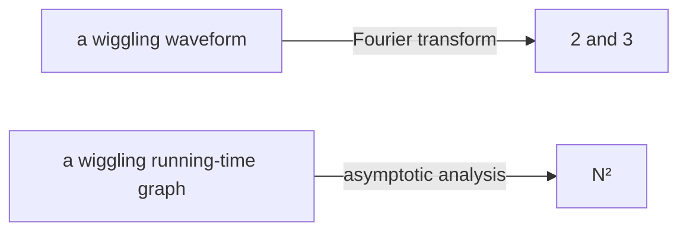

import GrowthDemo from '@components/GrowthDemo.astro';

> Through Topics 01 to 04 we have already been saying $$O(n)$$ and
> $$O(n \log n)$$. They appeared in every table, and the demo counters
> confirmed the numbers. This topic firms up the **language itself**:
> where it comes from, what it means exactly, and how to use it well.

## A language for summaries \{#language}

A challenge first. You have a wildly wiggling waveform. How would you
describe it to someone? Neither formulas nor words come easily.

But if the waveform happens to be the sum of a 2Hz and a 3Hz signal,
then after a Fourier transform the graph has **bars at exactly two
places, 2 and 3.** The description collapses to two numbers.



That is precisely this topic's job: a language that summarizes a
running-time graph of thousands of measurements **in one word,
$$N^2$$.** For the waveform story, see 3Blue1Brown's
[video on the Fourier transform](https://www.youtube.com/watch?v=spUNpyF58BY).

## The first road: measure \{#measure}

We timed a program at growing input sizes.

| $$N$$ | 250 | 500 | 1,000 | 2,000 | 4,000 | 8,000 | 16,000 |
| --- | --- | --- | --- | --- | --- | --- | --- |
| time (s) | 0.0 | 0.0 | 0.1 | 0.8 | 6.4 | 51.1 | ? |

Can you fill in the question mark? Watch the times as $$N$$ doubles:
$$0.8 \to 6.4 \to 51.1$$, about **8 times** each step. Since
$$2^3 = 8$$, the time follows $$N^3$$, and the next cell should be
$$51.1 \times 8 \approx 409$$ seconds. This is the **doubling
hypothesis**: measure, double, and read the ratio.

Measuring is powerful, but it has three limits.

- **It is tied to the machine and the language.** As we have repeated
  since Topic 01, the milliseconds are not the same everywhere.
- **It knows nothing about the $$N$$ you have not visited.** The next
  cell costs seven minutes of waiting; the one after, an hour.
- **It cannot explain why.** It reports the 8, but the reason lives in
  the code.

## The second road: count \{#count}

So the second road counts **operations** instead of seconds, building a
mathematical model straight from the code.

### 1-sum: counting everything \{#one-sum}

Code that counts the zeros in an array:

```c
int count = 0;
for (int i = 0; i < N; i++)
    if (a[i] == 0)
        count++;
```

Every kind of operation can be tallied.

| Operation | Frequency |
| --- | --- |
| variable declaration | $$2$$ |
| assignment | $$2$$ |
| `<` compare | $$N + 1$$ |
| `==` compare | $$N$$ |
| array access | $$N$$ |
| increment | $$N$$ \~ $$2N$$ |

The increment is a range because `count++` runs between 0 and $$N$$
times depending on the input. Best and worst cases are already visible.

### 2-sum: counting is work too \{#two-sum}

Move to counting pairs that sum to zero, and the table gets heavy.

```c
int count = 0;
for (int i = 0; i < N; i++)
    for (int j = i+1; j < N; j++)
        if (a[i] + a[j] == 0)
            count++;
```

| Operation | Frequency |
| --- | --- |
| variable declaration | $$N + 2$$ |
| assignment | $$N + 2$$ |
| `<` compare (inner loop) | $$\dfrac{N(N+1)}{2}$$ |
| `==` compare | $$\dfrac{N(N-1)}{2}$$ |
| array access | $$N(N-1)$$ |
| increment | $$\dfrac{N(N-1)}{2}$$ \~ $$N(N-1)$$ |

Exact, but nobody can carry this table around. A triple loop doubles it
again. **The counting itself must be simplified.**

### Simplifying \{#simplify}

Two conventions shrink the table to one line.

- **Cost model**: count **one representative operation** instead of
  all of them — here, array accesses. Pick the most frequent or the
  most expensive one.
- **Tilde notation**: keep only the leading term.
  $$N(N-1) = N^2 - N$$ becomes $$\sim N^2$$. As $$N$$ grows, the lower
  terms shrink into irrelevance.

The practice code validates the model. Counting array accesses matches
the theory to the digit, and the doubling experiment lands on 4 and 8
**independent of the machine**.

- Run

```sh
cd src/topic-05-complexity/01_three_sum
make -f /work/Makefile threeSum.out && ./threeSum.out
```

- Result

```console
N = 100
1-sum: count = 1, accesses = 100
2-sum: count = 19, accesses = 9900
3-sum: count = 642, accesses = 485100

doubling N: accesses ratio
     N        2-sum        3-sum
   200         4.02         8.12
   400         4.01         8.06
```

$$9900 = N(N-1)$$ and $$485100 = 3\binom{N}{3}$$. Measuring gave us
51.1 seconds; counting also gives us **why it is 8 times**.

## Asymptotic analysis \{#asymptotic}

The end of simplification is keeping only the growth rate at large
$$N$$ — [[asymptotic-analysis|asymptotic analysis]]. Remarkably, real
algorithms cluster into just a few growth rates.

### Seven growth classes \{#growth}

Each step doubles $$n$$. Watch what each class does, and how long it
takes on a computer doing $$10^9$$ operations per second.

<GrowthDemo />

A few doublings in, the $$2^n$$ row crosses into years. The ratio
badges are this topic's point: **×4 is quadratic, ×8 is cubic, and
squaring itself is exponential.** The ratios from the doubling
experiment are the fingerprints of the classes.

We have met all seven already.

| Class | Where we met it |
| --- | --- |
| $$1$$ | counting sort's slot arithmetic (Topic 03) |
| $$\log n$$ | binary search (Topic 01) |
| $$n$$ | sequential search (Topic 01), quickselect (Topic 04) |
| $$n \log n$$ | merge sort (Topic 03), quicksort average (Topic 04) |
| $$n^2$$ | selection, insertion, bubble sort (Topic 02), 2-sum |
| $$n^3$$ | 3-sum (this topic) |
| $$2^n$$ | recursive Fibonacci (Topic 01) |

### Decades change, classes remain \{#decades}

Adapted from Sedgewick: the problem size solvable in a few minutes, by
decade.

| Growth | 1970s | 1980s | 1990s | 2000s |
| --- | --- | --- | --- | --- |
| $$n$$ | millions | tens of millions | hundreds of millions | billions |
| $$n \log n$$ | hundreds of thousands | millions | millions | hundreds of millions |
| $$n^2$$ | hundreds | thousands | thousands | tens of thousands |
| $$n^3$$ | a hundred | hundreds | a thousand | thousands |
| $$2^n$$ | about 20 | the 20s | the 20s | about 30 |

While computers got thousands of times faster, the $$2^n$$ row moved
from 20 to 30. The same conclusion as Topic 02's 317 years and Topic
03's factor of 30 million: **a class gap cannot be closed with
hardware.**

## Four notations \{#notation}

Now the grammar of the language. Four to distinguish.

| Notation | Example | Meaning | Used for |
| --- | --- | --- | --- |
| tilde $$\sim$$ | $$\sim 10n^2$$ | leading term, **constant included** | approximate models |
| big theta $$\Theta$$ | $$\Theta(n^2)$$ | exactly that growth rate | classifying algorithms |
| big O $$O$$ | $$O(n^2)$$ | that rate **or slower** (upper bound) | guaranteeing ceilings |
| big omega $$\Omega$$ | $$\Omega(n^2)$$ | that rate **or faster** (lower bound) | proving floors |

$$O(n^2)$$ contains $$10n^2$$, and also $$100n$$, and
$$22n \log n$$ — it is a **fence** meaning "grows no faster than
$$n^2$$". $$\Omega$$ is the fence in the other direction, and we have
met it: **every comparison sort is $$\Omega(n \log n)$$** — Topic 03's
lower bound was exactly this notation. $$\Theta$$ is when the two
fences meet.

### A common confusion \{#misuse}

**Big O does not mean "worst case."** Best, average, and worst are the
axis of *which inputs you look at*; $$O \cdot \Theta \cdot \Omega$$
are the axis of *which direction you fence the growth rate from*. Two
independent axes, freely combined. Saying "quicksort's **average** is
$$O(n \log n)$$ and its **worst** is $$O(n^2)$$", as we have all
along, is the precise usage.

One convention to know: in practice, $$O$$ is often written where
$$\Theta$$ is meant — "merge sort is $$O(n \log n)$$". The upper bound
is true, so it is not wrong, and this course follows that convention.

## Quiz \{#quiz}

Three problems with the new grammar.

**Problem 1.** The time complexity of this code?

```c
for (int i = 0; i < 2*n; i++)
    for (int j = n-1000; j < n; j++)
        for (int k = n/2; k < n; k++)
            sum++;
```

A triple loop is not automatically $$O(n^3)$$. The outer runs $$2n$$
times, the middle a **fixed 1,000**, the inner $$n/2$$.
$$2n \cdot 1000 \cdot \frac{n}{2} = 1000n^2$$, so $$O(n^2)$$.
**A constant-bounded loop contributes no degree.**

**Problem 2.** A function that finds the minimum and subtracts it from
everyone?

```c
void reduce(int vals[], int n) {
    int minIndex = 0;
    for (int i = 0; i < n; i++)
        if (vals[i] < vals[minIndex])
            minIndex = i;
    int minVal = vals[minIndex];
    for (int i = 0; i < n; i++)
        vals[i] = vals[i] - minVal;
}
```

The two loops run **side by side**, so
$$O(n) + O(n) = O(n)$$. Only nested loops multiply.

**Problem 3.** The maximum difference between two elements?

```c
int maxDifference(int vals[], int n) {
    int max = 0;
    for (int i = 0; i < n; i++)
        for (int j = 0; j < n; j++)
            if (vals[i] - vals[j] > max)
                max = vals[i] - vals[j];
    return max;
}
```

Two nested loops of $$n$$ each: $$O(n^2)$$. Note, though, that finding
the maximum and minimum separately solves this in $$O(n)$$.
**Analysis grades the code you have, not the problem itself.** To speak
about the problem's limit you need a tool like Topic 03's lower-bound
argument.

## What to keep \{#takeaway}

- Two roads to performance: **measuring** (experiments) and
  **counting** (mathematical models). Measuring is quick but
  machine-bound; counting also gives the reason.
- **The doubling experiment**: the ratio when $$n$$ doubles is the
  fingerprint of the degree. ×2 linear, ×4 quadratic, ×8 cubic.
- Do not count everything. Simplify with a **cost model** (one
  representative operation) and the **tilde** (leading term).
- Real growth rates cluster into about **seven classes**, and a class
  gap cannot be closed with hardware.
- $$O$$ is a ceiling, $$\Omega$$ a floor, $$\Theta$$ both meeting.
  **An axis independent of best, average, and worst.**
- Constant-bounded loops add no degree; side-by-side loops add; only
  nested loops multiply.

## Practice code \{#code}

It lives in the
[lec-algorithm/algorithm-code](https://github.com/lec-algorithm/algorithm-code/tree/main)
repository under `src/topic-05-complexity/`.

```plaintext
src/topic-05-complexity/
└── 01_three_sum/    # counting 1-, 2-, 3-sum + the doubling experiment
```

Open a file and press the **▶ button** at the top right of the editor
to run it. See
[Setting up the practice environment](/article/setup-guide/) for how to
run things.

**Try it yourself**

- Run the same experiment in real time with `doubling_time.py`. The
  numbers differ by machine; the ratios still gather around 4 and 8.
- Add pruning to 3-sum and watch the ratio stay near 8. Constants
  shrink; the degree stays.
- Run the doubling experiment on Topic 01's Fibonacci: how much does
  the time grow when $$n$$ increases by one? That is the exponential's
  fingerprint.

## History \{#changelog}

The slides and this note are versioned together. The current version is
**v1**, shown at the bottom left of the slides.

| Version | Changes |
| --- | --- |
| v1 | First release |
