import HuffmanDemo from '@components/HuffmanDemo.astro';
import LzwDemo from '@components/LzwDemo.astro';
import TreeFigure from '@components/TreeFigure.astro';
import CoinDemo from '@components/CoinDemo.astro';
import ActivityDemo from '@components/ActivityDemo.astro';
import KnapsackDemo from '@components/KnapsackDemo.astro';

> Topics 03 and 04 were a strategy for splitting problems (divide and
> conquer), and Topic 05 was the language for measuring their cost. This
> topic is the second strategy.  
> **Pick what looks best right now, and never look back.**  
> We will see when this simple attitude is optimal and when it goes wrong,
> then follow it all the way to Huffman coding, which uses it to compress
> data.

## The greedy attitude \{#greedy}

A [[greedy-algorithm|greedy algorithm]] solves a problem by **always picking
the option that looks best among those available right now**. It does not
ask whether today's best leads to the best overall.

The Korean film *The Man from Nowhere* sums up this attitude in one line:
"I live only for today." Greedy does not plan for tomorrow; it lives only
for today.

- It picks a **local optimum**.
- It decides **from the current situation alone**, looking at neither past
  nor future choices.
- **Once it picks something, it never takes it back.**
- That is why it is simple and fast.

### Making the largest number \{#largest-number}

Say you want the largest number from the digit cards `3 9 5 9 7 1`. Without
a second thought, you put the largest card first.

$$
\text{LargestNumber}(3, 9, 5, 9, 7, 1) = 9 \,\|\, \text{LargestNumber}(3, 5, 9, 7, 1)
$$

Putting a 9 in front is the best move at that moment, and the same question
is then asked of the remaining cards. The answer is `997531`. Here greedy
is simply correct. This topic's question is **whether that is always so**.

## Example 1. Coin change \{#coin-change}

- **Problem**: the fewest coins that make a given amount
- **Coins**: 500 won, 100 won, 50 won, 10 won
- **Greedy strategy**: pay with **the largest coin first** that does not
  exceed the remaining amount.

For 1260 won: two 500s (260 left), two 100s (60 left), one 50 (10 left),
one 10. **6 coins**, and that is optimal. Pay them one step at a time. The
unit being looked at has an orange outline, and each coin paid flies down
into the tray.

<CoinDemo />

- Pseudocode

```plaintext
ALGORITHM CoinChange(coins, m, amount)
    count <- 0
    for i <- 0 to m-1 do                // coins sorted largest first
        k <- amount / coins[i]          // how many of this coin fit (quotient)
        count <- count + k
        amount <- amount - k * coins[i] // the amount left (remainder)
    return count
```

- C implementation

```c
int coinChange(const int coins[], int m, int amount, int used[]) {
    int count = 0;
    for (int i = 0; i < m; i++) {
        used[i] = amount / coins[i];
        count += used[i];
        amount -= used[i] * coins[i];
    }
    return count;
}
```

### What if there were a 40-won coin \{#coin-counter}

Feed the same code a different set of coins. In a country with 50, 40, and
10 won coins, make change for 80 won. At the end, the demo sets greedy's
answer beside the true minimum.

<CoinDemo coins={[50, 40, 10]} amount={80} />

- Run

```sh
cd src/topic-06-greedy/01_coin_change
make -f /work/Makefile coinChange.out && ./coinChange.out
```

- Result

```console
coins = {500, 100, 50, 10}, amount = 1260
greedy: 500x2 100x2 50x1 10x1 -> 6 coins

coins = {50, 40, 10}, amount = 80
greedy: 50x1 10x3 -> 4 coins
```

Greedy grabbed the 50 first and filled the remaining 30 with three 10s, for
**4 coins**. But two 40s make **2 coins**. The procedure did not change;
the coin set did, and optimality broke.

It is no accident that greedy works for our coins. 500 is a multiple of
100, 100 of 50, and 50 of 10. **One large coin exactly replaces several
small ones**, so paying with the large one first never costs anything. 50
is not a multiple of 40, so that relationship breaks, and the gap leaves
room for amounts where greedy is not optimal.

Still, the multiple-of relationship is only a **sufficient condition** for
greedy to work. US coins (25, 10, 5, and 1 cent) are always greedy-optimal
even though 25 is not a multiple of 10. Whether greedy works for a given
coin system can only be settled by checking amount by amount.

## Example 2. Activity selection \{#activity-selection}

- **Problem**: fit as many non-overlapping meetings as possible into one
  room
- **Input**: a (start time, end time) for each meeting
- **Greedy strategy**: pick **the meeting that ends earliest** first.

Line up six meetings by end time, and from the front pick only those that
do not overlap the previous pick. In the first step the bars swap places
into end-time order, and the orange dashed line follows "the time the meetings
picked so far end" to the right.

<ActivityDemo />

Gathering the picks on a single time axis gives this. The axis below is time.

```mermaid
%%{init: {"gantt": {"useWidth": 900, "barHeight": 26, "barGap": 8, "fontSize": 14, "sectionFontSize": 14, "leftPadding": 90}, "themeVariables": {"activeTaskBkgColor": "#22c55e", "activeTaskBorderColor": "#16a34a", "doneTaskBkgColor": "#d4d4d8", "doneTaskBorderColor": "#a1a1aa", "taskTextDarkColor": "#111827", "taskTextColor": "#111827"}}}%%
gantt
  dateFormat x
  axisFormat %s
  tickInterval 1second
  section by end time
  (1, 3) picked : active, t1, 1000, 3000
  (2, 5) overlaps : done, t2, 2000, 5000
  (4, 6) picked : active, t3, 4000, 6000
  (6, 7) picked : active, t4, 6000, 7000
  (5, 8) overlaps : done, t5, 5000, 8000
  (8, 9) picked : active, t6, 8000, 9000
```



Notice that (6, 7) was picked right after (4, 6). A meeting that starts
exactly when the previous one ends counts as not overlapping.

Why "ends earliest" of all things? Because **the earlier a meeting ends,
the more time is left**. Other criteria fall apart easily.

- **Starts earliest first**: a single all-day meeting like (0, 10) pushes
  every other meeting out.
- **Shortest first**: if one short meeting straddles the boundary between
  two long ones, you gain one and lose two.

```plaintext
ALGORITHM ActivitySelection(A, n)
    sort A by end time, ascending
    selected <- [A[0]]                  // start with the earliest-ending activity
    lastEnd <- A[0].end
    for i <- 1 to n-1 do
        if A[i].start >= lastEnd then   // starts after the previous one ends
            append A[i] to selected
            lastEnd <- A[i].end
    return selected
```

- Run

```sh
cd src/topic-06-greedy/02_activity_selection
make -f /work/Makefile activitySelection.out && ./activitySelection.out
```

- Result

```console
input   : (5,8) (1,3) (8,9) (2,5) (6,7) (4,6)
by end  : (1,3) (2,5) (4,6) (6,7) (5,8) (8,9)
selected: (1,3) (4,6) (6,7) (8,9)
count = 4
```

The cost is the sort, $$O(n \log n)$$, plus one pass, $$O(n)$$, for
$$O(n \log n)$$ in total. Greedy algorithms often end up exactly like this:
**one sort that decides what to look at first, and one pass**.

## Example 3. Fractional knapsack \{#fractional-knapsack}

You are at an all-you-can-eat buffet, and your stomach has a fixed size.
Do you fill it with gimbap, soup, and soda, or with sushi, steak, and
wine? For the same amount, you eat the most valuable things first. That is
the fractional knapsack problem.

- **Problem**: maximize the value packed into a knapsack of fixed capacity
- **Condition**: items **can be split**.
- **Greedy strategy**: pack items with the highest **value per unit
  weight** first.

| Item | Weight | Value | Value per unit weight |
| --- | --- | --- | --- |
| 1 | 10 | 60 | 6 |
| 2 | 20 | 100 | 5 |
| 3 | 30 | 120 | 4 |

With capacity 15, take all of item 1 (weight 10, value 60), then a quarter
of item 2 to fill the remaining 5 (value 25). Total **85**. The cards line up by value per unit weight, then the
knapsack bar fills in each item's colour.

<KnapsackDemo />

```plaintext
ALGORITHM FractionalKnapsack(items, n, capacity)
    sort items by value per unit weight v/w, descending
    total <- 0
    for i <- 0 to n-1 do
        if capacity = 0 then break
        if items[i].w <= capacity then          // fits whole: take it whole
            total <- total + items[i].v
            capacity <- capacity - items[i].w
        else                                    // does not fit: take what fits
            fraction <- capacity / items[i].w
            total <- total + items[i].v * fraction
            capacity <- 0
    return total
```

- Run

```sh
cd src/topic-06-greedy/03_fractional_knapsack
make -f /work/Makefile fractionalKnapsack.out && ./fractionalKnapsack.out
```

- Result

```console
capacity = 15
  take (w=10, v=60, v/w=6.0) x 1.00
  take (w=20, v=100, v/w=5.0) x 0.25
  total value = 85.00

capacity = 50
  take (w=10, v=60, v/w=6.0) x 1.00
  take (w=20, v=100, v/w=5.0) x 1.00
  take (w=30, v=120, v/w=4.0) x 0.67
  total value = 240.00

0/1 greedy, capacity = 50
  total value = 160
```

### If items cannot be split \{#zero-one}

The last line matters. It packs in the same order but **without
splitting**. Running it as a demo shows the gap that is left.

<KnapsackDemo capacity={50} whole />

With capacity 50, after items 1 and 2 the remaining 20 cannot
hold item 3 (weight 30), so it stops at 160. Yet packing items 2 and 3
gives **220**.

When items can be split, you can fill the knapsack with no gap left, so
"richest first" is optimal. When they cannot, the gap a rich item leaves behind
becomes a loss. This problem (the 0/1 knapsack) is solved by
[[dynamic-programming|dynamic programming]] in Topic 14.

## The criterion decides the answer: scheduling \{#scheduling}

Imagine you are the operating system, lining up five jobs for one CPU.
Jobs $$J_1, \dots, J_5$$ arrived in that order, and their running times are
$$T = \{10, 2, 1, 100, 5\}$$. Each job waits until every job ahead of it
has finished. We want to minimize the **average waiting time**.

| Criterion | Order | Waiting times | Average |
| --- | --- | --- | --- |
| order of arrival | $$J_1 J_2 J_3 J_4 J_5$$ | 0, 10, 12, 13, 113 | $$148 / 5 = 29.6$$ |
| longest first | $$J_4 J_1 J_5 J_2 J_3$$ | 0, 100, 110, 115, 117 | $$442 / 5 = 88.4$$ |
| shortest first | $$J_3 J_2 J_5 J_1 J_4$$ | 0, 1, 3, 8, 18 | $$30 / 5 = 6$$ |

**Shortest Job First** is the greedy choice, and it is optimal for average
waiting time. A job's running time is added to the waiting time of every
job behind it. The first job's time is added four times; the last job's,
not at all. So the right move is to put **the shortest job where it gets
multiplied the most**.

$$
\text{total waiting time} = 4t_1 + 3t_2 + 2t_3 + 1t_4 + 0t_5
$$

Here $$t_k$$ is the running time of the $$k$$-th job to run.

Coins, meetings, knapsacks, and jobs all share one shape: **choose a
criterion, sort by it, and take from the front.** Designing a greedy
algorithm is mostly a matter of finding that criterion.

## When greedy works \{#when-greedy-works}

### Finding the longest path \{#longest-path}

Now a case where greedy goes wrong. Starting at the root and going down to a
leaf, we want the largest possible sum of the numbers along the way.

<TreeFigure tree={{ v: "20", l: { v: "2", l: { v: "7" }, r: { v: "10" } }, r: { v: "3", r: { v: "1" } } }} />

Greedy takes the larger branch at every fork: from 20 to 3 (it beats 2),
then from 3 to 1. The sum is **24**. But the answer is **32**, going from
20 to 2 and from 2 to 10. A 10 was hiding behind the 2 that looked small
at the time. Greedy **does not look below.** Once it picks 3, it never
looks at the 2 side again.

<TreeFigure tree={{ v: "20", tone: "eval", l: { v: "2", tone: "eval", l: { v: "7" }, r: { v: "10", tone: "eval" } }, r: { v: "3", tone: "focus", r: { v: "1", tone: "focus" } } }} caption="Orange: the path greedy chose (24) · Green: the answer (32)" />

### Two properties \{#two-properties}

For greedy to guarantee an optimal solution, the problem needs two
properties.

- **Greedy choice property**: some optimal solution contains the best
  choice made right now.
- **Optimal substructure**: adding that choice to an optimal solution of
  the remaining problem gives an optimal solution of the whole.

Activity selection has both. In any optimal solution, swapping the first
meeting for "the meeting that ends earliest" causes no overlap and keeps
the count the same, so picking it first costs nothing. That is the greedy
choice property. What remains after the pick is a smaller problem of the
same shape, and that is optimal substructure. The longest path lacks the
first property: there is no guarantee that the path through the larger
branch now is part of an optimal solution.

Without a proof, greedy is only **a fast approximation**. So whenever you
use a greedy algorithm, you also have to argue why its criterion is
optimal.

### Side by side with other strategies \{#strategies}

| Feature | Greedy | Divide and conquer | Dynamic programming |
| --- | --- | --- | --- |
| How it chooses | the one best choice now | solve subproblems and combine | consider every case |
| Time | fast | moderate | slow |
| Optimality | only when the conditions hold | depends on the problem | always |
| Memory | little | moderate (recursion stack) | a lot (table) |
| Implementation | easy | moderate | hard |
| Typical examples | coin change, activity selection | merge sort, quicksort | 0/1 knapsack, longest common subsequence |

We will meet more famous greedy algorithms later. Prim's algorithm, which
builds a minimum spanning tree, and Dijkstra's algorithm, which finds
shortest paths, come in Topic 12. Both are greedy: they pick "whatever is
closest right now."

## Data compression \{#compression}

Now on to the most famous thing greedy builds. **Data compression** shrinks
the size of a file or data.

- **Purpose**: save space when storing and time when sending.
- **General files**: GZIP, BZIP2, 7z, file systems (NTFS, ZFS)
- **Multimedia**: images (GIF, JPEG), sound (MP3), video (MPEG)

### Run-length encoding \{#rle}

Start with the simplest compression. Here is a 40-bit bitstring.

```plaintext
0000000000000001111111000000011111111111
```

That is 15 zeros, 7 ones, 7 zeros, and 11 ones. Write down **only the
lengths** of the runs of equal values, and agree that 0s and 1s alternate.
With 4 bits per length:

```plaintext
 15   7    7    11
1111 0111 0111 1011      40 bits → 16 bits
```

- **How many bits per length?** It depends on the longest run. Here we need
  up to 15, so 4 bits.
- **What if a run is longer than that?** Insert a run of length 0. Twenty
  0s become "15 zeros, 0 ones, 5 zeros."

Run-length encoding does not compress much, but it is easy to implement and
fast. It works better the longer the runs of equal values, so it is used for
black-and-white images, where neighboring pixels share a value, and for
fax.

### Fixed-length codes \{#fixed-length}

How many bits per character? ASCII uses 8 for every character. But a genome
has only four letters: A, C, T, G.

| Character | ASCII (8 bits) | 2-bit code |
| --- | --- | --- |
| A | 01000001 | 00 |
| C | 01000011 | 01 |
| T | 01010100 | 10 |
| G | 01000111 | 11 |

With $$N$$ letters, $$8N$$ bits become $$2N$$ bits. This is a
**fixed-length code**. A $$k$$-bit code can hold $$2^k$$ characters, so 32
kinds of characters need only 5 bits.

Can we do better? **If some characters appear far more often than others**,
give them shorter codes. That is a **variable-length code**.

## Variable-length codes and ambiguity \{#variable-length}

Variable-length codes run into trouble right away. Here is a signal
received in Morse code.

```plaintext
···−−−···
```

Is it SOS? It is if you split it as `···`(S) `−−−`(O) `···`(S). But split as
`···−`(V) `−−···`(7) it is V7, and split as `·`(E) `·`(E) `·−−`(W) `−·`(N)
`··`(I) it is EEWNI. **It is not clear where one character ends and the
next begins.** Morse code solves this by putting a pause between
characters.

Text without spaces has the same problem. "GODISNOWHERE" could be "God is
now here" or "God is nowhere."

There are three fixes.

- **Fixed-length code**: you know exactly how many bits to cut at, so there
  is no ambiguity.
- **Separator**: attach a character marking the end of every codeword. The
  pause in Morse code is exactly this.
- **Prefix-free code**: make sure no codeword is the beginning (a prefix)
  of another codeword.

### Prefix-free codes \{#prefix-free}

A [[prefix-free-code|prefix-free code]] is a code where, for every pair of
characters $$i, j$$, the code for $$i$$ is not a prefix of the code for
$$j$$. For example, `A=0, B=10, C=110, D=111`. Let us read a bitstring
written in this code.

```plaintext
0 111 110 0 10 110
A  D   C  A B   C
```

Read `0111110010110` from the front and cut the moment a codeword is
complete. A 0 can only be A; something starting with 1 is not anything yet,
so keep reading. **Even without separators, there is only one place to
cut.** The answer is ADCABC.

Why is this useful? When character frequencies are uneven, the average
shrinks.

| Character | Frequency | Fixed length | Variable length (prefix-free) |
| --- | --- | --- | --- |
| A | 60% | 00 | 0 |
| B | 25% | 01 | 10 |
| C | 10% | 10 | 110 |
| D | 5% | 11 | 111 |

The average bits per character is 2.0 for the fixed-length code and
$$0.6 \times 1 + 0.25 \times 2 + 0.1 \times 3 + 0.05 \times 3 = 1.55$$ for
the variable-length one. The same content takes about 22% fewer bits.

## Codes as trees \{#code-tree}

A prefix-free code is easiest to see when drawn as a binary tree. A left
branch is 0, a right branch is 1. **The path from the root to a character
is that character's code.**

- A code with prefixes (`A=0, B=01, C=10, D=1`)

<TreeFigure bits tree={{ l: { v: "A", filled: true, note: "0", r: { v: "B", filled: true, note: "01" } }, r: { v: "D", filled: true, note: "1", l: { v: "C", filled: true, note: "10" } } }} />

- A prefix-free code (`A=0, B=10, C=110, D=111`)

<TreeFigure bits tree={{ l: { v: "A", filled: true, note: "0" }, r: { l: { v: "B", filled: true, note: "10" }, r: { l: { v: "C", filled: true, note: "110" }, r: { v: "D", filled: true, note: "111" } } } }} />

In the first tree, A is an ancestor of B, so A's code `0` is a prefix of
B's code `01`. In the second tree, **every character is at a leaf**.

- **Prefix-free ⇔ characters sit only at leaves.** After all, a prefix
  just means one node is an ancestor of another.
- **Decoding** starts at the root and follows the bits down; on reaching a
  leaf it outputs that character and returns to the root. Since characters
  sit only at leaves, there can be no ambiguity.
- The code length of character $$i$$ is the **depth** of $$i$$ in the tree.

### The best tree \{#best-tree}

The question now narrows to one. When character $$i$$ appears with
probability $$p_i$$, which tree $$T$$ minimizes the average code length

$$
L(T) = \sum_{i \in \Sigma} p_i \cdot \text{depth}_T(i)
$$

For the two trees above, the fixed-length tree gives $$L = 2$$ and the
variable-length tree gives $$L = 1.55$$.

### Top down: Shannon-Fano \{#shannon-fano}

The first attempt is Shannon-Fano coding, which splits from the top down.

1. Sort the characters by frequency, descending.
2. Split them into two groups whose frequency sums are nearly equal.
3. Append 0 to the left group and 1 to the right.
4. Repeat until every group is a single character.

Try it on a string (39 characters) with frequencies A 15, B 7, C 6, D 6,
E 5.

```plaintext
A B C D E         15 7 6 6 5
A B | C D E       22 | 17          left 0, right 1
A | B             C | D E
                      D | E
Result: A=00  B=01  C=10  D=110  E=111
```

The total is $$15 \cdot 2 + 7 \cdot 2 + 6 \cdot 2 + 6 \cdot 3 + 5 \cdot 3 = 89$$
bits. Plausible, but not the best. The first split, decided at the top,
cannot know what it will cause further down. It is the same weakness of
greedy we saw in the longest path.

## Example 4. Huffman codes \{#huffman}

In 1951, David Huffman, then a graduate student at MIT, turned the
direction around. Choosing a term paper over the final exam, he was
searching for an optimal code when he arrived at this method, and he
published it the following year. The professor of that course was none
other than Robert Fano, the Fano of Shannon-Fano. The idea is to build
**from the bottom up**. The rarest characters have to end up
deepest, with the longest codes, anyway. So **tie the two rarest characters
together as siblings first**.

1. Make a one-leaf tree for each character. Its weight is the frequency.
2. Take out the two trees with the smallest weights and merge them into
   one. The new tree's weight is the sum of the two.
3. Repeat step 2 until one tree is left.

Each step looks only at "the two lightest right now" and never undoes an
earlier decision. That is greedy. The code built this way is a
[[huffman-code|Huffman code]].

### Step by step \{#huffman-demo}

Run it on `ABRACADABRA!`, the same input as the practice code. The forest
is always lined up in the order trees will be taken out, so **the two
leftmost trees are the ones merged next**.

<HuffmanDemo />

After five merges a single tree is left. A, which appears five times, gets
1 bit; `!` and C, which appear once each, get 4 bits. The total is
**28 bits**.

When several trees share the same weight, which one is taken out first
changes the shape of the tree. This course fixes a rule so that the
practice code and the demo give the same answer.

- On equal weights, the tree with **the smallest character in it** (by
  code value, so `!` comes before A) goes first.
- The one taken out first goes on the **left** (0).

A different rule gives the same total bit count. Huffman codes are not
unique, but their length is always optimal. Run the earlier example of
A 60%, B 25%, C 10%, D 5%, and this rule produces `A=1, B=01, C=001,
D=000`. Compared with `0, 10, 110, 111` from before, only the 0s and 1s are
swapped; the lengths are the same.

<HuffmanDemo freq={{ A: 60, B: 25, C: 10, D: 5 }} />

### Beating Shannon-Fano \{#huffman-vs-sf}

Feed Huffman the A 15, B 7, C 6, D 6, E 5 for which Shannon-Fano produced
89 bits.

<HuffmanDemo freq={{ A: 15, B: 7, C: 6, D: 6, E: 5 }} />

**87 bits.** Shannon-Fano gave A 2 bits, but Huffman gives it 1 bit and the
other four 3 bits each. The split that looked balanced from the top was not
the best overall.

### As a procedure \{#huffman-pseudo}

```plaintext
ALGORITHM Huffman(freq)
    forest <- one leaf node per character, weight freq[character]
    while forest has two or more trees do
        x <- take the tree with the smallest weight out of forest
        y <- take the tree with the smallest weight out of forest
        z <- new node, z.left <- x, z.right <- y     // smaller one on the left (0)
        z.weight <- x.weight + y.weight
        put z into forest
    return the one tree left in forest

ALGORITHM Decode(bits, root)
    node <- root
    for each bit b in bits do
        node <- (node.left if b = 0, else node.right)
        if node is a leaf then
            output node's character
            node <- root               // prefix-free, so cut right at the leaf
```

### In code \{#huffman-code-c}

Taking out the smallest tree is done by scanning the forest once.

```c
/* Is a taken out before b? By weight, then by smallest character. */
static int before(int a, int b) {
    if (nodes[a].weight != nodes[b].weight) {
        return nodes[a].weight < nodes[b].weight;
    }
    return nodes[a].minSym < nodes[b].minSym;
}

/* Build a Huffman tree from freq and return its root. */
int huffman(const int freq[]) {
    /* ... put one leaf per character into forest ... */
    for (int step = 1; size > 1; step++) {
        int x = popMin(forest, &size);
        int y = popMin(forest, &size);
        unsigned char minSym = nodes[x].minSym < nodes[y].minSym
                                   ? nodes[x].minSym : nodes[y].minSym;
        int z = newNode(nodes[x].weight + nodes[y].weight, minSym, x, y);
        forest[size++] = z;
    }
    return forest[0];
}
```

- Run

```sh
cd src/topic-06-greedy/04_huffman_code
make -f /work/Makefile huffmanCode.out && ./huffmanCode.out
```

- Result

```console
text = ABRACADABRA!
freq : !=1 A=5 B=2 C=1 D=1 R=2

merge 1: !(1) + C(1) -> !C(2)
merge 2: D(1) + !C(2) -> D!C(3)
merge 3: B(2) + R(2) -> BR(4)
merge 4: D!C(3) + BR(4) -> D!CBR(7)
merge 5: A(5) + D!CBR(7) -> AD!CBR(12)

codes: !=1010 A=0 B=110 C=1011 D=100 R=111
encoded = 0110111010110100011011101010
bits: huffman 28, fixed 3-bit 36, ascii 96
decoded = ABRACADABRA!
```

The output matches the demo's five merges and code table exactly. Side by side,
here are the bits needed to write the same 12 characters.

| Method | Bits |
| --- | --- |
| ASCII (fixed 8 bits) | 96 |
| fixed length, 3 bits (6 kinds of characters) | 36 |
| an arbitrary prefix-free code (`A=0, D=100, !=101, C=110, R=1110, B=1111`) | 30 |
| Huffman code | 28 |

Being prefix-free is not enough to be the best. Huffman, which shapes the
tree from the frequencies, is the shortest.

### Analysis \{#huffman-analysis}

- **Optimality**: among prefix-free codes that give one code per character,
  the Huffman code has the shortest average length $$L(T)$$. There is
  always an optimal tree in which the two rarest characters are siblings at
  the deepest level (greedy choice property), and after tying them together
  what remains is the same problem with one fewer character (optimal
  substructure).
- **Time**: with $$k$$ kinds of characters there are $$k - 1$$ merges.
  Scanning the forest every time, as the practice code does, gives
  $$O(k^2)$$. Handing the take-the-smallest job to a
  [[priority-queue|priority queue]], that is, a binary heap, makes each
  take and put $$O(\log k)$$, for $$O(k \log k)$$. Heaps are covered in
  Topic 12. Counting the
  frequencies and encoding are $$O(n)$$ in the number of characters $$n$$.
- **What has to travel along**: the decoder cannot read anything without
  the tree. So real compressed files carry the tree (or the frequency
  table) up front. In short texts, that overhead eats up the gain.

## Example 5. LZW compression \{#lzw}

Huffman gives a code to **each single character**. But text repeats in
units larger than characters: English `the`, `tion`, `ing`, and so on.
**LZW**, by Lempel, Ziv, and Welch, gives codes to repeated **strings**.

- The table starts with the 256 single ASCII characters (codes 0\~255).
- Every time it reads a string it has not seen before, it adds it to the
  table with a new code: 256, 257, ….
- All codes have the same length. In this example 9 bits are enough. Real
  implementations widen the codes from 9 bits to 12 or more as the table
  grows. GIF and Unix `compress` do exactly that.

### Encoding \{#lzw-encode}

Append the next character C to the string P built so far. If P+C is in the
table, **keep extending**; if not, output P's code and add P+C to the
table. Run it on `BABAABAAA`.

<LzwDemo mode="encode" />

Nine characters became six codes, `66 65 256 257 65 260`. A code is output
only after P has been extended as far as the table allows. It is greedy:
**it always picks the longest match in the current table**.

### Decoding \{#lzw-decode}

All the decoder receives is the six codes. **It does not receive the
table.** Instead, it rebuilds exactly the same table as the encoder while
reading the codes.

<LzwDemo mode="decode" />

Look at the last step. When code 260 arrives, the decoder's table only goes
up to 259. The decoder always fills the table **one step behind** the
encoder, and here the encoder used 260 right after creating it. Such a
string always has the form "translation of OLD + its first character," so
the decoder can build it on its own. Here, A + A = AA.

### As a procedure \{#lzw-pseudo}

```plaintext
ALGORITHM LZWEncode(text)
    table <- 256 single characters (codes 0~255 are ASCII)
    P <- first character of text
    for each next character C in text do
        if P + C is in table then
            P <- P + C                      // a known string: keep extending
        else
            output the code of P
            add P + C to table              // next code 256, 257, ...
            P <- C
    output the code of P

ALGORITHM LZWDecode(codes)
    table <- 256 single characters
    OLD <- first code
    output the translation of OLD
    C <- first character of the translation of OLD
    for each next code NEW in codes do
        if NEW is not in table then         // a code the encoder just made
            S <- translation of OLD + C
        else
            S <- translation of NEW
        output S
        C <- first character of S
        add translation of OLD + C to table // build the table in the encoder's order
        OLD <- NEW
```

- Run

```sh
cd src/topic-06-greedy/05_lzw
make -f /work/Makefile lzw.out && ./lzw.out
```

- Result

```console
text = BABAABAAA

encode
  P     C   P+C   action
  B     A   BA    out 66 (B), add 256 = BA
  A     B   AB    out 65 (A), add 257 = AB
  B     A   BA    in table, P = BA
  BA    A   BAA   out 256 (BA), add 258 = BAA
  A     B   AB    in table, P = AB
  AB    A   ABA   out 257 (AB), add 259 = ABA
  A     A   AA    out 65 (A), add 260 = AA
  A     A   AA    in table, P = AA
  AA              out 260 (AA)
codes: 66 65 256 257 65 260

decode
  OLD   NEW   S     C   add
              B
  66    65    A     A   256 = BA
  65    256   BA    B   257 = AB
  256   257   AB    A   258 = BAA
  257   65    A     A   259 = ABA
  65    260   AA    A   260 = AA  (NEW not in table yet)
decoded = BABAABAAA

bits: ascii 9 x 8 = 72, lzw 6 x 9 = 54
```

The encoder's add column and the decoder's add column are **the same
table**.

### LZW in summary \{#lzw-summary}

- **Adaptive model**: it learns and updates its model (the table) while
  reading the text. That sets it apart from **static models** like ASCII or
  Morse code, and from **dynamic models** like Huffman, which builds a tree
  per text and sends it along. In exchange for not sending the table,
  decoding **must start from the beginning**. Start in the middle and there
  is no table.
- **The family**: LZ77, LZ78, and LZW. LZW was long restricted by patents;
  the US patent expired on June 20, 2003. Deflate, used by ZIP, gzip, and
  PNG, is **a variant of LZ77 with Huffman on top**. The two compressors of
  this topic actually work together in practice.

| | Strengths | Weaknesses |
| --- | --- | --- |
| Compression ratio | high on text with lots of repetition | less effective on images and video, which repeat less |
| Speed | fast decompression | on large files, constantly updating the table can slow compression |
| Versatility | no table to send, and widely supported | needs memory to hold the dictionary |

## Compression in summary \{#compression-summary}

- **Lossless compression**: restores the original without a single wrong
  bit.
  - Huffman: **fixed-length symbols** (characters) to **variable-length
    codes**
  - LZW: **variable-length strings** to **fixed-length codes**
- **Lossy compression**: throws away information people can hardly notice.
  JPEG, MPEG, and MP3 belong here. They use tools like the discrete cosine
  transform, a relative of the Fourier transform from Topic 05, and
  wavelets.
- **The limit**: how far lossless compression can go is set by the data's
  **Shannon entropy**. No clever algorithm can go below it on average.

## What to keep \{#takeaway}

- **Greedy**: pick what looks best right now and never take it back. It
  usually takes the shape of **sorting by one criterion and taking from the
  front**.
- The criterion decides the answer. The right criteria are "ends earliest"
  for activity selection, "value per unit weight" for the knapsack, and
  "shortest" for scheduling.
- For greedy to be optimal, the problem needs the **greedy choice
  property** and **optimal substructure**. Greedy fails for the 40-won
  coin, the 0/1 knapsack, and the longest path.
- A variable-length code is unambiguous only if it is **prefix-free**. In a
  code tree, that means characters sit only at leaves.
- **Huffman codes**: merge the two rarest trees first. A bottom-up greedy,
  optimal among symbol-by-symbol codes, and $$O(k \log k)$$ with a heap.
- **LZW**: gives codes to repeated strings. The decoder receives no table
  and rebuilds the same table from the codes.

## Practice code \{#code}

It lives in the
[lec-algorithm/algorithm-code](https://github.com/lec-algorithm/algorithm-code/tree/main)
repository under `src/topic-06-greedy/`. Each example pairs one pseudocode
file with a C and a Python implementation.

```plaintext
src/topic-06-greedy/
├── 01_coin_change/            # coin change; a 40-won coin breaks optimality
├── 02_activity_selection/     # activity selection, earliest-ending meeting first
├── 03_fractional_knapsack/    # fractional knapsack 85; without splitting, 160 vs 220
├── 04_huffman_code/           # ABRACADABRA! in 28 bits, decoding included
└── 05_lzw/                    # BABAABAAA as 6 codes, decoding included
```

Open a file and press the **▶ button** at the top right of the editor
to run it. See
[Setting up the practice environment](/article/setup-guide/) for how to
run things.

**Try it yourself**

- Find more amounts where greedy fails with the coins `{50, 40, 10}`. There
  are others besides 80.
- Change the activity-selection criterion to "starts earliest" and add a
  `(0, 10)` meeting. It ends up picking only one.
- Change Huffman's `text` to a string dominated by one character, like
  `AAAAAAAAAB`, and to one where every character appears equally often. You
  will see when compression pays off.
- Feed LZW `ABABABABABABABAB`. Sixteen characters become seven codes. With
  no repetition, `ABCDEFGH` becomes eight codes and actually takes more
  bits.

## History \{#changelog}

The slides and this note are versioned together. The current version is
**v1**, shown at the bottom left of the slides.

| Version | Date | Changes |
| --- | --- | --- |
| v1 | 2026-10-07 | First release |
