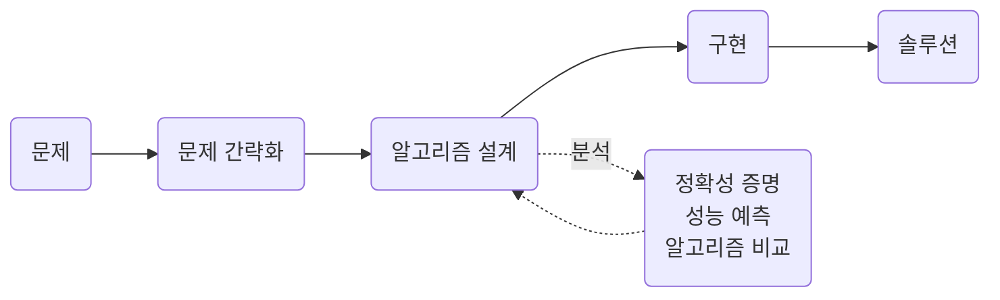
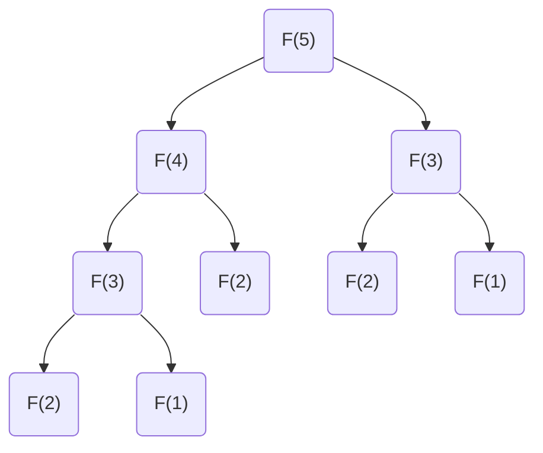

import SearchDemo from '@components/SearchDemo.astro';

> 진도상 위치: **1주차**  
> 이 과목의 첫 주제입니다. 앞으로 열네 개 주제에서 계속 쓰게 될 두 가지 질문을
> 여기서 꺼냅니다. **무엇을 내주고 무엇을 얻는가**, 그리고 **입력이 커지면
> 어떻게 되는가**.

## 알고리즘은 무엇을 하는가 \{#what}

[[algorithm|알고리즘]]은 문제를 푸는 절차를 유한한 단계로 명확히 적은 것입니다.
같은 입력에 같은 출력을 내고, 반드시 끝나야 합니다.

그런데 "푼다"는 것만으로는 부족합니다. 같은 문제를 푸는 절차는 대개 여러 개
있고, 우리가 배우는 것은 **그중 무엇을 고를지 판단하는 법**입니다.

알고리즘이 필요한 이유는 두 가지입니다.

- 다른 방법으로는 풀 수 없는 문제를 풀기 위해
- 이미 푸는 문제를 **더 적은 시간과 공간으로** 풀기 위해

컴퓨터 과학의 거의 모든 분야가 여기에 기대고 있습니다. 웹 검색과 라우팅,
게놈 프로젝트, 회로 배치와 컴파일러, 코덱과 압축과 얼굴 인식, 추천과 광고,
물리 시뮬레이션까지 전부 알고리즘 문제입니다.

### 문제 · 입력 · 인스턴스 \{#problem}

용어를 먼저 정리합니다. 셋을 구분하지 않으면 뒤에서 이야기가 엉킵니다.

| 말 | 뜻 | 예 |
| --- | --- | --- |
| **문제** | 답을 구하려는 질문 | "정렬된 배열에서 값 하나를 찾아라" |
| **입력(파라미터)** | 문제가 받는 것 | 배열 `A`, 찾는 값 `key` |
| **인스턴스** | 입력에 구체적인 값을 넣은 것 | `A = [6, 13, 14, …]`, `key = 51` |

알고리즘은 **문제**를 풀도록 설계하고, 성능은 **인스턴스**에서 측정합니다.
인스턴스 하나가 빨랐다고 그 알고리즘이 빠른 것은 아닙니다. 이 차이가 뒤에서
"최선·평균·최악"을 나누는 이유가 됩니다.

### 우리가 하는 일 \{#what-we-do}



설계와 분석은 한 번씩 지나가는 단계가 아니라 서로를 되먹입니다. 분석해 보니
느려서 다시 설계하고, 다시 분석합니다. 이 과목의 절반은 그 되먹임을 도는
연습입니다.

## 무엇을 내주고 무엇을 얻는가 \{#trade-off}

[[trade-off|트레이드오프]]는 이 과목 전체를 관통하는 사고 틀입니다.
**"가장 좋은 알고리즘"은 대개 없습니다.** 무엇을 내줄지 정하는 일이 있을 뿐입니다.

### 태블릿 고르기 \{#tablet}

태블릿을 하나 산다고 해 봅시다. 따질 것이 여럿입니다.

- 화면: 해상도, 주사율
- CPU
- 저장 용량
- 펜 민감도
- 가격

성능이 올라가면 가격도 올라갑니다. 모든 항목에서 최고인 물건은 없거나, 있어도
살 수 없습니다. 결국 **무엇을 포기할지** 정하는 일이 됩니다.

알고리즘도 같습니다. 시간을 줄이려고 메모리를 더 쓰거나, 평균을 빠르게 하려고
최악을 포기하거나, 속도를 얻으려고 입력에 조건(정렬 같은)을 겁니다.

### 뺄셈 두 가지 \{#subtraction}

같은 계산을 다르게 하는 예를 하나 봅시다. `361 - 192`입니다.

- 자리 내림을 쓰는 방법

```plaintext
    361
-   192
-------
    169
```

각 자리를 오른쪽부터 봅니다. `1 - 2`가 안 되니 윗자리에서 빌려옵니다. 빌려온
결과가 다음 자리 계산에 영향을 주므로 **순서대로** 해야 합니다.

- 음수를 허용하는 방법

```plaintext
    361
-   192
-------
    (2)(-3)(-1)     각 자리를 독립적으로 뺀 결과
```

각 자리를 그냥 뺍니다. `3-1=2`, `6-9=-3`, `1-2=-1`. 자리끼리 서로를 기다리지
않으므로 **세 자리를 동시에 계산할 수 있습니다.**

대신 이 결과는 아직 답이 아닙니다. 자릿값을 붙여 합쳐야 합니다.

```plaintext
(2)(-3)(-1) → 200 + (-30) + (-1) = 169
```

이 합치는 일은 순차적입니다. 즉 **계산은 병렬로 하고 정리는 순차로** 하는
구조입니다.

한 번 더 봅시다. `301 - 192`입니다.

```plaintext
    301                    301
-   192                -   192
-------                -------
    109                    (2)(-9)(-1)   →   200 + (-90) + (-1) = 109
```

`0 - 9 = -9`가 나왔습니다. 왼쪽 방법이라면 여기서 윗자리에 빌리러 가야 하고,
윗자리(`0`)에도 없으니 **그 위까지** 올라가야 합니다. 오른쪽은 그냥 `-9`로
두고 넘어갑니다. 자리 사이의 의존이 없다는 것이 이 방법의 값어치입니다.

| | 자리 내림 | 음수 허용 |
| --- | --- | --- |
| 자리별 계산 | 순차적이어야 함 | **병렬 가능** |
| 자리 사이 의존 | 있음 (빌림이 전파됨) | 없음 |
| 중간 저장 | 빌림 정보 | 자리별 음수 값 |
| 마무리 | 없음 | 합치는 단계가 한 번 더 |

둘 다 맞는 답을 냅니다. 어느 쪽이 나은지는 **무엇을 아끼고 싶은가**에
달렸습니다. 자리를 동시에 처리할 수 있는 하드웨어가 있다면 오른쪽이 낫고,
한 번에 하나씩 처리한다면 굳이 뒤처리를 더할 이유가 없으니 왼쪽이 낫습니다.

**이 예제가 말하는 것은 뺄셈이 아닙니다.** 같은 답을 내는 절차가 여럿이고,
그중 무엇이 나은지는 **어디서 돌릴 것인가**에 달렸다는 점입니다.

### 정확도와 속도 \{#accuracy-speed}

같은 이야기가 딥러닝에도 있습니다. 모델 셋을 놓고 고른다고 해 봅시다.

| | 모델 1 | 모델 2 | 모델 3 |
| --- | --- | --- | --- |
| 정확도 | 0.8 | 0.7 | **0.9** |
| 속도 | 0.5초 | **0.1초** | 10분 |

모델 3이 가장 정확하지만 10분이 걸립니다. 실시간 응답이 필요한 서비스라면
모델 2가 답입니다. 정확도가 중요한 진단 보조라면 모델 3입니다.
**문제가 무엇을 요구하는지 알아야 고를 수 있습니다.**

## 예제 1. 두 가지 검색 \{#search}

이제 실제 알고리즘 둘을 비교합니다. 같은 문제를 푸는 서로 다른 절차이고,
성능 차이가 어디서 오는지가 이 예제의 핵심입니다.

**문제**: 정렬된 배열에서 값 하나의 위치를 찾아라.

```plaintext
인덱스   0   1   2   3   4   5   6   7   8   9  10  11  12  13  14
값       6  13  14  25  33  43  51  53  64  72  84  93  95  96 101
```

찾을 값은 `51`입니다. 인덱스 6에 있습니다.

### 순차 검색 \{#sequential}

[[sequential-search|순차 검색]]은 앞에서부터 하나씩 비교합니다.

```plaintext
ALGORITHM SequentialSearch(A, n, key)
    for i <- 0 to n-1 do
        if A[i] = key then
            return i
    return -1
```

`51`은 인덱스 6에 있으니 **7번** 비교하고 찾습니다. 인덱스 0부터 6까지
하나씩 봤기 때문입니다.

- 실행

```sh
cd src/topic-01-intro-search/01_sequential_search
make -f /work/Makefile sequentialSearch.out && ./sequentialSearch.out
```

- 결과

```console
n = 15, key = 51
index = 6, comparisons = 7
```

비교 횟수는 찾는 값이 어디 있느냐에 따라 달라집니다.

| | 비교 횟수 | 언제 |
| --- | --- | --- |
| 최선 | 1 | 첫 원소가 `key`일 때 |
| 평균 | $$\dfrac{n+1}{2}$$ | **찾는 값이 배열에 있고** 위치가 고루 분포할 때 |
| 최악 | n | 마지막 원소이거나 배열에 없을 때 |

평균에 조건이 붙는 이유는 이렇습니다. 없는 값을 찾으면 언제나 n번을 다 셉니다.
따라서 "없을 수도 있는" 경우까지 섞으면 평균은 $$\frac{n+1}{2}$$보다 커집니다.
**성능을 말할 때는 어떤 인스턴스를 전제하는지 함께 말해야 합니다.**

최악을 기준으로 **시간** $$O(n)$$, 추가로 쓰는 메모리는 인덱스 변수뿐이니
**공간** $$O(1)$$ 입니다.

### 이진 검색 \{#binary}

[[binary-search|이진 검색]]은 가운데를 먼저 봅니다. 배열이 **정렬되어 있다는
사실**을 이용합니다.

```plaintext
ALGORITHM BinarySearch(A, n, key)
    lo <- 0
    hi <- n - 1
    while lo <= hi do
        mid <- lo + (hi - lo) / 2
        if A[mid] = key then return mid
        else if A[mid] < key then lo <- mid + 1
        else hi <- mid - 1
    return -1
```

가운데 값과 비교해서, 찾는 값이 더 크면 **왼쪽 절반을 통째로 버립니다.**
작으면 오른쪽 절반을 버립니다. 한 번 비교할 때마다 후보가 반으로 줄어듭니다.

`51`을 찾는 과정입니다.

| 비교 | lo | hi | mid | `A[mid]` | 판단 |
| --- | --- | --- | --- | --- | --- |
| 1 | 0 | 14 | 7 | 53 | 53 > 51 → 왼쪽으로 |
| 2 | 0 | 6 | 3 | 25 | 25 < 51 → 오른쪽으로 |
| 3 | 4 | 6 | 5 | 43 | 43 < 51 → 오른쪽으로 |
| 4 | 6 | 6 | 6 | **51** | 찾음 |

**4번**입니다. 순차 검색의 7번과 비교됩니다.

- 결과

```console
n = 15, key = 51
index = 6, comparisons = 4
```

**시간** $$O(\log n)$$ · **공간** $$O(1)$$ 입니다. n개에서 시작해 반씩 줄여 1개가 될
때까지가 $$\log_2 n$$번이기 때문입니다.

### 두 검색을 나란히 \{#demo}

같은 배열에서 `51`을 찾습니다. **한 걸음**을 눌러 한 번에 한 번씩 비교해
보세요. 순차 검색이 한 칸씩 나아가는 동안 이진 검색이 후보를 절반씩 지워
나갑니다.

<SearchDemo values={[6, 13, 14, 25, 33, 43, 51, 53, 64, 72, 84, 93, 95, 96, 101]} target={51} />

흐려진 칸은 **더 볼 필요가 없어진 범위**입니다. 이진 검색은 한 번 비교할
때마다 남은 칸의 절반을 지웁니다. 그것이 $$O(\log n)$$의 정체입니다.

배열에 없는 값을 찾으면 차이가 더 벌어집니다. `50`을 찾아 봅시다.

<SearchDemo values={[6, 13, 14, 25, 33, 43, 51, 53, 64, 72, 84, 93, 95, 96, 101]} target={50} />

순차 검색은 **15번을 다 세고** 나서야 없다고 답합니다. 이진 검색은 4번이면
됩니다.

### 차이는 n이 커질 때 드러난다 \{#comparison}

15개짜리 배열에서는 7번과 4번, 큰 차이가 아닙니다. 입력을 키우면 달라집니다.

| 요소 개수 | 순차 검색 | 이진 검색 | 차이 |
| --- | --- | --- | --- |
| 1,000 | 23.88 μs | 2.27 μs | 10.5배 |
| 10,000 | 202.31 μs | 2.23 μs | 90.9배 |
| 100,000 | 1,847.54 μs | 6.40 μs | 288.7배 |
| 1,000,000 | 24,519.73 μs | 9.15 μs | **2,679.8배** |

순차 검색은 요소가 10배 늘면 시간도 대략 10배가 됩니다. $$O(n)$$ 이기
때문입니다. 이진 검색은 10배가 늘어도 비교가 3\~4번 더 늘 뿐입니다.
$$O(\log n)$$ 이기 때문입니다.

이것이 이 과목이 [[big-o|Big-O]]를 계속 이야기하는 이유입니다.
**작은 입력에서는 무엇을 써도 비슷합니다. 알고리즘의 차이는 입력이 커질 때
드러납니다.**

### 공짜는 아니다 \{#binary-cost}

이진 검색이 언제나 낫다는 뜻은 아닙니다. **배열이 정렬되어 있어야 합니다.**

- 정렬되지 않은 배열에 이진 검색을 쓰면 **틀린 답**이 나옵니다. 순차 검색은
  정렬과 무관하게 맞습니다.
- 정렬 자체가 비용입니다. 한 번 찾자고 정렬하는 것은 대개 손해입니다. 여러 번
  찾을 것이라면 정렬해 두는 편이 이득입니다.

**트레이드오프입니다.** 이진 검색은 속도를 얻는 대신 입력에 조건을 겁니다.
실습 코드의 배열을 뒤섞어 직접 확인해 보세요.

## 예제 2. 재귀와 반복 \{#fibonacci}

두 번째 예제는 같은 수식을 두 방식으로 구현합니다. **코드의 모양이 성능을
어떻게 바꾸는지** 보는 것이 목적입니다.

피보나치 수열은 이렇게 정의됩니다.

$$
F(n) = \begin{cases}
0 & n = 0 \\
1 & n = 1 \\
F(n-1) + F(n-2) & n > 1
\end{cases}
$$

0, 1, 1, 2, 3, 5, 8, 13, 21, 34, …로 이어집니다.

### 정의를 그대로 옮기면 \{#recursive}

[[recursion|재귀]]로 쓰면 정의와 코드가 거의 같아 보입니다.

```plaintext
ALGORITHM FibonacciRecursive(n)
    if n <= 1 then return n
    return FibonacciRecursive(n-1) + FibonacciRecursive(n-2)
```

읽기 쉽고 정의에 충실합니다. 그런데 `F(5)`를 구하는 과정을 펼쳐 보면 문제가
보입니다.



`F(3)`이 두 번, `F(2)`가 세 번 계산됩니다. **이미 구한 값을 몇 번이고 다시
구합니다.** n이 커지면 이 중복이 폭발합니다.

### 앞의 두 항만 들고 가면 \{#iterative}

반복으로 쓰면 각 항을 한 번씩만 계산합니다.

```plaintext
ALGORITHM FibonacciIterative(n)
    if n <= 1 then return n
    prev <- 0
    curr <- 1
    for i <- 2 to n do
        next <- prev + curr
        prev <- curr
        curr <- next
    return curr
```

다음 항을 구하는 데 필요한 것은 **앞의 두 항뿐**입니다. 그 둘만 들고 앞으로
나아가면 됩니다.

### 얼마나 벌어지나 \{#fib-comparison}

실습 코드는 호출 횟수까지 셉니다. 시간보다 이쪽이 원인을 더 잘 보여 줍니다.

- 결과

```console
 n   재귀 호출 수        재귀(ms)   반복(ms)   F(n)
--- --------------- ---------- ---------- ----------
 10             177       0.00     0.0000         55
 20           21891       0.01     0.0000       6765
 30         2692537       0.82     0.0000     832040
 40       331160281     120.58     0.0000  102334155
```

n이 10 늘 때마다 호출 수가 **대략 100배**가 됩니다. 반복은 n에 비례해 늘 뿐이라
표에서 0으로 찍힙니다.

| | 시간 | 공간 |
| --- | --- | --- |
| 재귀 | $$O(2^n)$$ | $$O(n)$$ (호출 스택) |
| 반복 | $$O(n)$$ | $$O(1)$$ |

재귀는 n = 100이면 1GHz 컴퓨터로 **5만 6천 년**이 걸립니다. 반복은 즉시
끝납니다. 같은 수식, 같은 답, 다른 코드 모양입니다.

### 재귀는 나쁜 것인가 \{#recursion-verdict}

아닙니다. **여기서 느린 원인은 재귀가 아니라 중복 계산입니다.**

이미 구한 값을 저장해 두면 재귀도 $$O(n)$$이 됩니다. 그 방법이
[[memoization|메모이제이션]]이고, [[dynamic-programming|동적 계획법]]의
한 축입니다. 주제 14에서 이 코드로 다시 돌아옵니다.

반대로 재귀가 자연스러운 문제도 많습니다. 문제를 같은 형태의 작은 문제로
쪼개는 [[divide-and-conquer|분할 정복]]이 그렇습니다. 머지 정렬과 퀵 정렬이
거기 속하고, 주제 03에서 다룹니다.

일부 언어는 꼬리 재귀(tail recursion)를 반복문으로 바꿔 컴파일하기도 합니다.
그런 경우 재귀로 써도 반복만큼 빠릅니다.

**정리하면 이렇습니다.** 재귀냐 반복이냐가 성능을 정하는 것이 아니라,
**같은 일을 몇 번 하느냐**가 정합니다.

## 이 주제에서 남길 것 \{#takeaway}

1. **최선의 알고리즘은 대개 없습니다.** 무엇을 내줄지 정하는 일이 있을 뿐입니다.
2. **차이는 입력이 커질 때 드러납니다.** 작은 입력에서는 무엇을 써도 비슷합니다.
3. **빠름에는 조건이 따릅니다.** 이진 검색은 정렬을 요구합니다. 조건을 확인하지
   않고 쓰면 틀린 답을 얻습니다.
4. **코드의 모양이 성능을 바꿉니다.** 같은 수식도 어떻게 쓰느냐에 따라
   $$O(2^n)$$과 $$O(n)$$으로 갈립니다.

## 이 과목을 따라오는 법 \{#how-to-study}

첫 주이니 앞으로의 진행 방식을 짚고 갑니다.

**의사코드가 기준입니다.** 모든 예제는 `.pseudo` 파일 하나에 C와 Python 구현이
붙습니다. 두 구현은 같은 이름의 함수를 쓰고 같은 결과를 냅니다. 언어를 배우는
것이 목적이 아니라, **같은 절차가 두 언어에서 어떤 모양이 되는지** 보는 것이
목적입니다.

**코드는 읽는 것으로 끝내지 마세요.** 이 과목의 예제는 대부분 비교 횟수나
호출 횟수를 함께 찍습니다. 숫자를 바꿔 가며 돌려 보면 표에 적힌 복잡도가
무슨 뜻인지 손에 잡힙니다. 각 예제의 README 끝에 **바꿔 볼 것**을 적어 두었으니
그것부터 해 보면 됩니다.

**막히면 컨테이너에서 확인하세요.** 질문을 받을 때의 기준은 실습 컨테이너
안입니다. 로컬에 따로 설치한 환경에서 결과가 다르면 컨테이너에서 한 번 더
돌려 보고 물어 주세요.

## 실습 코드 \{#code}

`algorithm-code` 저장소의 `src/topic-01-intro-search/` 폴더에 들어 있습니다.
예제마다 의사코드 하나에 C와 Python 구현이 붙습니다.

```plaintext
src/topic-01-intro-search/
├── 01_sequential_search/    # 순차 검색, 비교 7회
├── 02_binary_search/        # 이진 검색, 비교 4회
└── 03_fibonacci/            # 재귀와 반복, 호출 수 비교
```

파일을 열고 편집기 오른쪽 위 **▶ 버튼**을 누르면 실행됩니다. 실행 방법은
[실습 환경 준비](/article/setup-guide/)를 참고하세요.

**직접 해 볼 것**

- 이진 검색의 배열을 뒤섞고 돌려 보세요. 답이 어떻게 틀리는지 봅니다.
- 찾는 값을 배열에 없는 값으로 바꿔 두 검색의 비교 횟수를 견줘 보세요.
- 피보나치의 `n`을 45, 50으로 올려 보세요. 재귀가 언제 실용성을 잃는지
  보입니다.
