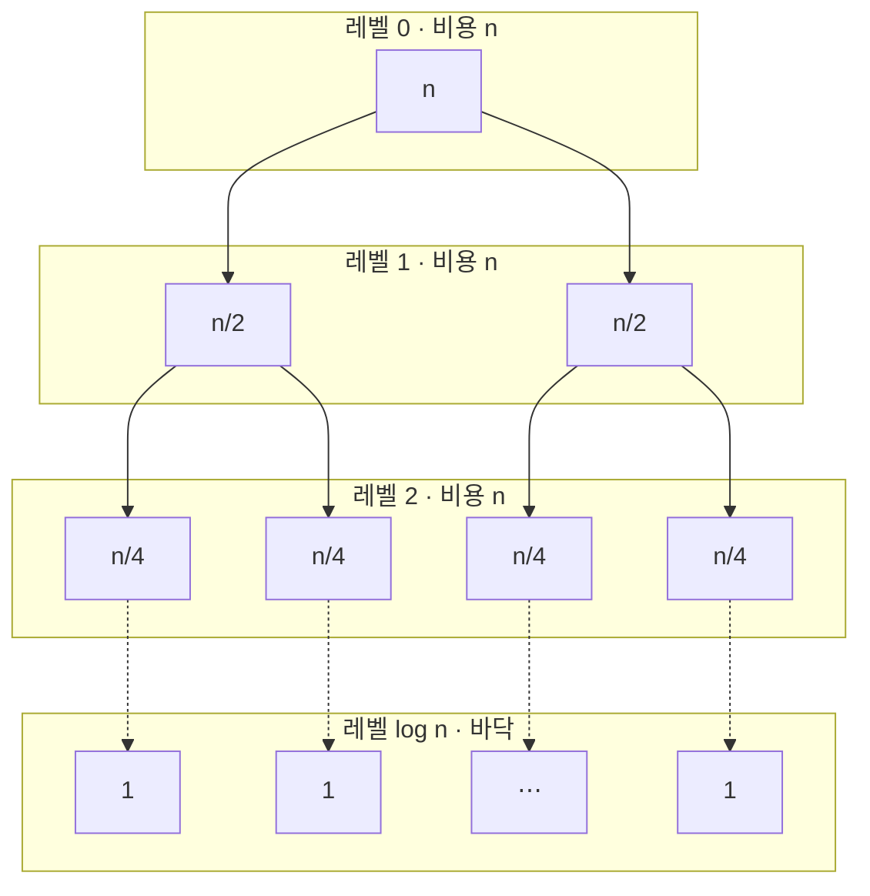
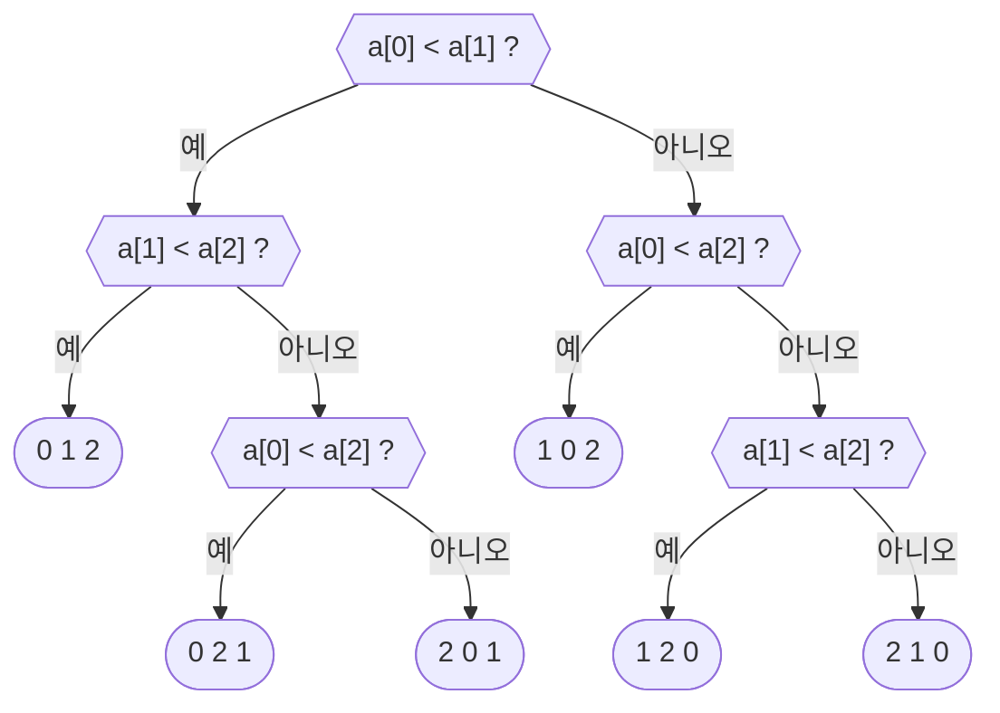

import MergeDemo from '@components/MergeDemo.astro';
import CountingDemo from '@components/CountingDemo.astro';
import MergeTrace from '@components/MergeTrace.astro';

> 주제 02의 마지막 표는 벽으로 끝났습니다. 네 정렬 모두 최악이
> $$O(n^2)$$입니다. 이번 주제는 그 벽을 두 번 넘습니다. 한 번은 **문제를
> 나눠서**, 또 한 번은 **아예 비교하지 않아서**입니다.

## 나누면 왜 빨라지는가 \{#divide}

도미노 천 개를 세운다고 합시다. 혼자면 한참 걸리지만, 열 명이 백 개씩
나눠 세우면 금방 끝납니다. 조별 과제도 같습니다. 회사 조사, 인터뷰,
발표 준비를 나눠 맡고 마지막에 합칩니다.

여기까지는 놀랍지 않습니다. **사람이 열 배니 빨라지는 것**은 주제 01의
병렬 덧셈에서 이미 본 이야기입니다.

이 주제의 놀라움은 다른 데 있습니다. **혼자 해도 빨라집니다.** 정렬을
반으로 나눠서 각각 정렬하고 합치면, 한 사람이 순서대로 다 해도 전체
일의 양 자체가 줄어듭니다. $$O(n^2)$$이 $$O(n \log n)$$이 되는 이유는
일꾼이 늘어서가 아니라 **해야 할 일이 줄어서**입니다.

### 분할 정복 \{#divide-conquer}

이 전략을 [[divide-and-conquer|분할 정복]]이라고 부릅니다. 세 단계입니다.

- **분할(divide)**: 문제를 같은 꼴의 작은 문제로 나눈다.
- **정복(conquer)**: 작은 문제를 푼다. 충분히 작으면 그냥 풀고,
  아니면 또 나눈다.
- **결합(combine)**: 작은 답들을 합쳐 전체 답을 만든다.

사실 처음이 아닙니다. 주제 01의 이진 검색이 분할 정복이었습니다.
절반으로 나누고, **한쪽만** 정복하고, 결합은 할 것이 없었습니다.
이번에는 양쪽을 다 정복하고 결합도 해야 하는 경우입니다.

### 어떻게 나눌 것인가 \{#split-ways}

1부터 100까지의 수 100개를 두 명이 나눠 정렬한다면, 나누는 방법이 둘
있습니다.

- **값으로 나누기**: 50 이하를 한 명, 51 이상을 한 명이 맡습니다.
  각자 정렬하고 나면 **이어 붙이기만 하면** 끝입니다. 결합이 공짜인
  대신, 나눌 때 원소 100개를 전부 값으로 분류해야 합니다.
- **위치로 나누기**: 앞 50개와 뒤 50개를 맡습니다. 나누기는 반으로
  자르면 끝이라 공짜입니다. 대신 정렬된 두 묶음을 **섞어 합치는 일**이
  남습니다.

어느 쪽이든 일은 남습니다. 나누기가 쉬우면 결합이 어렵고, 결합이
쉬우면 나누기가 어렵습니다. 병합 정렬은 두 번째 길을 갑니다. 그리고
다음 주제의 퀵 정렬이 첫 번째 길을 갑니다.

### 참고: 곱셈도 나눌 수 있다 \{#karatsuba}

분할 정복은 정렬 전용이 아닙니다. 카라추바(Karatsuba)는 곱셈을
나눴습니다.

$$
1234 \times 5678 = (12 \cdot 100 + 34)(56 \cdot 100 + 78) = a \cdot 10^4 + b \cdot 10^2 + c
$$

$$
a = 12 \times 56, \quad b = 12 \times 78 + 34 \times 56, \quad c = 34 \times 78
$$

그대로 계산하면 두 자리 곱셈이 **4번** 필요합니다. 그런데 $$b$$를 이렇게
바꿀 수 있습니다.

$$b = (12 + 34)(56 + 78) - a - c$$

$$a$$와 $$c$$는 어차피 구하는 값이므로, 새 곱셈은
$$(12+34)(56+78) = 46 \times 134$$ **하나**뿐입니다. 곱셈 4번이 3번이
되고, 이것을 재귀로 반복하면 $$O(n^2)$$이던 큰 수 곱셈이
$$O(n^{\log_2 3}) \approx O(n^{1.585})$$가 됩니다. 검산하면
$$672 \cdot 10^4 + 2840 \cdot 10^2 + 2652 = 7{,}006{,}652$$로 정확히
$$1234 \times 5678$$입니다.

## 예제 1. 병합 정렬 \{#merge-sort}

병합 정렬의 아이디어는 한 줄입니다. **반으로 나눠 각각 정렬하고,
정렬된 두 절반을 합친다.** 각각을 정렬하는 방법은 또 병합 정렬,
즉 재귀입니다.

### 엔진은 병합이다 \{#merge}

재귀보다 먼저 볼 것이 있습니다. **정렬된 두 묶음을 합치는 일**이 이
정렬의 엔진입니다. 두 묶음의 맨 앞끼리 비교해서 작은 쪽을 꺼내는 일을
반복하면 됩니다.

윗줄이 배열, 아랫줄이 임시 배열(temp)입니다. 앞 절반과 뒤 절반은 각각
정렬되어 있습니다.

<MergeDemo mode="merge" />

원소 10개를 합치는 데 비교가 9번뿐입니다. 두 묶음이 **이미 정렬되어
있다는 사실**이 비교를 아껴 줍니다. 각 묶음에서 맨 앞만 보면 되기
때문입니다.

### 전체 정렬 \{#merge-sort-demo}

그 병합을 재귀에 태우면 전체 정렬이 됩니다. 원소 하나는 이미 정렬이므로
재귀의 바닥이 되고, 거기서부터 병합하며 올라옵니다. `ms(0, 9)` 칩이
지금 어느 호출 안에 있는지를 보여줍니다.

<MergeDemo mode="sort" />

### 한눈에 펼치면 \{#merge-tree}

데모가 시간 순서라면, 이 그림은 전체 구조입니다. **분할·병합
트리**(재귀 트리)라고 부릅니다. 위쪽 절반에서 원소 하나가 될 때까지
반씩 나뉘고, 파란 가운데 줄이 재귀의 바닥입니다. 아래쪽 절반에서는
이웃한 두 묶음이 병합되며 올라오는데, 초록 묶음은 언제나 정렬된
상태입니다.

<MergeTrace />

나누기는 원소를 움직이지 않아 위쪽 절반의 순서가 그대로이고, 모든
재배열은 아래쪽 절반에서 일어납니다. 잠시 뒤 분석에서 이 그림의
줄(레벨)을 세게 됩니다.

### 절차로 적으면 \{#merge-pseudo}

```plaintext
ALGORITHM MergeSort(A, lo, hi)
    if lo >= hi then return          // 원소 하나면 이미 정렬
    mid <- (lo + hi) / 2
    MergeSort(A, lo, mid)            // 왼쪽 절반
    MergeSort(A, mid+1, hi)          // 오른쪽 절반
    Merge(A, lo, mid, hi)            // 정렬된 두 절반을 합친다

ALGORITHM Merge(A, lo, mid, hi)
    i <- lo, j <- mid+1, k <- lo
    while i <= mid and j <= hi do
        if A[i] <= A[j] then
            T[k] <- A[i]; i++
        else
            T[k] <- A[j]; j++
        k++
    남은 원소를 T로 복사
    T[lo..hi]를 A[lo..hi]로 복사
```

주제 01의 피보나치처럼 **자기 자신을 부르는 정의**입니다. 다른 점은
같은 값을 두 번 계산하지 않는다는 것입니다. 왼쪽과 오른쪽은 겹치지 않는
서로 다른 구간입니다.

### 코드로 옮기면 \{#merge-code}

```c
static void merge(int a[], int lo, int mid, int hi, int temp[],
                  int *comparisons, int *moves) {
    int i = lo;
    int j = mid + 1;
    int k = lo;
    while (i <= mid && j <= hi) {
        (*comparisons)++;
        if (a[i] <= a[j]) {   /* <=라서 같은 값이면 왼쪽이 먼저: 안정 */
            temp[k++] = a[i++];
        } else {
            temp[k++] = a[j++];
        }
        (*moves)++;
    }
    while (i <= mid) { temp[k++] = a[i++]; (*moves)++; }
    while (j <= hi)  { temp[k++] = a[j++]; (*moves)++; }
    for (k = lo; k <= hi; k++) { a[k] = temp[k]; (*moves)++; }
}

void mergeSort(int a[], int lo, int hi, int temp[],
               int *comparisons, int *moves) {
    if (lo >= hi) {
        return;
    }
    int mid = lo + (hi - lo) / 2;
    mergeSort(a, lo, mid, temp, comparisons, moves);
    mergeSort(a, mid + 1, hi, temp, comparisons, moves);
    merge(a, lo, mid, hi, temp, comparisons, moves);
}
```

- 실행

```sh
cd src/topic-03-divide-conquer/01_merge_sort
make -f /work/Makefile mergeSort.out && ./mergeSort.out
```

- 결과

```console
before: 2 8 5 9 1 10 7 6 4 3
after : 1 2 3 4 5 6 7 8 9 10
comparisons = 22, moves = 68
```

데모의 카운터가 도착한 숫자와 같습니다.

### 분석 \{#merge-analysis}

왜 $$O(n \log n)$$인지는 그림 하나로 보입니다. 병합을 레벨별로
모아 보면, **어느 레벨이든 병합되는 원소의 합은** $$n$$입니다.



반씩 나누므로 레벨은 $$\log_2 n$$개이고, 레벨마다 비용이 $$n$$이니
전체는 $$O(n \log n)$$입니다. **최선도 평균도 최악도 같습니다.**
어떤 입력이든 나누는 모양이 똑같기 때문입니다.

우리 배열에서 재 보면 이렇습니다.

| 입력 | 비교 횟수 | 이동 횟수 |
| --- | --- | --- |
| 예제 배열 | $$22$$ | $$68$$ |
| 이미 정렬됨 | $$19$$ | $$68$$ |
| 역순 | $$15$$ | $$68$$ |

두 가지가 눈에 띕니다.

- **이동이 언제나 68회입니다.** 병합마다 구간 전체가 temp로 갔다가
  돌아오므로, 이동 횟수는 입력과 무관하게 정해져 있습니다.
- **역순(15회)이 정렬됨(19회)보다 비교가 적습니다.** 역순 배열은
  병합마다 한쪽이 일찍 바닥나서, 남은 쪽을 비교 없이 부어 넣기
  때문입니다.

값을 내주는 곳도 분명합니다. **공간 $$O(n)$$.** 임시 배열 temp가
필요합니다. 주제 02의 네 정렬은 모두 $$O(1)$$이었습니다. 그리고
`merge`의 `<=` 덕에 같은 값이면 왼쪽이 먼저 나와 **안정 정렬**입니다.

### 다섯 정렬을 나란히 \{#five-sorts}

같은 배열 `2 8 5 9 1 10 7 6 4 3`에 다섯 정렬을 돌린 결과입니다.

| 정렬 | 비교 | 이동 | 최악 |
| --- | --- | --- | --- |
| 선택 정렬 | 45 | 21 | $$O(n^2)$$ |
| 삽입 정렬 | 33 | 43 | $$O(n^2)$$ |
| 셸 정렬 | 30 | 57 | $$O(n^2)$$ |
| 버블 정렬 | 45 | 75 | $$O(n^2)$$ |
| **병합 정렬** | **22** | 68 | $$O(n \log n)$$ |

$$n = 10$$에서는 차이가 심심해 보입니다. 하지만 주제 02에서 본 것처럼
차이는 $$n$$이 커질 때 드러납니다. $$n = 10^9$$이면 $$n^2$$은
$$10^{18}$$이고 $$n \log n$$은 약 $$3 \times 10^{10}$$입니다.
**3천만 배** 차이입니다. 삽입 정렬로 317년 걸리던 일이 병합 정렬로
18분이 되는 이유입니다.

## 비교로는 여기까지 \{#lower-bound}

병합 정렬보다 더 빠른 정렬을 만들 수 있을까요. 놀랍게도 **비교로
정렬하는 한, 이보다 차수가 낮아질 수 없다**는 것을 증명할 수 있습니다.

정렬 알고리즘이 하는 비교를 나무로 그려 봅니다. 마디마다 비교 하나,
가지는 그 결과입니다. $$n = 3$$이면 가능한 정렬 결과(순열)가
$$3! = 6$$가지이고, 알고리즘은 비교의 답을 따라 내려가 그중 하나에
도착해야 합니다.



- 잎이 **적어도 $$n!$$개** 있어야 합니다. 순열 하나라도 빠지면 그
  입력에서 틀립니다.
- 높이 $$h$$인 이진 트리의 잎은 **많아야 $$2^h$$개**입니다.
- 그러므로 $$2^h \geq n!$$, 즉 $$h \geq \log_2(n!)$$입니다.

$$h$$는 최악의 경우 비교 횟수입니다. 스털링 근사로
$$\log_2(n!) \approx n \log_2 n$$이므로, **어떤 비교 정렬도 최악의
경우 $$\Omega(n \log n)$$번 비교해야 합니다.** 병합 정렬은 이 하한에
차수가 닿아 있는, 그 이상 좋아질 수 없는 정렬입니다.

숫자로 재 보면 $$\lceil \log_2 10! \rceil = 22$$입니다. 원소 10개를
비교로 정렬하려면 최악의 경우 22번은 비교해야 합니다. 우리 병합
정렬이 예제 배열에서 쓴 비교가 마침 22회였습니다.

그런데 이 증명에는 조건이 하나 붙어 있습니다. **"비교로 정렬하는 한"**
입니다. 비교하지 않고 정렬할 수 있다면 어떻게 될까요.

## 예제 2. 카운팅 정렬 \{#counting}

값이 0 이상 $$k$$ 이하의 정수라면, 원소끼리 비교할 필요가 없습니다.
**값마다 몇 개 있는지 세면** 각 원소가 갈 자리를 계산할 수 있습니다.

세 줄을 봅니다. 입력, 카운팅 배열, 출력입니다. 비교 카운터가 끝까지
0에 머무는 것을 확인하세요.

<CountingDemo />

### 절차로 적으면 \{#counting-pseudo}

```plaintext
ALGORITHM CountingSort(A, n, k)
    // 1) 세기: 값마다 몇 개 있는지
    for v <- 0 to k do count[v] <- 0
    for i <- 0 to n-1 do
        count[A[i]] <- count[A[i]] + 1

    // 2) 누적: 값 v가 끝나는 위치(개수 합)
    for v <- 1 to k do
        count[v] <- count[v] + count[v-1]

    // 3) 배치: 뒤에서부터 읽어 제자리에 놓는다
    for i <- n-1 downto 0 do
        count[A[i]] <- count[A[i]] - 1
        B[count[A[i]]] <- A[i]
```

### 코드로 옮기면 \{#counting-code}

```c
void countingSort(const int a[], int b[], int n, int count[], int *moves) {
    for (int v = 0; v <= MAX_KEY; v++) {
        count[v] = 0;
    }
    for (int i = 0; i < n; i++) {         /* 1) 세기 */
        count[a[i]]++;
    }
    for (int v = 1; v <= MAX_KEY; v++) {  /* 2) 누적 */
        count[v] += count[v - 1];
    }
    for (int i = n - 1; i >= 0; i--) {    /* 3) 뒤에서부터 배치: 안정 */
        count[a[i]]--;
        b[count[a[i]]] = a[i];
        (*moves)++;
    }
}
```

- 실행

```sh
cd src/topic-03-divide-conquer/02_counting_sort
make -f /work/Makefile countingSort.out && ./countingSort.out
```

- 결과

```console
before: 1 0 1 5 4 3 1 4 5 2 1
after : 0 1 1 1 1 2 3 4 4 5 5
comparisons = 0, moves = 11
```

**비교 0회.** 원소 11개가 11번의 이동만으로 제자리를 찾았습니다.

### 왜 뒤에서부터인가 \{#counting-stable}

3단계가 입력을 뒤에서부터 읽는 데는 이유가 있습니다. 누적 배열은 "값
$$v$$의 **마지막** 자리"를 알고 있습니다. 뒤에서부터 읽으면 같은 값 중
뒤의 것이 뒤 자리를 받아, 원래 순서가 유지됩니다. **안정 정렬**이
됩니다.

같은 값에 이름표를 붙여 보면 보입니다.

<CountingDemo
  values={[2, 1, 2, 0, 1]}
  maxKey={2}
  labels={['가', '나', '다', '라', '마']}
/>

2가 둘(가·다), 1이 둘(나·마)인데, 출력에서도 가가 다보다 앞에,
나가 마보다 앞에 있습니다. 실습 코드의 **바꿔 보기**가 안내하듯 앞에서부터 읽도록
바꾸면 정렬 결과는 같지만 이 순서가 뒤집힙니다.

### 분석 \{#counting-analysis}

세기 $$O(n)$$, 누적 $$O(k)$$, 배치 $$O(n)$$이므로 전체
$$O(n + k)$$입니다. $$k$$가 $$n$$과 비슷한 크기라면 사실상
$$O(n)$$이고, $$\Omega(n \log n)$$ 하한보다 빠릅니다. 하한을 어긴 것이
아니라 **하한의 전제 밖에서 움직이는** 것입니다. 비교를 하지 않으니
결정 트리 논증이 적용되지 않습니다.

공짜가 아닙니다. 내주는 것이 둘입니다.

- **키가 좁은 범위의 정수여야 합니다.** 실수, 문자열, 범위를 모르는
  값에는 쓸 수 없습니다. 비교 정렬은 비교만 가능하면 무엇이든
  정렬합니다.
- **공간 $$O(n + k)$$.** 카운팅 배열과 출력 배열이 필요합니다.
  $$k$$가 크면 이것이 재앙이 됩니다. 원소 11개를 정렬하는데 값의
  범위가 백만이라면, 백만 칸을 만들어 거의 전부 0으로 놀립니다.

정리하면 이렇습니다. 학생 점수(0\~100점), 나이, 월(1\~12)처럼 **범위가
좁고 촘촘한 정수 키**에는 카운팅 정렬이 압도적이고, 그 밖에는 비교
정렬이 안전합니다.

## 여섯 정렬을 나란히 \{#comparison}

| 정렬 | 최선 | 평균 | 최악 | 공간 | 안정성 | 구분 |
| --- | --- | --- | --- | --- | --- | --- |
| 선택 정렬 | $$O(n^2)$$ | $$O(n^2)$$ | $$O(n^2)$$ | $$O(1)$$ | 불안정 | 비교 |
| 삽입 정렬 | $$O(n)$$ | $$O(n^2)$$ | $$O(n^2)$$ | $$O(1)$$ | 안정 | 비교 |
| 셸 정렬 | $$O(n \log n)$$ | $$O(n^{1.5})$$ | $$O(n^2)$$ | $$O(1)$$ | 불안정 | 비교 |
| 버블 정렬 | $$O(n^2)$$ | $$O(n^2)$$ | $$O(n^2)$$ | $$O(1)$$ | 안정 | 비교 |
| 병합 정렬 | $$O(n \log n)$$ | $$O(n \log n)$$ | $$O(n \log n)$$ | $$O(n)$$ | 안정 | 비교 |
| 카운팅 정렬 | $$O(n + k)$$ | $$O(n + k)$$ | $$O(n + k)$$ | $$O(n + k)$$ | 안정 | 비-비교 |

주제 01부터 반복해 온 질문이 이 표에도 그대로 있습니다. 병합 정렬은
시간의 벽을 넘는 대신 공간을 내주었고, 카운팅 정렬은 비교 자체를
버리는 대신 키의 종류를 내주었습니다. **무엇을 내주고 무엇을
얻는가**입니다.

## 이 주제에서 남길 것 \{#takeaway}

- **분할 정복**: 나누고, 풀고, 합친다. 여럿이 나눠서가 아니라 **일
  자체가 줄어서** 빨라진다.
- 나누기가 쉬우면 결합이 어렵고, 결합이 쉬우면 나누기가 어렵다.
  병합 정렬은 나누기가 공짜인 쪽이다.
- **병합 정렬**: 레벨마다 비용 $$n$$, 레벨 수 $$\log n$$, 그래서
  $$O(n \log n)$$. 최선·평균·최악이 같고 안정적이다. 공간 $$O(n)$$을
  내준다.
- **비교 정렬의 하한**: 결정 트리의 잎이 $$n!$$개는 있어야 하므로
  어떤 비교 정렬도 최악 $$\Omega(n \log n)$$이다.
- **카운팅 정렬**: 좁은 범위의 정수 키라면 비교 없이 $$O(n + k)$$.
  하한을 어기는 것이 아니라 하한의 전제 밖에 있다.
- 곱셈도 나눌 수 있다. 카라추바는 곱셈 4번을 3번으로 줄여
  $$O(n^{1.585})$$를 얻는다.

## 실습 코드 \{#code}

[lec-algorithm/algorithm-code](https://github.com/lec-algorithm/algorithm-code/tree/main) 저장소의 `src/topic-03-divide-conquer/`
폴더에 들어 있습니다. 예제마다 의사코드 하나에 C와 Python 구현이 붙습니다.

```plaintext
src/topic-03-divide-conquer/
├── 01_merge_sort/       # 병합 정렬, 비교 22 이동 68
└── 02_counting_sort/    # 카운팅 정렬, 비교 0 이동 11
```

파일을 열고 편집기 오른쪽 위 **▶ 버튼**을 누르면 실행됩니다. 실행 방법은
[실습 환경 준비](/article/setup-guide/)를 참고하세요.

**직접 해 볼 것**

- 병합 정렬에 정렬된 배열과 역순 배열을 넣어 보세요. 비교는 19회와
  15회로 달라지지만 이동은 늘 68회입니다.
- `merge`의 `<=`를 `<`로 바꿔 보세요. 정답은 그대로지만 안정성이
  깨집니다.
- 카운팅 정렬의 3단계를 앞에서부터 읽도록 바꿔 같은 값의 순서가
  뒤집히는 것을 확인해 보세요.
- `MAX_KEY`를 1000000으로 올려 보세요. 원소 11개에 백만 칸이 생깁니다.
  $$O(n + k)$$의 $$k$$가 무엇인지 보입니다.
