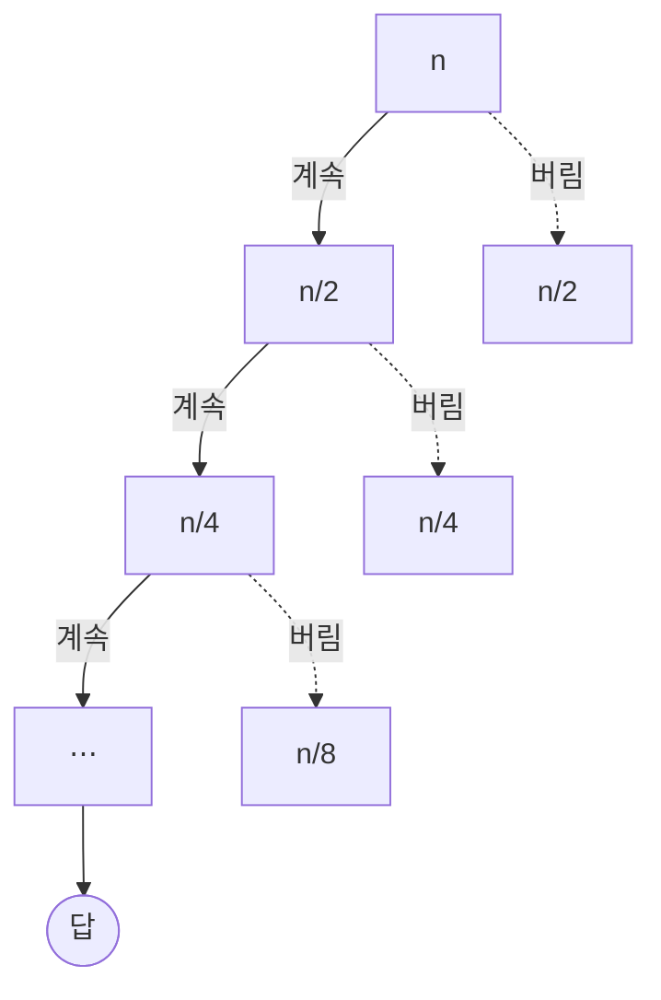

import QuickDemo from '@components/QuickDemo.astro';
import ParallelQuickDemo from '@components/ParallelQuickDemo.astro';

> 주제 03에서 나누기와 결합은 시소라고 했습니다. 병합 정렬은 나누기가
> 공짜였고, 결합(병합)에서 일했습니다. 이번 주제는 시소의 반대편입니다.
> **나눌 때 일하고, 결합은 공짜인 정렬.** 그리고 그 나누기를 지키는
> 재료로 **랜덤**이 등장합니다.

## 재료: 랜덤 \{#random}

퀵 정렬에 들어가기 전에 재료 하나를 준비합니다. 컴퓨터의 랜덤은
어디서 올까요.

사실 `rand()`가 만드는 것은 **유사난수**(pseudorandom)입니다. 시드
(seed)라는 입력을 받아 **함수를 돌린 출력**이고, 함수이므로 **입력이
같으면 출력이 같습니다.** 실습 코드는 라이브러리 대신 같은 종류의
생성기(minstd)를 직접 만들어 이것을 보입니다.

```c
static int64_t state = 1;

/* srand처럼 시드를 바꾼다. */
void setSeed(int64_t seed) {
    state = seed;
}

/* rand처럼 다음 수를 만든다. x <- x * 16807 mod (2^31 - 1) */
int64_t nextRandom(void) {
    state = state * 16807 % 2147483647;
    return state;
}
```

- 실행

```sh
cd src/topic-04-quick-sort/01_random
make -f /work/Makefile randomProgram.out && ./randomProgram.out
```

- 결과

```console
seed = 1 : 16807 282475249 1622650073
seed = 1 : 16807 282475249 1622650073
seed = 2 : 33614 564950498 1097816499
```

시드 1을 두 번 넣으면 **완전히 같은 수열**이 두 번 나옵니다. 바뀌는
것은 시드를 바꿀 때뿐입니다. 그래서 실전에서는 시계처럼 예측하기
어려운 값을 시드로 씁니다. C의 `srand(time(NULL))`이 그 관용구입니다.

### 랜덤이 필요한 곳 \{#random-why}

유튜브 영상 주소의 ID는 왜 `10500`, `10501` 같은 순차 번호가 아닐까요.
매초 수많은 영상이 여러 서버, 여러 데이터베이스에 나뉘어 올라오는데
(샤딩), ID는 절대 겹치면 안 됩니다. 순차 번호는 서버끼리 조율을
요구하므로 쓸 수 없고, 그래서 랜덤에 기반한 ID를 씁니다. 다음 번호를
**예측할 수 없다**는 성질도 덤으로 얻습니다.

이 주제에서 랜덤이 맡는 일은 따로 있습니다. **피벗을 고르는
일**입니다. 왜 그 일에 랜덤이 필요한지는 퀵 정렬의 최악을 본 뒤에
돌아옵니다.

## 예제 1. 퀵 정렬 \{#quick-sort}

아이디어는 주제 03의 시소에서 나옵니다. **기준 값(피벗) 하나를 골라,
작은 것은 왼쪽으로 큰 것은 오른쪽으로 보낸다. 그러면 피벗은 제자리에
도착하고, 양쪽을 각각 정렬하면 끝이다.** 값으로 나눴으므로 결합은
이어 붙이기, 즉 공짜입니다.

### 엔진은 파티션이다 \{#partition}

병합 정렬의 엔진이 병합이었듯, 퀵 정렬의 엔진은
**파티션**(partition)입니다. 첫 원소를 피벗으로 삼고, 나머지를 훑으며
피벗보다 작은 것(청록 구간)을 왼쪽으로 모읍니다. 끝나면 피벗을 그
경계에 놓습니다.

<QuickDemo mode="partition" />

파티션 한 번에 비교 9회, 그리고 **피벗의 자리 하나가 확정**됩니다.
이번 피벗 `2`는 거의 최솟값이라 왼쪽 구간에 `1` 하나만 남았습니다.
좋은 피벗과 나쁜 피벗의 이야기가 여기서 이미 시작됩니다.

### 전체 정렬 \{#quick-sort-demo}

그 파티션을 재귀에 태우면 전체 정렬이 됩니다. `qs(0, 9)` 칩이 지금의
호출입니다. 확정된 피벗이 초록으로 하나씩 쌓입니다.

<QuickDemo mode="sort" />

### 절차로 적으면 \{#quick-pseudo}

```plaintext
ALGORITHM QuickSort(A, lo, hi)
    if lo >= hi then return          // 원소 하나면 이미 정렬
    p <- Partition(A, lo, hi)        // 피벗을 제자리에 놓는다
    QuickSort(A, lo, p-1)            // 피벗 왼쪽 (피벗보다 작은 것들)
    QuickSort(A, p+1, hi)            // 피벗 오른쪽 (크거나 같은 것들)

ALGORITHM Partition(A, lo, hi)
    pivot <- A[lo]
    i <- lo                          // i: 피벗보다 작은 구간의 끝
    for j <- lo+1 to hi do
        if A[j] < pivot then
            i <- i + 1
            swap A[i], A[j]
    swap A[lo], A[i]                 // 피벗을 경계로
    return i                         // 피벗의 최종 위치
```

병합 정렬과 뼈대가 같은 재귀입니다. 다른 점은 일하는 자리입니다.
병합은 **재귀에서 돌아온 뒤**(결합)에 일했고, 퀵은 **재귀에 들어가기
전**(분할)에 일합니다.

### 코드로 옮기면 \{#quick-code}

```c
static int partition(int a[], int lo, int hi, int *comparisons, int *moves) {
    int pivot = a[lo];
    int i = lo;
    for (int j = lo + 1; j <= hi; j++) {
        (*comparisons)++;
        if (a[j] < pivot) {
            i++;
            swap(a, i, j, moves);
        }
    }
    swap(a, lo, i, moves);
    return i;
}

void quickSort(int a[], int lo, int hi, int *comparisons, int *moves) {
    if (lo >= hi) {
        return;
    }
    int p = partition(a, lo, hi, comparisons, moves);
    quickSort(a, lo, p - 1, comparisons, moves);
    quickSort(a, p + 1, hi, comparisons, moves);
}
```

- 실행

```sh
cd src/topic-04-quick-sort/02_quick_sort
make -f /work/Makefile quickSort.out && ./quickSort.out
```

- 결과

```console
before: 2 8 5 9 1 10 7 6 4 3
after : 1 2 3 4 5 6 7 8 9 10
comparisons = 25, moves = 21
```

데모의 카운터가 도착한 숫자와 같습니다.

### 분석 \{#quick-analysis}

피벗이 매번 가운데쯤에 떨어지면 배열이 반씩 나뉩니다. 그러면 병합
정렬과 같은 그림이 됩니다. 레벨마다 파티션 비용의 합이 $$n$$이고
레벨이 $$\log n$$개라 **평균 $$O(n \log n)$$입니다.**

세 경우를 직접 돌려 봅니다. 먼저 **최선**입니다. 피벗이 늘
한가운데에 서도록 일부러 짠 배열을 넣으면 트리가 완전한 균형이
됩니다.

<QuickDemo mode="sort" values={[5, 1, 3, 4, 2, 8, 7, 6, 9, 10]} />

비교 19회로 끝났습니다. $$n = 10$$의 퀵 정렬이 낼 수 있는 최소가
정확히 19회입니다. 반대로 **최악**은 이미 정렬된 입력입니다.

<QuickDemo mode="sort" values={[1, 2, 3, 4, 5, 6, 7, 8, 9, 10]} />

피벗이 매번 최솟값이라 왼쪽이 늘 비고, 트리가 외길이 됩니다.
숫자로 모으면 이렇습니다.

| 입력 | 비교 횟수 | 이동 횟수 |
| --- | --- | --- |
| 최선을 만드는 배열 | $$19$$ | $$9$$ |
| 예제 배열 (평균쯤) | $$25$$ | $$21$$ |
| 이미 정렬됨 (최악) | $$45$$ | $$0$$ |
| 역순 | $$45$$ | $$15$$ |

**이미 정렬된 입력이 최악입니다.** 첫 원소 피벗이 매번 최솟값이 되어,
왼쪽은 비고 오른쪽만 하나 줄어듭니다. 레벨이 $$\log n$$개가 아니라
$$n$$개가 되어 비교가 $$\frac{n(n-1)}{2} = 45$$회, 즉
$$O(n^2)$$입니다. 삽입 정렬은 정렬된 입력이
최선(9회)이었는데 퀵은 정확히 반대입니다. **어떤 입력이 좋은
입력인지도 알고리즘마다 다릅니다.**

병합 정렬과 나란히 놓으면 서로가 내준 것이 보입니다.

| | 비교 | 이동 | 추가 공간 | 최악 | 안정성 |
| --- | --- | --- | --- | --- | --- |
| 병합 정렬 | 22 | 68 | temp 배열 $$O(n)$$ | $$O(n \log n)$$ | 안정 |
| 퀵 정렬 | 25 | 21 | 재귀 스택 $$O(\log n)$$ | $$O(n^2)$$ | 불안정 |

퀵은 비교를 셋 더 쓰는 대신 이동이 3분의 1이고, temp 배열 없이
주어진 배열 안에서 움직입니다. 병합처럼 통째로 왕복하는 일이 없기
때문입니다. 대신 최악 $$O(n^2)$$의 위험과 안정성을 내주었습니다.
멀리 떨어진 원소를 교환하므로 같은 키의 순서가 보장되지 않습니다.
실전 라이브러리들이 기본 정렬로 퀵 계열을 즐겨 쓰는 이유가 이 표
안에 있습니다. 평균이 빠르고, 이동이 적고, 메모리를 아낍니다.

### 피벗을 어떻게 고르나 \{#pivot}

최악을 피하는 열쇠는 피벗 선택입니다.

- **옵션 1. 랜덤.** 파티션마다 피벗을 무작위로 고릅니다. 어떤 입력이
  와도, 심지어 일부러 만든 적대적 입력이라도, **기대 시간이
  $$O(n \log n)$$이 됩니다.** 최악의 경우가 "특정 입력"이 아니라
  "특정 입력과 특정 난수의 조합"으로 바뀌어, 사실상 일어나지 않기
  때문입니다. 앞에서 준비한 랜덤이 여기에 쓰입니다.
- **옵션 2. 셋 중 가운데.** 앞·가운데·뒤 세 원소를 보고 그중
  중앙값(median)을 피벗으로 삼습니다. median-of-3이라고 부르며, 정렬된
  입력의 함정을 값싸게 피합니다.

중앙값이라는 말이 나온 김에 셋을 구분해 둡니다. **평균값**(mean)은
다 더해 나눈 것, **중앙값**(median)은 줄 세웠을 때 가운데,
**최빈값**(mode)은 가장 자주 나오는 값입니다. 피벗으로 이상적인 것은
중앙값입니다. 배열을 정확히 반으로 가르기 때문입니다.

### 파티션도 동시에 할 수 있다 \{#parallel-quick}

병합 정렬의 병렬 이야기가 퀵에도 그대로 있습니다. **같은 레벨의
파티션들은 서로 다른 구간을 만지므로** 동시에 돌릴 수 있습니다.
방향만 반대입니다. 병합은 아래에서 위로 합쳤고, 퀵은 위에서
아래로 가릅니다.

<ParallelQuickDemo />

파티션 여섯 번이라는 일의 양은 같고, 레벨마다 동시에 하면 단계가
트리 깊이인 **3단계**로 줄어듭니다. 방향이 반대라 벽시계의 바닥도
반대에 있습니다. 병합은 **마지막 병합**이, 퀵은 **첫 파티션**이
혼자 전체를 다룹니다.

여기서 랜덤 피벗의 가치가 하나 더 드러납니다. 정렬된 입력처럼
트리가 외길이 되면 레벨마다 파티션이 하나뿐이라 **병렬 이득도
0**이 됩니다. 좋은 피벗은 시간만 줄이는 것이 아니라 **병렬로 돌릴
자리도 만들어 줍니다.**

## 예제 2. 퀵 선택 \{#quick-select}

질문을 바꿔 봅니다. 전교 등수처럼 **"k번째로 작은 값"** 하나만 필요할
때도 다 정렬해야 할까요. 정렬하면 $$O(n \log n)$$입니다. 더 싸게 할
수 있습니다.

파티션의 성질을 다시 봅니다. **피벗의 위치는 확정**됩니다. 피벗이
$$k$$번째 자리에 섰다면 그 값이 답입니다. 앞에 섰다면 답은 오른쪽에,
뒤에 섰다면 왼쪽에 있습니다. **답이 없는 쪽은 통째로 버립니다.**

<QuickDemo mode="select" k={5} />

### 절차로 적으면 \{#select-pseudo}

```plaintext
ALGORITHM QuickSelection(A, n, k)
    lo <- 0, hi <- n-1
    loop
        p <- Partition(A, lo, hi)    // 퀵 정렬과 같은 파티션
        if p = k-1 then              // 피벗이 정확히 k번째 자리
            return A[p]
        else if p > k-1 then
            hi <- p-1                // 답은 왼쪽에. 오른쪽은 버린다
        else
            lo <- p+1                // 답은 오른쪽에. 왼쪽은 버린다
```

퀵 정렬과 파티션이 같습니다. 다른 점은 하나뿐입니다. 퀵 정렬은
**양쪽을 다** 팠고, 퀵 선택은 **한쪽만** 팝니다. 주제 01의 이진
검색이 순차 검색에서 절반을 버렸던 것과 같은 동작입니다.

### 코드로 옮기면 \{#select-code}

```c
int quickSelection(int a[], int n, int k, int *comparisons, int *moves) {
    int lo = 0;
    int hi = n - 1;
    while (1) {
        int p = partition(a, lo, hi, comparisons, moves);
        if (p == k - 1) {
            return a[p];
        }
        if (p > k - 1) {
            hi = p - 1;
        } else {
            lo = p + 1;
        }
    }
}
```

- 실행

```sh
cd src/topic-04-quick-sort/03_quick_selection
make -f /work/Makefile quickSelection.out && ./quickSelection.out
```

- 결과

```console
before: 2 8 5 9 1 10 7 6 4 3
after : 1 2 3 4 5 10 7 6 9 8
k = 5 -> value = 5
comparisons = 16, moves = 15
```

**after 줄을 보세요.** 앞 다섯 자리만 잡혔고 뒤는 뒤섞인 그대로입니다.
다 정렬하지 않고 답을 얻었습니다. 같은 배열을 퀵 정렬로 다 정렬하면
25회, 선택은 **16회**입니다.

### 분석 \{#select-analysis}

한쪽만 파는 것이 왜 이렇게 이득인지, 트리에서 보입니다. 버린 쪽은
다시 만지지 않습니다.



퀵 정렬은 모든 가지를 돌아 레벨마다 $$n$$씩 $$\log n$$레벨을
일했습니다. 퀵 선택은 한 줄기만 타고 내려가므로 비용이 절반씩
줄어듭니다.

$$
n + \frac{n}{2} + \frac{n}{4} + \cdots \leq 2n
$$

그래서 **평균 $$O(n)$$입니다.** $$n = 10$$이면
$$10 + 5 + 2 + 1 = 18$$쯤이고, 실제 측정 16회가 그 근처에 있습니다.

주의할 것이 둘 있습니다.

- **최악은 여전히 $$O(n^2)$$입니다.** 나쁜 피벗의 함정이 그대로
  있으므로, 진지한 구현은 여기서도 랜덤 피벗을 씁니다.
- **"몇 번째"를 찾는 도구이지 "값"을 찾는 도구가 아닙니다.** 특정
  값이 있는지 찾는 일은 주제 01의 검색이 맡습니다. 정렬된 배열이면
  이진 검색이 $$O(\log n)$$으로 더 쌉니다.

## 일곱 정렬을 나란히 \{#comparison}

| 정렬 | 최선 | 평균 | 최악 | 공간 | 안정성 | 구분 |
| --- | --- | --- | --- | --- | --- | --- |
| 선택 정렬 | $$O(n^2)$$ | $$O(n^2)$$ | $$O(n^2)$$ | $$O(1)$$ | 불안정 | 비교 |
| 삽입 정렬 | $$O(n)$$ | $$O(n^2)$$ | $$O(n^2)$$ | $$O(1)$$ | 안정 | 비교 |
| 셸 정렬 | $$O(n \log n)$$ | $$O(n^{1.5})$$ | $$O(n^2)$$ | $$O(1)$$ | 불안정 | 비교 |
| 버블 정렬 | $$O(n^2)$$ | $$O(n^2)$$ | $$O(n^2)$$ | $$O(1)$$ | 안정 | 비교 |
| 병합 정렬 | $$O(n \log n)$$ | $$O(n \log n)$$ | $$O(n \log n)$$ | $$O(n)$$ | 안정 | 비교 |
| 카운팅 정렬 | $$O(n + k)$$ | $$O(n + k)$$ | $$O(n + k)$$ | $$O(n + k)$$ | 안정 | 비-비교 |
| 퀵 정렬 | $$O(n \log n)$$ | $$O(n \log n)$$ | $$O(n^2)$$ | $$O(\log n)$$ | 불안정 | 비교 |

표가 일곱 줄이 되었습니다. 최악을 보장해야 하면 병합, 평균이 빠르고
메모리가 아까우면 퀵, 키가 좁은 정수면 카운팅, 거의 정렬된 입력이
계속 오면 삽입입니다. **정렬 하나를 고르는 일이 곧 트레이드오프를
고르는 일**입니다.

## 이 주제에서 남길 것 \{#takeaway}

- 컴퓨터의 랜덤은 **유사난수**다. 시드가 같으면 수열이 같고, 그래서
  재현할 수 있다.
- **퀵 정렬**: 파티션으로 피벗의 자리를 확정하고 양쪽을 판다. 나누기에
  일하고 결합은 공짜, 병합 정렬의 반대편이다.
- 평균 $$O(n \log n)$$, 이동이 적고 제자리에서 돈다. 대신 최악
  $$O(n^2)$$과 안정성을 내주었다.
- **정렬된 입력이 퀵의 최악**이다. 삽입 정렬과 정반대다. 좋은 입력은
  알고리즘마다 다르다.
- 최악의 해독제가 **랜덤 피벗**이다. 어떤 입력이 와도 기대
  $$O(n \log n)$$이 되고, 트리가 균형이라 같은 레벨의 파티션을
  **동시에 돌릴 자리**도 생긴다.
- **퀵 선택**: 같은 파티션으로 한쪽만 파면 k번째 값이 평균
  $$O(n)$$에 나온다. 다 정렬하지 않는다.

## 실습 코드 \{#code}

[lec-algorithm/algorithm-code](https://github.com/lec-algorithm/algorithm-code/tree/main) 저장소의 `src/topic-04-quick-sort/`
폴더에 들어 있습니다. 예제마다 의사코드 하나에 C와 Python 구현이 붙습니다.

```plaintext
src/topic-04-quick-sort/
├── 01_random/            # 유사난수, 같은 시드 = 같은 수열
├── 02_quick_sort/        # 퀵 정렬, 비교 25 이동 21
└── 03_quick_selection/   # 퀵 선택, 비교 16으로 5번째 값
```

파일을 열고 편집기 오른쪽 위 **▶ 버튼**을 누르면 실행됩니다. 실행 방법은
[실습 환경 준비](/article/setup-guide/)를 참고하세요.

**직접 해 볼 것**

- 퀵 정렬에 이미 정렬된 `1 2 … 10`을 넣어 보세요. 비교가 45회로
  뜁니다. 최악이 어떤 모양인지 봅니다.
- 최선 배열 `5 1 3 4 2 8 7 6 9 10`도 넣어 보세요. 19회, 이 크기의
  최소입니다.
- 파티션의 피벗을 `01_random`의 난수로 고르게 바꿔 보세요. 정렬된
  입력의 함정이 사라집니다.
- 퀵 선택의 `k`를 1과 10으로 바꿔 비교 횟수를 재 보세요. 9회와
  20회, 어느 쪽이든 다 정렬(25회)보다 쌉니다.
- 시드를 `time(NULL)`로 바꿔 돌릴 때마다 다른 수열이 나오는 것을
  확인해 보세요.

## 자료 이력 \{#changelog}

슬라이드와 이 자료는 함께 버전을 올립니다. 현재 **v1**이고, 슬라이드
왼쪽 아래에서 같은 버전을 확인할 수 있습니다.

| 버전 | 내용 |
| --- | --- |
| v1 | 최초 공개 |
