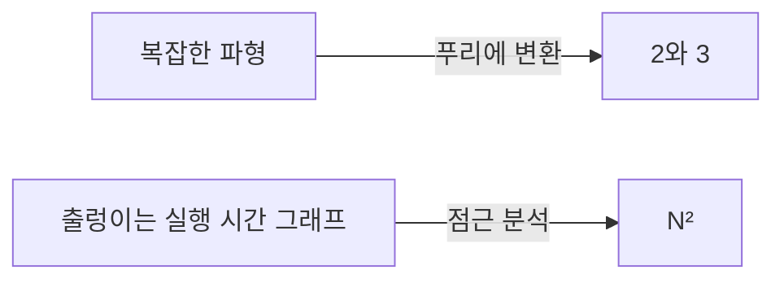

import GrowthDemo from '@components/GrowthDemo.astro';

> 주제 01부터 04까지 우리는 이미 $$O(n)$$, $$O(n \log n)$$ 같은 말을
> 써 왔습니다. 표마다 등장했고, 데모의 카운터가 그 숫자를 확인해
> 주었습니다. 이번 주제는 그 **언어 자체**를 다집니다. 어디서 왔고,
> 정확히 무엇을 뜻하고, 어떻게 쓰는 것이 맞는지입니다.

## 요약이라는 언어 \{#language}

먼저 도전 과제 하나. 복잡하게 출렁이는 파형 그래프가 있습니다. 이
그래프를 다른 사람에게 어떻게 설명할까요. 수식으로도 말로도 쉽지
않습니다.

그런데 이 파형이 사실 2Hz 신호와 3Hz 신호의 합이라면, 푸리에
변환(Fourier transform)을 거친 그래프에는 **2와 3 두 자리에만 막대가
섭니다.** 설명이 "2와 3"이라는 두 숫자로 끝납니다.



이 주제가 하는 일이 정확히 이것입니다. 측정점 수천 개짜리 실행 시간
그래프를 **$$N^2$$ 한 마디로 요약하는 언어**를 만드는 것입니다.
파형 이야기가 궁금하면 3Blue1Brown의
[푸리에 변환 영상](https://www.youtube.com/watch?v=spUNpyF58BY)을
보세요.

## 첫 번째 길: 재기 \{#measure}

어떤 프로그램의 실행 시간을 입력 크기별로 쟀습니다.

| $$N$$ | 250 | 500 | 1,000 | 2,000 | 4,000 | 8,000 | 16,000 |
| --- | --- | --- | --- | --- | --- | --- | --- |
| 시간 (초) | 0.0 | 0.0 | 0.1 | 0.8 | 6.4 | 51.1 | ? |

물음표를 채울 수 있을까요. $$N$$이 두 배가 될 때마다 시간을 보면
$$0.8 \to 6.4 \to 51.1$$, 매번 **약 8배**입니다. $$2^3 = 8$$이므로
시간은 $$N^3$$을 따르고 있고, 다음 칸은 $$51.1 \times 8 \approx
409$$초로 예측됩니다. 이것이 **배가 실험**(doubling hypothesis)입니다.
재고, 두 배로 하고, 비율을 봅니다.

재기는 강력하지만 한계가 셋 있습니다.

- **기계와 언어에 묶입니다.** 주제 01부터 반복한 말 그대로, 밀리초는
  기계마다 다릅니다.
- **가 보지 못한 $$N$$은 모릅니다.** 51.1초 다음 칸을 재려면 7분을
  기다려야 하고, 그다음 칸은 한 시간입니다.
- **왜 그런지 설명하지 못합니다.** 8배라는 사실은 알려 주지만 어디서
  8배가 나오는지는 코드가 알고 있습니다.

## 두 번째 길: 세기 \{#count}

그래서 두 번째 길은 시간을 재는 대신 **연산을 셉니다.** 코드에서
직접 수학적 모델을 만드는 길입니다.

### 1-sum: 연산을 전부 세면 \{#one-sum}

배열에서 0인 원소를 세는 코드입니다.

```c
int count = 0;
for (int i = 0; i < N; i++)
    if (a[i] == 0)
        count++;
```

연산의 종류별로 몇 번 일어나는지 셀 수 있습니다.

| 연산 | 빈도 |
| --- | --- |
| 변수 선언 | $$2$$ |
| 할당 | $$2$$ |
| `<` 비교 | $$N + 1$$ |
| `==` 비교 | $$N$$ |
| 배열 접근 | $$N$$ |
| 증가 | $$N$$ \~ $$2N$$ |

증가가 범위인 이유는 `count++`가 입력에 따라 0번에서 $$N$$번까지
일어나기 때문입니다. 벌써 최선과 최악이 갈리는 게 보입니다.

### 2-sum: 세는 것도 일이다 \{#two-sum}

합이 0이 되는 쌍을 세는 코드로 가면 표가 무거워집니다.

```c
int count = 0;
for (int i = 0; i < N; i++)
    for (int j = i+1; j < N; j++)
        if (a[i] + a[j] == 0)
            count++;
```

| 연산 | 빈도 |
| --- | --- |
| 변수 선언 | $$N + 2$$ |
| 할당 | $$N + 2$$ |
| `<` 비교 (안쪽 루프) | $$\dfrac{N(N+1)}{2}$$ |
| `==` 비교 | $$\dfrac{N(N-1)}{2}$$ |
| 배열 접근 | $$N(N-1)$$ |
| 증가 | $$\dfrac{N(N-1)}{2}$$ \~ $$N(N-1)$$ |

정확하지만, 이 표를 계속 들고 다닐 수는 없습니다. 3중 루프면 표가
또 배로 무거워집니다. **세는 일 자체를 간소화해야 합니다.**

### 간소화 \{#simplify}

두 가지 약속으로 표가 한 줄이 됩니다.

- **비용 모델**: 연산을 전부 세지 않고 **대표 연산 하나**만 셉니다.
  여기서는 배열 접근입니다. 가장 자주 일어나거나 가장 비싼 연산을
  고릅니다.
- **틸드 표기**: 최고차항만 남깁니다. $$N(N-1) = N^2 - N$$은
  $$\sim N^2$$으로 적습니다. $$N$$이 커지면 낮은 차수는 무시할 수
  있을 만큼 작아집니다.

실습 코드가 이 모델을 검증합니다. 배열 접근을 세면 이론값과
자리수까지 정확히 일치하고, 배가 실험이 **기계와 무관하게** 4와 8에
꽂힙니다.

- 실행

```sh
cd src/topic-05-complexity/01_three_sum
make -f /work/Makefile threeSum.out && ./threeSum.out
```

- 결과

```console
N = 100
1-sum: count = 1, accesses = 100
2-sum: count = 19, accesses = 9900
3-sum: count = 642, accesses = 485100

doubling N: accesses ratio
     N        2-sum        3-sum
   200         4.02         8.12
   400         4.01         8.06
```

$$9900 = N(N-1)$$, $$485100 = 3\binom{N}{3}$$입니다. 재기가 51.1초를
주었다면, 세기는 **왜 8배인지**까지 줍니다.

## 점근 분석 \{#asymptotic}

간소화의 끝은 $$N$$이 충분히 클 때의 성장률만 남기는 것, 즉
[[asymptotic-analysis|점근 분석]]입니다. 실제 알고리즘의 성장률은
놀랄 만큼 몇 가지로 모입니다.

### 성장 등급 일곱 \{#growth}

한 걸음마다 $$n$$이 두 배가 됩니다. 각 등급이 몇 배가 되는지,
그리고 1초에 $$10^9$$번 연산하는 컴퓨터로 얼마나 걸리는지 보세요.

<GrowthDemo />

$$n$$을 몇 번 두 배로 하면 $$2^n$$ 줄이 년 단위를 넘습니다. 배율
배지가 이 주제의 요점입니다. **×4는 2차, ×8은 3차, 제곱은
지수입니다.** 배가 실험에서 본 비율이 등급의 지문입니다.

일곱 등급 모두 이미 만났습니다.

| 등급 | 이미 만난 곳 |
| --- | --- |
| $$1$$ | 카운팅 정렬의 자리 계산 한 번 (주제 03) |
| $$\log n$$ | 이진 검색 (주제 01) |
| $$n$$ | 순차 검색 (주제 01), 퀵 선택 (주제 04) |
| $$n \log n$$ | 병합 정렬 (주제 03), 퀵 정렬 평균 (주제 04) |
| $$n^2$$ | 선택·삽입·버블 정렬 (주제 02), 2-sum |
| $$n^3$$ | 3-sum (이 주제) |
| $$2^n$$ | 재귀 피보나치 (주제 01) |

### 시대가 바뀌어도 등급은 남는다 \{#decades}

세지윅(Sedgewick)의 표를 각색한 것입니다. 몇 분 안에 풀 수 있는
문제 크기가 연대별로 어떻게 변했는지 봅니다.

| 증가율 | 1970년대 | 1980년대 | 1990년대 | 2000년대 |
| --- | --- | --- | --- | --- |
| $$n$$ | 수백만 | 수천만 | 수억 | 수십억 |
| $$n \log n$$ | 수십만 | 수백만 | 수백만 | 수억 |
| $$n^2$$ | 수백 | 수천 | 수천 | 수만 |
| $$n^3$$ | 백 | 수백 | 천 | 수천 |
| $$2^n$$ | 20쯤 | 20대 | 20대 | 30쯤 |

컴퓨터가 수천 배 빨라지는 동안 $$2^n$$의 줄은 20에서 30으로
움직였을 뿐입니다. 주제 02의 317년 표, 주제 03의 3천만 배와 같은
결론이 다시 나옵니다. **등급의 차이는 하드웨어로 메울 수 없습니다.**

## 표기법 네 가지 \{#notation}

이제 이 언어의 문법입니다. 넷을 구분합니다.

| 표기 | 예 | 뜻 | 쓰임 |
| --- | --- | --- | --- |
| 틸드 $$\sim$$ | $$\sim 10n^2$$ | 최고차항을 **상수까지** 남김 | 근사 모델 |
| 빅 세타 $$\Theta$$ | $$\Theta(n^2)$$ | 정확히 그 성장률 | 알고리즘 분류 |
| 빅 오 $$O$$ | $$O(n^2)$$ | 그 성장률 **이하** (상한) | 상한 보장 |
| 빅 오메가 $$\Omega$$ | $$\Omega(n^2)$$ | 그 성장률 **이상** (하한) | 하한 증명 |

$$O(n^2)$$에는 $$10n^2$$도, $$100n$$도, $$22n \log n$$도 들어갑니다.
"$$n^2$$보다 빠르게 자라지는 않는다"는 **울타리**이기 때문입니다.
$$\Omega$$는 반대 방향의 울타리이고, 주제 03에서 이미 만났습니다.
**어떤 비교 정렬도 $$\Omega(n \log n)$$이라던 하한이 바로 이
표기였습니다.** $$\Theta$$는 위아래 울타리가 만난 경우입니다.

### 흔한 오해 \{#misuse}

**빅 오는 "최악의 경우"라는 뜻이 아닙니다.** 최선·평균·최악은
"어떤 입력을 보는가"의 축이고, $$O \cdot \Theta \cdot \Omega$$는
"성장률을 어느 방향에서 울타리 치는가"의 축입니다. 별개의 두
축이라 자유롭게 조합됩니다. 우리가 지금까지 "퀵 정렬의 **평균**은
$$O(n \log n)$$, **최악**은 $$O(n^2)$$"이라고 말해 온 것이 정확한
어법입니다.

관례도 하나 알아 둡니다. 실무에서는 $$\Theta$$를 써야 할 자리에
$$O$$를 쓰는 일이 흔합니다. "병합 정렬은 $$O(n \log n)$$"처럼요.
상한이 사실이니 틀린 말은 아니고, 이 과목도 그 관례를 따랐습니다.

## 퀴즈 \{#quiz}

배운 문법으로 세 문제를 풉니다.

**문제 1.** 이 코드의 시간 복잡도는?

```c
for (int i = 0; i < 2*n; i++)
    for (int j = n-1000; j < n; j++)
        for (int k = n/2; k < n; k++)
            sum++;
```

3중 루프라고 $$O(n^3)$$이 아닙니다. 바깥은 $$2n$$번, 가운데는
**1,000번으로 고정**, 안쪽은 $$n/2$$번입니다. $$2n \cdot 1000 \cdot
\frac{n}{2} = 1000n^2$$이므로 $$O(n^2)$$입니다. **상수로 묶인 루프는
차수를 만들지 않습니다.**

**문제 2.** 최솟값을 찾아 모두에게서 빼는 함수는?

```c
void reduce(int vals[], int n) {
    int minIndex = 0;
    for (int i = 0; i < n; i++)
        if (vals[i] < vals[minIndex])
            minIndex = i;
    int minVal = vals[minIndex];
    for (int i = 0; i < n; i++)
        vals[i] = vals[i] - minVal;
}
```

루프 두 개가 **나란히** 있으므로 $$O(n) + O(n) = O(n)$$입니다.
겹친 루프만 곱해집니다.

**문제 3.** 두 원소의 차의 최댓값은?

```c
int maxDifference(int vals[], int n) {
    int max = 0;
    for (int i = 0; i < n; i++)
        for (int j = 0; j < n; j++)
            if (vals[i] - vals[j] > max)
                max = vals[i] - vals[j];
    return max;
}
```

겹친 두 루프가 각각 $$n$$번이므로 $$O(n^2)$$입니다. 참고로 이
문제는 최댓값과 최솟값을 따로 찾으면 $$O(n)$$으로 풀립니다. **분석은
현재 코드의 성적표이지, 문제 자체의 한계가 아닙니다.** 문제의
한계를 말하려면 주제 03의 하한 논증 같은 도구가 필요합니다.

## 이 주제에서 남길 것 \{#takeaway}

- 성능을 아는 길은 둘, **재기**(실험)와 **세기**(수학적 모델)다.
  재기는 빠르지만 기계에 묶이고, 세기는 이유까지 준다.
- **배가 실험**: $$n$$을 두 배로 했을 때의 비율이 차수의 지문이다.
  ×2는 선형, ×4는 2차, ×8은 3차.
- 전부 세지 않는다. **비용 모델**(대표 연산)과 **틸드**(최고차항)로
  간소화한다.
- 실제 알고리즘의 성장률은 **일곱 등급**쯤으로 모이고, 등급의
  차이는 하드웨어로 메울 수 없다.
- $$O$$는 상한, $$\Omega$$는 하한, $$\Theta$$는 둘이 만난 것.
  **최선·평균·최악과는 별개의 축**이다.
- 상수로 묶인 루프는 차수를 만들지 않고, 나란한 루프는 더해지고,
  겹친 루프만 곱해진다.

## 실습 코드 \{#code}

[lec-algorithm/algorithm-code](https://github.com/lec-algorithm/algorithm-code/tree/main) 저장소의 `src/topic-05-complexity/`
폴더에 들어 있습니다.

```plaintext
src/topic-05-complexity/
└── 01_three_sum/    # 1·2·3-sum 연산 세기 + 배가 실험
```

파일을 열고 편집기 오른쪽 위 **▶ 버튼**을 누르면 실행됩니다. 실행 방법은
[실습 환경 준비](/article/setup-guide/)를 참고하세요.

**직접 해 볼 것**

- `doubling_time.py`로 같은 실험을 실제 시간으로 돌려 보세요.
  숫자는 기계마다 달라도 비율은 4와 8 근처로 모입니다.
- 3-sum에 가지치기를 넣어도 비율이 8 근처인 것을 확인해 보세요.
  상수는 줄어도 차수는 그대로입니다.
- 주제 01의 피보나치로 배가 실험을 해 보세요. $$n$$을 하나 늘릴
  때마다 시간이 몇 배가 되는지, 지수의 지문을 봅니다.
