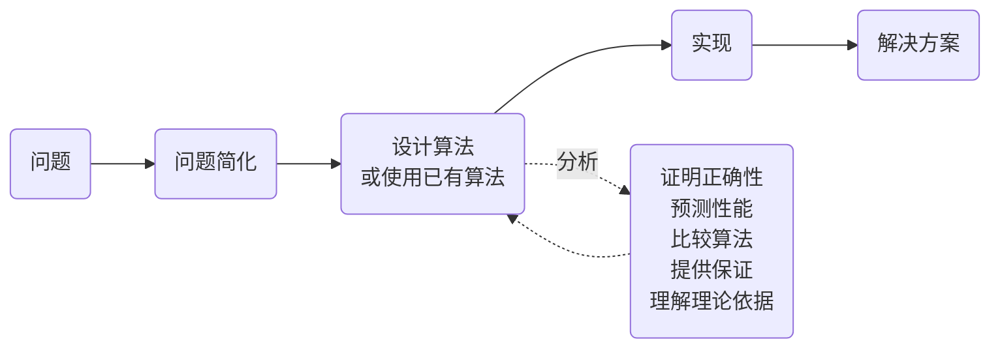

import SearchDemo from '@components/SearchDemo.astro';
import RecursionDemo from '@components/RecursionDemo.astro';
import ParallelSumDemo from '@components/ParallelSumDemo.astro';

> 本课程的**第一个主题**。它提出的两个问题，会在后面十四个主题中反复出现：
> **付出什么换来什么**，以及**输入变大之后会怎样**。

## 算法做的是什么 \{#what}

[[algorithm|算法]]是把解决问题的步骤用有限且明确的步骤写下来。相同输入产生
相同输出，并且必须终止。

但只是"能解出来"还不够。解决同一个问题的步骤通常不止一种，而本课程要学的是
**如何判断该选哪一种**。

### 算法与数据结构 \{#with-data-structures}

算法无法单独谈论。[[data-structure|数据结构]]是存储信息并将其取出的方式，
两者互相需要。

- **算法运行在合适的数据结构之上。** 本主题的二分查找就是例子。正因为有
  "有序数组"这个结构，它才能每次丢掉一半。
- **实现数据结构又需要算法。** 哈希表里有哈希函数，堆里有上浮和下沉的步骤。

尼克劳斯·维尔特（Niklaus Wirth）的一句话概括了这层关系。

> "Algorithms + Data Structures = Programs"  
> （Niklaus Wirth）

本课程的重心在算法一侧，但每当数据结构出现时，都会指出是哪一边在支撑哪一边。

需要算法的理由有两个。

- 为了解决用别的方法解决不了的问题
- 为了**用更少的时间和空间**解决已经能解决的问题

计算机科学几乎所有领域都依赖于此。网页搜索与路由、基因组计划、电路布局与
编译器、编解码与压缩与人脸识别、推荐与广告、物理仿真，全都是算法问题。

### 问题 · 输入 · 实例 \{#problem}

先把三个词分开。不区分它们，后面的讨论就会缠在一起。

| 用语 | 含义 | 例子 |
| --- | --- | --- |
| **问题** | 想要得到答案的提问 | "在有序数组中找出一个值" |
| **输入（参数）** | 问题接收的东西 | 数组 `A`、要找的值 `key` |
| **实例** | 给输入填上具体值 | `A = [6, 13, 14, …]`、`key = 51` |

算法是为解决**问题**而设计的，性能却是在**实例**上测量的。一个实例跑得快，
并不代表这个算法快。这个区别正是后面划分"最好、平均、最坏"的原因。

### 我们要做的事 \{#what-we-do}



设计与分析不是各走一次的阶段，而是互相反馈。分析发现慢，就重新设计，再分析
一次。本课程有一半是在练习绕这个环。

**并非每个问题都需要新算法。** 挑选已有的算法才是更常见的工作，而要挑选就得
知道有哪些算法、各自要求什么。这就是本课程要走过十四个主题的原因。

分析要做的事有五件。

| 要做的事 | 回答什么 |
| --- | --- |
| 证明正确性 | 这个步骤**每一次**都给出正确答案吗 |
| 预测性能 | 输入变大后要花多久 |
| 比较算法 | 两者中哪一个更适合这个问题 |
| 提供保证 | 即使在最坏情况下也有不会越过的界线吗 |
| 理解理论依据 | 能否断言根本不存在更快的方法 |

前三件在本主题里就会用到。后两件会随着[[big-o|大 O 表示法]]和下界，在整个
学期里不断回来。

## 付出什么换来什么 \{#trade-off}

[[trade-off|权衡]]是贯穿整门课的思考框架。
**"最好的算法"通常并不存在。** 存在的只是决定放弃什么。

### 挑一台平板 \{#tablet}

假设你要买一台平板，要考虑的东西不少。

- 屏幕：分辨率、刷新率
- CPU
- 存储容量
- 笔的压感
- 价格

性能上去了，价格也上去。没有哪一样在所有项目上都最好，就算有你也买不起。
最后还是变成**决定放弃什么**。

算法也一样。为了省时间多用内存，为了让平均更快而放弃最坏情况，或者为了换取
速度而给输入加上条件（比如"必须有序"）。

### 两种减法 \{#subtraction}

看一个同样的计算用两种做法：`361 - 192`。

- 用借位的做法

```plaintext
    361
-   192
-------
    169
```

从右往左逐位处理。`1 - 2` 不够减，就向上一位借。借来的结果会影响下一位的
计算，所以**必须按顺序做**。

- 允许出现负数的做法

```plaintext
    361
-   192
-------
    (2)(-3)(-1)     每一位独立相减的结果
```

每一位直接相减：`3-1=2`、`6-9=-3`、`1-2=-1`。各位之间互不等待，所以
**三位可以同时计算。**

但这个结果还不是答案。要把负的位去掉才能读成一个数，做法是从右边开始向左
借 10。

```plaintext
(2)(-3)(-1)      个位：-1 + 10 = 9，向十位借 1
(2)(-4)( 9)      十位：-4 + 10 = 6，向百位借 1
(1)( 6)( 9)  =  169
```

**这一步收尾是顺序的。** 只有先处理完右边的位，左边的位才定得下来。也就是
**计算并行、收尾顺序**的结构。

再看一次 `301 - 192`。这里收尾要多波及一位。

```plaintext
    301                    301
-   192                -   192
-------                -------
    109                    (2)(-9)(-1)  →  (2)(-10)(9)  →  (1)(0)(9)  =  109
```

出现了 `0 - 9 = -9`。用左边的做法就得向上一位借，而上一位是 `0`，所以还得
**再往上一位**去借。右边的做法只写下 `-9` 就继续。位与位之间没有依赖，这正是
这个做法的价值。

只是在收尾阶段，那个依赖又回来了。十位变成 `-10`，再次动到百位。
**是推迟了，不是消除了。**

| | 借位 | 允许负数 |
| --- | --- | --- |
| 逐位计算 | 必须顺序 | **可以并行** |
| 位之间的依赖 | 有（借位会传播） | 无 |
| 中间要保存的 | 借位信息 | 每一位的负值 |
| 收尾 | 没有 | 多一次合并 |

两者都给出正确答案。哪一个更好取决于**你想省什么**。如果有能同时处理各位的
硬件，右边更好；如果本来就一次处理一位，没理由再加一道收尾，那左边更好。

**这个例子讲的不是减法。** 讲的是给出同样答案的步骤有好几种，而哪一种更好，
取决于**要在什么地方运行**。

### 并行真正取胜的地方 \{#parallel}

刚才的减法里，并行的好处并不明显。逐位相减一次就能做完，但进位收尾又是顺序的，
所以三位数时步数是 3 比 3，一样多。

也有把好处完整保留下来的运算，**把很多值加起来**就是。十六个数逐个相加要 15 步，
因为每一次加法都要先有前一个和。成对相加往上收，只要 4 步。

<ParallelSumDemo />

**加法次数同样是 15 次**，即 8 + 4 + 2 + 1。减少的只有时间，代价是第一步需要
八个人手。用资源换时间的[[trade-off|权衡]]，在这里同样存在。

把 n 个值相加，顺序做要 $$n-1$$ 步，成对做要 $$\log_2 n$$ 步。
**这和马上要讲的顺序查找与二分查找是同一个形状。** 一个把输入减半，另一个把
工作两两合并，最后到达同一个地方。

决定能否并行的只有一件事：**什么在等什么**。

#### 就算有很多核心 \{#cores}

这并不只是纸上的事。现在的 CPU 有多个核心，每个核心跑各自的线程，八个加法
确实可以在同一时刻发生。

**可是把逐个相加放到八核上跑，也只有一个核心在忙。** 其余七个都在等前一个和。
就算加到十六个核心，仍然是 15 步，**因为等待在算法里面，不在硬件上**。

成对相加也不是全程都用满八个。它按 8 → 4 → 2 → 1 递减，最后一次单独完成。
只要还有顺序的部分，无论加多少核心，那里就是下限。

于是路分成两条。

- **改写算法去配合硬件。** 知道核心有很多，就把步骤重写成互不等待的样子。
- **制造硬件去配合算法。** GPU 是为了同时跑几千份同样的计算，NPU 几乎只做
  矩阵乘法。前面看到的推迟进位（carry-save），也是出于同样的理由被放进
  乘法器里的。

**算法是在机器上运行的。** 减法例子问过的"要在什么地方运行"，在这里又回来了。
改哪一边，同样是一种选择。

### 准确度与速度 \{#accuracy-speed}

同样的故事在深度学习里也有。假设要在三个模型中挑一个。

| | 模型 1 | 模型 2 | 模型 3 |
| --- | --- | --- | --- |
| 准确度 | 0.8 | 0.7 | **0.9** |
| 速度 | 0.5 秒 | **0.1 秒** | 10 分钟 |

模型 3 最准，但要十分钟。如果是需要实时响应的服务，答案是模型 2。如果是看重
准确度的诊断辅助，那就是模型 3。
**只有知道问题要求什么，才能做出选择。**

## 例题 1. 两种查找 \{#search}

现在来比较两个真实的算法。它们是解决同一问题的不同步骤，而性能差异从何而来
正是这个例子的核心。

**问题**：在有序数组中找出一个值的位置。

```plaintext
索引     0   1   2   3   4   5   6   7   8   9  10  11  12  13  14
值       6  13  14  25  33  43  51  53  64  72  84  93  95  96 101
```

要找的值是 `51`，它在索引 6。

### 顺序查找 \{#sequential}

[[sequential-search|顺序查找]]从头开始逐个比较。

```plaintext
ALGORITHM SequentialSearch(A, n, key)
    for i <- 0 to n-1 do
        if A[i] = key then
            return i
    return -1
```

`51` 在索引 6，所以比较 **7 次**才找到。因为从索引 0 到 6 逐个看了一遍。

- 运行

```sh
cd src/topic-01-intro-search/01_sequential_search
make -f /work/Makefile sequentialSearch.out && ./sequentialSearch.out
```

- 结果

```console
n = 15, key = 51
index = 6, comparisons = 7
```

比较次数取决于要找的值在哪里。

| | 比较次数 | 时间 | 什么时候 |
| --- | --- | --- | --- |
| 最好 | $$1$$ | $$O(1)$$ | 第一个元素就是 `key` |
| 平均 | $$\dfrac{n+1}{2}$$ | $$O(n)$$ | **要找的值在数组里**且位置分布均匀 |
| 最坏 | $$n$$ | $$O(n)$$ | 是最后一个元素，或者根本不在数组里 |

平均之所以要加条件，原因是这样。找一个不存在的值，永远要数满 n 次。所以一旦
把"可能不在"的情况也算进来，平均就会高于 $$\frac{n+1}{2}$$。
**谈性能的时候，要一并说清楚以哪些实例为前提。**

**三种情况的空间都是 $$O(1)$$。** 额外用到的内存只有一个索引变量，
和要找的值在哪里无关。

用一句话概括这个算法时，采用最坏情况：**时间 $$O(n)$$ · 空间 $$O(1)$$。**
因为那是能够保证不越过的界线。

### 二分查找 \{#binary}

[[binary-search|二分查找]]先看中间。它利用了**数组已经有序**这个事实。

```plaintext
ALGORITHM BinarySearch(A, n, key)
    lo <- 0
    hi <- n - 1
    while lo <= hi do
        mid <- lo + (hi - lo) / 2
        if A[mid] = key then return mid
        else if A[mid] < key then lo <- mid + 1
        else hi <- mid - 1
    return -1
```

和中间的值比较：要找的值更大，就**把左半边整个丢掉**；更小就丢掉右半边。
每比较一次，候选就减半。

找 `51` 的过程是这样。

| 比较 | lo | hi | mid | `A[mid]` | 判断 |
| --- | --- | --- | --- | --- | --- |
| 1 | 0 | 14 | 7 | 53 | 53 > 51 → 往左 |
| 2 | 0 | 6 | 3 | 25 | 25 < 51 → 往右 |
| 3 | 4 | 6 | 5 | 43 | 43 < 51 → 往右 |
| 4 | 6 | 6 | 6 | **51** | 找到 |

**4 次**，与顺序查找的 7 次形成对比。

- 结果

```console
n = 15, key = 51
index = 6, comparisons = 4
```

**时间** $$O(\log n)$$ · **空间** $$O(1)$$。从 n 个开始每次减半，直到剩
一个为止需要 $$\log_2 n$$ 次。

### 两种查找并排看 \{#demo}

在同一个数组里找 `51`。按**单步**一次比较一次地看。顺序查找一格一格往前挪的
同时，二分查找每次抹掉一半候选。

<SearchDemo values={[6, 13, 14, 25, 33, 43, 51, 53, 64, 72, 84, 93, 95, 96, 101]} target={51} />

变淡的格子是**已经没必要再看的范围**。二分查找每比较一次就抹掉剩余的一半。
这就是 $$O(\log n)$$ 的真面目。

要找数组里没有的值时，差距拉得更开。试试 `50`。

<SearchDemo values={[6, 13, 14, 25, 33, 43, 51, 53, 64, 72, 84, 93, 95, 96, 101]} target={50} />

顺序查找要**数满十五次**才能回答"不存在"，二分查找四次就够了。

### 差别在 n 变大时显现 \{#comparison}

在十五个元素的数组上，7 次和 4 次并没有多大差别。把输入放大就不一样了。

| 元素个数 | 顺序查找 | 二分查找 | 实测倍数 | 理论值 $$n / \lceil \log_2 n \rceil$$ |
| --- | --- | --- | --- | --- |
| 1,000 | 23.88 μs | 2.27 μs | 10.5 倍 | 100 |
| 10,000 | 202.31 μs | 2.23 μs | 90.9 倍 | 714 |
| 100,000 | 1,847.54 μs | 6.40 μs | 288.7 倍 | 5,882 |
| 1,000,000 | 24,519.73 μs | 9.15 μs | **2,679.8 倍** | 50,000 |

元素多十倍，顺序查找的时间大约也多十倍，因为它是 $$O(n)$$。二分查找多十倍
也只多比较三四次，因为它是 $$O(\log n)$$。

**也请一并注意实测倍数低于理论值。** 一百万个元素时理论说五万倍，实测是
2,680 倍。二分查找在数组里到处跳，缓存不太起作用；顺序查找从头往后扫内存，
缓存很起作用。**大 O 说的是增长率，不是实际时间。** 即便如此，两者的差距随
n 拉大这一点，在实测里同样看得见。

这就是本课程不断谈[[big-o|大 O 表示法]]的原因。
**输入小的时候用什么都差不多。算法的差别要在输入变大时才显现。**

### 不是免费的 \{#binary-cost}

这并不意味着二分查找总是更好。**数组必须是有序的。**

- 在无序数组上用二分查找会得到**错误答案**。顺序查找则与是否有序无关，
  始终正确。
- 排序本身就是代价。为了找一次而排序，通常是亏的。如果要找很多次，先排好
  才划算。

**这就是权衡。** 二分查找用给输入加条件的方式换取速度。把练习代码里的数组
打乱，自己确认一下。

## 例题 2. 递归与迭代 \{#fibonacci}

第二个例子用两种方式实现同一个公式。目的是看**代码的形状如何改变性能**。

斐波那契数列是这样定义的。

$$
F(n) = \begin{cases}
0 & n = 0 \\
1 & n = 1 \\
F(n-1) + F(n-2) & n > 1
\end{cases}
$$

依次是 0、1、1、2、3、5、8、13、21、34、……

### 把定义原样搬过来 \{#recursive}

用[[recursion|递归]]写出来，代码和定义看上去几乎一样。

```plaintext
ALGORITHM FibonacciRecursive(n)
    if n <= 1 then return n
    return FibonacciRecursive(n-1) + FibonacciRecursive(n-2)
```

好读，也忠于定义。可是把求 `F(5)` 的过程展开，问题就出来了。按**单步**，
跟着看调用栈如何堆起来又退下去。

<RecursionDemo n={5} />

有两件事同时可见。**栈的深度**只与 n 成正比地增长，这就是递归占用
$$O(n)$$ 空间的原因。而**调用次数**每当分叉就翻倍，这就是时间为
$$O(2^n)$$ 的原因。

红色的格子是**把已经算过的值又算了一遍**的地方。`F(3)` 算了两次，`F(2)` 算了
三次，十五次调用里不同的值只有六个。n 一大，这种重复就会爆炸。

### 只带着前两项往前走 \{#iterative}

写成循环，每一项只算一次。

```plaintext
ALGORITHM FibonacciIterative(n)
    if n <= 1 then return n
    prev <- 0
    curr <- 1
    for i <- 2 to n do
        next <- prev + curr
        prev <- curr
        curr <- next
    return curr
```

求下一项需要的只有**前面两项**。带着这两项往前走就行了。

### 差距有多大 \{#fib-comparison}

练习代码连调用次数也一起数。比起时间，这个数字更能说明原因。

**调用次数在哪里跑都一样，时间则因机器而异。** 下面的毫秒值只是在练习容器里
跑一次的结果，你的数字不同也很正常。值得比较的不是绝对值，而是
**n 每增加 10 变成几倍**。

程序打印的表头是韩文，同一次运行整理成表格是这样。

| n | 递归调用次数 | 递归（ms） | 迭代（ms） | F(n) |
| --- | --- | --- | --- | --- |
| 10 | 177 | 0.00 | 0.0000 | 55 |
| 20 | 21,891 | 0.01 | 0.0000 | 6,765 |
| 30 | 2,692,537 | 0.82 | 0.0000 | 832,040 |
| 40 | **331,160,281** | 120.58 | 0.0000 | 102,334,155 |

n 每增加 10，调用次数大约变成 **100 倍**。迭代只与 n 成正比地增长，在表里
四舍五入成了 0。

| | 时间 | 空间 |
| --- | --- | --- |
| 递归 | $$O(2^n)$$ | $$O(n)$$（调用栈） |
| 迭代 | $$O(n)$$ | $$O(1)$$ |

### 一共算了多少项 \{#terms}

$$O(2^n)$$ 和 $$O(n)$$ 是结论，而这个结论来自**各自计算了多少项**。

- **迭代算 $$n + 1$$ 项**，从 $$F(0)$$ 到 $$F(n)$$ 各一次。
- **递归至少算 $$2^{n/2}$$ 项。** 把调用次数记作 $$C(n)$$，则
  $$C(n) = 2F(n+1) - 1$$，而在 $$n \ge 2$$ 时 $$F(n) \ge 2^{n/2 - 1}$$，
  所以调用次数比 $$2^{n/2}$$ 增长得更快。

上表里的数字正是这个 $$C(n)$$：$$C(10) = 177$$，
$$C(40) = 331{,}160{,}281$$。

$$n = 100$$ 时会变成这样。

```plaintext
C(100) = 2 × F(101) - 1
       = 1,146,295,688,027,634,168,201        约 1.1 × 10^21 次
```

即使一次调用只算 1 纳秒，也要 **3 万 6 千年**。把每次调用里的几次加法和比较
也算进去，就超过 5 万年。而迭代算完 101 项就结束了。

**同一个公式、同一个答案、不同的代码形状。** 分开两者的既不是语言也不是硬件，
而是计算的项数。

### 那么递归就是坏的吗 \{#recursion-verdict}

不是。**这里慢的原因是重复计算，不是递归本身。**

把已经算出的值存起来，递归也是 $$O(n)$$。这个方法就是
[[memoization|记忆化]]，是[[dynamic-programming|动态规划]]的一个支柱。
主题 14 会回到这段代码。

反过来，有很多问题天然适合递归。把问题拆成同样形态的小问题就是
[[divide-and-conquer|分治法]]，归并排序和快速排序属于这一类，主题 03 会讲。

有些语言会把尾递归编译成循环。那种情况下，用递归写也和迭代一样快。

**总结起来是这样。** 决定性能的不是递归还是迭代，而是**同样的事做了多少遍**。

## 本主题要记住的 \{#takeaway}

1. **最好的算法通常并不存在。** 存在的只是决定放弃什么。
2. **差别在输入变大时才显现。** 输入小的时候用什么都差不多。
3. **快是有条件的。** 二分查找要求有序。不确认条件就用，会得到错误答案。
4. **代码的形状会改变性能。** 同一个公式，写法不同就分成 $$O(2^n)$$ 和
   $$O(n)$$。

## 怎样跟上这门课 \{#how-to-study}

既然是第一周，先说明一下往后的进行方式。

**以伪代码为基准。** 每个例子都是一个 `.pseudo` 文件配上 C 和 Python 两份
实现。两份实现使用同名函数，产生相同结果。目的不是学语言，而是看
**同一个步骤在两种语言里长成什么样**。

**不要只是读代码。** 本课程的例子大多会连同比较次数或调用次数一起打印出来。
改改数字再跑一遍，表里写的复杂度就会变成能摸得到的东西。每个例子的 README
末尾都写了**可以改的地方**，从那里开始就行。

**卡住了就在容器里确认。** 回答提问时以练习容器为准。如果本地另外安装的
环境结果不同，请先在容器里再跑一次再来问。

## 练习代码 \{#code}

放在 [lec-algorithm/algorithm-code](https://github.com/lec-algorithm/algorithm-code/tree/main)
仓库的 `src/topic-01-intro-search/` 文件夹里。每个例子都是一份伪代码配上
C 和 Python 实现。

```plaintext
src/topic-01-intro-search/
├── 01_sequential_search/    # 顺序查找，比较 7 次
├── 02_binary_search/        # 二分查找，比较 4 次
└── 03_fibonacci/            # 递归与迭代，比较调用次数
```

打开文件，按编辑器右上角的 **▶ 按钮**即可运行。运行方法请参考
[准备练习环境](/article/setup-guide/)。

**动手试试**

- 把二分查找的数组打乱后运行，看看答案是怎么错的。
- 把要找的值改成数组里没有的值，比较两种查找的比较次数。
- 把斐波那契的 `n` 提到 45、50。你会看到递归在什么时候失去实用性。
