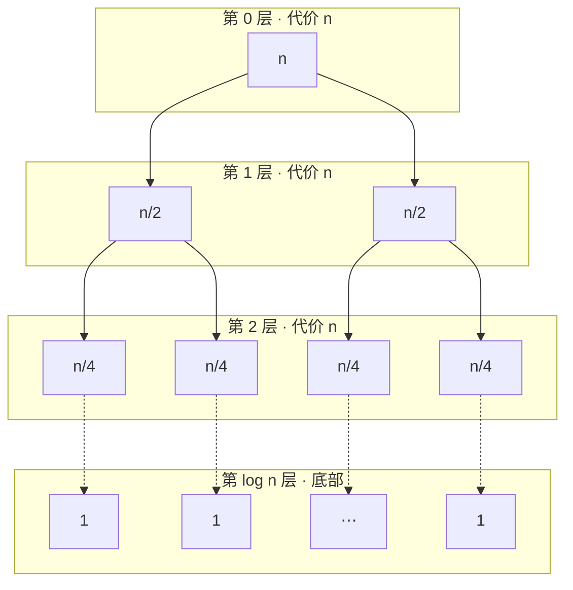
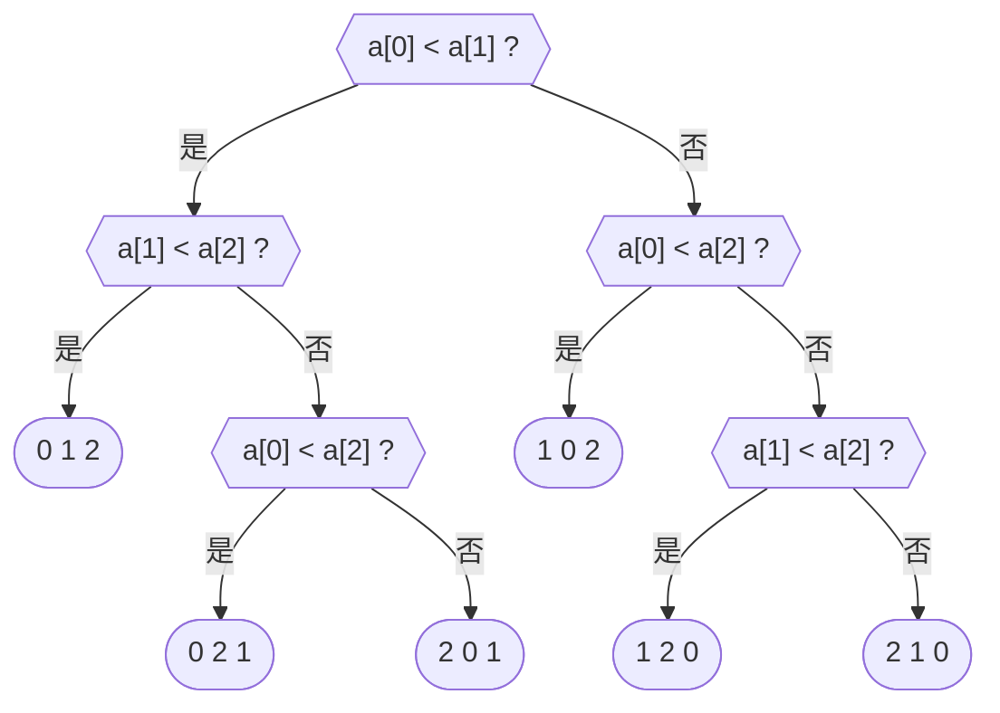

import MergeDemo from '@components/MergeDemo.astro';
import CountingDemo from '@components/CountingDemo.astro';
import MergeTrace from '@components/MergeTrace.astro';
import ParallelMergeDemo from '@components/ParallelMergeDemo.astro';

> 主题 02 的结尾是一堵墙：四种排序最坏都是 $$O(n^2)$$。本主题要翻过它
> 两次。一次靠**把问题拆开**，一次靠**根本不做比较**。

## 拆开为什么会变快 \{#divide}

假设要立一千张多米诺骨牌。一个人立要立很久，十个人各立一百张很快就完。
小组作业也一样：公司调研、访谈、准备发表分头去做，最后再合起来。

到这里没什么可惊讶的。**人多十倍所以快十倍**，是主题 01 的并行求和
已经讲过的故事。

本主题的惊讶在别处。**一个人做也会变快**。把排序对半拆开，各自排好再
合并，即使一个人按顺序全部做完，**总的工作量本身也变少了**。
$$O(n^2)$$ 变成 $$O(n \log n)$$，不是因为工人变多，而是因为
**要做的活变少了**。

### 分治 \{#divide-conquer}

这个策略叫[[divide-and-conquer|分治]]。三个步骤。

- **分（divide）**：把问题拆成同样形状的小问题。
- **治（conquer）**：解决小问题。足够小就直接解，否则继续拆。
- **合（combine）**：把小答案拼成整体的答案。

其实这不是第一次见。主题 01 的二分查找就是分治：对半拆开，
**只治一边**，合并则无事可做。这一次要两边都治，还要合。

### 怎么拆 \{#split-ways}

1 到 100 共 100 个数，两个人分工排序，拆法有两种。

- **按值拆**：一人负责 50 以下，一人负责 51 以上。各自排好之后
  **接起来就完了**。合并免费，但拆的时候要把 100 个元素全部按值分类。
- **按位置拆**：一人前 50 个，一人后 50 个。对半一切就好，拆是免费的。
  但排好的两堆还要**交错着合起来**。

哪种拆法都有活剩下。拆得容易合就难，合得容易拆就难。归并排序走第二条
路，下一个主题的快速排序走第一条。

### 参考：乘法也能拆 \{#karatsuba}

分治不是排序专用。卡拉楚巴（Karatsuba）拆的是乘法。

$$
1234 \times 5678 = (12 \cdot 100 + 34)(56 \cdot 100 + 78) = a \cdot 10^4 + b \cdot 10^2 + c
$$

$$
a = 12 \times 56, \quad b = 12 \times 78 + 34 \times 56, \quad c = 34 \times 78
$$

直接算需要 **4 次**两位数乘法。但 $$b$$ 可以改写成：

$$b = (12 + 34)(56 + 78) - a - c$$

$$a$$ 和 $$c$$ 反正都要算，新的乘法只有
$$(12+34)(56+78) = 46 \times 134$$ **一次**。4 次乘法变 3 次，
递归地做下去，大数乘法就从 $$O(n^2)$$ 变成
$$O(n^{\log_2 3}) \approx O(n^{1.585})$$。验算：
$$672 \cdot 10^4 + 2840 \cdot 10^2 + 2652 = 7{,}006{,}652$$，
正是 $$1234 \times 5678$$。

## 例 1. 归并排序 \{#merge-sort}

归并排序的想法只有一句话：**对半拆开各自排序，再把有序的两半合起来。**
而"各自排序"的办法还是归并排序，也就是递归。

### 引擎是归并 \{#merge}

看递归之前，先看引擎：**把两堆有序的元素合成一堆**。反复比较两堆的
排头，取走小的那个，就够了。

上排是数组，下排是临时数组（temp）。前一半和后一半各自有序。

<MergeDemo mode="merge" />

合并 10 个元素只用了 9 次比较。两堆**已经有序**这件事帮我们省了比较：
永远只需要看每堆的排头。

### 完整的排序 \{#merge-sort-demo}

把这个归并放上递归，就是完整的排序。单个元素本来就有序，是递归的
底部，从那里开始一路向上合并。`ms(0, 9)` 芯片标出当前所在的调用。

<MergeDemo mode="sort" />

### 一眼看全 \{#merge-tree}

演示按时间走，这张图给出整体结构，叫**分合树**（递归树）。上半部分
一路对半，直到只剩单个元素，蓝色的中间一行是递归的底部；下半部分
相邻两段一路归并上来，绿色的每一段始终有序。

<MergeTrace />

分的过程不挪动任何元素，所以上半部分保持原来的顺序；所有的重排都
发生在下半部分。稍后的分析要数的，正是这张图的行数（层数）。

### 归并可以同时做 \{#parallel-merge}

这棵树还有一件礼物。**同一层的归并碰的是不同的区间**。互不重叠，
所以可以同时做 — 和主题 01 的并行求和是同一幅图。

<ParallelMergeDemo />

两条泳道的工作量相同：都是九次归并。一个人按顺序要 9 步，
一层一起做只要 **4 步**，也就是层数。分治不只把活变少，
还把拆出来的块摆成了**可以同时跑的形状**。

不过也不是免费的。最后一次归并要独自处理整个数组，
核心再多，这一步也定下了墙钟时间的下限。

### 写成过程 \{#merge-pseudo}

```plaintext
ALGORITHM MergeSort(A, lo, hi)
    if lo >= hi then return          // 单个元素：本来就有序
    mid <- (lo + hi) / 2
    MergeSort(A, lo, mid)            // 左半
    MergeSort(A, mid+1, hi)          // 右半
    Merge(A, lo, mid, hi)            // 合并有序的两半

ALGORITHM Merge(A, lo, mid, hi)
    i <- lo, j <- mid+1, k <- lo
    while i <= mid and j <= hi do
        if A[i] <= A[j] then
            T[k] <- A[i]; i++
        else
            T[k] <- A[j]; j++
        k++
    把剩下的元素抄到 T
    把 T[lo..hi] 抄回 A[lo..hi]
```

和主题 01 的斐波那契一样，是**调用自己的定义**。不同之处：左右两段
不重叠，同一个值不会被算两遍。

### 写成代码 \{#merge-code}

```c
static void merge(int a[], int lo, int mid, int hi, int temp[],
                  int *comparisons, int *moves) {
    int i = lo;
    int j = mid + 1;
    int k = lo;
    while (i <= mid && j <= hi) {
        (*comparisons)++;
        if (a[i] <= a[j]) {   /* <= 让相同的值左边先出：稳定 */
            temp[k++] = a[i++];
        } else {
            temp[k++] = a[j++];
        }
        (*moves)++;
    }
    while (i <= mid) { temp[k++] = a[i++]; (*moves)++; }
    while (j <= hi)  { temp[k++] = a[j++]; (*moves)++; }
    for (k = lo; k <= hi; k++) { a[k] = temp[k]; (*moves)++; }
}

void mergeSort(int a[], int lo, int hi, int temp[],
               int *comparisons, int *moves) {
    if (lo >= hi) {
        return;
    }
    int mid = lo + (hi - lo) / 2;
    mergeSort(a, lo, mid, temp, comparisons, moves);
    mergeSort(a, mid + 1, hi, temp, comparisons, moves);
    merge(a, lo, mid, hi, temp, comparisons, moves);
}
```

- 运行

```sh
cd src/topic-03-divide-conquer/01_merge_sort
make -f /work/Makefile mergeSort.out && ./mergeSort.out
```

- 结果

```console
before: 2 8 5 9 1 10 7 6 4 3
after : 1 2 3 4 5 6 7 8 9 10
comparisons = 22, moves = 68
```

演示的计数器落在同样的数字上。

### 分析 \{#merge-analysis}

为什么是 $$O(n \log n)$$，一张图就能看明白。把归并按层归拢：
**任何一层，被合并的元素加起来都是 $$n$$。**



对半分，层数是 $$\log_2 n$$；每层代价 $$n$$，所以总共
$$O(n \log n)$$。**最好、平均、最坏全都一样**，因为拆分的形状与输入
无关。

在我们的数组上量出来是：

| 输入 | 比较次数 | 移动次数 |
| --- | --- | --- |
| 示例数组 | $$22$$ | $$68$$ |
| 已排序 | $$19$$ | $$68$$ |
| 逆序 | $$15$$ | $$68$$ |

有两点显眼。

- **移动永远是 68 次**。每次归并整段都要经 temp 往返一趟，移动次数
  与输入无关，是定死的。
- **逆序（15 次）比已排序（19 次）比较得更少**。逆序数组每次归并都有
  一边提前取完，剩下的一边不用比较直接倒进去。

付出的代价也很清楚。**空间 $$O(n)$$**：需要临时数组 temp。主题 02 的
四种排序全是 $$O(1)$$。另外多亏 `merge` 里的 `<=`，值相同时左边先出，
是**稳定排序**。

### 五种排序并排看 \{#five-sorts}

同一个数组 `2 8 5 9 1 10 7 6 4 3` 跑五种排序：

| 排序 | 比较 | 移动 | 最坏 |
| --- | --- | --- | --- |
| 选择排序 | 45 | 21 | $$O(n^2)$$ |
| 插入排序 | 33 | 43 | $$O(n^2)$$ |
| 希尔排序 | 30 | 57 | $$O(n^2)$$ |
| 冒泡排序 | 45 | 75 | $$O(n^2)$$ |
| **归并排序** | **22** | 68 | $$O(n \log n)$$ |

$$n = 10$$ 时差距平平。但正如主题 02 所示，差距在 $$n$$ 变大时显现。
$$n = 10^9$$ 时，$$n^2$$ 是 $$10^{18}$$，而 $$n \log n$$ 约
$$3 \times 10^{10}$$，相差 **3 千万倍**。插入排序要 317 年的活，
归并排序 18 分钟做完，原因就在这里。

## 靠比较只能到这里 \{#lower-bound}

能造出比归并排序更快的排序吗？令人吃惊的是，可以证明：**只要靠比较来
排序，阶就不可能再低。**

把算法做的比较画成一棵树：每个结点一次比较，分支是比较的结果。
$$n = 3$$ 时可能的排序结果（排列）有 $$3! = 6$$ 种，算法要沿着比较的
答案一路走到其中一个。



- 叶子**至少要有 $$n!$$ 个**。少了哪个排列，算法在那个输入上就错。
- 高度为 $$h$$ 的二叉树，叶子**至多 $$2^h$$ 个**。
- 于是 $$2^h \geq n!$$，即 $$h \geq \log_2(n!)$$。

而 $$h$$ 正是最坏情况的比较次数。用斯特林近似
$$\log_2(n!) \approx n \log_2 n$$，所以**任何比较排序在最坏情况下都要
比较 $$\Omega(n \log n)$$ 次**。归并排序的阶已经贴着这条下界，
不可能再好。

用数字量一下：$$\lceil \log_2 10! \rceil = 22$$。10 个元素靠比较来
排，最坏至少要比 22 次。我们的归并排序在示例数组上用的恰好是 22 次。

不过这个证明带着一个条件：**"只要靠比较来排序"**。如果可以不比较呢？

## 例 2. 计数排序 \{#counting}

如果值是 0 到 $$k$$ 之间的整数，元素之间根本不需要比较。**数出每个值
有几个**，每个元素该去的位置就能算出来。

看三排：输入、计数数组、输出。注意比较计数器到最后都停在 0。

<CountingDemo />

### 写成过程 \{#counting-pseudo}

```plaintext
ALGORITHM CountingSort(A, n, k)
    // 1) 计数：每个值有几个
    for v <- 0 to k do count[v] <- 0
    for i <- 0 to n-1 do
        count[A[i]] <- count[A[i]] + 1

    // 2) 累加：值 v 结束的位置（个数和）
    for v <- 1 to k do
        count[v] <- count[v] + count[v-1]

    // 3) 放置：从后往前读，放进该去的位置
    for i <- n-1 downto 0 do
        count[A[i]] <- count[A[i]] - 1
        B[count[A[i]]] <- A[i]
```

### 写成代码 \{#counting-code}

```c
void countingSort(const int a[], int b[], int n, int count[], int *moves) {
    for (int v = 0; v <= MAX_KEY; v++) {
        count[v] = 0;
    }
    for (int i = 0; i < n; i++) {         /* 1) 计数 */
        count[a[i]]++;
    }
    for (int v = 1; v <= MAX_KEY; v++) {  /* 2) 累加 */
        count[v] += count[v - 1];
    }
    for (int i = n - 1; i >= 0; i--) {    /* 3) 从后往前放：稳定 */
        count[a[i]]--;
        b[count[a[i]]] = a[i];
        (*moves)++;
    }
}
```

- 运行

```sh
cd src/topic-03-divide-conquer/02_counting_sort
make -f /work/Makefile countingSort.out && ./countingSort.out
```

- 结果

```console
before: 1 0 1 5 4 3 1 4 5 2 1
after : 0 1 1 1 1 2 3 4 4 5 5
comparisons = 0, moves = 11
```

**比较 0 次**。11 个元素只用 11 次移动就各就各位。

### 为什么从后往前 \{#counting-stable}

第 3 步从后往前读输入是有原因的。累加数组记着"值 $$v$$ 的**最后一个**
位置"。从后往前读，相同值里靠后的拿到靠后的位置，原来的顺序就保住了。
是**稳定排序**。

给相同的值挂上名牌就看得见。

<CountingDemo
  values={[2, 1, 2, 0, 1]}
  maxKey={2}
  labels={['甲', '乙', '丙', '丁', '戊']}
/>

2 有两个（甲、丙），1 有两个（乙、戊），输出里甲仍在丙前面，
乙仍在戊前面。照实践代码的**改改看**换成从前往后读，结果照样有序，
但这些顺序会翻过来。

### 分析 \{#counting-analysis}

计数 $$O(n)$$，累加 $$O(k)$$，放置 $$O(n)$$，总共 $$O(n + k)$$。
$$k$$ 和 $$n$$ 差不多大时就相当于 $$O(n)$$，比 $$\Omega(n \log n)$$
的下界还快。不是打破了下界，而是**站到了下界的前提之外**：不做比较，
决策树的论证就套不上来。

这不是免费的。付出的有两样。

- **键必须是窄范围的整数**。实数、字符串、范围未知的值都不行。
  比较排序则只要能比较，什么都能排。
- **空间 $$O(n + k)$$**。计数数组加输出数组。$$k$$ 一大就是灾难：
  11 个元素，值的范围却到一百万，就得开一百万个格子，几乎全在
  闲置。

一句话：考试分数（0\~100）、年龄、月份（1\~12）这类**又窄又密的整数
键**，计数排序碾压一切；其他场合，比较排序才是安全的选择。

## 六种排序并排看 \{#comparison}

| 排序 | 最好 | 平均 | 最坏 | 空间 | 稳定性 | 类别 |
| --- | --- | --- | --- | --- | --- | --- |
| 选择排序 | $$O(n^2)$$ | $$O(n^2)$$ | $$O(n^2)$$ | $$O(1)$$ | 不稳定 | 比较 |
| 插入排序 | $$O(n)$$ | $$O(n^2)$$ | $$O(n^2)$$ | $$O(1)$$ | 稳定 | 比较 |
| 希尔排序 | $$O(n \log n)$$ | $$O(n^{1.5})$$ | $$O(n^2)$$ | $$O(1)$$ | 不稳定 | 比较 |
| 冒泡排序 | $$O(n^2)$$ | $$O(n^2)$$ | $$O(n^2)$$ | $$O(1)$$ | 稳定 | 比较 |
| 归并排序 | $$O(n \log n)$$ | $$O(n \log n)$$ | $$O(n \log n)$$ | $$O(n)$$ | 稳定 | 比较 |
| 计数排序 | $$O(n + k)$$ | $$O(n + k)$$ | $$O(n + k)$$ | $$O(n + k)$$ | 稳定 | 非比较 |

从主题 01 反复问到现在的问题，也写在这张表里。归并排序翻过时间之墙，
付出的是空间；计数排序抛弃比较，付出的是键的普适性。**付出什么，
得到什么。**

## 要带走的 \{#takeaway}

- **分治**：分、治、合。变快不是因为人多分担，而是**活本身变少**。
  拆出来的块互不重叠，还**可以同时跑**。
- 拆得容易合就难，合得容易拆就难。归并排序在拆免费的那一边。
- **归并排序**：每层代价 $$n$$，共 $$\log n$$ 层，所以
  $$O(n \log n)$$。最好、平均、最坏一致，稳定，付出 $$O(n)$$ 空间。
- **比较排序的下界**：决策树至少要 $$n!$$ 个叶子，所以任何比较排序
  最坏都是 $$\Omega(n \log n)$$。
- **计数排序**：窄范围整数键时，不比较就能 $$O(n + k)$$。不是打破
  下界，而是站在下界的前提之外。
- 乘法也能拆：卡拉楚巴把 4 次乘法变 3 次，得到 $$O(n^{1.585})$$。

## 实践代码 \{#code}

在 [lec-algorithm/algorithm-code](https://github.com/lec-algorithm/algorithm-code/tree/main)
仓库的 `src/topic-03-divide-conquer/` 文件夹里。每个例子由一份伪代码
配上 C 和 Python 两个实现。

```plaintext
src/topic-03-divide-conquer/
├── 01_merge_sort/       # 归并排序，比较 22 移动 68
└── 02_counting_sort/    # 计数排序，比较 0 移动 11
```

打开文件，按编辑器右上角的 **▶ 按钮**即可运行。运行方法见
[实践环境准备](/article/setup-guide/)。

**亲手试试**

- 给归并排序喂已排序和逆序的数组。比较变成 19 次和 15 次，
  移动始终 68 次。
- 把 `merge` 的 `<=` 改成 `<`。答案不变，稳定性没了。
- 把计数排序第 3 步改成从前往后读，看相同值的顺序翻过来。
- 把 `MAX_KEY` 提到 1000000：11 个元素配一百万个格子。这就是
  $$O(n + k)$$ 里 $$k$$ 的含义。

## 版本记录 \{#changelog}

幻灯片与本资料一起升版。当前版本是 **v1**，幻灯片左下角
可以看到同一版本号。

| 版本 | 日期 | 内容 |
| --- | --- | --- |
| v1 | 2026-09-01 | 首次公开 |
