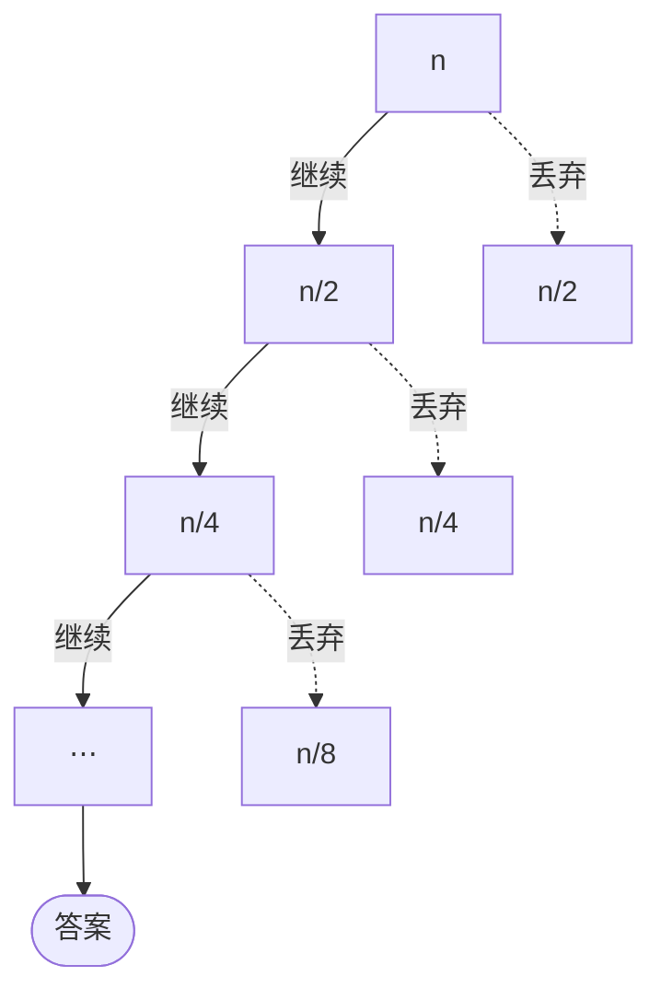

import QuickDemo from '@components/QuickDemo.astro';

> 主题 03 说过，拆与合是跷跷板。归并排序拆是免费的，活干在合并里。
> 本主题坐在跷跷板的另一端：**拆的时候干活，合并免费的排序。**
> 而守住这个"拆"的材料，是**随机**。

## 材料：随机 \{#random}

进入快速排序之前，先备一份材料。计算机的随机是从哪来的？

其实 `rand()` 产出的是**伪随机数**（pseudorandom）。它接受一个叫
种子（seed）的输入，**跑一个函数**得到输出，而函数意味着
**输入相同，输出就相同**。实践代码不用库函数，而是亲手实现同一类
生成器（minstd）来展示这一点。

```c
static int64_t state = 1;

/* 像 srand 一样换种子。 */
void setSeed(int64_t seed) {
    state = seed;
}

/* 像 rand 一样产出下一个数。x <- x * 16807 mod (2^31 - 1) */
int64_t nextRandom(void) {
    state = state * 16807 % 2147483647;
    return state;
}
```

- 运行

```sh
cd src/topic-04-quick-sort/01_random
make -f /work/Makefile randomProgram.out && ./randomProgram.out
```

- 结果

```console
seed = 1 : 16807 282475249 1622650073
seed = 1 : 16807 282475249 1622650073
seed = 2 : 33614 564950498 1097816499
```

种子 1 喂两次，得到**一模一样的序列**两遍。只有换种子，序列才会变。
所以实战里用难以预测的值当种子，比如时钟：C 的惯用写法是
`srand(time(NULL))`。

### 哪里需要随机 \{#random-why}

YouTube 视频地址的 ID 为什么不是 `10500`、`10501` 这样的顺序号？
每秒都有大量视频落到许多服务器、许多数据库上（分片），而 ID 绝不能
重复。顺序号要求服务器之间协调，行不通，所以用基于随机的 ID。
"下一个号猜不出来"这个性质是白送的。

在本主题里，随机有自己的岗位：**挑基准（pivot）**。为什么这个岗位
需要随机，要等看过快速排序的最坏情况再回来。

## 例 1. 快速排序 \{#quick-sort}

想法来自主题 03 的跷跷板。**挑一个基准值，小的送左边，大的送右边。
基准就落在它最终的位置上，再把两边各自排好就完了**。按值拆开，
合并就是接起来：免费。

### 引擎是划分 \{#partition}

归并排序的引擎是归并，快速排序的引擎是**划分**（partition）。
拿第一个元素当基准，扫一遍其余元素，把比基准小的（青色区）聚到左边。
扫完后，把基准放到边界上。

<QuickDemo mode="partition" />

一次划分花 9 次比较，**定下一个最终位置**。这次的基准 `2` 几乎是
最小值，左区只剩一个 `1`。好基准与坏基准的故事，从这里就开始了。

### 完整的排序 \{#quick-sort-demo}

把划分放上递归，就是完整的排序。`qs(0, 9)` 芯片标出当前调用。
定好位置的基准一个个变绿堆起来。

<QuickDemo mode="sort" />

### 写成过程 \{#quick-pseudo}

```plaintext
ALGORITHM QuickSort(A, lo, hi)
    if lo >= hi then return          // 单个元素：本来就有序
    p <- Partition(A, lo, hi)        // 把基准放到它的位置
    QuickSort(A, lo, p-1)            // 基准左边（比它小的）
    QuickSort(A, p+1, hi)            // 基准右边（大于等于的）

ALGORITHM Partition(A, lo, hi)
    pivot <- A[lo]
    i <- lo                          // i：小区的末尾
    for j <- lo+1 to hi do
        if A[j] < pivot then
            i <- i + 1
            swap A[i], A[j]
    swap A[lo], A[i]                 // 基准放到边界
    return i                         // 基准的最终位置
```

递归骨架和归并排序一样，不同的是干活的位置：归并在**递归回来之后**
（合并）干活，快排在**进入递归之前**（拆分）干活。

### 写成代码 \{#quick-code}

```c
static int partition(int a[], int lo, int hi, int *comparisons, int *moves) {
    int pivot = a[lo];
    int i = lo;
    for (int j = lo + 1; j <= hi; j++) {
        (*comparisons)++;
        if (a[j] < pivot) {
            i++;
            swap(a, i, j, moves);
        }
    }
    swap(a, lo, i, moves);
    return i;
}

void quickSort(int a[], int lo, int hi, int *comparisons, int *moves) {
    if (lo >= hi) {
        return;
    }
    int p = partition(a, lo, hi, comparisons, moves);
    quickSort(a, lo, p - 1, comparisons, moves);
    quickSort(a, p + 1, hi, comparisons, moves);
}
```

- 运行

```sh
cd src/topic-04-quick-sort/02_quick_sort
make -f /work/Makefile quickSort.out && ./quickSort.out
```

- 结果

```console
before: 2 8 5 9 1 10 7 6 4 3
after : 1 2 3 4 5 6 7 8 9 10
comparisons = 25, moves = 21
```

演示的计数器落在同样的数字上。

### 分析 \{#quick-analysis}

基准每次落在中间附近，数组就近似对半分，图景就成了归并排序的：
每层划分代价之和是 $$n$$，共 $$\log n$$ 层，所以**平均
$$O(n \log n)$$。**

麻烦在基准不好的时候。在我们的数组上量出来：

| 输入 | 比较次数 | 移动次数 |
| --- | --- | --- |
| 示例数组 | $$25$$ | $$21$$ |
| 已排序 | $$45$$ | $$0$$ |
| 逆序 | $$45$$ | $$15$$ |

**已排序的输入是最坏情况**。首元素基准每次都是最小值，左边空着，
右边只缩一个。层数从 $$\log n$$ 变成 $$n$$，比较冲到
$$\frac{n(n-1)}{2} = 45$$ 次，也就是 $$O(n^2)$$。插入排序的最好情况
（9 次）正是已排序输入，快排恰好相反。**哪种输入算好输入，
也因算法而异。**

和归并排序摆在一起，各自付出的东西就看清了。

| | 比较 | 移动 | 额外空间 | 最坏 | 稳定性 |
| --- | --- | --- | --- | --- | --- |
| 归并排序 | 22 | 68 | temp 数组 $$O(n)$$ | $$O(n \log n)$$ | 稳定 |
| 快速排序 | 25 | 21 | 递归栈 $$O(\log n)$$ | $$O(n^2)$$ | 不稳定 |

快排多花三次比较，换来移动只有三分之一，而且不用 temp，在原数组里
就地进行。没有归并那种整段往返。代价是 $$O(n^2)$$ 的风险和稳定性：
交换的是相距很远的元素，相同键的顺序没有保证。实战库偏爱快排系
做默认排序的理由，都写在这张表里：平均快、移动少、省内存。

### 基准怎么挑 \{#pivot}

躲开最坏情况的钥匙是基准选择。

- **选项 1. 随机**。每次划分随机挑基准。那么不管来什么输入，
  哪怕是故意构造的对抗输入，**期望时间都是 $$O(n \log n)$$。**
  最坏情况从"某个特定输入"变成"特定输入撞上特定随机数"，
  实际上不会发生。前面备好的材料在这里用上了。
- **选项 2. 三数取中（median-of-3）**。看首、中、尾三个元素，
  取它们的中位数当基准。廉价地躲开已排序输入的陷阱。

既然提到中位数，把三个词分清楚：**平均数**（mean）是加起来除以
个数，**中位数**（median）是排队后站中间的，**众数**（mode）是
出现最多的。理想的基准是中位数，因为它把数组正好切成两半。

## 例 2. 快速选择 \{#quick-select}

换个问题。像年级排名那样，只需要**第 k 小的值**一个，也要全部
排序吗？排序要 $$O(n \log n)$$。有更便宜的办法。

再看划分给的保证：**基准的位置是最终的**。基准正好站在第 $$k$$ 个
位置，它就是答案；站得靠前，答案在右边；靠后，答案在左边。
**没有答案的那一边，整个丢掉。**

<QuickDemo mode="select" k={5} />

### 写成过程 \{#select-pseudo}

```plaintext
ALGORITHM QuickSelection(A, n, k)
    lo <- 0, hi <- n-1
    loop
        p <- Partition(A, lo, hi)    // 和快排相同的划分
        if p = k-1 then              // 基准恰好在第 k 位
            return A[p]
        else if p > k-1 then
            hi <- p-1                // 答案在左边，丢掉右边
        else
            lo <- p+1                // 答案在右边，丢掉左边
```

划分和快排一模一样。不同只有一处：快排**两边都挖**，快选**只挖
一边**。这正是二分查找对顺序查找做过的事：丢掉一半。

### 写成代码 \{#select-code}

```c
int quickSelection(int a[], int n, int k, int *comparisons, int *moves) {
    int lo = 0;
    int hi = n - 1;
    while (1) {
        int p = partition(a, lo, hi, comparisons, moves);
        if (p == k - 1) {
            return a[p];
        }
        if (p > k - 1) {
            hi = p - 1;
        } else {
            lo = p + 1;
        }
    }
}
```

- 运行

```sh
cd src/topic-04-quick-sort/03_quick_selection
make -f /work/Makefile quickSelection.out && ./quickSelection.out
```

- 结果

```console
before: 2 8 5 9 1 10 7 6 4 3
after : 1 2 3 4 5 10 7 6 9 8
k = 5 -> value = 5
comparisons = 16, moves = 15
```

**看 after 那一行**。只有前五个位置定了，后面还是乱的。没排完
就拿到了答案。同一个数组全部排好要 25 次比较，选择只用了 **16 次**。

### 分析 \{#select-analysis}

只挖一边为什么这么划算，树上看得见。丢掉的一边再也不碰。



快排走遍每根枝条，每层付 $$n$$，共 $$\log n$$ 层。快选只顺着一条
车道下去，代价每轮减半：

$$
n + \frac{n}{2} + \frac{n}{4} + \cdots \leq 2n
$$

所以**平均 $$O(n)$$。**$$n = 10$$ 时大约
$$10 + 5 + 2 + 1 = 18$$，实测的 16 次就在附近。

两点提醒。

- **最坏仍是 $$O(n^2)$$**。坏基准的陷阱原样存在，所以认真的实现
  在这里也用随机基准。
- **它找的是"第几"，不是"某个值"**。判断一个值在不在，是查找的
  活，归主题 01 管。有序数组上二分查找 $$O(\log n)$$ 更便宜。

## 七种排序并排看 \{#comparison}

| 排序 | 最好 | 平均 | 最坏 | 空间 | 稳定性 | 类别 |
| --- | --- | --- | --- | --- | --- | --- |
| 选择排序 | $$O(n^2)$$ | $$O(n^2)$$ | $$O(n^2)$$ | $$O(1)$$ | 不稳定 | 比较 |
| 插入排序 | $$O(n)$$ | $$O(n^2)$$ | $$O(n^2)$$ | $$O(1)$$ | 稳定 | 比较 |
| 希尔排序 | $$O(n \log n)$$ | $$O(n^{1.5})$$ | $$O(n^2)$$ | $$O(1)$$ | 不稳定 | 比较 |
| 冒泡排序 | $$O(n^2)$$ | $$O(n^2)$$ | $$O(n^2)$$ | $$O(1)$$ | 稳定 | 比较 |
| 归并排序 | $$O(n \log n)$$ | $$O(n \log n)$$ | $$O(n \log n)$$ | $$O(n)$$ | 稳定 | 比较 |
| 计数排序 | $$O(n + k)$$ | $$O(n + k)$$ | $$O(n + k)$$ | $$O(n + k)$$ | 稳定 | 非比较 |
| 快速排序 | $$O(n \log n)$$ | $$O(n \log n)$$ | $$O(n^2)$$ | $$O(\log n)$$ | 不稳定 | 比较 |

表格到了七行。要保证最坏：归并。平均要快、内存要省：快排。
窄范围整数键：计数。近乎有序的输入源源不断：插入。
**挑一种排序，就是挑一种权衡。**

## 要带走的 \{#takeaway}

- 计算机的随机是**伪随机**。种子相同序列就相同，因此可以复现。
- **快速排序**：划分定下基准的位置，再挖两边。活干在拆里，
  合并免费，是归并排序的镜像。
- 平均 $$O(n \log n)$$，移动少，原地进行。代价：最坏 $$O(n^2)$$
  和稳定性。
- **已排序输入是快排的最坏情况**，和插入排序正相反。好输入因
  算法而异。
- 最坏情况的解药是**随机基准**：任何输入下期望 $$O(n \log n)$$。
- **快速选择**：同一个划分只挖一边，平均 $$O(n)$$ 拿到第 k 小，
  不用排完。

## 实践代码 \{#code}

在 [lec-algorithm/algorithm-code](https://github.com/lec-algorithm/algorithm-code/tree/main)
仓库的 `src/topic-04-quick-sort/` 文件夹里。每个例子由一份伪代码
配上 C 和 Python 两个实现。

```plaintext
src/topic-04-quick-sort/
├── 01_random/            # 伪随机，同种子 = 同序列
├── 02_quick_sort/        # 快速排序，比较 25 移动 21
└── 03_quick_selection/   # 快速选择，16 次比较拿到第 5 小
```

打开文件，按编辑器右上角的 **▶ 按钮**即可运行。运行方法见
[实践环境准备](/article/setup-guide/)。

**亲手试试**

- 给快排喂已排序的 `1 2 … 10`。比较跳到 45 次，看看最坏长什么样。
- 把划分改成用 `01_random` 的生成器挑基准。已排序输入的陷阱消失。
- 把快选的 `k` 改成 1 和 10：比较 9 次和 20 次，都比全排（25 次）
  便宜。
- 用 `time(NULL)` 当种子，看每次运行序列都不一样。
