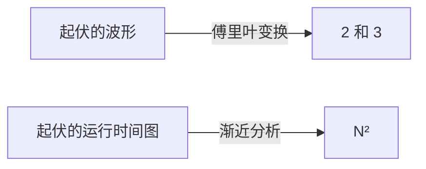

import GrowthDemo from '@components/GrowthDemo.astro';

> 从主题 01 到 04，我们其实一直在说 $$O(n)$$、$$O(n \log n)$$。
> 每张表里都有它们，演示的计数器也一次次印证了那些数字。本主题要
> 打牢的是这门**语言本身**：它从哪来，精确含义是什么，怎么用才对。

## 一门做摘要的语言 \{#language}

先来一个挑战。有一条剧烈起伏的波形图，你怎么向别人描述它？
用公式难，用话说也难。

但如果这条波形其实是 2Hz 信号与 3Hz 信号的和，经过傅里叶变换的
图上，**只有 2 和 3 两个位置立着柱子**。描述缩成了两个数字。



本主题做的正是这件事：一门把几千个测量点的运行时间图
**用一个词 $$N^2$$ 概括**的语言。波形的故事可看 3Blue1Brown 的
[傅里叶变换视频](https://www.youtube.com/watch?v=spUNpyF58BY)。

## 第一条路：测量 \{#measure}

我们按输入规模给一个程序计了时。

| $$N$$ | 250 | 500 | 1,000 | 2,000 | 4,000 | 8,000 | 16,000 |
| --- | --- | --- | --- | --- | --- | --- | --- |
| 时间（秒） | 0.0 | 0.0 | 0.1 | 0.8 | 6.4 | 51.1 | ? |

问号能填出来吗？看 $$N$$ 每翻一倍时的时间：
$$0.8 \to 6.4 \to 51.1$$，每次**约 8 倍**。$$2^3 = 8$$，所以时间
跟着 $$N^3$$ 走，下一格应是 $$51.1 \times 8 \approx 409$$ 秒。
这就是**倍增实验**（doubling hypothesis）：测量、翻倍、看比值。

测量很有力，但有三个局限。

- **被机器和语言绑住**。主题 01 起反复说的那句话：毫秒因机器而异。
- **没去过的 $$N$$ 一无所知**。下一格要等七分钟，再下一格要等
  一个小时。
- **说不出为什么**。它告诉你是 8 倍，但原因在代码里。

## 第二条路：计数 \{#count}

于是第二条路不测秒，而是**数运算**，直接从代码建立数学模型。

### 1-sum：把运算数个遍 \{#one-sum}

数数组里 0 的个数的代码：

```c
int count = 0;
for (int i = 0; i < N; i++)
    if (a[i] == 0)
        count++;
```

每种运算发生几次，都能数出来。

| 运算 | 频次 |
| --- | --- |
| 变量声明 | $$2$$ |
| 赋值 | $$2$$ |
| `<` 比较 | $$N + 1$$ |
| `==` 比较 | $$N$$ |
| 数组访问 | $$N$$ |
| 自增 | $$N$$ \~ $$2N$$ |

自增是个范围，因为 `count++` 随输入在 0 到 $$N$$ 次之间。
最好与最坏的分岔已经露头了。

### 2-sum：数数本身也是活 \{#two-sum}

换成数"和为 0 的对"，表就沉了。

```c
int count = 0;
for (int i = 0; i < N; i++)
    for (int j = i+1; j < N; j++)
        if (a[i] + a[j] == 0)
            count++;
```

| 运算 | 频次 |
| --- | --- |
| 变量声明 | $$N + 2$$ |
| 赋值 | $$N + 2$$ |
| `<` 比较（内层） | $$\dfrac{N(N+1)}{2}$$ |
| `==` 比较 | $$\dfrac{N(N-1)}{2}$$ |
| 数组访问 | $$N(N-1)$$ |
| 自增 | $$\dfrac{N(N-1)}{2}$$ \~ $$N(N-1)$$ |

精确，但没人能一直扛着这张表。三重循环还要再翻一倍。
**数数这件事本身得简化。**

### 简化 \{#simplify}

两条约定让表缩成一行。

- **代价模型**：不数全部运算，只数**一种代表运算**。这里是数组
  访问。挑最频繁或最贵的那种。
- **波浪号记法**：只留最高次项。$$N(N-1) = N^2 - N$$ 写成
  $$\sim N^2$$。$$N$$ 一大，低次项小到可以无视。

实践代码验证这个模型。数数组访问，与理论一位不差；倍增实验
**与机器无关**地落在 4 和 8 上。

- 运行

```sh
cd src/topic-05-complexity/01_three_sum
make -f /work/Makefile threeSum.out && ./threeSum.out
```

- 结果

```console
N = 100
1-sum: count = 1, accesses = 100
2-sum: count = 19, accesses = 9900
3-sum: count = 642, accesses = 485100

doubling N: accesses ratio
     N        2-sum        3-sum
   200         4.02         8.12
   400         4.01         8.06
```

$$9900 = N(N-1)$$，$$485100 = 3\binom{N}{3}$$。测量给了 51.1 秒，
计数还给出**为什么是 8 倍**。

## 渐近分析 \{#asymptotic}

简化的尽头，是只留下 $$N$$ 足够大时的增长率，也就是
[[asymptotic-analysis|渐近分析]]。真实算法的增长率出奇地集中在
少数几种上。

### 七个增长等级 \{#growth}

每走一步 $$n$$ 翻一倍。看每个等级各变成几倍，再看在每秒
$$10^9$$ 次运算的计算机上要多久。

<GrowthDemo />

翻不了几次，$$2^n$$ 那一行就跨进了"年"。倍率徽章是本主题的
要点：**×4 是二次，×8 是三次，自我平方是指数**。倍增实验里看到的
比值，就是等级的指纹。

七个等级我们全都遇见过。

| 等级 | 在哪遇见的 |
| --- | --- |
| $$1$$ | 计数排序的位置计算（主题 03） |
| $$\log n$$ | 二分查找（主题 01） |
| $$n$$ | 顺序查找（主题 01）、快速选择（主题 04） |
| $$n \log n$$ | 归并排序（主题 03）、快排平均（主题 04） |
| $$n^2$$ | 选择·插入·冒泡排序（主题 02）、2-sum |
| $$n^3$$ | 3-sum（本主题） |
| $$2^n$$ | 递归斐波那契（主题 01） |

### 年代在变，等级不变 \{#decades}

改编自塞奇威克：几分钟内能解决的问题规模，按年代看。

| 增长率 | 1970 年代 | 1980 年代 | 1990 年代 | 2000 年代 |
| --- | --- | --- | --- | --- |
| $$n$$ | 数百万 | 数千万 | 数亿 | 数十亿 |
| $$n \log n$$ | 数十万 | 数百万 | 数百万 | 数亿 |
| $$n^2$$ | 数百 | 数千 | 数千 | 数万 |
| $$n^3$$ | 一百 | 数百 | 一千 | 数千 |
| $$2^n$$ | 20 上下 | 20 多 | 20 多 | 30 上下 |

计算机快了几千倍，$$2^n$$ 那一行只从 20 挪到 30。主题 02 的
317 年、主题 03 的三千万倍，结论又一次出现：
**等级之差，硬件填不平。**

## 四种记法 \{#notation}

现在是这门语言的语法。四个要分清。

| 记法 | 例 | 含义 | 用途 |
| --- | --- | --- | --- |
| 波浪号 $$\sim$$ | $$\sim 10n^2$$ | 最高次项，**连常数一起**留下 | 近似模型 |
| 大 Theta $$\Theta$$ | $$\Theta(n^2)$$ | 恰好这个增长率 | 给算法分类 |
| 大 O $$O$$ | $$O(n^2)$$ | 这个增长率**及以下**（上界） | 保证上限 |
| 大 Omega $$\Omega$$ | $$\Omega(n^2)$$ | 这个增长率**及以上**（下界） | 证明下限 |

$$O(n^2)$$ 里装着 $$10n^2$$，也装着 $$100n$$ 和
$$22n \log n$$ — 它是一道"长得不比 $$n^2$$ 快"的**栅栏**。
$$\Omega$$ 是反方向的栅栏，我们早就遇见了：
**任何比较排序都是 $$\Omega(n \log n)$$** — 主题 03 的下界用的
正是这个记法。$$\Theta$$ 是上下两道栅栏合拢的情形。

### 常见的误会 \{#misuse}

**大 O 不是"最坏情况"的意思。**最好·平均·最坏，是"看哪些输入"
这条轴；$$O \cdot \Theta \cdot \Omega$$ 是"从哪个方向给增长率
设栅栏"这条轴。两条轴彼此独立，可以自由组合。我们一路说的
"快排的**平均**是 $$O(n \log n)$$，**最坏**是 $$O(n^2)$$"，
正是准确的用法。

还有一个惯例：实践中常在该写 $$\Theta$$ 的地方写 $$O$$，比如
"归并排序是 $$O(n \log n)$$"。上界属实，所以不算错，本课程也
沿用了这个惯例。

## 测验 \{#quiz}

用新学的语法做三道题。

**第 1 题**。这段代码的时间复杂度？

```c
for (int i = 0; i < 2*n; i++)
    for (int j = n-1000; j < n; j++)
        for (int k = n/2; k < n; k++)
            sum++;
```

三重循环不等于 $$O(n^3)$$。外层 $$2n$$ 次，中层**固定 1,000 次**，
内层 $$n/2$$ 次。$$2n \cdot 1000 \cdot \frac{n}{2} = 1000n^2$$，
所以是 $$O(n^2)$$。**被常数框住的循环不贡献次数。**

**第 2 题**。找最小值并从每个元素里减掉它的函数？

```c
void reduce(int vals[], int n) {
    int minIndex = 0;
    for (int i = 0; i < n; i++)
        if (vals[i] < vals[minIndex])
            minIndex = i;
    int minVal = vals[minIndex];
    for (int i = 0; i < n; i++)
        vals[i] = vals[i] - minVal;
}
```

两个循环**并排**，所以 $$O(n) + O(n) = O(n)$$。只有嵌套的循环
才相乘。

**第 3 题**。两元素之差的最大值？

```c
int maxDifference(int vals[], int n) {
    int max = 0;
    for (int i = 0; i < n; i++)
        for (int j = 0; j < n; j++)
            if (vals[i] - vals[j] > max)
                max = vals[i] - vals[j];
    return max;
}
```

两层各 $$n$$ 次的嵌套循环：$$O(n^2)$$。不过注意，分别找最大值和
最小值就能 $$O(n)$$ 解决。**分析打分的是手上这份代码，不是问题
本身的极限**。要谈问题的极限，得用主题 03 那样的下界论证。

## 要带走的 \{#takeaway}

- 通往性能的路有两条：**测量**（实验）与**计数**（数学模型）。
  测量快但绑机器，计数还给出原因。
- **倍增实验**：$$n$$ 翻倍时的比值是次数的指纹。×2 线性，
  ×4 二次，×8 三次。
- 不必全数。用**代价模型**（一种代表运算）和**波浪号**
  （最高次项）简化。
- 真实的增长率集中在**七个等级**上下，等级之差硬件填不平。
- $$O$$ 是上界，$$\Omega$$ 是下界，$$\Theta$$ 是两者合拢。
  **与最好·平均·最坏是彼此独立的轴。**
- 常数循环不贡献次数，并排循环相加，只有嵌套循环相乘。

## 实践代码 \{#code}

在 [lec-algorithm/algorithm-code](https://github.com/lec-algorithm/algorithm-code/tree/main)
仓库的 `src/topic-05-complexity/` 文件夹里。

```plaintext
src/topic-05-complexity/
└── 01_three_sum/    # 数 1·2·3-sum 的运算 + 倍增实验
```

打开文件，按编辑器右上角的 **▶ 按钮**即可运行。运行方法见
[实践环境准备](/article/setup-guide/)。

**亲手试试**

- 用 `doubling_time.py` 把同一实验换成真实时间。数字因机器而异，
  比值仍聚在 4 和 8 附近。
- 给 3-sum 加剪枝，看比值依旧在 8 附近。常数缩小，次数不动。
- 用主题 01 的斐波那契做倍增实验：$$n$$ 每加一，时间变几倍？
  那是指数的指纹。

## 版本记录 \{#changelog}

幻灯片与本资料一起升版。当前版本是 **v1**，幻灯片左下角
可以看到同一版本号。

| 版本 | 日期 | 内容 |
| --- | --- | --- |
| v1 | 2026-09-01 | 首次公开 |
