import HuffmanDemo from '@components/HuffmanDemo.astro';
import LzwDemo from '@components/LzwDemo.astro';
import TreeFigure from '@components/TreeFigure.astro';

> 主题 03 和 04 是拆分问题的策略（分治），主题 05 是衡量其代价的语言。
> 本主题是第二种策略。  
> **选当下看起来最好的，并且再也不回头。**  
> 先看这种简单的态度何时最优、何时出错，再用同样的态度去压缩数据，
> 一直走到霍夫曼编码。

## 贪心这种态度 \{#greedy}

[[greedy-algorithm|贪心算法]]是**从当前可选的选项中挑看起来最好的那个**来
解题的方法。英文叫 greedy algorithm，也叫贪婪算法。它不去考虑当下的最优
能否通向整体的最优。

韩国电影《大叔》里那句"我只为今天而活"，正好概括了这种态度。贪心不算计
明天，只活在今天。

- 选**局部最优解**（local optimum）。
- **只看眼前的情况**做判断。过去的选择、未来的选择都不看。
- **选过的就不撤回**。
- 所以它简单又快。

### 拼出最大的数 \{#largest-number}

假设要用数字卡片 `3 9 5 9 7 1` 拼出最大的数。不用多想，从最大的卡片开始
往前放。

$$
\text{LargestNumber}(3, 9, 5, 9, 7, 1) = 9 \,\|\, \text{LargestNumber}(3, 5, 9, 7, 1)
$$

在最前面一位放 9，是那一刻的最优选择；再用剩下的卡片问同一个问题。答案是
`997531`。在这里，贪心直接就是正确答案。本主题要问的是**是否总是如此**。

## 例 1. 找零钱 \{#coin-change}

- **问题**：凑出某个金额所需硬币数的最小值
- **硬币**：500 韩元、100 韩元、50 韩元、10 韩元
- **贪心策略**：从不超过剩余金额的**最大硬币开始**付。

1260 韩元：500 韩元 2 枚（剩 260）、100 韩元 2 枚（剩 60）、50 韩元 1 枚
（剩 10）、10 韩元 1 枚。共 **6 枚**，这就是最优。

- 伪代码

```plaintext
ALGORITHM CoinChange(coins, m, amount)
    count <- 0
    for i <- 0 to m-1 do                // coins 已按从大到小排序
        k <- amount / coins[i]          // 这种面值最多能付几枚（商）
        count <- count + k
        amount <- amount - k * coins[i] // 剩余金额（余数）
    return count
```

- C 实现

```c
int coinChange(const int coins[], int m, int amount, int used[]) {
    int count = 0;
    for (int i = 0; i < m; i++) {
        used[i] = amount / coins[i];
        count += used[i];
        amount -= used[i] * coins[i];
    }
    return count;
}
```

### 如果有 40 韩元的硬币 \{#coin-counter}

同一段代码，只换硬币面值。在一个有 50、40、10 韩元硬币的国家，找 80 韩元。

- 运行

```sh
cd src/topic-06-greedy/01_coin_change
make -f /work/Makefile coinChange.out && ./coinChange.out
```

- 结果

```console
coins = {500, 100, 50, 10}, amount = 1260
greedy: 500x2 100x2 50x1 10x1 -> 6 coins

coins = {50, 40, 10}, amount = 80
greedy: 50x1 10x3 -> 4 coins
```

贪心先拿了 50 韩元，剩下的 30 韩元用三枚 10 韩元补齐，一共用了 **4 枚**。
可是两枚 40 韩元只要 **2 枚**。步骤没变，硬币面值一换，最优就被打破了。

我们的硬币能让贪心成立，并不是巧合。500 是 100 的倍数，100 是 50 的倍数，
50 是 10 的倍数。**一枚大硬币恰好能顶替若干枚小硬币**，所以先付大的不会
吃亏。50 韩元不是 40 韩元的倍数，这层关系就断了，于是在这个缝隙里出现了贪心
无法给出最优解的金额。

不过，倍数关系只是贪心成立的**充分条件**。美国硬币（25、10、5、1 美分）中
25 并不是 10 的倍数，贪心却总能给出最优解。某套硬币体系能否用贪心，要逐个
金额检验才能知道。

## 例 2. 活动选择 \{#activity-selection}

- **问题**：在一间会议室里放进尽可能多的互不重叠的会议
- **输入**：每个会议的（开始时刻, 结束时刻）
- **贪心策略**：从**最早结束的会议开始**选。

把六个会议按结束时刻排好，从前往后只挑与前一个会议不重叠的。下方的轴是
时刻。

```mermaid
%%{init: {"gantt": {"useWidth": 900, "barHeight": 26, "barGap": 8, "fontSize": 14, "sectionFontSize": 14, "leftPadding": 90}, "themeVariables": {"activeTaskBkgColor": "#22c55e", "activeTaskBorderColor": "#16a34a", "doneTaskBkgColor": "#d4d4d8", "doneTaskBorderColor": "#a1a1aa", "taskTextDarkColor": "#111827", "taskTextColor": "#111827"}}}%%
gantt
  dateFormat x
  axisFormat %s
  tickInterval 1second
  section 按结束时间
  (1, 3) 选中 : active, t1, 1000, 3000
  (2, 5) 重叠 : done, t2, 2000, 5000
  (4, 6) 选中 : active, t3, 4000, 6000
  (6, 7) 选中 : active, t4, 6000, 7000
  (5, 8) 重叠 : done, t5, 5000, 8000
  (8, 9) 选中 : active, t6, 8000, 9000
```



注意 (4, 6) 之后选了 (6, 7)。前一个会议结束的时刻下一个会议开始，算作
不重叠。

为什么偏偏是"最早结束的"？因为**结束得越早，剩下的时间越多**。别的标准
很容易崩。

- **最早开始的优先**：只要有一个像 (0, 10) 这样开一整天的会议，它一个就把
  其余会议全挤掉了。
- **最短的优先**：一个短会议若卡在两个长会议的交界上，就是得一失二。

```plaintext
ALGORITHM ActivitySelection(A, n)
    按结束时刻升序排序 A
    selected <- [A[0]]                  // 从最早结束的活动开始
    lastEnd <- A[0].end
    for i <- 1 to n-1 do
        if A[i].start >= lastEnd then   // 在前一个活动结束之后开始
            把 A[i] 加入 selected
            lastEnd <- A[i].end
    return selected
```

- 运行

```sh
cd src/topic-06-greedy/02_activity_selection
make -f /work/Makefile activitySelection.out && ./activitySelection.out
```

- 结果

```console
input   : (5,8) (1,3) (8,9) (2,5) (6,7) (4,6)
by end  : (1,3) (2,5) (4,6) (6,7) (5,8) (8,9)
selected: (1,3) (4,6) (6,7) (8,9)
count = 4
```

代价是排序 $$O(n \log n)$$ 加一次扫描 $$O(n)$$，合计 $$O(n \log n)$$。
贪心算法常常就这样，**一次决定"先看什么"的排序，加一次扫描**就结束了。

## 例 3. 分数背包 \{#fractional-knapsack}

来到一家无限续餐的自助餐厅。胃口是有限的。是用紫菜包饭、汤和饮料填饱
肚子，还是用寿司、牛排和红酒？同样的量，先吃值钱的。这就是分数背包问题。

- **问题**：让容量固定的背包里装的价值最大
- **条件**：物品**可以分割**。
- **贪心策略**：先装**单位重量价值**高的物品。

| 物品 | 重量 | 价值 | 单位重量价值 |
| --- | --- | --- | --- |
| 1 | 10 | 60 | 6 |
| 2 | 20 | 100 | 5 |
| 3 | 30 | 120 | 4 |

容量为 15 时，把物品 1 整个装进去（重量 10，价值 60），剩下的 5 装物品 2
的四分之一（价值 25）。合计 **85**。

```plaintext
ALGORITHM FractionalKnapsack(items, n, capacity)
    按单位重量价值 v/w 降序排序 items
    total <- 0
    for i <- 0 to n-1 do
        if capacity = 0 then break
        if items[i].w <= capacity then          // 放得下就整个放
            total <- total + items[i].v
            capacity <- capacity - items[i].w
        else                                    // 放不下就按剩余容量切一块
            fraction <- capacity / items[i].w
            total <- total + items[i].v * fraction
            capacity <- 0
    return total
```

- 运行

```sh
cd src/topic-06-greedy/03_fractional_knapsack
make -f /work/Makefile fractionalKnapsack.out && ./fractionalKnapsack.out
```

- 结果

```console
capacity = 15
  take (w=10, v=60, v/w=6.0) x 1.00
  take (w=20, v=100, v/w=5.0) x 0.25
  total value = 85.00

capacity = 50
  take (w=10, v=60, v/w=6.0) x 1.00
  take (w=20, v=100, v/w=5.0) x 1.00
  take (w=30, v=120, v/w=4.0) x 0.67
  total value = 240.00

0/1 greedy, capacity = 50
  total value = 160
```

### 如果不能分割 \{#zero-one}

最后一行很重要。这是按同样的顺序装、但改成**不能分割**后的结果。容量 50，
装下物品 1 和 2 后剩 20，物品 3（重量 30）放不进去，于是停在 160。可是装
物品 2 和 3 能得到 **220**。

能分割时可以把背包装得不留空隙，所以"先装最实在的"就是最优。不能分割时，实在的物品
留下的空位就成了损失。这个问题（0/1 背包）由主题 14 的
[[dynamic-programming|动态规划]]来解。

## 标准决定答案：调度 \{#scheduling}

假设你是操作系统，要给一个 CPU 排五个作业。作业 $$J_1, \dots, J_5$$ 按这个
顺序到达，所需时间是 $$T = \{10, 2, 1, 100, 5\}$$。每个作业都要等前面的
作业全部结束。我们想缩短**平均等待时间**。

| 标准 | 执行顺序 | 等待时间 | 平均 |
| --- | --- | --- | --- |
| 按到达顺序 | $$J_1 J_2 J_3 J_4 J_5$$ | 0, 10, 12, 13, 113 | $$148 / 5 = 29.6$$ |
| 最长的优先 | $$J_4 J_1 J_5 J_2 J_3$$ | 0, 100, 110, 115, 117 | $$442 / 5 = 88.4$$ |
| 最短的优先 | $$J_3 J_2 J_5 J_1 J_4$$ | 0, 1, 3, 8, 18 | $$30 / 5 = 6$$ |

**最短的优先**（Shortest Job First）就是贪心，而且使平均等待时间最优。排在
前面的作业的时间，会加到排在后面所有作业的等待时间上。最前面作业的时间被加
四次，最后面作业的时间一次也不加。所以**把最短的作业放在乘得最多的位置**
才对。

$$
\text{等待时间之和} = 4t_1 + 3t_2 + 2t_3 + 1t_4 + 0t_5
$$

其中 $$t_k$$ 是第 $$k$$ 个执行的作业所需的时间。

硬币、会议、背包、作业，都是同一个形状：**定一个标准排序，从前往后拿**。
设计贪心算法，大多就是在找那个标准。

## 贪心成立的条件 \{#when-greedy-works}

### 求最长路径 \{#longest-path}

这次看贪心出错的情形。从根出发一直走到叶子，想让经过的数之和最大。

<TreeFigure tree={{ v: "20", l: { v: "2", l: { v: "7" }, r: { v: "10" } }, r: { v: "3", r: { v: "1" } } }} />

贪心在每个岔路口都选大的一边。在 20 选 3（因为比 2 大），在 3 选 1。和是
**24**。可正确答案是从 20 走到 2、再从 2 走到 10，得 **32**。那一刻看起来
小的 2 后面藏着 10。贪心**不往下看**。一旦选了 3，就再也不看 2 那边。

<TreeFigure tree={{ v: "20", tone: "eval", l: { v: "2", tone: "eval", l: { v: "7" }, r: { v: "10", tone: "eval" } }, r: { v: "3", tone: "focus", r: { v: "1", tone: "focus" } } }} caption="橙色：贪心选的路 (24) · 绿色：正确答案 (32)" />

### 两条性质 \{#two-properties}

要让贪心保证得到最优解，问题必须具备两条性质。

- **贪心选择性质**（greedy choice property）：一定存在一个包含当前所选最优项
  的最优解。
- **最优子结构**（optimal substructure）：选定一项后，剩余问题的最优解加上
  这一选择，就是整体的最优解。

活动选择两条都具备。任取一个最优解，把它的第一个会议换成"最早结束的会议"，
仍然不重叠，个数也相同。所以先选它不吃亏，这就是贪心选择性质。选完之后剩下
的时间是形状相同的更小问题，这就是最优子结构。最长路径不具备第一条性质：
无法保证现在选了大的一边的路径会出现在最优解里。

没有证明，贪心就只是**快速的近似**。所以使用贪心算法时，要一并追问"为什么
这个标准是最优的"。

### 与其他策略并排 \{#strategies}

| 特点 | 贪心 | 分治 | 动态规划 |
| --- | --- | --- | --- |
| 选择方式 | 当下最优的一个 | 解子问题再合并 | 考虑所有情况 |
| 时间 | 快 | 中等 | 慢 |
| 最优解保证 | 仅在满足条件时 | 视问题而定 | 总是 |
| 内存 | 少 | 中等（递归栈） | 多（表） |
| 实现 | 容易 | 中等 | 难 |
| 代表例子 | 找零钱、活动选择 | 归并排序、快速排序 | 0/1 背包、最长公共子序列 |

后面还会遇到用贪心解的著名算法。构造最小生成树的 Prim 算法和求最短路径的
Dijkstra 算法会在主题 12 讲到。两者都是选"当前最近的那个"的贪心。

## 数据压缩 \{#compression}

现在来看用贪心做出的最有名的成果。**数据压缩**就是减小文件或数据的大小。

- **目的**：存储时省空间，传输时省时间。
- **普通文件**：GZIP、BZIP2、7z、文件系统（NTFS、ZFS）
- **多媒体**：图像（GIF、JPEG）、声音（MP3）、视频（MPEG）

### 游程编码 \{#rle}

先看最简单的压缩。这是一串 40 位的比特串。

```plaintext
0000000000000001111111000000011111111111
```

15 个 0、7 个 1、7 个 0、11 个 1。只记下同值连续区段（游程）的**长度**，
并约定 0 和 1 交替出现即可。用 4 位记长度就是这样。

```plaintext
 15   7    7    11
1111 0111 0111 1011      40 bits → 16 bits
```

- **长度用几位记**？取决于最长的游程。这里要表示到 15，所以是 4 位。
- **游程比这还长呢**？插入长度为 0 的游程。20 个 0 就记成"15 个 0、0 个 1、
  5 个 0"。

游程编码压缩率不高，但实现简单、速度快。同值连续得越长压得越好，所以用于
相邻像素多为同值的黑白图像和传真。

### 定长编码 \{#fixed-length}

一个字符用几位来记？ASCII 每个字符用 8 位。可基因组（genome）只有 A、C、
T、G 四个字母。

| 字符 | ASCII（8 位） | 2 位编码 |
| --- | --- | --- |
| A | 01000001 | 00 |
| C | 01000011 | 01 |
| T | 01010100 | 10 |
| G | 01000111 | 11 |

有 $$N$$ 个字母时，$$8N$$ 位变成 $$2N$$ 位。这就是**定长编码**（fixed-length
code）。$$k$$ 位编码能容纳 $$2^k$$ 个字符。32 种字符用 5 位就够了。

还能更短吗？**如果某个字符比其他字符频繁得多**，就给它更短的编码。这就是
**变长编码**（variable-length code）。

## 变长编码与歧义 \{#variable-length}

变长编码马上就会出问题。这是用摩尔斯电码收到的信号。

```plaintext
···−−−···
```

是 SOS 吗？按 `···`(S) `−−−`(O) `···`(S) 切分就是。可按 `···−`(V)
`−−···`(7) 切分就是 V7，按 `·`(E) `·`(E) `·−−`(W) `−·`(N) `··`(I) 切分就是
EEWNI。**一个字符在哪结束、下一个字符从哪开始，并不分明**。摩尔斯电码靠在
字符之间加停顿来解决这个问题。

中文不分词时也会遇到同样的事。"南京市长江大桥"可以读成"南京市 / 长江大桥"，
也可以读成"南京 / 市长 / 江大桥"。

解决办法有三种。

- **定长编码**：每隔几位切一刀是事先定好的，所以没有歧义。
- **分隔符**：给每个码字加上表示结束的符号。摩尔斯电码的停顿就是这个。
- **无前缀码**：让任何码字都不是另一个码字的开头部分（前缀）。

### 无前缀码 \{#prefix-free}

[[prefix-free-code|无前缀码]]（prefix-free code）是这样的编码：对任意一对
字符 $$i, j$$，$$i$$ 的编码都不是 $$j$$ 的编码的前缀。例如
`A=0, B=10, C=110, D=111`。来读一读用这套编码写下的比特串。

```plaintext
0 111 110 0 10 110
A  D   C  A B   C
```

从前往后读 `0111110010110`，一旦凑成一个码字就立刻切开。读到 0 只能是 A；
以 1 开头还什么都不是，继续往下读。**不用分隔符，切分位置也只有一种**。
答案是 ADCABC。

这有什么用？字符频次不均匀时，平均长度会变短。

| 字符 | 频次 | 定长 | 变长（无前缀） |
| --- | --- | --- | --- |
| A | 60% | 00 | 0 |
| B | 25% | 01 | 10 |
| C | 10% | 10 | 110 |
| D | 5% | 11 | 111 |

每个字符的平均位数，定长是 2.0，变长是
$$0.6 \times 1 + 0.25 \times 2 + 0.1 \times 3 + 0.05 \times 3 = 1.55$$。
同样的内容少用约 22%。

## 把编码画成树 \{#code-tree}

无前缀码画成二叉树就一目了然。左分支是 0，右分支是 1。**从根到字符的路径
就是该字符的编码**。

- 有前缀的编码（`A=0, B=01, C=10, D=1`）

<TreeFigure bits tree={{ l: { v: "A", filled: true, note: "0", r: { v: "B", filled: true, note: "01" } }, r: { v: "D", filled: true, note: "1", l: { v: "C", filled: true, note: "10" } } }} />

- 无前缀码（`A=0, B=10, C=110, D=111`）

<TreeFigure bits tree={{ l: { v: "A", filled: true, note: "0" }, r: { l: { v: "B", filled: true, note: "10" }, r: { l: { v: "C", filled: true, note: "110" }, r: { v: "D", filled: true, note: "111" } } } }} />

在左边的树里，A 是 B 的祖先，所以 A 的编码 `0` 成了 B 的编码 `01` 的前缀。
右边的树里，**字符全都在叶子上**。

- **无前缀 ⇔ 字符只在叶子上**。因为前缀说到底就是一个节点是另一个节点的
  祖先。
- **解码**就是从根出发按比特往下走，碰到叶子就输出该字符，再回到根。字符只在
  叶子上，所以不可能有歧义。
- 字符 $$i$$ 的编码长度就是 $$i$$ 在树中的**深度**。

### 最好的树 \{#best-tree}

于是问题收敛成一个。字符 $$i$$ 出现的概率为 $$p_i$$ 时，让平均编码长度

$$
L(T) = \sum_{i \in \Sigma} p_i \cdot \text{depth}_T(i)
$$

最小的树 $$T$$ 是什么？用前面两棵树来算，定长树是 $$L = 2$$，变长树是
$$L = 1.55$$。

### 自上而下：香农-范诺 \{#shannon-fano}

第一种尝试是自上而下切分的香农-范诺编码（Shannon-Fano coding）。

1. 按频次降序排列字符。
2. 分成频次之和几乎相等的两组。
3. 左边加 0，右边加 1。
4. 重复，直到每组只剩一个字符。

用频次为 A 15、B 7、C 6、D 6、E 5 的字符串（39 个字母）来试。

```plaintext
A B C D E         15 7 6 6 5
A B | C D E       22 | 17          left 0, right 1
A | B             C | D E
                      D | E
result: A=00  B=01  C=10  D=110  E=111
```

总位数是 $$15 \cdot 2 + 7 \cdot 2 + 6 \cdot 2 + 6 \cdot 3 + 5 \cdot 3 = 89$$。
看着不错，但这不是最好的。因为在上面定下的第一刀，不知道会在下面造成什么。
这和在最长路径里看到的贪心弱点是同一个形状。

## 例 4. 霍夫曼编码 \{#huffman}

1951 年，还是 MIT 研究生的大卫·霍夫曼（David Huffman）把方向倒了过来。
他选择用学期报告代替期末考试，在寻找最优编码的过程中想出了这个方法，并在
第二年发表了论文。那门课的教授正是香农-范诺中的范诺（Robert Fano）。

霍夫曼倒过来的方向，是**自下而上**地构造。最罕见的字符反正要放在最深处、拿最长的编码。
那就**先把最罕见的两个字符绑成兄弟**。

1. 每个字符做成一棵只有一片叶子的树。权重是频次。
2. 取出权重最小的两棵树合成一棵。新树的权重是两者之和。
3. 重复 2，直到只剩一棵树。

每次只看"眼下最轻的两棵"，不撤回之前的决定。这就是贪心。这样得到的编码就是
[[huffman-code|霍夫曼编码]]。

### 一步一步 \{#huffman-demo}

用与实践代码相同的输入 `ABRACADABRA!` 来跑。森林总是按下一次取出的顺序
排好，所以**最左边的两棵就是下一次要合并的树**。

<HuffmanDemo />

合并五次后剩下一棵树。出现五次的 A 得到 1 位，各出现一次的 `!` 和 C 得到
4 位。合计 **28 位**。

权重相同的树有好几棵时，先取哪一棵会让树的形状不同。本课程定了规则，让
实践代码和演示给出相同的答案。

- 权重相同时，**树中最小的字符**（按编码值，`!` 在 A 前面）先取。
- 先取出的放**左边**（0）。

规则不同，总位数也一样。霍夫曼编码不唯一，但其长度总是最优的。把前面
A 60%、B 25%、C 10%、D 5% 的例子拿来跑，按这套规则得到
`A=1, B=01, C=001, D=000`。和前面的 `0, 10, 110, 111` 相比只是 0 和 1
对调了，长度相同。

<HuffmanDemo freq={{ A: 60, B: 25, C: 10, D: 5 }} />

### 胜过香农-范诺 \{#huffman-vs-sf}

把香农-范诺得到 89 位的 A 15、B 7、C 6、D 6、E 5 交给霍夫曼。

<HuffmanDemo freq={{ A: 15, B: 7, C: 6, D: 6, E: 5 }} />

是 **87 位**。香农-范诺给了 A 2 位，霍夫曼只给 A 1 位，其余四个各给 3 位。
从上面看很均衡的切分，从整体看并不是最好的。

### 写成步骤 \{#huffman-pseudo}

```plaintext
ALGORITHM Huffman(freq)
    forest <- 每个字符一个叶节点，权重为 freq[字符]
    while forest 中还剩两棵以上的树 do
        x <- 从 forest 取出权重最小的树
        y <- 从 forest 取出权重最小的树
        z <- 新节点, z.left <- x, z.right <- y     // 小的在左边(0)
        z.weight <- x.weight + y.weight
        把 z 放回 forest
    return forest 中剩下的那棵树

ALGORITHM Decode(bits, root)
    node <- root
    for bits 中的每个比特 b do
        node <- (b = 0 则 node.left, 否则 node.right)
        if node 是叶子 then
            输出 node 的字符
            node <- root               // 没有前缀，所以到了叶子就切开
```

### 写成代码 \{#huffman-code-c}

取出最小的树，靠把森林扫一遍来找。

```c
/* a 是否比 b 先取出。先比权重，相同则比最小字符。 */
static int before(int a, int b) {
    if (nodes[a].weight != nodes[b].weight) {
        return nodes[a].weight < nodes[b].weight;
    }
    return nodes[a].minSym < nodes[b].minSym;
}

/* 用 freq 构建霍夫曼树并返回根。 */
int huffman(const int freq[]) {
    /* ... 每个字符一片叶子，放进 forest ... */
    for (int step = 1; size > 1; step++) {
        int x = popMin(forest, &size);
        int y = popMin(forest, &size);
        unsigned char minSym = nodes[x].minSym < nodes[y].minSym
                                   ? nodes[x].minSym : nodes[y].minSym;
        int z = newNode(nodes[x].weight + nodes[y].weight, minSym, x, y);
        forest[size++] = z;
    }
    return forest[0];
}
```

- 运行

```sh
cd src/topic-06-greedy/04_huffman_code
make -f /work/Makefile huffmanCode.out && ./huffmanCode.out
```

- 结果

```console
text = ABRACADABRA!
freq : !=1 A=5 B=2 C=1 D=1 R=2

merge 1: !(1) + C(1) -> !C(2)
merge 2: D(1) + !C(2) -> D!C(3)
merge 3: B(2) + R(2) -> BR(4)
merge 4: D!C(3) + BR(4) -> D!CBR(7)
merge 5: A(5) + D!CBR(7) -> AD!CBR(12)

codes: !=1010 A=0 B=110 C=1011 D=100 R=111
encoded = 0110111010110100011011101010
bits: huffman 28, fixed 3-bit 36, ascii 96
decoded = ABRACADABRA!
```

演示里的五次合并和编码表原样出现。把写同样 12 个字母所需的位数并排放在
一起是这样的。

| 方法 | 位数 |
| --- | --- |
| ASCII（8 位定长） | 96 |
| 3 位定长（6 种字符） | 36 |
| 随便一种无前缀码（`A=0, D=100, !=101, C=110, R=1110, B=1111`） | 30 |
| 霍夫曼编码 | 28 |

光是无前缀还不是最好的。看着频次搭树的霍夫曼最短。

### 分析 \{#huffman-analysis}

- **最优性**：在给每个字符一个编码的无前缀码中，霍夫曼编码的平均长度
  $$L(T)$$ 最短。因为总有一棵最优树，其中最罕见的两个字符在最深处成为兄弟
  （贪心选择性质）；把两者绑在一起后，剩下的是少了一个字符的同一问题
  （最优子结构）。
- **时间**：字符有 $$k$$ 种时合并 $$k - 1$$ 次。像实践代码那样每次扫一遍
  森林是 $$O(k^2)$$；把取最小的工作交给[[priority-queue|优先队列]]，也就是
  二叉堆，取出和放入都是 $$O(\log k)$$，于是是 $$O(k \log k)$$。堆在主题 12 讲解。统计频次和
  编码对字母数 $$n$$ 是 $$O(n)$$。
- **必须一起发送的东西**：解码器要有树才能读。所以实际的压缩文件会把树
  （或频次表）放在前面一起存。短文本里，这部分会吃掉收益。

## 例 5. LZW 压缩 \{#lzw}

霍夫曼给**每个字符**一个编码。可文本里有比字符更大的重复，比如英文的
`the`、`tion`，中文的 `的时候`。Lempel、Ziv、Welch 的 **LZW** 给重复出现的
**字符串**编码。

- 表从 256 个 ASCII 单字符（编码 0\~255）开始。
- 边读边遇到没见过的字符串，就依次给它 256、257、… 新编码，登记进表。
- 编码全部等长。本例用 9 位就够了。实际实现会随着表变大，把位宽从 9 位
  逐步加宽到 12 位甚至更多。GIF 和 Unix 的 `compress` 就是这样做的。

### 编码 \{#lzw-encode}

在到目前为止累积的字符串 P 后面接上下一个字符 C。P+C 在表里就**继续延长**；
不在，就输出 P 的编码，把 P+C 登记进表。拿 `BABAABAAA` 来跑。

<LzwDemo mode="encode" />

9 个字母变成了 6 个编码 `66 65 256 257 65 260`。只要 P 还在表里就尽量拉长，
之后才输出编码。这是**总是挑当前表里最长匹配**的贪心。

### 解码 \{#lzw-decode}

解码器收到的只有六个编码。**表是收不到的**。它一边读编码，一边自己重建出与
编码器一模一样的表。

<LzwDemo mode="decode" />

看最后一步。编码 260 到来时，解码器的表里还只到 259。解码器总比编码器
**晚一步**填表，而编码器刚生成 260 就马上用上了。这种字符串总是"OLD 的
字符串 + 其首字符"的形式，所以解码器可以自己造出来。这里是 A + A = AA。

### 写成步骤 \{#lzw-pseudo}

```plaintext
ALGORITHM LZWEncode(text)
    table <- 256 个单字符 (编码 0~255 是 ASCII)
    P <- text 的第一个字符
    for text 中的下一个字符 C do
        if P + C 在 table 中 then
            P <- P + C                      // 已知的字符串就继续延长
        else
            输出 P 的编码
            把 P + C 加入 table             // 下一个编码 256, 257, ...
            P <- C
    输出 P 的编码

ALGORITHM LZWDecode(codes)
    table <- 256 个单字符
    OLD <- 第一个编码
    输出 OLD 的字符串
    C <- OLD 的字符串的首字符
    for codes 中的下一个编码 NEW do
        if NEW 不在 table 中 then           // 编码器刚生成的编码
            S <- OLD 的字符串 + C
        else
            S <- NEW 的字符串
        输出 S
        C <- S 的首字符
        把 OLD 的字符串 + C 加入 table      // 按与编码器相同的顺序建表
        OLD <- NEW
```

- 运行

```sh
cd src/topic-06-greedy/05_lzw
make -f /work/Makefile lzw.out && ./lzw.out
```

- 结果

```console
text = BABAABAAA

encode
  P     C   P+C   action
  B     A   BA    out 66 (B), add 256 = BA
  A     B   AB    out 65 (A), add 257 = AB
  B     A   BA    in table, P = BA
  BA    A   BAA   out 256 (BA), add 258 = BAA
  A     B   AB    in table, P = AB
  AB    A   ABA   out 257 (AB), add 259 = ABA
  A     A   AA    out 65 (A), add 260 = AA
  A     A   AA    in table, P = AA
  AA              out 260 (AA)
codes: 66 65 256 257 65 260

decode
  OLD   NEW   S     C   add
              B
  66    65    A     A   256 = BA
  65    256   BA    B   257 = AB
  256   257   AB    A   258 = BAA
  257   65    A     A   259 = ABA
  65    260   AA    A   260 = AA  (NEW not in table yet)
decoded = BABAABAAA

bits: ascii 9 x 8 = 72, lzw 6 x 9 = 54
```

编码器的 add 列和解码器的 add 列是**同一张表**。

### LZW 小结 \{#lzw-summary}

- **自适应模型**：边读文本边学习、修改模型（表）。这既不同于 ASCII、摩尔斯
  电码这样的**静态模型**，也不同于霍夫曼这样为每段文本建树并一起发送的
  **动态模型**。不发送表的代价是，解码**必须从头开始**。从中间读就没有表。
- **家族**：有 LZ77、LZ78、LZW。LZW 因专利长期受限，其美国专利于 2003 年
  6 月 20 日到期。ZIP、gzip、PNG 使用的 Deflate 是**在 LZ77 的变体上叠加
  霍夫曼**。本主题的两种压缩在实际中是一起工作的。

| | 优点 | 缺点 |
| --- | --- | --- |
| 压缩率 | 重复多的文本压缩率高 | 对重复少的图像、视频效果较差 |
| 速度 | 解压快 | 大文件要不断修改表，压缩可能变慢 |
| 通用性 | 不发送表，很多软件都支持 | 需要内存来维护字典 |

## 压缩小结 \{#compression-summary}

- **无损压缩**（lossless）：把原文一位不差地还原。
  - 霍夫曼：把**定长符号**（字符）变成**变长编码**
  - LZW：把**变长字符串**变成**定长编码**
- **有损压缩**（lossy）：丢掉人难以察觉的信息。JPEG、MPEG、MP3 属于这一类。
  用到离散余弦变换（主题 05 遇到的傅里叶变换的亲戚）和小波等工具。
- **极限**：无损压缩最多能压到多小，由数据的**香农熵**（Shannon entropy）
  决定。再聪明的算法，平均而言也压不到它以下。

## 要带走的 \{#takeaway}

- **贪心**：选当下看起来最好的，不撤回。通常是**按一个标准排序、从前往后
  拿**的形状。
- 标准决定答案。活动选择用"最早结束"，背包用"单位重量价值"，调度用"最短"，
  这些才是对的标准。
- 贪心要最优，需要**贪心选择性质**和**最优子结构**。40 韩元硬币、0/1 背包、
  最长路径上贪心都会出错。
- 变长编码**必须无前缀**才没有歧义。在编码树里，这意味着字符只在叶子上。
- **霍夫曼编码**：从最罕见的两棵树开始合并。它是自下而上的贪心，在逐字符
  编码中最优。用堆是 $$O(k \log k)$$。
- **LZW**：给重复的字符串编码。解码器不接收表，而是从编码重建同一张表。

## 实践代码 \{#code}

在 [lec-algorithm/algorithm-code](https://github.com/lec-algorithm/algorithm-code/tree/main)
仓库的 `src/topic-06-greedy/` 文件夹里。每个示例都由一份伪代码加 C 和 Python
实现组成。

```plaintext
src/topic-06-greedy/
├── 01_coin_change/            # 找零钱，有 40 韩元硬币时最优被打破
├── 02_activity_selection/     # 活动选择，最早结束的会议优先
├── 03_fractional_knapsack/    # 分数背包 85，不能分割时 160 vs 220
├── 04_huffman_code/           # ABRACADABRA! 压成 28 位，并解码
└── 05_lzw/                    # BABAABAAA 变成 6 个编码，并解码
```

打开文件，按编辑器右上角的 **▶ 按钮**即可运行。运行方法见
[实践环境准备](/article/setup-guide/)。

**亲手试试**

- 用硬币 `{50, 40, 10}` 再找几个贪心出错的金额。除了 80 韩元还有别的。
- 把活动选择的标准改成"最早开始"，再加一个 `(0, 10)` 会议。结果只会选出
  1 个。
- 把霍夫曼的 `text` 换成像 `AAAAAAAAAB` 这样一个字母占压倒多数的字符串，再换成
  所有字母出现得一样均匀的字符串。能看出压缩什么时候划算。
- 给 LZW 输入 `ABABABABABABABAB`。16 个字母变成 7 个编码。没有重复的
  `ABCDEFGH` 变成 8 个编码，位数反而增加。

## 版本记录 \{#changelog}

幻灯片与本资料一起升版。当前版本是 **v1**，幻灯片左下角
可以看到同一版本号。

| 版本 | 日期 | 内容 |
| --- | --- | --- |
| v1 | 2026-10-07 | 首次公开 |
