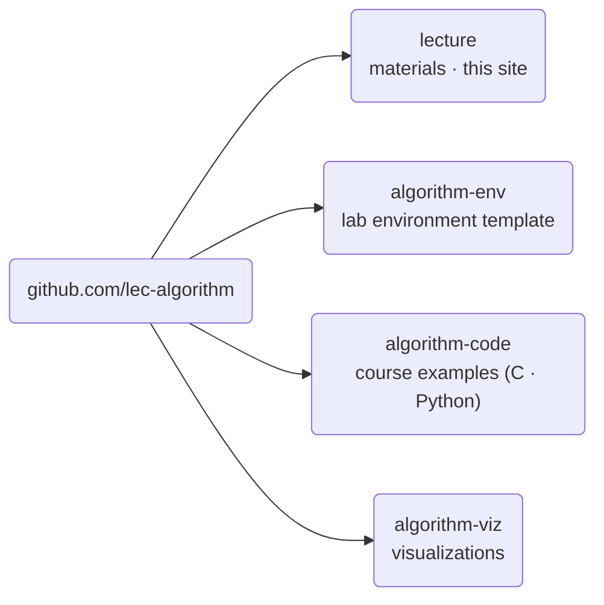

## Advanced Algorithms \{#overview}

This course covers computer algorithms and the logic behind them. We work
through a range of sorting algorithms, divide-and-conquer, and dynamic
programming, and we look at how the complexity of an algorithm is judged.

| Item | Value |
| --- | --- |
| Course number | SIT2001-01 |
| Credits | 3 (Wed period 5, Fri periods 5\~6) |
| Room | I-B202 |
| Instructor | Taekyu Lee |
| Grading | Absolute |
| Online | LearnUs |

## Objectives \{#goals}

- Learn the basics of computer algorithms (40%)
- Learn how to program computer algorithms (40%)
- Discuss and learn advanced topics in algorithms (20%)

## How the course runs \{#how}

We define each algorithm in pseudocode first, then implement the same thing in
**both C and Python**. This is not a course about a language. It is a course
about seeing the same procedure take two shapes.

- Lecture 50% · lab work 50%
- The lab environment is **pinned in a container**. You can start in the browser with GitHub Codespaces.
- All practice code is public in the GitHub organization [lec-algorithm](https://github.com/lec-algorithm).
- The individual project must be submitted as a GitHub repository.

## Grading \{#grading}

| Item | Weight |
| --- | --- |
| Midterm | 20% |
| Final | 40% |
| Assignment 1 | 5% |
| Assignment 2 | 5% |
| Individual project | 25% |
| Attendance | 5% |

- Midterm: 2026-10-23 (week 8)
- Final: 2026-12-18 (week 16)
- The individual project has an interim submission

Missing one third or more of the scheduled hours means an F or NP regardless of
exam results.

## Textbooks \{#books}

| Kind | Title | Author | Publisher |
| --- | --- | --- | --- |
| Main | Algorithms | Sedgewick, Robert | Gilbut (2018) |
| Supplementary | Introduction to Algorithms | Leiserson, Charles Eric | Hanbit Academy (2014) |

The recommended prerequisite is Computer Programming.

## The repositories \{#repos}



| Repository | Holds | What you do with it |
| --- | --- | --- |
| `lecture` | Lecture notes, slides, notices, glossary | You read this site |
| `algorithm-env` | The lab environment as a template | **Use this template** for your assignment and project repositories |
| `algorithm-code` | Pseudocode, C and Python per topic | **Create a codespace on it** (do not copy it) |
| `algorithm-viz` | Algorithm visualizations | You watch them inside the slides |

For the course examples, open `algorithm-code` and press
**Code → Codespaces → Create codespace on main**. VS Code opens in the browser
with the compiler and Python ready. Nothing to install; a GitHub account is
enough. Topics are added through the semester, so **do not copy it**. Pull
instead.

For assignments and the individual project, press **Use this template** on
`algorithm-env` to get your own repository.

If you would rather run it on your own machine, install Git and Docker and
start like this.

```sh
git clone https://github.com/lec-algorithm/algorithm-code.git
cd algorithm-code
docker compose up -d
docker compose exec lab bash
```

The full walkthrough is in [Setting up the lab](/article/setup-guide/).
