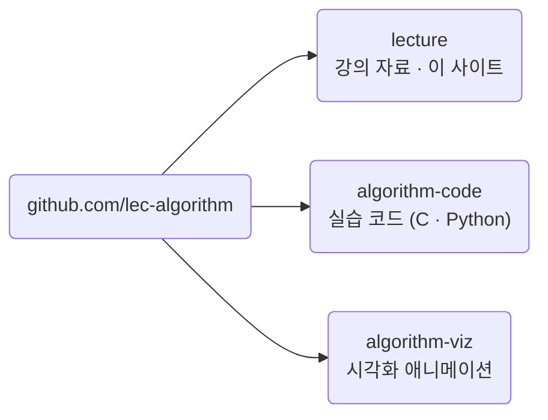

## 고급알고리즘 \{#overview}

컴퓨터 알고리즘과 그 뒤에 있는 논리를 다룹니다. 여러 정렬 알고리즘, 분할 정복,
동적 계획법을 살펴보고, 알고리즘의 복잡도를 어떻게 판단하는지 배웁니다.

| 항목 | 내용 |
| --- | --- |
| 학정번호 | SIT2001-01 |
| 학점 | 3학점 (수5, 금5·6) |
| 강의실 | I자B202 |
| 담당 | 이태규 (첨단융합공학부) |
| 평가 | 절대평가 |
| 온라인 | LearnUs |

## 수업목표 \{#goals}

- 컴퓨터 알고리즘의 기본 학습 (40%)
- 알고리즘 구현 학습 (40%)
- 최신 및 고급 알고리즘 학습 (20%)

## 이 수업의 방식 \{#how}

의사코드로 알고리즘을 먼저 정의하고, 같은 것을 **C와 Python 두 언어로**
구현해 봅니다. 언어를 배우는 수업이 아니라, 같은 절차가 두 언어에서 어떻게
같은 모양으로 나타나는지를 보는 수업입니다.

- 강의 50% · 실습 50%
- 모든 실습 코드는 GitHub 조직 [lec-algorithm](https://github.com/lec-algorithm)에 공개됩니다
- 개인프로젝트는 GitHub 저장소 제출이 필수입니다

## 평가 \{#grading}

| 항목 | 비중 |
| --- | --- |
| 중간시험 | 20% |
| 기말시험 | 40% |
| 과제1 | 5% |
| 과제2 | 5% |
| 개인프로젝트 | 25% |
| 출석 | 5% |

- 중간고사: 2026-10-23 (8주차)
- 기말고사: 2026-12-18 (16주차)
- 개인프로젝트는 중간 제출이 있습니다

실제 수업시수의 1/3 이상을 결석하면 시험 결과와 관계없이 F 또는 NP를 받습니다.

## 교재 \{#books}

| 구분 | 교재 | 저자 | 출판사 |
| --- | --- | --- | --- |
| 주교재 | 알고리즘 | Sedgewick, Robert | 길벗 (2018) |
| 부교재 | Introduction to Algorithms | Leiserson, Charles Eric | 한빛아카데미 (2014) |

선수 추천과목은 Computer Programming입니다.

## 저장소 구성 \{#repos}

| 저장소 | 담는 것 | 수강생이 하는 일 |
| --- | --- | --- |
| `lecture` | 강의 문서, 슬라이드, 공지, 용어집 | 이 사이트를 봅니다 |
| `algorithm-code` | 주제별 의사코드 · C · Python 구현 | 클론해서 직접 돌려 봅니다 |
| `algorithm-viz` | 알고리즘 동작 시각화 | 슬라이드 안에서 봅니다 |

준비 방법은 [실습 환경 준비](/article/setup-guide/)를 참고하세요.
