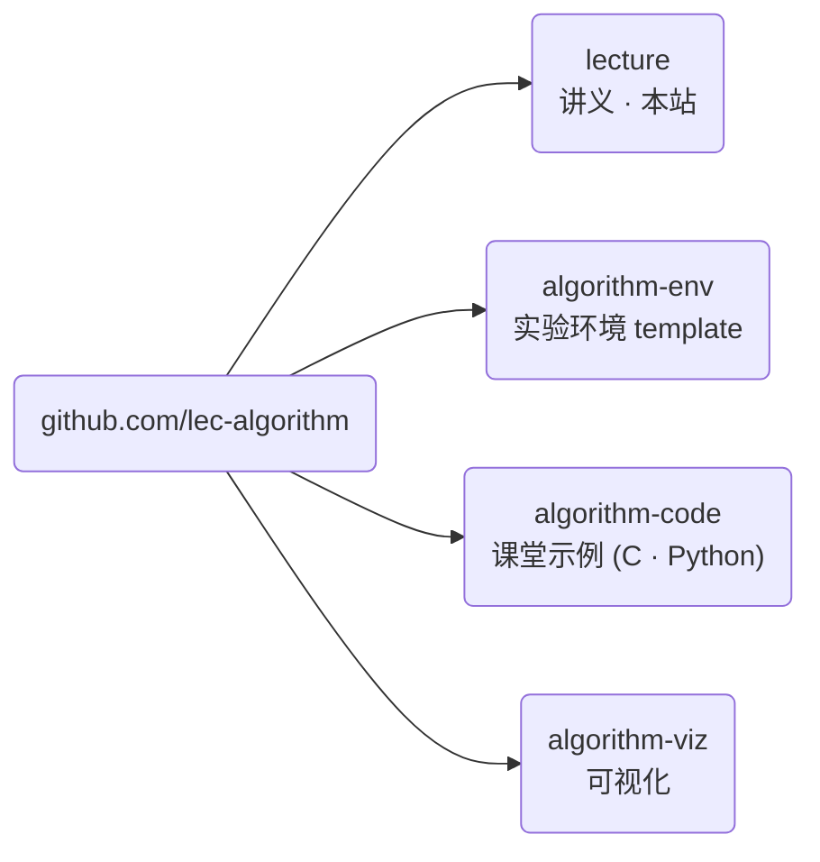

## 高级算法 \{#overview}

本课程讲授计算机算法以及它们背后的逻辑。我们会走过多种排序算法、分治法与
动态规划，并讨论如何判断一个算法的复杂度。

| 项目 | 内容 |
| --- | --- |
| 课程编号 | SIT2001-01 |
| 学分 | 3（周三第 5 节，周五第 5\~6 节） |
| 教室 | I-B202 |
| 任课教师 | 李泰奎 |
| 评分方式 | 绝对评分 |
| 在线平台 | LearnUs |

## 教学目标 \{#goals}

- 掌握计算机算法的基础（40%）
- 学会用程序实现算法（40%）
- 讨论并学习算法的进阶主题（20%）

## 授课方式 \{#how}

每个算法先用伪代码定义，再用 **C 和 Python 两种语言**实现同一件事。这不是一门
教语言的课，而是一门看同一段流程如何呈现为两种形态的课。

- 讲授 50% · 实验 50%
- 实验环境用**容器固定**。可以通过 GitHub Codespaces 在浏览器中直接开始。
- 全部实验代码公开在 GitHub 组织 [lec-algorithm](https://github.com/lec-algorithm)。
- 个人项目必须以 GitHub 仓库形式提交。

## 评分 \{#grading}

| 项目 | 比重 |
| --- | --- |
| 期中考试 | 20% |
| 期末考试 | 40% |
| 作业 1 | 5% |
| 作业 2 | 5% |
| 个人项目 | 25% |
| 出勤 | 5% |

- 期中考试：2026-10-23（第 8 周）
- 期末考试：2026-12-18（第 16 周）
- 个人项目设有中期提交

缺席达到实际课时的三分之一以上者，无论考试结果如何都将得到 F 或 NP。

## 教材 \{#books}

| 类别 | 书名 | 作者 | 出版社 |
| --- | --- | --- | --- |
| 主教材 | 算法 | Sedgewick, Robert | Gilbut（2018） |
| 参考教材 | Introduction to Algorithms | Leiserson, Charles Eric | 韩光学术（2014） |

推荐先修课程为 Computer Programming。

## 三个仓库 \{#repos}



| 仓库 | 内容 | 你要做的事 |
| --- | --- | --- |
| `lecture` | 讲义、幻灯片、公告、术语表 | 阅读本站 |
| `algorithm-env` | 实验环境 template | 用 **Use this template** 创建作业与项目用的自己的仓库 |
| `algorithm-code` | 各主题的伪代码与 C、Python 实现 | **直接在这里创建 Codespace**（不要复制） |
| `algorithm-viz` | 算法可视化 | 在幻灯片中观看 |

课堂示例请在 `algorithm-code` 仓库中选择
**Code → Codespaces → Create codespace on main**。浏览器中会打开已备好编译器与
Python 的 VS Code。无需安装任何东西，有 GitHub 账号即可。学期中会不断添加主题，
所以**不要复制**，用 `git pull` 获取。

作业与个人项目请在 `algorithm-env` 上点击 **Use this template** 创建自己的仓库。

如果想在自己的电脑上运行，安装 Git 与 Docker 后这样开始。

```sh
git clone https://github.com/lec-algorithm/algorithm-code.git
cd algorithm-code
docker compose up -d
docker compose exec lab bash
```

完整步骤见[实验环境准备](/article/setup-guide/)。
