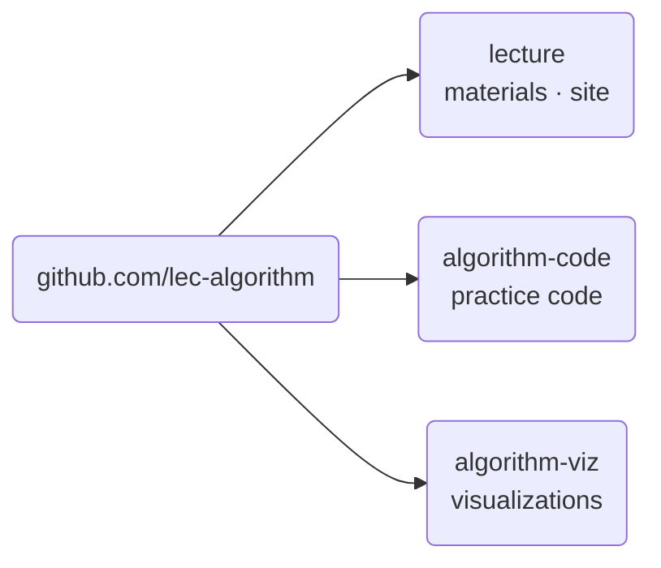

import Slide from 'stack-site-builder/components/Slide.astro';
import Screenshot from '@components/Screenshot.astro';
import repoTemplate from '@assets/slides/orientation/github-repo-1.png';
import repoCreate from '@assets/slides/orientation/github-repo-2.png';

{/* Slide conventions follow the "슬라이드 규칙" section of docs/writing-rules.md. */}

<Slide class="cover">

# Advanced Algorithms

Fall 2026 · SIT2001-01

*Taekyu Lee · School of Integrated Technology, Yonsei University*

</Slide>

<Slide>

## What this course does
::sub[From sorting and divide-and-conquer to graphs and dynamic programming]

- Computer algorithms and **the logic behind them**
- A range of sorting algorithms, divide-and-conquer, dynamic programming
- **How to judge** the complexity of an algorithm

</Slide>

<Slide>

## How it runs
::sub[One pseudocode, two implementations]

- Every algorithm is defined in **pseudocode** first.
  - The C and Python versions are transcriptions of it.
- This is not a course about a language.
  - It is about seeing one procedure take two shapes.
- The runtime is **pinned in a container**.
  - Git and Docker are the only installs, and Codespaces removes even those.
- Lecture 50% · lab work 50%

</Slide>

<Slide>

### Three repositories



- [github.com/lec-algorithm/lecture](https://github.com/lec-algorithm/lecture)
- [github.com/lec-algorithm/algorithm-code](https://github.com/lec-algorithm/algorithm-code)
- [github.com/lec-algorithm/algorithm-viz](https://github.com/lec-algorithm/algorithm-viz)

</Slide>

<Slide class="center">

### What each one is for

| Repository | What you do with it |
| --- | --- |
| `lecture` | You read the site (notes and slides) |
| `algorithm-code` | You copy it and run it yourself |
| `algorithm-viz` | You watch it inside the slides |

</Slide>

<Slide>

## What you need
::sub[A browser is enough]

| Way | What you need |
| --- | --- |
| **GitHub Codespaces** (recommended) | one [GitHub account](https://github.com/signup) |
| Running it locally | [Git](https://git-scm.com/downloads) · [Docker Desktop](https://www.docker.com/get-started/) |

<br/>

You do not install a compiler or Python.  
Either way it runs **inside the same container**.

</Slide>

<Slide class="compact">

### Make your own repository ①
::sub[You work in your copy, not in the shared repository]

<Screenshot src={repoTemplate} alt="The Use this template button on the algorithm-code repository with the Create a new repository menu open" maxHeight="40vh" />

`algorithm-code` is a **template repository**.  
**Use this template** → **Create a new repository**

</Slide>

<Slide class="compact">

### Make your own repository ②
::sub[Name it and create it]

<Screenshot src={repoCreate} alt="The Create a new repository screen, with my-algorithm-code entered as the repository name and the Create repository button below" />

Give it a name you will recognize, like `my-algorithm-code`.  
**Create repository** puts a copy under your account.

</Slide>

<Slide>

### Open Codespaces on your repository
::sub[Nothing to install]

1. Go to the repository **you just made**.
2. Green **Code** button → **Codespaces** tab
3. **Create codespace on main**

After a moment VS Code opens in the browser.  
**That terminal is the inside of the container.**

</Slide>

<Slide class="compact">

### What is in the container
::sub[You do not install a compiler or Python]

- Run

```sh
gcc --version | head -1
python3 --version
```

- Output

```console
gcc (Debian 14.2.0-19) 14.2.0
Python 3.13.5
```

<br/>

This removes the differences between operating systems.  
Whatever your laptop is, the inside of the container is identical.

</Slide>

<Slide class="compact">

### Run one example

- Run

```sh
cd topic-01-intro-search/01_sequential_search
gcc -o sequentialSearch.out sequentialSearch.c && ./sequentialSearch.out
python3 sequential_search.py
```

- Output

```console
n = 15, key = 51
index = 6, comparisons = 7
```

When both implementations print the same thing, you are set up.

</Slide>

<Slide class="compact">

### Running it locally
::sub[On your own machine instead of Codespaces]

- Run

```sh
git clone https://github.com/<your-account>/my-algorithm-code.git
cd my-algorithm-code
docker compose up -d
docker compose exec lab bash
```

- Output

```console
root@d38ddee8c2a8:/work#
```

<br/>

Once the prompt changes, everything is **the same as above**.  
Codespaces uses the same `compose.yml`.

</Slide>

<Slide>

## Grading
::sub[Absolute grading]

| Item | Weight |
| --- | --- |
| Midterm (Oct 23, Fri) | 20% |
| Final (Dec 18, Fri) | 40% |
| Assignment 1 · 2 | 5% + 5% |
| Individual project | 25% |
| Attendance | 5% |

- **Assignments and the project are submitted as GitHub repositories.**
- The project also has an interim submission: a repository and about ten slides.

</Slide>

<Slide class="center">

### Missing a third means an F

Miss one third or more of the scheduled hours  
and you get an F or NP regardless of exam results.

</Slide>

<Slide>

### The semester

| Weeks | Content |
| --- | --- |
| 1\~2 | Introduction and search, elementary sorting |
| 3\~5 | Divide and conquer, quicksort, analysis |
| 5\~7 | Greedy and Huffman, binary search trees |
| 8 | **Midterm** |
| 9\~11 | Hashing, radix sort, tries, K-means |
| 12\~13 | Graphs, regular expressions |
| 14\~15 | Shortest paths, dynamic programming |
| 16 | **Final** |

</Slide>

<Slide>

## Textbooks

| Kind | Book |
| --- | --- |
| Main | Algorithms (Sedgewick, Gilbut 2018) |
| Supplementary | Introduction to Algorithms (Hanbit Academy 2014) |

Recommended prerequisite: Computer Programming

</Slide>

<Slide class="center">

### Getting started

Course material goes on the site,  
administrative notices go on LearnUs.

Start with **Setting up the lab**.

</Slide>
