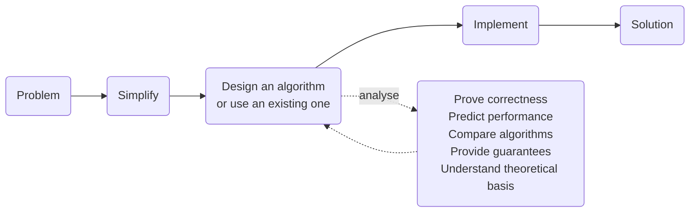

import Slide from 'stack-site-builder/components/Slide.astro';
import SearchDemo from '@components/SearchDemo.astro';
import SearchTrace from '@components/SearchTrace.astro';
import RecursionDemo from '@components/RecursionDemo.astro';
import ParallelSumDemo from '@components/ParallelSumDemo.astro';

{/* Follows the slide rules in docs/writing-rules.md.
    Each example goes procedure → code → run → practice. The code is copied
    from the algorithm-code repository, so a change there changes this too.
    Long lines are folded to the column width; a clipped line is unreadable. */}

<Slide class="cover">

# Introduction and Search

Topic 01

*Advanced Algorithms*

</Slide>

<Slide>

## What an algorithm does
::sub[A procedure for solving a problem, written as finite, unambiguous steps]

- The same input yields the same output.
- It must terminate.

<br/>

But "it solves the problem" is not enough.  
There are usually **several** procedures that solve the same problem.

</Slide>

<Slide class="center">

### What this course teaches is
### **how to judge which one to pick**

</Slide>

<Slide>

### Algorithms and data structures
::sub[The two need each other]

- **An algorithm runs on top of a fitting data structure.**
  - Binary search halves the array only because a sorted array is a structure.
- **Implementing a data structure takes algorithms in turn.**
  - A hash table has a hash function; a heap has sift-up and sift-down.

<br/>

> "Algorithms + Data Structures = Programs"  
> (Niklaus Wirth)

</Slide>

<Slide>

### Problem · input · instance

| Word | Meaning | Example |
| --- | --- | --- |
| **Problem** | The question you want answered | find one value in a sorted array |
| **Input** | What the problem takes | array `A`, search key `key` |
| **Instance** | The input filled in with values | `A = [6, 13, …]`, `key = 51` |

<br/>

An algorithm is designed to solve a **problem**,  
but performance is measured on an **instance**.

</Slide>

<Slide class="compact">

### What we actually do



Design and analysis are not stages you pass through once; they feed each other.  
The analysis says it is slow, so you redesign, and analyse again.

</Slide>

<Slide>

### The five things analysis answers

| What it does | What it answers |
| --- | --- |
| Prove correctness | Does this give the right answer **every** time |
| Predict performance | How long does it take as the input grows |
| Compare algorithms | Which of the two fits this problem |
| Provide guarantees | Is there a line it will not cross in the worst case |
| Understand theoretical basis | Can we say no faster method exists at all |

The first three get used today.  
The last two come back all semester, through Big-O and lower bounds.

</Slide>

<Slide>

## Trade-off
::sub[There is usually no best algorithm]

Say you are buying a tablet.

- Screen: resolution, refresh rate
- CPU · storage · pen sensitivity
- **Price**

<br/>

As the specs go up, so does the price.  
In the end it is about **deciding what to give up**.

</Slide>

<Slide>

### Work that must wait, and work that need not
::sub[Adding sixteen numbers. Watch how many additions happen per step]

<ParallelSumDemo slide />

</Slide>

<Slide>

### Same work, different time

| | One at a time | In pairs |
| --- | --- | --- |
| Additions | 15 | 15 |
| Steps | 15 | **4** |
| Cores needed per step | 1 | up to 8 |

**The amount of work is the same. What shrank is the time.**  
There is one reason it could: no pair waits on another.

Adding one at a time needs the previous sum before the next addition.  
**What waits on what** is what decides whether parallelism is possible.

</Slide>

<Slide>

### Even with many cores
::sub[If the waiting is inside the algorithm, the cores sit idle]

- **Run the sequential sum on eight cores and one core does the work.**
  - The other seven wait for the previous sum.
  - Go to sixteen cores and it is still 15 steps.
- **Adding in pairs does not use all eight the whole way either.**
  - It falls 8 → 4 → 2 → 1, and the last addition is done alone.
  - Whatever stays sequential is the floor.

<br/>

**So the road forks.** Reshape the algorithm to fit the hardware, or build
hardware to fit the algorithm. GPUs and NPUs are the second.

</Slide>

<Slide>

### Accuracy and speed
::sub[The same story shows up in deep learning]

| | Model 1 | Model 2 | Model 3 |
| --- | --- | --- | --- |
| Accuracy | 0.8 | 0.7 | **0.9** |
| Speed | 0.5 s | **0.1 s** | 10 min |

Real-time service takes model 2; accuracy-critical diagnosis takes model 3.  
**You can only choose once you know what the problem demands.**

</Slide>

<Slide>

## Example 1. Two searches
::sub[Find the position of one value in a sorted array]

| **index** | 0 | 1 | 2 | 3 | 4 | 5 | **6** | 7 | 8 | 9 | 10 | 11 | 12 | 13 | 14 |
| --- | --- | --- | --- | --- | --- | --- | --- | --- | --- | --- | --- | --- | --- | --- | --- |
| **value** | 6 | 13 | 14 | 25 | 33 | 43 | **51** | 53 | 64 | 72 | 84 | 93 | 95 | 96 | 101 |

The value to find is `51`.  
It sits at index 6.

</Slide>

<Slide>

### What sequential search does
::sub[One element at a time from the front. Press **step**]

<SearchDemo slide mode="sequential" values={[6, 13, 14, 25, 33, 43, 51, 53, 64, 72, 84, 93, 95, 96, 101]} target={51} />

It walks from index 0 one cell at a time.  
`51` sits at index 6, so it turns up on the seventh look.

</Slide>

<Slide class="compact">

### Sequential search
::sub[Compare one element at a time from the front]

```plaintext
ALGORITHM SequentialSearch(A, n, key)
    for i <- 0 to n-1 do
        if A[i] = key then
            return i
    return -1
```

Indices 0 through 6, one at a time, so **7 comparisons** to find it.

</Slide>

<Slide class="compact">

### In code
::sub[`01_sequential_search/`]

<div class="aas-split">
<div>

- `sequentialSearch.c`

```c
int sequentialSearch(const int a[], int n, int key,
                     int *comparisons) {
    for (int i = 0; i < n; i++) {
        (*comparisons)++;
        if (a[i] == key) {
            return i;
        }
    }
    return -1;
}
```

</div>
<div>

- `sequential_search.py`

```python
def sequential_search(a, key):
    comparisons = 0
    for i, value in enumerate(a):
        comparisons += 1
        if value == key:
            return i, comparisons
    return -1, comparisons
```

</div>
</div>

One extra line counting each comparison, and otherwise the pseudocode as written.

</Slide>

<Slide>

### Best: the first element is the key
::sub[`key = 6`]

<SearchDemo slide mode="sequential" values={[6, 13, 14, 25, 33, 43, 51, 53, 64, 72, 84, 93, 95, 96, 101]} target={6} />

**One comparison** and it is done, however long the array gets.

</Slide>

<Slide>

### Average: somewhere in the middle
::sub[`key = 53`]

<SearchDemo slide mode="sequential" values={[6, 13, 14, 25, 33, 43, 51, 53, 64, 72, 84, 93, 95, 96, 101]} target={53} />

**Eight.** For fifteen elements $$\dfrac{n+1}{2} = 8$$.  
If the key's position is evenly spread, this is the average.

</Slide>

<Slide>

### Worst: the last element, or absent
::sub[`key = 101`]

<SearchDemo slide mode="sequential" values={[6, 13, 14, 25, 33, 43, 51, 53, 64, 72, 84, 93, 95, 96, 101]} target={101} />

**Fifteen** — the whole array.  
Searching for a value that is not there costs the same fifteen.

</Slide>

<Slide>

### How many comparisons
::sub[It depends on where the value sits]

| | Comparisons | When |
| --- | --- | --- |
| Best | 1 | the first element is `key` |
| Average | $$\dfrac{n+1}{2}$$ | **the value is in the array** and evenly distributed |
| Worst | n | it is the last element, or not there at all |

Looking for a value that is not there always costs all n.  
That is why the average carries a condition.  
**When you state a performance, state which instances you assume.**

Worst case: **time** $$O(n)$$ · **space** $$O(1)$$

</Slide>

<Slide class="compact">

### Binary search erases half the range
::sub[Look at the middle, throw away the half you no longer need]

<SearchTrace slide values={[6, 13, 14, 25, 33, 43, 51, 53, 64, 72, 84, 93, 95, 96, 101]} target={51} />

Four comparisons reach `51`.  
The dimmed cells are what that step threw away.

</Slide>

<Slide class="compact">

### Binary search
::sub[Look at the middle first. It uses the fact that the array is sorted]

```plaintext
ALGORITHM BinarySearch(A, n, key)
    lo <- 0
    hi <- n - 1
    while lo <= hi do
        mid <- lo + (hi - lo) / 2
        if A[mid] = key then return mid
        else if A[mid] < key then lo <- mid + 1
        else hi <- mid - 1
    return -1
```

If the key is larger than the middle, **throw away the whole left half.**

</Slide>

<Slide class="compact">

### In code
::sub[`02_binary_search/`]

<div class="aas-split">
<div>

- `binarySearch.c`

```c
int binarySearch(const int a[], int n, int key,
                 int *comparisons) {
    int lo = 0;
    int hi = n - 1;
    while (lo <= hi) {
        int mid = lo + (hi - lo) / 2;
        (*comparisons)++;
        if (a[mid] == key) {
            return mid;
        } else if (a[mid] < key) {
            lo = mid + 1;
        } else {
            hi = mid - 1;
        }
    }
    return -1;
}
```

</div>
<div>

- `binary_search.py`

```python
def binary_search(a, key):
    lo, hi = 0, len(a) - 1
    comparisons = 0
    while lo <= hi:
        mid = lo + (hi - lo) // 2
        comparisons += 1
        if a[mid] == key:
            return mid, comparisons
        elif a[mid] < key:
            lo = mid + 1
        else:
            hi = mid - 1
    return -1, comparisons
```

</div>
</div>

It is `lo + (hi - lo) / 2`, not `(lo + hi) / 2`.  
When both values are large, the addition can overflow the type.

</Slide>

<Slide class="compact">

### Four comparisons to find 51
::sub[The four steps just seen, written out]

| Comparison | lo | hi | mid | `A[mid]` | Decision |
| --- | --- | --- | --- | --- | --- |
| 1 | 0 | 14 | 7 | 53 | 53 > 51 → go left |
| 2 | 0 | 6 | 3 | 25 | 25 < 51 → go right |
| 3 | 4 | 6 | 5 | 43 | 43 < 51 → go right |
| 4 | 6 | 6 | 6 | **51** | found |

**Four**, against sequential search's seven.  
**Time** $$O(\log n)$$ · **space** $$O(1)$$

</Slide>

<Slide>

### The two searches side by side
::sub[Both look for 51 in the same array]

<SearchDemo slide values={[6, 13, 14, 25, 33, 43, 51, 53, 64, 72, 84, 93, 95, 96, 101]} target={51} />

The dimmed cells are **the range there is no reason to look at any more**.

</Slide>

<Slide>

### Searching for a value that is absent
::sub[Looking for 50]

<SearchDemo slide values={[6, 13, 14, 25, 33, 43, 51, 53, 64, 72, 84, 93, 95, 96, 101]} target={50} />

Sequential search has to **count all fifteen** before answering.

</Slide>

<Slide class="compact">

### Running it
::sub[Same array, same key]

- Sequential search

```console
n = 15, key = 51
index = 6, comparisons = 7
```

- Binary search

```console
n = 15, key = 51
index = 6, comparisons = 4
```

Same answer, different comparison counts.  
The 7 and the 4 we counted by hand print out exactly.

</Slide>

<Slide>

### The difference shows as n grows

| Elements | Sequential | Binary | Measured | Theory $$n / \lceil \log_2 n \rceil$$ |
| --- | --- | --- | --- | --- |
| 1,000 | 23.88 μs | 2.27 μs | 10.5× | 100 |
| 10,000 | 202.31 μs | 2.23 μs | 90.9× | 714 |
| 100,000 | 1,847.54 μs | 6.40 μs | 288.7× | 5,882 |
| 1,000,000 | 24,519.73 μs | 9.15 μs | **2,679.8×** | 50,000 |

This is the difference between $$O(n)$$ and $$O(\log n)$$.  
The measurement falls short of theory because of caching. **Big-O describes growth, not time.**

</Slide>

<Slide class="center">

### It is not free

Binary search needs **the array to be sorted**.

If it is not, you get a **wrong answer**.  
It buys speed by putting a condition on its input.

</Slide>

<Slide class="compact">

### Where to change things
::sub[`02_binary_search/` · the array and the key live here]

<div class="aas-split">
<div>

- `binarySearch.c`

```c
int main(void) {
    int a[] = {6, 13, 14, 25, 33, 43, 51, 53,
               64, 72, 84, 93, 95, 96, 101};
    int n = (int)(sizeof(a) / sizeof(a[0]));
    int key = 51;
    int comparisons = 0;

    int index = binarySearch(a, n, key, &comparisons);

    printf("n = %d, key = %d\n", n, key);
    printf("index = %d, comparisons = %d\n",
           index, comparisons);
    return 0;
}
```

</div>
<div>

- `binary_search.py`

```python
if __name__ == "__main__":
    a = [6, 13, 14, 25, 33, 43, 51, 53,
         64, 72, 84, 93, 95, 96, 101]
    key = 51

    index, comparisons = binary_search(a, key)

    print(f"n = {len(a)}, key = {key}")
    print(f"index = {index}, "
          f"comparisons = {comparisons}")
```

</div>
</div>

Here is why `comparisons` is passed as a pointer.  
A C function returns one value, so getting both the index and the count back
means one of them has to be filled in from outside.  
Python returns both as a tuple.

</Slide>

<Slide class="compact">

### Try it now
::sub[Example 1. Two searches]

[lec-algorithm/algorithm-code](https://github.com/lec-algorithm/algorithm-code/tree/main) · `src/topic-01-intro-search/`  
Open a file and press the **▶ button** at the top right of the editor.

1. **Change `key` to the first and to the last value.**
   - `6` costs sequential search 1 comparison, `101` costs 15.
   - Compare what binary search costs for the same values.
2. **Search for a value that is not in the array.**
   - `key = 50` returns `-1` from both.
   - The comparison counts on the way there differ.
3. **Shuffle the array for binary search only.**
   - The answer is wrong.
   - Sequential search stays right on the same array.
   - What speed demands in exchange shows up here.

</Slide>

<Slide class="center">

## Example 2. Recursion and iteration
::sub[The same formula implemented two ways]

$$
F(n) = \begin{cases}
0 & n = 0 \\
1 & n = 1 \\
F(n-1) + F(n-2) & n > 1
\end{cases}
$$

It runs 0, 1, 1, 2, 3, 5, 8, 13, 21, 34, and so on.

</Slide>

<Slide class="compact">

### Transcribing the definition
::sub[Written recursively, the code and the definition look almost the same]

```plaintext
ALGORITHM FibonacciRecursive(n)
    if n <= 1 then return n
    return FibonacciRecursive(n-1) + FibonacciRecursive(n-2)
```

It reads well and is faithful to the definition.  
Unfold `F(5)`, though, and the problem shows.

</Slide>

<Slide>

### The stack deepens and drains
::sub[Step through it and watch how $$F(5)$$ runs]

<RecursionDemo slide n={5} />

</Slide>

<Slide class="center">

### 15 calls, 6 distinct values

The depth grows **in proportion to n**. That is why recursion costs $$O(n)$$ space.  
The call count **doubles at every branch**. That is why the time is $$O(2^n)$$.

<br/>

A red cell marks **a value computed again after it was already known**.

</Slide>

<Slide class="compact">

### Carrying only the last two terms

```plaintext
ALGORITHM FibonacciIterative(n)
    if n <= 1 then return n
    prev <- 0
    curr <- 1
    for i <- 2 to n do
        next <- prev + curr
        prev <- curr
        curr <- next
    return curr
```

All the next term needs is **the two before it**.  
Each term is computed exactly once.

</Slide>

<Slide class="compact">

### In code
::sub[`03_fibonacci/fibonacci.c` · the two functions side by side]

<div class="aas-split">
<div>

- Recursive

```c
long fibonacciRecursive(int n) {
    calls++;
    if (n <= 1) {
        return n;
    }
    return fibonacciRecursive(n - 1)
         + fibonacciRecursive(n - 2);
}
```

</div>
<div>

- Iterative

```c
long fibonacciIterative(int n) {
    if (n <= 1) {
        return n;
    }
    long prev = 0, curr = 1;
    for (int i = 2; i <= n; i++) {
        long next = prev + curr;
        prev = curr;
        curr = next;
    }
    return curr;
}
```

</div>
</div>

`calls` is there to count how often the recursion branches. That number explains
the cause better than the clock does.

</Slide>

<Slide>

### How far apart they get

| n | Recursive calls | Recursive (ms) | Iterative (ms) |
| --- | --- | --- | --- |
| 10 | 177 | 0.00 | 0.0000 |
| 20 | 21,891 | 0.01 | 0.0000 |
| 30 | 2,692,537 | 0.82 | 0.0000 |
| 40 | **331,160,281** | 120.58 | 0.0000 |

Every ten steps of n multiply the call count by **roughly 100**.  
The call count is the same everywhere; **the milliseconds are not.**  
Recursion $$O(2^n)$$ · iteration $$O(n)$$

</Slide>

<Slide class="compact">

### How many terms get computed
::sub[$$O(2^n)$$ and $$O(n)$$ are conclusions; the term count is the reason]

- **Iteration computes $$n + 1$$ terms.**
  - One each from $$F(0)$$ to $$F(n)$$.
- **Recursion computes at least $$2^{n/2}$$.**
  - Calls are $$C(n) = 2F(n+1) - 1$$, and $$F(n) \ge 2^{n/2-1}$$ for $$n \ge 2$$.

```plaintext
C(100) = 2 × F(101) - 1
       = 1,146,295,688,027,634,168,201        about 1.1 × 10^21 calls
```

At one nanosecond per call that is **36,000 years**.  
Iteration computes 101 terms and stops.

</Slide>

<Slide class="center">

### Is recursion bad, then

No.

What is slow is not the recursion but the **duplicated work**.  
Store the values and recursion is $$O(n)$$ too.

*We meet this again in topic 14, dynamic programming.*

</Slide>

<Slide class="compact">

### Where to change things
::sub[`03_fibonacci/` · the measuring loop lives here]

<div class="aas-split">
<div>

- `fibonacci.c`

```c
for (int n = 10; n <= 40; n += 10) {
    long rec, itr;

    calls = 0;
    double tRec = timeIt(fibonacciRecursive, n, &rec);
    double tItr = timeIt(fibonacciIterative, n, &itr);

    printf("%3d %15ld %10.2f %10.4f %10ld\n",
           n, calls, tRec, tItr, itr);

    if (rec != itr) {
        printf("  !! values differ: %ld vs %ld\n",
               rec, itr);
    }
}
```

</div>
<div>

- `fibonacci.py`

```python
# at n=40 the recursion takes about 12 s
for n in (10, 20, 30, 35):
    calls = 0
    rec, t_rec = time_it(fibonacci_recursive, n)
    itr, t_itr = time_it(fibonacci_iterative, n)

    print(f"{n:3d} {calls:15,d} {t_rec:10.2f} "
          f"{t_itr:10.4f} {itr:10d}")

    if rec != itr:
        print(f"  !! values differ: {rec} vs {itr}")
```

</div>
</div>

`rec != itr` is checked every time.  
Letting the code verify for itself that the two implementations agree means you
never have to wonder whether the faster one is simply wrong.

</Slide>

<Slide class="compact">

### Try it now
::sub[Example 2. Recursion and iteration]

[lec-algorithm/algorithm-code](https://github.com/lec-algorithm/algorithm-code/tree/main) · `src/topic-01-intro-search/03_fibonacci/`  
Open a file and press the **▶ button** at the top right of the editor.

1. **Raise the C side's `n <= 40` to 45, then 50.**
   - Watch how far the call count climbs.
   - Watch where the waiting becomes unbearable.
2. **The Python side stops at `(10, 20, 30, 35)`.**
   - Same procedure, far slower.
   - **Where it gives out is part of the observation.**
3. **See how high `n` can go on the iterative side and still finish at once.**
   - You will also find where `long` overflows.

</Slide>

<Slide>

## What to take away

1. **There is usually no best algorithm.**
   - There is only deciding what to give up.
2. **The difference shows once the input is large.**
   - On small inputs anything works.
3. **Speed comes with conditions.**
   - Binary search demands a sorted array.
   - Use it without checking and you get a wrong answer.
4. **The shape of the code changes the performance.**
   - The same formula splits into $$O(2^n)$$ and $$O(n)$$.

</Slide>

<Slide>

### How to follow this course

- **The pseudocode is the reference.**
  - Every example is one `.pseudo` file with C and Python beside it.
  - The goal is not the language but **what the same procedure looks like in two of them**.
- **Do not stop at reading.**
  - Examples print comparison counts and call counts alongside the answer.
  - Change the numbers, run again, and the complexity in the table becomes concrete.
- **When stuck, check inside the container.**
  - Questions are answered against the practice container.

<br/>

The code lives in [lec-algorithm/algorithm-code](https://github.com/lec-algorithm/algorithm-code/tree/main)
under `src/topic-01-intro-search/`.  
For how to run it, see [preparing the practice environment](/article/setup-guide/).

</Slide>
