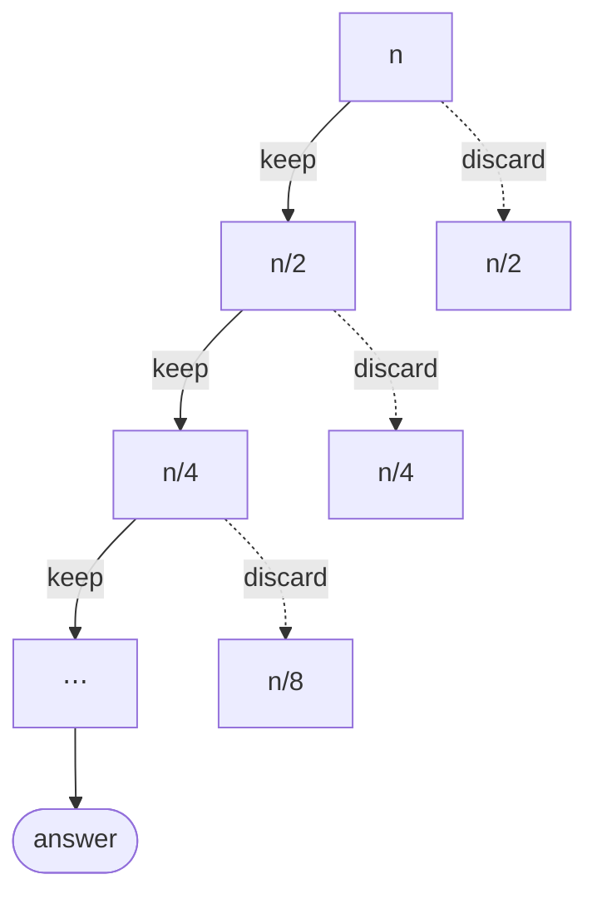

import Slide from 'stack-site-builder/components/Slide.astro';
import QuickDemo from '@components/QuickDemo.astro';
import ParallelQuickDemo from '@components/ParallelQuickDemo.astro';

{/* Slide rules follow "슬라이드 규칙" in docs/writing-rules.md.
    Each example goes demo → procedure → code → analysis. The code mirrors
    the algorithm-code repository, so changes there must land here too.
    The demo counters arrive at the same numbers the code prints. */}

<Slide class="cover">

# Randomness and Quicksort

Topic 04

*Advanced Algorithms*

</Slide>

<Slide>

## The other end of the seesaw
::sub[Topic 03 called splitting and combining a seesaw]

<div class="aas-split">
<div>

- **Merge sort**
  - Split: cut in half. Free
  - Combine: the merge. The work is here

</div>
<div>

- **This topic's sort**
  - Split: **by value**. The work is here
  - Combine: concatenate. Free

</div>
</div>

<br/>

And to guard that split, **randomness** enters as an ingredient.

</Slide>

<Slide>

## Ingredient: randomness
::sub[Where does a computer's randomness come from]

- What `rand()` produces is **pseudorandom**.
- It takes an input called a seed and runs it through **a function**.
- A function means **same input, same output.**

<br/>


</Slide>

<Slide class="compact">

#### Same seed, same sequence
::sub[`01_random/` · the same kind of generator (minstd), built by hand]

<div class="aas-split">
<div>

- `randomProgram.c`

```c
static int64_t state = 1;

/* Change the seed, like srand. */
void setSeed(int64_t seed) {
    state = seed;
}

/* Next number, like rand. */
int64_t nextRandom(void) {
    state = state * 16807
          % 2147483647;
    return state;
}
```

</div>
<div>

- Run result

```console
seed = 1 : 16807 282475249 1622650073
seed = 1 : 16807 282475249 1622650073
seed = 2 : 33614 564950498 1097816499
```

- Seed 1 twice: **exactly the same sequence**
- Things change only when the seed does.
- The field idiom: `srand(time(NULL))`

</div>
</div>

</Slide>

<Slide>

#### Where randomness is needed
::sub[Why is a YouTube video ID not a sequential number]

- Every second, videos land on **many servers, many databases** (sharding).
- IDs must never collide.
- Sequential numbers demand coordination between servers. Out.
- So IDs are built on **randomness**.
  - Unpredictability of the next ID comes as a bonus.

</Slide>

<Slide class="center">

### In this topic, randomness has one job
### **choosing the pivot**

Why that job needs it becomes clear after the worst case.

</Slide>

<Slide class="center">

## Example 1. Quicksort
::sub[Put the pivot in its place, then sort both sides]

</Slide>

<Slide>

### The engine is the partition
::sub[Elements smaller than the pivot (blue) gather in the teal zone. Press **Step**]

<QuickDemo slide mode="partition" />

</Slide>

<Slide>

#### The pivot's place is final
::sub[What one partition buys]

- Nine comparisons settled **one final position**.
- Left of it: smaller elements. Right: the rest.
- Sort each side and the job is done. No combining needed.

<br/>

This pivot, `2`, is nearly the minimum, so the left zone got only `1`.  
The story of good and bad pivots starts right here.

</Slide>

<Slide>

### The full sort
::sub[The partition on recursion. The `qs(0, 9)` chip names the current call]

<QuickDemo slide mode="sort" />

</Slide>

<Slide>

#### As a procedure
::sub[Merge sort's skeleton, with the work relocated]

```plaintext
ALGORITHM QuickSort(A, lo, hi)
    if lo >= hi then return          // one element: already sorted
    p <- Partition(A, lo, hi)        // put the pivot in its place
    QuickSort(A, lo, p-1)            // left of the pivot
    QuickSort(A, p+1, hi)            // right of the pivot
```

- Merge sort worked **after returning** (combine).
- Quicksort works **before recursing** (divide).

</Slide>

<Slide class="compact">

#### As code
::sub[`02_quick_sort/` · the partition is everything]

<div class="aas-split">
<div>

- `quickSort.c`

```c
static int partition(int a[], int lo, int hi,
                     int *comparisons, int *moves) {
    int pivot = a[lo];
    int i = lo;
    for (int j = lo + 1; j <= hi; j++) {
        (*comparisons)++;
        if (a[j] < pivot) {
            i++;
            swap(a, i, j, moves);
        }
    }
    swap(a, lo, i, moves);
    return i;
}

void quickSort(int a[], int lo, int hi,
               int *comparisons, int *moves) {
    if (lo >= hi) {
        return;
    }
    int p = partition(a, lo, hi,
                      comparisons, moves);
    quickSort(a, lo, p - 1,
              comparisons, moves);
    quickSort(a, p + 1, hi,
              comparisons, moves);
}
```

</div>
<div>

- `quick_sort.py`

```python
def _partition(a, lo, hi, counts):
    pivot = a[lo]
    i = lo
    for j in range(lo + 1, hi + 1):
        counts[0] += 1
        if a[j] < pivot:
            i += 1
            _swap(a, i, j, counts)
    _swap(a, lo, i, counts)
    return i


def quick_sort(a, lo=None, hi=None,
               counts=None):
    if lo is None:
        lo, hi = 0, len(a) - 1
        counts = [0, 0]
    if lo >= hi:
        return tuple(counts)
    p = _partition(a, lo, hi, counts)
    quick_sort(a, lo, p - 1, counts)
    quick_sort(a, p + 1, hi, counts)
    return tuple(counts)
```

</div>
</div>

</Slide>

<Slide>

#### A good pivot halves the array
::sub[The picture becomes merge sort's]

- A pivot near the middle splits the array roughly in half.
- Partition costs sum to $$n$$ per level, and there are $$\log n$$ levels.
- So the **average is $$O(n \log n)$$.**

- Run

```console
before: 2 8 5 9 1 10 7 6 4 3
after : 1 2 3 4 5 6 7 8 9 10
comparisons = 25, moves = 21
```

</Slide>

<Slide>

#### Best case: the pivot always in the middle
::sub[An array built on purpose. The tree comes out perfectly balanced]

<QuickDemo slide mode="sort" values={[5, 1, 3, 4, 2, 8, 7, 6, 9, 10]} />

</Slide>

<Slide>

#### Worst case: sorted input
::sub[The pivot is the minimum every time. The tree becomes a single lane]

<QuickDemo slide mode="sort" values={[1, 2, 3, 4, 5, 6, 7, 8, 9, 10]} />

</Slide>

<Slide>

#### Change the input
::sub[19 is this size's minimum; 45 is n(n-1)/2]

| Input | Comparisons | Moves |
| --- | --- | --- |
| Best-case array | $$19$$ | $$9$$ |
| Sample array (near average) | $$25$$ | $$21$$ |
| Already sorted (worst) | $$45$$ | $$0$$ |
| Reversed | $$45$$ | $$15$$ |

<br/>

- Sorted input: the first-element pivot is **the minimum every time**.
- The left side stays empty; the right shrinks by one.
- Levels number $$n$$, so $$\frac{n(n-1)}{2} = 45$$ comparisons: $$O(n^2)$$.

</Slide>

<Slide class="center">

### Sorted input is quicksort's worst case
### The **exact opposite** of insertion sort (best: 9)

Which inputs are good inputs differs by algorithm.

</Slide>

<Slide>

#### How to choose the pivot
::sub[The key to dodging the worst case]

- **Option 1. Random**
  - Pick the pivot at random in every partition.
  - Any input: **expected $$O(n \log n)$$**
  - The worst case becomes "an input meeting particular random numbers".
  - This is where our ingredient gets used.
- **Option 2. Median of three (median-of-3)**
  - Take the median of the first, middle, and last elements.
  - Dodges the sorted-input trap cheaply.

</Slide>

<Slide>

#### Mean · median · mode
::sub[Since the median came up]

| Term | Meaning |
| --- | --- |
| Mean | The sum divided by the count |
| Median | The middle of the lineup |
| Mode | The most frequent value |

<br/>

The ideal pivot is the **median**.  
It cuts the array exactly in half.

</Slide>

<Slide>

#### Next to merge sort
::sub[On the same array, what each gives up]

| | Comparisons | Moves | Extra space | Worst | Stability |
| --- | --- | --- | --- | --- | --- |
| Merge sort | 22 | 68 | temp $$O(n)$$ | $$O(n \log n)$$ | Stable |
| Quicksort | 25 | 21 | stack $$O(\log n)$$ | $$O(n^2)$$ | Unstable |

<br/>

- Quicksort pays three comparisons for **a third of the moves** and no temp.
- The price: the $$O(n^2)$$ risk, and stability.
- Why libraries favor quicksort variants is written in this table.

</Slide>

<Slide>

#### Partitions can run at the same time too
::sub[Same-level partitions touch disjoint ranges · merge sort's parallelism, direction flipped]

<ParallelQuickDemo slide />

</Slide>

<Slide>

#### Same work, fewer steps
::sub[And the wall-clock floor sits at the other end]

- Still six partitions; the steps go from **6 to 3**, the tree's depth.
- Merging built upward: the **final merge** handles the whole array alone.
- Quicksort splits downward: the **first partition** does.

<br/>

A one-lane tree (sorted input) holds one partition per level,  
so the **parallel gain drops to zero**. A good pivot creates the room.

</Slide>

<Slide class="compact">

#### Try it now
::sub[Example 1. Quicksort]

[lec-algorithm/algorithm-code](https://github.com/lec-algorithm/algorithm-code/tree/main) · `src/topic-04-quick-sort/`  
Open a file and press the **▶ button** at the top right of the editor.

1. **Feed it the sorted `1 2 … 10`.**
   - Comparisons jump to 45. Watch the worst case's shape.
2. **Pick the pivot with `01_random`'s generator.**
   - The sorted-input trap disappears.
3. **Seed with `time(NULL)`.**
   - A different sequence on every run.

</Slide>

<Slide class="center">

## Example 2. Quickselect
::sub[The k-th smallest, without sorting everything]

</Slide>

<Slide>

### Quickselect
::sub[The side without the answer is discarded whole, and stays dimmed]

<QuickDemo slide mode="select" k={5} />

</Slide>

<Slide>

#### As a procedure
::sub[Quicksort's partition. One difference only]

```plaintext
ALGORITHM QuickSelection(A, n, k)
    lo <- 0, hi <- n-1
    loop
        p <- Partition(A, lo, hi)    // the same partition as quicksort
        if p = k-1 then              // the pivot is exactly k-th
            return A[p]
        else if p > k-1 then
            hi <- p-1                // answer on the left; discard the right
        else
            lo <- p+1                // answer on the right; discard the left
```

- Quicksort dug into **both sides**; quickselect digs into **one**.
- The same move binary search made: throw half away.

</Slide>

<Slide class="compact">

#### As code
::sub[`03_quick_selection/` · look at the after line]

<div class="aas-split">
<div>

- `quickSelection.c`

```c
int quickSelection(int a[], int n, int k,
                   int *comparisons,
                   int *moves) {
    int lo = 0;
    int hi = n - 1;
    while (1) {
        int p = partition(a, lo, hi,
                          comparisons, moves);
        if (p == k - 1) {
            return a[p];
        }
        if (p > k - 1) {
            hi = p - 1;
        } else {
            lo = p + 1;
        }
    }
}
```

</div>
<div>

- Run result

```console
before: 2 8 5 9 1 10 7 6 4 3
after : 1 2 3 4 5 10 7 6 9 8
k = 5 -> value = 5
comparisons = 16, moves = 15
```

- Only the first five slots settled.
- The rest is still shuffled.
- **The answer arrived without a full sort.**
- Full sort: 25. Selection: 16.

</div>
</div>

</Slide>

<Slide>

#### Why O(n)
::sub[A discarded side is never touched again]



$$
n + \frac{n}{2} + \frac{n}{4} + \cdots \leq 2n
$$

</Slide>

<Slide>

#### Sorting and selecting
::sub[One partition, two uses]

| | Digs into | Average | Comparisons at n = 10 |
| --- | --- | --- | --- |
| Quicksort | both sides | $$O(n \log n)$$ | 25 |
| Quickselect | one side | $$O(n)$$ | 16 |

<br/>

- The worst case is still $$O(n^2)$$. A random pivot is the antidote here too.
- **A tool for "the k-th", not for "a value".**
  - Finding a value is searching, Topic 01's job.

</Slide>

<Slide class="compact">

#### Try it now
::sub[Example 2. Quickselect]

[lec-algorithm/algorithm-code](https://github.com/lec-algorithm/algorithm-code/tree/main) · `src/topic-04-quick-sort/`  
Open a file and press the **▶ button** at the top right of the editor.

1. **Set `k` to 1 and 10.**
   - 9 and 20 comparisons. Either way cheaper than the full sort's 25.
2. **Watch the after line.**
   - See how much more sorted it gets as k grows.
3. **Think about why it cannot find a specific value.**
   - That job belongs to searching.

</Slide>

<Slide>

### Seven sorts side by side
::sub[Choosing a sort is choosing a trade-off]

| Sort | Best | Average | Worst | Space | Stability | Kind |
| --- | --- | --- | --- | --- | --- | --- |
| Selection | $$O(n^2)$$ | $$O(n^2)$$ | $$O(n^2)$$ | $$O(1)$$ | Unstable | Comparison |
| Insertion | $$O(n)$$ | $$O(n^2)$$ | $$O(n^2)$$ | $$O(1)$$ | Stable | Comparison |
| Shell | $$O(n \log n)$$ | $$O(n^{1.5})$$ | $$O(n^2)$$ | $$O(1)$$ | Unstable | Comparison |
| Bubble | $$O(n^2)$$ | $$O(n^2)$$ | $$O(n^2)$$ | $$O(1)$$ | Stable | Comparison |
| Merge | $$O(n \log n)$$ | $$O(n \log n)$$ | $$O(n \log n)$$ | $$O(n)$$ | Stable | Comparison |
| Counting | $$O(n+k)$$ | $$O(n+k)$$ | $$O(n+k)$$ | $$O(n+k)$$ | Stable | Non-comparison |
| Quick | $$O(n \log n)$$ | $$O(n \log n)$$ | $$O(n^2)$$ | $$O(\log n)$$ | Unstable | Comparison |

</Slide>

<Slide>

## What to keep

1. **A computer's randomness is pseudorandom.**
   - Same seed, same sequence. Therefore reproducible.
2. **Quicksort works in the split.**
   - The partition settles the pivot's place; combining is free.
   - Average $$O(n \log n)$$, few moves, in place.
3. **Sorted input is quicksort's worst case.**
   - The exact opposite of insertion sort. Good inputs differ by algorithm.
4. **The antidote is a random pivot.**
   - Expected $$O(n \log n)$$ on any input.
   - A balanced tree also keeps the room to run in parallel.
5. **Quickselect digs one side for average $$O(n)$$.**
   - The k-th value, without finishing the sort.

</Slide>
