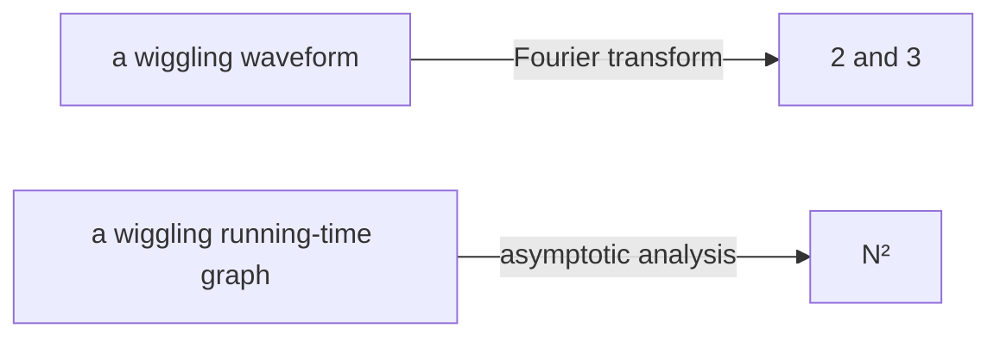

import Slide from 'stack-site-builder/components/Slide.astro';
import GrowthDemo from '@components/GrowthDemo.astro';

{/* Slide rules follow "슬라이드 규칙" in docs/writing-rules.md.
    Numbers match the practice code (threeSum) exactly. */}

<Slide class="cover">

# Analyzing Performance

Topic 05

*Advanced Algorithms*

</Slide>

<Slide>

## A language we already speak
::sub[It appeared in every table from Topics 01 to 04]

- Sequential search $$O(n)$$, binary search $$O(\log n)$$
- Insertion sort best $$O(n)$$, worst $$O(n^2)$$
- Merge sort $$O(n \log n)$$, the comparison lower bound $$\Omega(n \log n)$$
- Quickselect average $$O(n)$$

<br/>

This topic firms up the **language itself**.  
Where it comes from, what it means exactly, and how to use it well.

</Slide>

<Slide>

## A language for summaries
::sub[Challenge: describe a wildly wiggling waveform]

- Neither formulas nor words come easily.
- But what if it is the **sum of a 2Hz and a 3Hz signal**?
- After a Fourier transform, bars stand at **exactly 2 and 3**.
- The description collapses to two numbers.

<br/>

For the waveform story, see 3Blue1Brown's
[video on the Fourier transform](https://www.youtube.com/watch?v=spUNpyF58BY).

</Slide>

<Slide>

#### What this topic builds
::sub[The same kind of summary language]



A graph of thousands of measurements, summarized **in one word**.

</Slide>

<Slide>

## The first road: measure
::sub[Can you fill in the question mark]

| $$N$$ | 250 | 500 | 1,000 | 2,000 | 4,000 | 8,000 | 16,000 |
| --- | --- | --- | --- | --- | --- | --- | --- |
| time (s) | 0.0 | 0.0 | 0.1 | 0.8 | 6.4 | 51.1 | ? |

</Slide>

<Slide>

#### The doubling experiment
::sub[The ratio when N doubles is the fingerprint of the degree]

- $$0.8 \to 6.4 \to 51.1$$: about **8 times** each step.
- $$2^3 = 8$$, so the time follows $$N^3$$.
- The question mark: $$51.1 \times 8 \approx 409$$ seconds.

<br/>

Measure, double, read the ratio.  
×2 is linear, ×4 quadratic, ×8 cubic.

</Slide>

<Slide>

#### The limits of measuring
::sub[Powerful, but three things fall short]

- **Tied to the machine and the language.**
  - As repeated since Topic 01: the milliseconds differ by machine.
- **It knows nothing about the N you have not visited.**
  - The next cell costs seven minutes; the one after, an hour.
- **It cannot explain why.**
  - It reports the 8; the reason lives in the code.

</Slide>

<Slide class="center">

## The second road: count
::sub[Count operations instead of seconds]

</Slide>

<Slide>

#### 1-sum: counting everything
::sub[Counting the zeros in an array]

<div class="aas-split">
<div>

```c
int count = 0;
for (int i = 0; i < N; i++)
    if (a[i] == 0)
        count++;
```

</div>
<div>

| Operation | Frequency |
| --- | --- |
| declaration | $$2$$ |
| assignment | $$2$$ |
| `<` compare | $$N + 1$$ |
| `==` compare | $$N$$ |
| array access | $$N$$ |
| increment | $$N$$ \~ $$2N$$ |

</div>
</div>

<br/>

The increment is a range: `count++` runs 0 to $$N$$ times by input.

</Slide>

<Slide>

#### 2-sum: counting is work too
::sub[Counting the pairs that sum to zero]

<div class="aas-split">
<div>

```c
int count = 0;
for (int i = 0; i < N; i++)
    for (int j = i+1; j < N; j++)
        if (a[i] + a[j] == 0)
            count++;
```

</div>
<div>

| Operation | Frequency |
| --- | --- |
| declaration | $$N + 2$$ |
| assignment | $$N + 2$$ |
| `<` compare (inner) | $$\dfrac{N(N+1)}{2}$$ |
| `==` compare | $$\dfrac{N(N-1)}{2}$$ |
| array access | $$N(N-1)$$ |

</div>
</div>

<br/>

Exact, but heavy. **The counting itself must be simplified.**

</Slide>

<Slide>

#### Simplifying
::sub[Two conventions shrink the table to one line]

- **Cost model**
  - Count **one representative operation**, not all of them.
  - Here: array accesses.
- **Tilde notation**
  - Keep the leading term only.
  - $$N(N-1) = N^2 - N$$ becomes $$\sim N^2$$.

</Slide>

<Slide>

#### The practice code validates the model
::sub[`01_three_sum/` · the doubling ratios land on 4 and 8, machine-independent]

- Run

```console
N = 100
1-sum: count = 1, accesses = 100
2-sum: count = 19, accesses = 9900
3-sum: count = 642, accesses = 485100

doubling N: accesses ratio
     N        2-sum        3-sum
   200         4.02         8.12
   400         4.01         8.06
```

$$9900 = N(N-1)$$, $$485100 = 3\binom{N}{3}$$.  
Measuring gave 51.1 seconds; counting also gives **why it is 8 times**.

</Slide>

<Slide class="center">

## Asymptotic analysis
::sub[Keep only the growth rate at large N]

</Slide>

<Slide>

### Seven growth classes
::sub[Press **Double n**. The ratio badges are the fingerprints]

<GrowthDemo slide />

</Slide>

<Slide>

#### We have met them all
::sub[All seven classes appeared in this course]

| Class | Where we met it |
| --- | --- |
| $$1$$ | counting sort's slot arithmetic (Topic 03) |
| $$\log n$$ | binary search (Topic 01) |
| $$n$$ | sequential search (Topic 01), quickselect (Topic 04) |
| $$n \log n$$ | merge sort (Topic 03), quicksort average (Topic 04) |
| $$n^2$$ | selection, insertion, bubble (Topic 02), 2-sum |
| $$n^3$$ | 3-sum (this topic) |
| $$2^n$$ | recursive Fibonacci (Topic 01) |

</Slide>

<Slide>

#### Decades change, classes remain
::sub[Problem size solvable in minutes · adapted from Sedgewick]

| Growth | 1970s | 1980s | 1990s | 2000s |
| --- | --- | --- | --- | --- |
| $$n$$ | millions | tens of millions | hundreds of millions | billions |
| $$n \log n$$ | hundreds of thousands | millions | millions | hundreds of millions |
| $$n^2$$ | hundreds | thousands | thousands | tens of thousands |
| $$n^3$$ | a hundred | hundreds | a thousand | thousands |
| $$2^n$$ | about 20 | the 20s | the 20s | about 30 |

<br/>

Computers got thousands of times faster; the $$2^n$$ row moved from 20 to 30.

</Slide>

<Slide class="center">

### A class gap cannot be closed with hardware

The same conclusion as Topic 02's 317 years and Topic 03's factor of 30 million.

</Slide>

<Slide>

## Four notations
::sub[The grammar of the language]

| Notation | Example | Meaning | Used for |
| --- | --- | --- | --- |
| tilde $$\sim$$ | $$\sim 10n^2$$ | leading term, **constant included** | approximate models |
| big theta $$\Theta$$ | $$\Theta(n^2)$$ | exactly that growth rate | classifying algorithms |
| big O $$O$$ | $$O(n^2)$$ | that rate **or slower** (ceiling) | guaranteeing ceilings |
| big omega $$\Omega$$ | $$\Omega(n^2)$$ | that rate **or faster** (floor) | proving floors |

</Slide>

<Slide>

#### O is a fence
::sub[Look at what fits inside and the meaning clicks]

- $$O(n^2)$$ contains $$10n^2$$, and $$100n$$, and $$22n \log n$$.
  - The fence says "grows no faster than $$n^2$$".
- $$\Omega$$ is the fence in the other direction.
  - Topic 03's lower bound, **every comparison sort is $$\Omega(n \log n)$$**, was this.
- $$\Theta$$ is when the two fences meet.

</Slide>

<Slide>

#### A common confusion
::sub[Big O does not mean "worst case"]

- **Best · average · worst**: the axis of which inputs you look at
- **$$O \cdot \Theta \cdot \Omega$$**: the axis of which direction you fence from
- Independent axes, freely combined.
  - "Quicksort's **average** is $$O(n \log n)$$, its **worst** $$O(n^2)$$" ← precise usage

<br/>

A convention: in practice $$O$$ often stands where $$\Theta$$ is meant.  
The ceiling is true, so it is not wrong; this course follows it too.

</Slide>

<Slide class="center">

## Quiz
::sub[Three problems with the new grammar]

</Slide>

<Slide>

#### Problem 1
::sub[The time complexity of this code?]

```c
for (int i = 0; i < 2*n; i++)
    for (int j = n-1000; j < n; j++)
        for (int k = n/2; k < n; k++)
            sum++;
```

</Slide>

<Slide>

#### Answer 1: O(n²)
::sub[A triple loop is not automatically O(n³)]

```c
for (int i = 0; i < 2*n; i++)        // 2n times
    for (int j = n-1000; j < n; j++) // a fixed 1,000
        for (int k = n/2; k < n; k++) // n/2 times
            sum++;
```

$$2n \cdot 1000 \cdot \dfrac{n}{2} = 1000n^2$$

<br/>

**A constant-bounded loop contributes no degree.**

</Slide>

<Slide>

#### Problem 2
::sub[Find the minimum, subtract it from everyone?]

```c
void reduce(int vals[], int n) {
    int minIndex = 0;
    for (int i = 0; i < n; i++)
        if (vals[i] < vals[minIndex])
            minIndex = i;
    int minVal = vals[minIndex];
    for (int i = 0; i < n; i++)
        vals[i] = vals[i] - minVal;
}
```

</Slide>

<Slide>

#### Answer 2: O(n)
::sub[The two loops run side by side]

- First loop $$O(n)$$, second loop $$O(n)$$
- Side-by-side loops **add**: $$O(n) + O(n) = O(n)$$
- **Only nested loops multiply.**

</Slide>

<Slide>

#### Problem 3
::sub[The maximum difference between two elements?]

```c
int maxDifference(int vals[], int n) {
    int max = 0;
    for (int i = 0; i < n; i++)
        for (int j = 0; j < n; j++)
            if (vals[i] - vals[j] > max)
                max = vals[i] - vals[j];
    return max;
}
```

</Slide>

<Slide>

#### Answer 3: O(n²), but
::sub[Two nested loops of n each]

- This code is $$O(n^2)$$.
- Finding the max and min separately solves it in $$O(n)$$.

<br/>

**Analysis grades the code you have, not the problem itself.**  
For the problem's limit you need a tool like Topic 03's lower bound.

</Slide>

<Slide class="compact">

#### Try it now
::sub[Counting operations and the doubling experiment]

[lec-algorithm/algorithm-code](https://github.com/lec-algorithm/algorithm-code/tree/main) · `src/topic-05-complexity/`  
Open a file and press the **▶ button** at the top right of the editor.

1. **Time it for real with `doubling_time.py`.**
   - Numbers differ by machine; ratios still gather at 4 and 8.
2. **Add pruning to 3-sum.**
   - The ratio stays near 8. Constants shrink; the degree stays.
3. **Run the doubling experiment on Topic 01's Fibonacci.**
   - How much per +1 of n? The exponential's fingerprint.

</Slide>

<Slide>

## What to keep

1. **Two roads to performance.**
   - Measuring is quick but machine-bound; counting gives the reason.
2. **The doubling ratio is the degree's fingerprint.**
   - ×2 linear, ×4 quadratic, ×8 cubic, squaring exponential.
3. **Simplify with a cost model and the tilde.**
   - One representative operation, one leading term.
4. **$$O$$ is a ceiling, $$\Omega$$ a floor, $$\Theta$$ both meeting.**
   - An axis independent of best, average, and worst.
5. **Constant loops add no degree.**
   - Side-by-side loops add; only nested loops multiply.

</Slide>
