import Slide from 'stack-site-builder/components/Slide.astro';
import HuffmanDemo from '@components/HuffmanDemo.astro';
import LzwDemo from '@components/LzwDemo.astro';
import TreeFigure from '@components/TreeFigure.astro';
import CoinDemo from '@components/CoinDemo.astro';
import ActivityDemo from '@components/ActivityDemo.astro';
import KnapsackDemo from '@components/KnapsackDemo.astro';

{/* Slide rules follow "슬라이드 규칙" in docs/writing-rules.md.
    Numbers match the practice code (topic-06-greedy) exactly. */}

<Slide class="cover">

# Greedy Algorithms and Huffman Codes

Topic 06

*Advanced Algorithms*

</Slide>

<Slide>

## The second strategy
::sub[Topics 03 and 04 were splitting; Topic 05 was the language of cost]

- **Divide and conquer**: split the problem, solve the parts, combine.
- **Greedy**: pick what looks best right now, and **never look back.**

<br/>

We will see when this simple attitude is optimal and when it goes wrong.  
Then we follow it all the way to Huffman codes, which compress data with it.

</Slide>

<Slide class="center">

## Greedy algorithms
::sub[Solving a problem by picking the best option available right now]

</Slide>

<Slide>

#### The greedy approach
::sub["I live only for today." from the Korean film *The Man from Nowhere*]

- It picks a **local optimum**.
- It decides **from the current situation alone**.
  - It looks at neither past nor future choices.
- **Once it picks something, it never takes it back.**
- That is why it is simple and fast.

<br/>

It does not ask whether today's best leads to the best overall.

</Slide>

<Slide>

#### Making the largest number
::sub[Digit cards 3 9 5 9 7 1]

$$
\text{LargestNumber}(3, 9, 5, 9, 7, 1) = 9 \,\|\, \text{LargestNumber}(3, 5, 9, 7, 1)
$$

<br/>

- Putting the largest card in front is the best move at that moment.
- The same question is asked again of the remaining cards.
- The answer is `997531`; here greedy is simply correct.

<br/>

This topic's question is **whether that is always so**.

</Slide>

<Slide class="center">

## Example 1. Coin change
::sub[Coin Change Problem]

</Slide>

<Slide>

#### The coin problem
::sub[Pay with the largest coin first]

- **Problem**: the fewest coins that make a given amount
- **Coins**: 500 won, 100 won, 50 won, 10 won
- **Greedy strategy**: pay with **the largest coin first** that does not exceed the remaining amount.

<br/>

1260 won = 500×2 + 100×2 + 50×1 + 10×1, **6 coins**  
That is optimal.

</Slide>

<Slide>

### One step at a time: 1260 won
::sub[Press **Step**. The unit being looked at is orange, and each coin paid flies down]

<CoinDemo slide />

</Slide>

<Slide class="compact">

#### In code
::sub[`01_coin_change/coinChange.c` · each coin value is visited once, so O(m)]

```c
int coinChange(const int coins[], int m, int amount, int used[]) {
    int count = 0;
    for (int i = 0; i < m; i++) {
        used[i] = amount / coins[i];      // how many of this coin (quotient)
        count += used[i];
        amount -= used[i] * coins[i];     // the amount left (remainder)
    }
    return count;
}
```

</Slide>

<Slide>

### With a 40-won coin: 80 won
::sub[Go to the end. Greedy’s answer is set beside the true minimum]

<CoinDemo coins={[50, 40, 10]} amount={80} slide />

</Slide>

<Slide class="compact">

#### What if there were a 40-won coin
::sub[Same code, only the coin set changes]

- Run

```console
coins = {500, 100, 50, 10}, amount = 1260
greedy: 500x2 100x2 50x1 10x1 -> 6 coins

coins = {50, 40, 10}, amount = 80
greedy: 50x1 10x3 -> 4 coins
```

Greedy uses **4 coins**, but two 40s make **2 coins**.  
The procedure is the same, yet optimality broke.

</Slide>

<Slide>

#### Why it works for our coins
::sub[It is no accident]

- 500 is a multiple of 100, 100 of 50, and 50 of 10.
- **One large coin exactly replaces several small ones.**
  - Paying with the large one first never costs anything.
- 50 is not a multiple of 40, so that relationship breaks.

<br/>

The multiple-of relationship is only a **sufficient condition**.  
US coins (25, 10, 5, 1 cent) break that relationship, yet greedy is still optimal.

</Slide>

<Slide class="center">

## Example 2. Activity selection
::sub[Activity Selection Problem]

</Slide>

<Slide>

### One step at a time: six meetings
::sub[They line up by end time first; the orange dashed line follows the last picked meeting’s end]

<ActivityDemo slide />

</Slide>

<Slide>

#### One room, as many meetings as possible
::sub[Greedy strategy: the meeting that ends earliest first]

```mermaid
%%{init: {"gantt": {"useWidth": 1100, "barHeight": 44, "barGap": 12, "fontSize": 22, "sectionFontSize": 22, "leftPadding": 150, "gridLineStartPadding": 40}, "themeVariables": {"activeTaskBkgColor": "#22c55e", "activeTaskBorderColor": "#16a34a", "doneTaskBkgColor": "#d4d4d8", "doneTaskBorderColor": "#a1a1aa", "taskTextDarkColor": "#111827", "taskTextColor": "#111827"}}}%%
gantt
  dateFormat x
  axisFormat %s
  tickInterval 1second
  section by end time
  (1, 3) picked : active, t1, 1000, 3000
  (2, 5) overlaps : done, t2, 2000, 5000
  (4, 6) picked : active, t3, 4000, 6000
  (6, 7) picked : active, t4, 6000, 7000
  (5, 8) overlaps : done, t5, 5000, 8000
  (8, 9) picked : active, t6, 8000, 9000
```



Line them up by end time and pick only those that do not overlap the previous pick.  
As with (6, 7) after (4, 6), starting exactly when the previous one ends is no overlap.

</Slide>

<Slide>

#### Why "ends earliest"
::sub[The earlier it ends, the more time is left]

- What if **starts earliest first**?
  - One all-day meeting like (0, 10) pushes out all the others.
- What if **shortest first**?
  - One short meeting straddling two long ones: gain one, lose two.

<br/>

With greedy, **what you pick first** is everything.

</Slide>

<Slide class="compact">

#### Procedure and run
::sub[`02_activity_selection/` · sort O(n log n) + one pass O(n)]

```plaintext
sort A by end time, ascending
selected <- [A[0]],  lastEnd <- A[0].end
for i <- 1 to n-1 do
    if A[i].start >= lastEnd then      // starts after the previous one ends
        append A[i] to selected,  lastEnd <- A[i].end
```

- Run

```console
input   : (5,8) (1,3) (8,9) (2,5) (6,7) (4,6)
by end  : (1,3) (2,5) (4,6) (6,7) (5,8) (8,9)
selected: (1,3) (4,6) (6,7) (8,9)
count = 4
```

</Slide>

<Slide class="center">

## Example 3. Fractional knapsack
::sub[Fractional Knapsack Problem]

</Slide>

<Slide>

#### At an all-you-can-eat buffet
::sub[Your stomach has a fixed size. What do you eat first?]

<div class="aas-split">
<div>

- **Problem**: maximize the value packed into a knapsack of fixed capacity
- **Condition**: items **can be split**.
- **Greedy strategy**: pack the highest **value per unit weight** first.

</div>
<div>

| Item | Weight | Value | Value/weight |
| --- | --- | --- | --- |
| 1 | 10 | 60 | 6 |
| 2 | 20 | 100 | 5 |
| 3 | 30 | 120 | 4 |

</div>
</div>

<br/>

Capacity 15: all of item 1 (60) + a quarter of item 2 (25) = **85**

</Slide>

<Slide>

### One step at a time: capacity 15
::sub[Cards line up by value per unit weight, then the bag fills in each item’s colour]

<KnapsackDemo slide />

</Slide>

<Slide class="compact">

#### Run
::sub[`03_fractional_knapsack/` · the last lines forbid splitting]

- Run

```console
capacity = 15
  take (w=10, v=60, v/w=6.0) x 1.00
  take (w=20, v=100, v/w=5.0) x 0.25
  total value = 85.00

capacity = 50
  take (w=10, v=60, v/w=6.0) x 1.00
  take (w=20, v=100, v/w=5.0) x 1.00
  take (w=30, v=120, v/w=4.0) x 0.67
  total value = 240.00

0/1 greedy, capacity = 50
  total value = 160
```

</Slide>

<Slide>

### Without splitting: capacity 50
::sub[Same order, no splitting. The end shows the gap and the true optimum]

<KnapsackDemo capacity={50} whole slide />

</Slide>

<Slide>

#### If items cannot be split
::sub[0/1 knapsack: the same order misses the optimum]

- With capacity 50, after items 1 and 2, item 3 (weight 30) does not fit in the remaining 20.
  - Greedy stops at **160**.
- Packing items 2 and 3 gives **220**.

<br/>

When items can be split, you fill it with no gap left, so "richest first" is optimal.  
When they cannot, the gap a rich item leaves behind becomes a loss.  
Dynamic programming solves this problem in Topic 14.

</Slide>

<Slide>

#### Scheduling: the criterion decides the answer
::sub[One CPU, five jobs · T = \{10, 2, 1, 100, 5\}]

| Criterion | Order | Waiting times | Average |
| --- | --- | --- | --- |
| order of arrival | $$J_1 J_2 J_3 J_4 J_5$$ | 0, 10, 12, 13, 113 | $$29.6$$ |
| longest first | $$J_4 J_1 J_5 J_2 J_3$$ | 0, 100, 110, 115, 117 | $$88.4$$ |
| shortest first | $$J_3 J_2 J_5 J_1 J_4$$ | 0, 1, 3, 8, 18 | $$6$$ |

<br/>

**Shortest Job First** is the greedy choice, and it is optimal.

</Slide>

<Slide>

#### Why shortest first
::sub[A job's time is added to every job behind it]

$$
\text{total waiting time} = 4t_1 + 3t_2 + 2t_3 + 1t_4 + 0t_5
$$

<br/>

- $$t_k$$ is the running time of the $$k$$-th job to run.
- The first job's time is added four times; the last job's, not at all.
- Put **the shortest job where it gets multiplied the most**.

</Slide>

<Slide class="center">

### Choose a criterion, sort by it, take from the front

Coins, meetings, knapsacks, and jobs all share this shape.  
Designing a greedy algorithm is mostly finding that criterion.

</Slide>

<Slide>

#### Finding the longest path
::sub[Root to leaf, maximize the sum along the way · what if you take the larger branch at every fork?]

<TreeFigure tree={{ v: "20", l: { v: "2", l: { v: "7" }, r: { v: "10" } }, r: { v: "3", r: { v: "1" } } }} slide />

</Slide>

<Slide>

#### Greedy does not look below
::sub[A 10 was hiding behind the 2 that looked small]

<div class="aas-split">
<div>

<TreeFigure tree={{ v: "20", tone: "eval", l: { v: "2", tone: "eval", l: { v: "7" }, r: { v: "10", tone: "eval" } }, r: { v: "3", tone: "focus", r: { v: "1", tone: "focus" } } }} slide />

</div>
<div>

- **Greedy**: takes the larger branch at every fork.
  - 20 → 3 → 1, sum **24**
- **Answer**: 20 → 2 → 10, sum **32**

<br/>

Once it picks 3, it never looks at the 2 side again.

</div>
</div>

</Slide>

<Slide>

#### When greedy works
::sub[Two properties guarantee optimality]

- **Greedy choice property**
  - Some optimal solution contains the best choice made right now.
- **Optimal substructure**
  - Adding that choice to an optimal solution of the remaining problem gives an optimal solution of the whole.

<br/>

Activity selection has both; the longest path lacks the first.  
Without a proof, greedy is only **a fast approximation**.

</Slide>

<Slide>

#### Side by side with other strategies
::sub[Greedy vs. divide and conquer vs. dynamic programming]

| Feature | Greedy | Divide and conquer | Dynamic programming |
| --- | --- | --- | --- |
| How it chooses | the one best choice now | solve subproblems and combine | consider every case |
| Time | fast | moderate | slow |
| Optimality | only when the conditions hold | depends on the problem | always |
| Memory | little | moderate (recursion stack) | a lot (table) |
| Implementation | easy | moderate | hard |
| Typical examples | coin change, activity selection | merge sort, quicksort | 0/1 knapsack, LCS |

<br/>

Prim and Dijkstra are greedy too. We meet them in Topic 12.

</Slide>

<Slide class="center">

## Data compression
::sub[Shrinking the size of a file or data]

</Slide>

<Slide>

#### Compression
::sub[Purpose and where it is used]

- **Purpose**
  - Save space when storing.
  - Save time when sending.
- **General files**: GZIP, BZIP2, 7z, file systems (NTFS, ZFS)
- **Multimedia**: images (GIF, JPEG), sound (MP3), video (MPEG)

</Slide>

<Slide class="compact">

#### Run-length encoding
::sub[Write down only the lengths of runs of equal values]

```plaintext
0000000000000001111111000000011111111111      40 bits
 15   7    7    11
1111 0111 0111 1011                           16 bits
```

- **How many bits per length?** It depends on the longest run. Here, 4 bits.
- **What if a run is longer than that?** Insert a run of length 0.
- It does not compress much, but it is easy and fast. Used for black-and-white images and fax.

</Slide>

<Slide>

#### Fixed-length codes
::sub[A genome has only four letters: A, C, T, G]

| Character | ASCII (8 bits) | 2-bit code |
| --- | --- | --- |
| A | 01000001 | 00 |
| C | 01000011 | 01 |
| T | 01010100 | 10 |
| G | 01000111 | 11 |

<br/>

$$8N$$ bits become $$2N$$ bits. A $$k$$-bit code holds $$2^k$$ characters.  
**What if frequent characters get shorter codes?** That is a variable-length code.

</Slide>

<Slide>

#### Ambiguity in variable-length codes
::sub[A signal received in Morse code: ···−−−···]

- `···` `−−−` `···` → **SOS**
- `···−` `−−···` → **V7**
- `··` `·−` `−−` `··` `·` → **IAMIE**
- `·` `·` `·−−` `−·` `··` → **EEWNI**

<br/>

It is not clear where one character ends and the next begins.  
Is "GODISNOWHERE" "God is now here" or "God is nowhere"?

</Slide>

<Slide>

#### Resolving the ambiguity
::sub[Check whether a codeword is a prefix of another]

1. **Fixed-length code**
   - You know exactly how many bits to cut at.
2. **Separator**
   - Attach a character marking the end of every codeword. The pause in Morse code.
3. **Prefix-free code**
   - Make sure no codeword is the beginning of another.

</Slide>

<Slide class="compact">

#### Prefix-free codes
::sub[A=0, B=10, C=110, D=111 · what is 0111110010110?]

```plaintext
0 111 110 0 10 110
A  D   C  A B   C
```

- Read from the front and cut the moment a codeword is complete.
- A 0 can only be A; something starting with 1 is not anything yet, so keep reading.
- **Even without separators, there is only one place to cut.** The answer is ADCABC.

</Slide>

<Slide>

#### Why it is useful
::sub[When character frequencies are uneven, the average shrinks]

| Character | Frequency | Fixed length | Variable length (prefix-free) |
| --- | --- | --- | --- |
| A | 60% | 00 | 0 |
| B | 25% | 01 | 10 |
| C | 10% | 10 | 110 |
| D | 5% | 11 | 111 |

<br/>

Average per character: fixed **2.0** bits, variable **1.55** bits

</Slide>

<Slide>

#### Codes as trees: with prefixes
::sub[A=0, B=01, C=10, D=1 · left branch 0, right branch 1]

<TreeFigure bits tree={{ l: { v: "A", filled: true, note: "0", r: { v: "B", filled: true, note: "01" } }, r: { v: "D", filled: true, note: "1", l: { v: "C", filled: true, note: "10" } } }} slide />

</Slide>

<Slide>

#### Codes as trees: prefix-free
::sub[A=0, B=10, C=110, D=111 · every character is at a leaf]

<TreeFigure bits tree={{ l: { v: "A", filled: true, note: "0" }, r: { l: { v: "B", filled: true, note: "10" }, r: { l: { v: "C", filled: true, note: "110" }, r: { v: "D", filled: true, note: "111" } } } }} slide />

</Slide>

<Slide>

#### Seen as a tree
::sub[A prefix means one node is an ancestor of another]

- **Prefix-free ⇔ characters sit only at leaves.**
- **Decoding**
  - Follow the bits down from the root; on reaching a leaf, output its character.
  - Return to the root and start over. Characters sit only at leaves, so there is no ambiguity.
- Code length of character $$i$$ = **depth** of $$i$$ in the tree

</Slide>

<Slide>

#### Finding the best tree
::sub[When character i has probability p_i]

$$
L(T) = \sum_{i \in \Sigma} p_i \cdot \text{depth}_T(i)
$$

<br/>

Which tree $$T$$ minimizes this average code length?  
The two trees above give $$L = 2$$ and $$L = 1.55$$.

</Slide>

<Slide class="compact">

#### First attempt: Shannon-Fano
::sub[Top down, splitting so the frequency sums are close]

```plaintext
A B C D E         15 7 6 6 5
A B | C D E       22 | 17          left 0, right 1
A | B             C | D E
                      D | E
Result: A=00  B=01  C=10  D=110  E=111
```

Total $$15 \cdot 2 + 7 \cdot 2 + 6 \cdot 2 + 6 \cdot 3 + 5 \cdot 3 = 89$$ bits  
Plausible, but not the best. A split decided at the top cannot know what it causes below.

</Slide>

<Slide class="center">

## Example 4. Huffman codes
::sub[Huffman Code · bottom up]

</Slide>

<Slide>

#### Huffman's idea
::sub[1951, an MIT graduate student; the course professor was that very Fano]

The rarest characters end up deepest, with the longest codes, anyway.  
So **tie the two rarest characters together as siblings first**.

1. Make a one-leaf tree for each character. Its weight is the frequency.
2. Take out the two lightest trees and merge them into one.
3. Repeat step 2 until one tree is left.

<br/>

Each step looks only at "the two lightest right now." **That is greedy.**

</Slide>

<Slide>

### Step by step: ABRACADABRA!
::sub[Press **Step**. The two leftmost trees merge next]

<HuffmanDemo slide />

</Slide>

<Slide>

#### Breaking ties
::sub[A rule so the practice code and the demo give the same answer]

- On equal weights, the tree with **the smallest character in it** goes first.
  - By code value, so `!` comes before A.
- The one taken out first goes on the **left** (0).

<br/>

A different rule gives the same total bit count.  
Huffman codes are not unique, but their length is always optimal.

</Slide>

<Slide>

### Beating Shannon-Fano
::sub[Same frequencies A 15, B 7, C 6, D 6, E 5 · Shannon-Fano took 89 bits]

<HuffmanDemo freq={{ A: 15, B: 7, C: 6, D: 6, E: 5 }} slide />

</Slide>

<Slide class="compact">

#### Run
::sub[`04_huffman_code/` · the same five merges as the demo]

- Run

```console
merge 1: !(1) + C(1) -> !C(2)
merge 2: D(1) + !C(2) -> D!C(3)
merge 3: B(2) + R(2) -> BR(4)
merge 4: D!C(3) + BR(4) -> D!CBR(7)
merge 5: A(5) + D!CBR(7) -> AD!CBR(12)

codes: !=1010 A=0 B=110 C=1011 D=100 R=111
encoded = 0110111010110100011011101010
bits: huffman 28, fixed 3-bit 36, ascii 96
decoded = ABRACADABRA!
```

</Slide>

<Slide>

#### Bits to write 12 characters
::sub[Being prefix-free is not enough to be the best]

| Method | Bits |
| --- | --- |
| ASCII (fixed 8 bits) | 96 |
| fixed length, 3 bits (6 kinds of characters) | 36 |
| an arbitrary prefix-free code (A=0, D=100, …, B=1111) | 30 |
| Huffman code | 28 |

</Slide>

<Slide>

#### Analysis
::sub[k kinds of characters, n characters of text]

- **Optimality**: shortest average length among symbol-by-symbol prefix-free codes.
  - Greedy choice property: some optimal tree has the two rarest characters as siblings.
  - Optimal substructure: after tying them, the same problem with one fewer character remains.
- **Time**: $$k - 1$$ merges
  - Scanning every time gives $$O(k^2)$$; a priority queue (heap, Topic 12) gives $$O(k \log k)$$.
  - Counting frequencies and encoding are $$O(n)$$.
- **The tree must be sent too.** In short texts, that overhead eats up the gain.

</Slide>

<Slide class="center">

## Example 5. LZW compression
::sub[Lempel-Ziv-Welch · codes for strings, not characters]

</Slide>

<Slide>

#### The idea of LZW
::sub[Text repeats in units larger than characters: the, tion, ing]

- The table starts with the 256 single ASCII characters (codes 0\~255).
- Every new string it reads gets a new code: 256, 257, ….
- All codes have the same length. In this example, 9 bits are enough.
  - Real implementations widen the codes past 9 bits, to 12 or more, as the table grows.

<br/>

**Encoding**: if P+C is in the table, extend further;  
if not, output P's code and add P+C to the table.

</Slide>

<Slide>

### Encoding: BABAABAAA
::sub[P in blue, C in orange, new codes in green]

<LzwDemo mode="encode" slide />

</Slide>

<Slide>

### Decoding: no table is sent
::sub[Reading only the codes, it builds the same table as the encoder]

<LzwDemo mode="decode" slide />

</Slide>

<Slide>

#### The decoder one step behind
::sub[When the last code, 260, arrives, the table only goes up to 259]

- The decoder always fills the table **one step behind** the encoder.
- The encoder used 260 right after creating it.
- Such a string always has the form "translation of OLD + its first character."
  - Here, A + A = AA

<br/>

The encoder picks **the longest match in the current table**. That is greedy too.

</Slide>

<Slide class="compact">

#### Run
::sub[`05_lzw/` · the encoder's add column and the decoder's add column are the same table]

- Run

```console
codes: 66 65 256 257 65 260

decode
  OLD   NEW   S     C   add
              B
  66    65    A     A   256 = BA
  65    256   BA    B   257 = AB
  256   257   AB    A   258 = BAA
  257   65    A     A   259 = ABA
  65    260   AA    A   260 = AA  (NEW not in table yet)
decoded = BABAABAAA

bits: ascii 9 x 8 = 72, lzw 6 x 9 = 54
```

</Slide>

<Slide>

#### LZW in summary
::sub[An adaptive model]

- It learns and updates its model (the table) while reading the text.
  - Unlike **static models** (ASCII, Morse code) and **dynamic models** (Huffman).
  - In exchange for not sending the table, decoding **must start from the beginning**.
- **The family**: LZ77, LZ78, LZW
  - The US patent on LZW expired on June 20, 2003.
  - Deflate in ZIP, gzip, PNG = **an LZ77 variant + Huffman**

</Slide>

<Slide>

#### Strengths and weaknesses

| | Strengths | Weaknesses |
| --- | --- | --- |
| Compression ratio | high on text with lots of repetition | less effective on images and video |
| Speed | fast decompression | on large files, updating the table can slow compression |
| Versatility | no table to send, widely supported | needs memory to hold the dictionary |

</Slide>

<Slide>

#### Compression in summary

- **Lossless compression**
  - Huffman: **fixed-length symbols** to **variable-length codes**
  - LZW: **variable-length strings** to **fixed-length codes**
- **Lossy compression**: JPEG, MPEG, MP3
  - A relative of the Fourier transform (the discrete cosine transform), wavelets
- **The limit**: Shannon entropy
  - No clever algorithm can go below it on average.

</Slide>

<Slide class="compact">

#### Try it now
::sub[Find where greedy fails and where compression pays off]

[lec-algorithm/algorithm-code](https://github.com/lec-algorithm/algorithm-code/tree/main) · `src/topic-06-greedy/`  
Open a file and press the **▶ button** at the top right of the editor.

1. **Find more amounts where greedy fails with the coins `{50, 40, 10}`.**
   - There are others besides 80.
2. **Change the activity-selection criterion to "starts earliest."**
   - Add a `(0, 10)` meeting and it picks only one.
3. **Feed Huffman and LZW other strings.**
   - The more uneven the frequencies and the more repetition, the more compression pays off.

</Slide>

<Slide>

## What to keep

1. **Greedy picks today's best and never takes it back.**
   - It usually sorts by one criterion and takes from the front.
2. **The criterion decides the answer.**
   - Earliest-ending meeting, value per unit weight, shortest job
3. **Optimality needs the greedy choice property and optimal substructure.**
   - Greedy fails for the 40-won coin, the 0/1 knapsack, and the longest path.
4. **A variable-length code is unambiguous only if prefix-free.**
   - In a code tree, characters sit only at leaves.
5. **Huffman merges the two rarest first; LZW gives codes to strings.**
   - Huffman is optimal per symbol; LZW sends no table.

</Slide>
