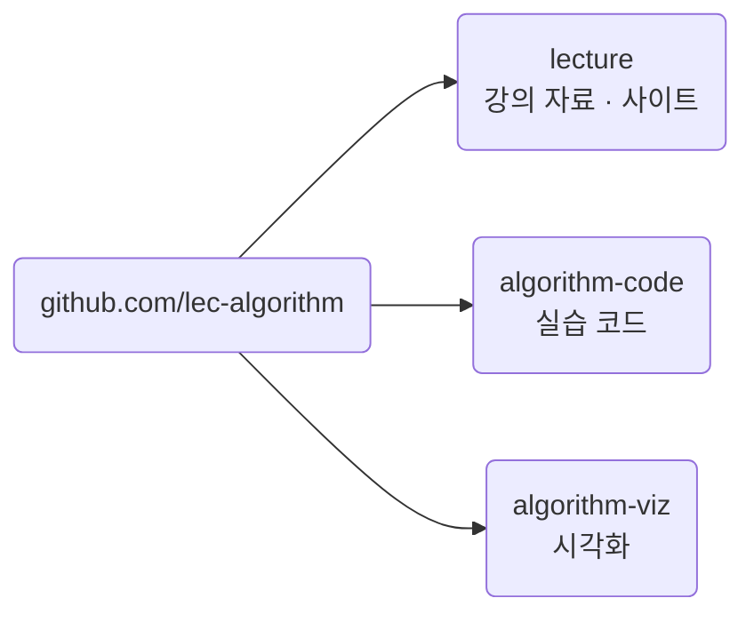

import Slide from 'stack-site-builder/components/Slide.astro';
import Screenshot from '@components/Screenshot.astro';
import envTemplate from '@assets/slides/orientation/github-repo-1.png';
import envCreate from '@assets/slides/orientation/github-repo-2.png';
import codeCodespace from '@assets/slides/orientation/algo-code-setup-1.png';
import codeRunning from '@assets/slides/orientation/algo-code-setup-2.png';

{/* 슬라이드 작성 규칙은 docs/writing-rules.md의 "슬라이드 규칙"을 따릅니다. */}

<Slide class="cover">

# 고급알고리즘

2026학년도 2학기 · SIT2001-01

*이태규 · 연세대학교 첨단융합공학부*

</Slide>

<Slide>

## 이 수업이 하는 일
::sub[정렬과 분할 정복에서 그래프와 동적 계획법까지]

- 컴퓨터 알고리즘과 **그 뒤에 있는 논리**
- 여러 정렬 알고리즘, 분할 정복, 동적 계획법
- 알고리즘의 **복잡도를 판단하는 법**

</Slide>

<Slide>

## 수업의 방식
::sub[의사코드 한 벌, 구현 두 벌]

- 알고리즘은 **의사코드**로 먼저 정의합니다.
- 같은 것을 **C**와 **Python**으로 구현합니다.
- 언어를 배우는 수업이 아닙니다.
  - 같은 절차가 두 언어에서 어떤 모양이 되는지를 봅니다.
- 실행 환경은 **컨테이너로 고정**합니다.
  - 설치하는 것은 Git과 Docker 둘뿐입니다.
- 강의 50% · 실습 50%
  - 가급적 실습을 많이 진행하려고 합니다.

</Slide>

<Slide>

### 세 개의 저장소



- [github.com/lec-algorithm/lecture](https://github.com/lec-algorithm/lecture)
- [github.com/lec-algorithm/algorithm-code](https://github.com/lec-algorithm/algorithm-code)
- [github.com/lec-algorithm/algorithm-viz](https://github.com/lec-algorithm/algorithm-viz)

</Slide>

<Slide>

### 각 저장소에서 하는 일

| 저장소 | 여러분이 하는 일 |
| --- | --- |
| `lecture` | 사이트를 봅니다. (강의 문서 및 슬라이드) |
| `algorithm-code` | 클론해서 직접 돌립니다. (코드 작성 및 실행) |
| `algorithm-viz` | 슬라이드 안에서 봅니다. (알고리즘 애니메이션 등) |

</Slide>

<Slide>

## 수업 준비물
::sub[브라우저만 있으면 됩니다]

| 방법 | 필요한 것 |
| --- | --- |
| **GitHub Codespaces** (권장) | [GitHub 계정](https://github.com/signup) 하나 |
| 로컬에서 하기 | [Git](https://git-scm.com/downloads) · [Docker Desktop](https://www.docker.com/get-started/) |

<br/>

컴파일러와 Python은 설치하지 않습니다.  
어느 쪽이든 **같은 컨테이너 안**에서 돌아갑니다.

</Slide>

<Slide>

## 저장소 둘을 이렇게 씁니다
::sub[하나는 복사하고, 하나는 복사하지 않습니다]

| 저장소 | 무엇에 | 어떻게 |
| --- | --- | --- |
| `algorithm-env` | 과제 · 개인프로젝트 | **Use this template**으로 내 저장소를 만듭니다 |
| `algorithm-code` | 수업 예제 | **여기서 바로 Codespace**를 만듭니다 |

<br/>

`algorithm-code`는 학기 중에 주제가 계속 추가됩니다.  
복사하면 새 주제를 받을 방법이 없습니다.

</Slide>

<Slide class="compact">

### 과제용 내 저장소 ①
::sub[algorithm-env에서 Use this template]

<Screenshot src={envTemplate} alt="lec-algorithm/algorithm-env 저장소의 Use this template 버튼과 그 아래 펼쳐진 Create a new repository 메뉴" maxHeight="46vh" />

`algorithm-env`는 **template 저장소**입니다.  
**Use this template** → **Create a new repository**

</Slide>

<Slide class="compact">

### 과제용 내 저장소 ②
::sub[이름을 정하고 만듭니다]

<Screenshot src={envCreate} alt="Create a new repository 화면. Start with a template에 lec-algorithm/algorithm-env가 선택되어 있고, 저장소 이름에 my-algorithm-code를 입력한 뒤 Create repository를 누른다" maxHeight="62vh" />

이름은 알아볼 수 있게 짓습니다.  
**Create repository**를 누르면 내 계정에 사본이 생깁니다.

</Slide>

<Slide class="compact">

### 수업 예제는 Codespace로
::sub[algorithm-code는 복사하지 않습니다]

<Screenshot src={codeCodespace} alt="lec-algorithm/algorithm-code 저장소에서 Code 버튼을 누르고 Codespaces 탭의 Create codespace on main을 누르는 화면" maxHeight="56vh" />

**Code** → **Codespaces** → **Create codespace on main**

</Slide>

<Slide class="compact">

### 만들어진 Codespace
::sub[main 브랜치에 붙습니다]

<Screenshot src={codeRunning} alt="Codespaces 탭에 만들어진 codespace가 main 브랜치에 Active 상태로 나열된 화면" maxHeight="52vh" />

잠시 기다리면 브라우저에 VS Code가 뜹니다.  
**그 터미널이 곧 컨테이너 안입니다.**

</Slide>

<Slide class="compact">

### 컨테이너 안에 무엇이 있나
::sub[컴파일러와 Python은 설치하지 않습니다]

- 실행

```sh
gcc --version | head -1
python3 --version
```

- 결과

```console
gcc (Debian 14.2.0-19) 14.2.0
Python 3.13.5
```

<br/>

설치 방법이 운영체제마다 갈리는 것을 없애기 위해서입니다.  
여러분의 노트북이 무엇이든 컨테이너 안은 똑같습니다.

</Slide>

<Slide class="compact">

### 예제 하나 돌려보기

- 실행

```sh
cd src/topic-01-intro-search/01_sequential_search
gcc -o sequentialSearch.out sequentialSearch.c && ./sequentialSearch.out
python3 sequential_search.py
```

- 결과

```console
n = 15, key = 51
index = 6, comparisons = 7
```

두 구현이 같은 결과를 내면 준비가 끝난 것입니다.

</Slide>

<Slide class="compact">

### 로컬에서 하려면
::sub[Codespaces 대신 본인 노트북에서]

- 실행

```sh
git clone https://github.com/lec-algorithm/algorithm-code.git
cd algorithm-code
docker compose up -d
docker compose exec lab bash
```

- 결과

```console
root@d38ddee8c2a8:/work#
```

<br/>

프롬프트가 바뀌면 그 다음부터는 **위와 똑같습니다.**  
같은 `compose.yml`을 Codespaces도 씁니다.

</Slide>

<Slide>

## 평가
::sub[절대평가입니다]

| 항목 | 비중 |
| --- | --- |
| 중간시험 (10월 23일 금요일) | 20% |
| 기말시험 (12월 18일 금요일) | 40% |
| 과제1 · 과제2 | 5% + 5% |
| 개인프로젝트 | 25% |
| 출석 | 5% |

- **과제와 개인프로젝트는 GitHub 저장소 제출이 필수**입니다.
- 개인프로젝트는 중간 제출도 있습니다. 저장소와 슬라이드 10장 정도를 냅니다.

</Slide>

<Slide class="center">

### 결석 1/3이면 F입니다

실제 수업시수의 1/3 이상을 결석하면  
시험 결과와 관계없이 F 또는 NP를 받습니다.

</Slide>

<Slide>

### 학기 진도

| 주차 | 내용 |
| --- | --- |
| 1\~2 | 소개와 탐색, 기본 정렬 |
| 3\~5 | 분할 정복, 퀵 정렬, 성능 분석 |
| 5\~7 | 그리디와 허프만, 이진 탐색 트리 |
| 8 | **중간고사** |
| 9\~11 | 해시, 기수 정렬, 트라이, K-평균 |
| 12\~13 | 그래프, 정규식 |
| 14\~15 | 최단 경로, 동적 계획법 |
| 16 | **기말고사** |

- 수업 내용 및 주차는 상황에 따라 변동될 수 있습니다.

</Slide>

<Slide>

## 교재

| 구분 | 교재 |
| --- | --- |
| 주교재 | 알고리즘 (Sedgewick, 길벗 2018) |
| 부교재 | Introduction to Algorithms (한빛아카데미 2014) |

- 선수 추천과목: Computer Programming
  - Python or C

</Slide>

<Slide class="center">

### 시작하기

수업 자료는 강의 사이트에,  
운영 공지는 LearnUs에 올라갑니다.

먼저 **실습 환경 준비**부터 하세요.

</Slide>
