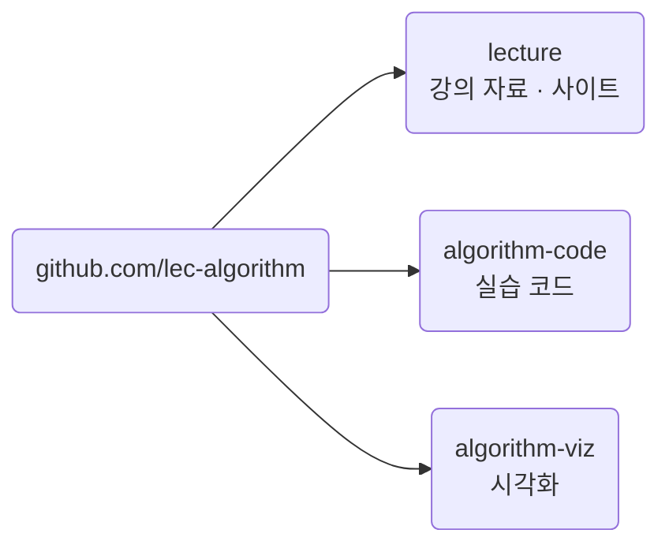

import Slide from 'stack-site-builder/components/Slide.astro';

{/* 슬라이드 작성 규칙은 docs/writing-rules.md의 "슬라이드 규칙"을 따릅니다. */}

<Slide class="cover">

# 고급알고리즘

2026학년도 2학기 · SIT2001-01

*이태규 · 연세대학교 첨단융합공학부*

</Slide>

<Slide>

## 이 수업이 하는 일
::sub[정렬과 분할 정복에서 그래프와 동적 계획법까지]

- 컴퓨터 알고리즘과 **그 뒤에 있는 논리**
- 여러 정렬 알고리즘, 분할 정복, 동적 계획법
- 알고리즘의 **복잡도를 판단하는 법**

</Slide>

<Slide>

## 수업의 방식
::sub[의사코드 한 벌, 구현 두 벌]

- 알고리즘은 **의사코드**로 먼저 정의합니다.
- 같은 것을 **C**와 **Python**으로 구현합니다.
- 언어를 배우는 수업이 아닙니다.  
  같은 절차가 두 언어에서 어떤 모양이 되는지를 봅니다.

강의 50% · 실습 50%

</Slide>

<Slide>

### 저장소는 셋입니다



</Slide>

<Slide class="center">

### 각 저장소에서 하는 일

| 저장소 | 여러분이 하는 일 |
| --- | --- |
| `lecture` | 사이트를 봅니다 |
| `algorithm-code` | 클론해서 직접 돌립니다 |
| `algorithm-viz` | 슬라이드 안에서 봅니다 |

</Slide>

<Slide>

### 첫 명령

```sh
git clone https://github.com/lec-algorithm/algorithm-code.git
cd algorithm-code/topic-01-intro-search/01_sequential_search

gcc -o sequentialSearch sequentialSearch.c && ./sequentialSearch
python3 sequential_search.py
```

두 명령이 같은 결과를 내면 준비가 끝난 것입니다.

</Slide>

<Slide>

## 평가
::sub[절대평가입니다]

| 항목 | 비중 |
| --- | --- |
| 중간시험 (10-23) | 20% |
| 기말시험 (12-18) | 40% |
| 과제1 · 과제2 | 5% + 5% |
| 개인프로젝트 | 25% |
| 출석 | 5% |

**개인프로젝트는 GitHub 저장소 제출이 필수**이고, 중간 제출이 있습니다.

</Slide>

<Slide class="center">

### 결석 1/3이면 F입니다

실제 수업시수의 1/3 이상을 결석하면  
시험 결과와 관계없이 F 또는 NP를 받습니다.

</Slide>

<Slide>

### 학기 진도

| 주차 | 내용 |
| --- | --- |
| 1\~2 | 소개와 탐색, 기본 정렬 |
| 3\~5 | 분할 정복, 퀵 정렬, 성능 분석 |
| 5\~7 | 그리디와 허프만, 이진 탐색 트리 |
| 8 | **중간고사** |
| 9\~11 | 해시, 기수 정렬, 트라이, K-평균 |
| 12\~13 | 그래프, 정규식 |
| 14\~15 | 최단 경로, 동적 계획법 |
| 16 | **기말고사** |

</Slide>

<Slide>

## 교재

| 구분 | 교재 |
| --- | --- |
| 주교재 | 알고리즘 (Sedgewick, 길벗 2018) |
| 부교재 | Introduction to Algorithms (한빛아카데미 2014) |

선수 추천과목: Computer Programming

</Slide>

<Slide class="center">

### 시작하기

수업 자료는 강의 사이트에,  
운영 공지는 LearnUs에 올라갑니다.

먼저 **실습 환경 준비**부터 하세요.

</Slide>
