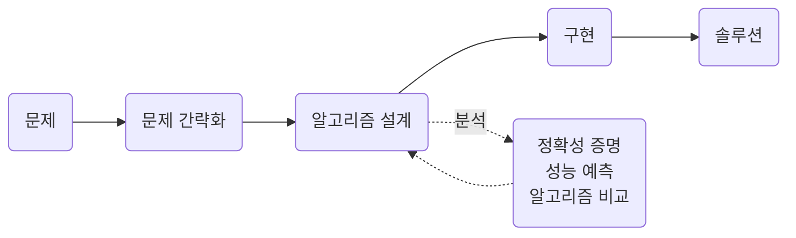
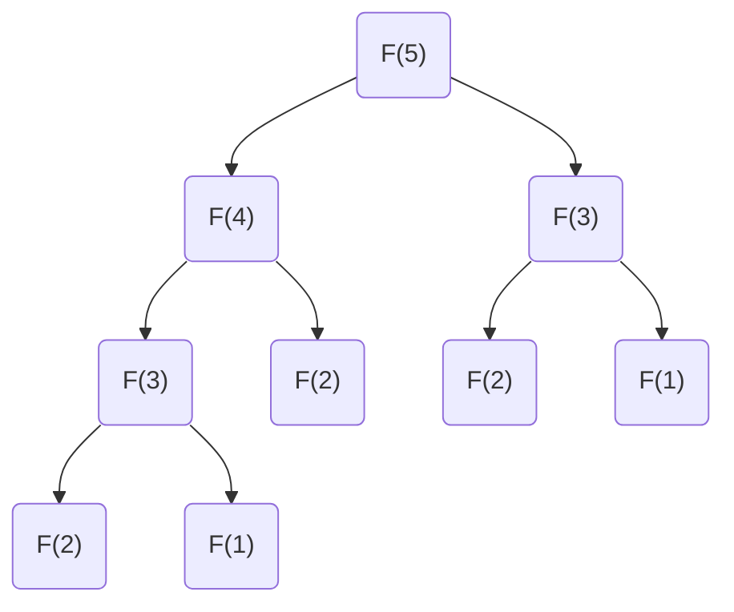

import Slide from 'stack-site-builder/components/Slide.astro';
import SearchDemo from '@components/SearchDemo.astro';
import SearchTrace from '@components/SearchTrace.astro';

{/* 슬라이드 작성 규칙은 docs/writing-rules.md의 "슬라이드 규칙"을 따릅니다.
    예제마다 절차 → 코드 → 실행 → 실습 순서로 갑니다. 코드는 algorithm-code
    저장소 파일을 옮긴 것이므로, 저장소가 바뀌면 여기도 함께 고칩니다.
    긴 줄은 두 단 폭에 맞춰 접었습니다. 잘리면 읽을 수 없기 때문입니다. */}

<Slide class="cover">

# 소개와 탐색

주제 01 · 1주차

*고급알고리즘 · 2026-2*

</Slide>

<Slide>

## 알고리즘은 무엇을 하는가
::sub[문제를 푸는 절차를 유한한 단계로 명확히 적은 것]

- 같은 입력에 같은 출력을 냅니다.
- 반드시 끝나야 합니다.

<br/>

그런데 "푼다"는 것만으로는 부족합니다.  
같은 문제를 푸는 절차는 대개 **여러 개** 있습니다.

</Slide>

<Slide class="center">

### 우리가 배우는 것은
### **그중 무엇을 고를지 판단하는 법**입니다

</Slide>

<Slide>

### 문제 · 입력 · 인스턴스

| 말 | 뜻 | 예 |
| --- | --- | --- |
| **문제** | 답을 구하려는 질문 | 정렬된 배열에서 값 하나 찾기 |
| **입력** | 문제가 받는 것 | 배열 `A`, 찾는 값 `key` |
| **인스턴스** | 입력에 구체적 값을 넣은 것 | `A = [6, 13, …]`, `key = 51` |

<br/>

알고리즘은 **문제**를 풀도록 설계하고,  
성능은 **인스턴스**에서 측정합니다.

</Slide>

<Slide class="compact">

### 우리가 하는 일



설계와 분석은 한 번씩 지나가는 단계가 아니라 서로를 되먹입니다.  
분석해 보니 느려서 다시 설계하고, 다시 분석합니다.

</Slide>

<Slide>

## 트레이드오프
::sub[가장 좋은 알고리즘은 대개 없습니다]

태블릿을 하나 산다고 해 봅시다.

- 화면: 해상도, 주사율
- CPU · 용량 · 펜 민감도
- **가격**

<br/>

성능이 올라가면 가격도 올라갑니다.  
결국 **무엇을 포기할지** 정하는 일입니다.

</Slide>

<Slide>

### 뺄셈 두 가지

$$
\begin{array}{r}
\text{자리 내림} \\[4pt]
361 \\
\underline{-\;192} \\
169
\end{array}
\qquad\qquad\qquad
\begin{array}{r}
\text{음수 허용} \\[4pt]
361 \\
\underline{-\;192} \\
(2)\,(-3)\,(-1)
\end{array}
$$

오른쪽은 아직 답이 아닙니다. 자릿값을 붙여 합칩니다.  
$$200 + (-30) + (-1) = 169$$

| | 자리 내림 | 음수 허용 |
| --- | --- | --- |
| 자리별 계산 | 순차적 | **병렬 가능** |
| 자리 사이 의존 | 있음 | 없음 |
| 마무리 | 없음 | 합치는 단계 |

둘 다 맞는 답을 냅니다.  
**어디서 돌릴 것인가**가 고릅니다.

</Slide>

<Slide>

### 정확도와 속도
::sub[같은 이야기가 딥러닝에도 있습니다]

| | 모델 1 | 모델 2 | 모델 3 |
| --- | --- | --- | --- |
| 정확도 | 0.8 | 0.7 | **0.9** |
| 속도 | 0.5초 | **0.1초** | 10분 |

실시간 응답이 필요하면 모델 2, 정확도가 중요한 진단 보조라면 모델 3입니다.  
**문제가 무엇을 요구하는지 알아야 고를 수 있습니다.**

</Slide>

<Slide>

## 예제 1. 두 가지 검색
::sub[정렬된 배열에서 값 하나의 위치를 찾아라]

| **인덱스** | 0 | 1 | 2 | 3 | 4 | 5 | **6** | 7 | 8 | 9 | 10 | 11 | 12 | 13 | 14 |
| --- | --- | --- | --- | --- | --- | --- | --- | --- | --- | --- | --- | --- | --- | --- | --- |
| **값** | 6 | 13 | 14 | 25 | 33 | 43 | **51** | 53 | 64 | 72 | 84 | 93 | 95 | 96 | 101 |

찾을 값은 `51`입니다.  
인덱스 6에 있습니다.

</Slide>

<Slide class="compact">

### 순차 검색
::sub[앞에서부터 하나씩 비교합니다]

```plaintext
ALGORITHM SequentialSearch(A, n, key)
    for i <- 0 to n-1 do
        if A[i] = key then
            return i
    return -1
```

인덱스 0부터 6까지 하나씩 봤으니 **7번** 비교하고 찾습니다.

</Slide>

<Slide class="compact">

### 코드로 옮기면
::sub[`01_sequential_search/`]

<div class="aas-split">
<div>

- `sequentialSearch.c`

```c
int sequentialSearch(const int a[], int n, int key,
                     int *comparisons) {
    for (int i = 0; i < n; i++) {
        (*comparisons)++;
        if (a[i] == key) {
            return i;
        }
    }
    return -1;
}
```

</div>
<div>

- `sequential_search.py`

```python
def sequential_search(a, key):
    comparisons = 0
    for i, value in enumerate(a):
        comparisons += 1
        if value == key:
            return i, comparisons
    return -1, comparisons
```

</div>
</div>

비교할 때마다 세는 줄이 하나 더 있을 뿐, 절차는 의사코드 그대로입니다.

</Slide>

<Slide>

### 몇 번 비교하나
::sub[찾는 값이 어디 있느냐에 달렸습니다]

| | 비교 횟수 | 언제 |
| --- | --- | --- |
| 최선 | 1 | 첫 원소가 `key`일 때 |
| 평균 | $$\dfrac{n+1}{2}$$ | **찾는 값이 배열에 있고** 위치가 고루 분포할 때 |
| 최악 | n | 마지막 원소이거나 배열에 없을 때 |

없는 값을 찾으면 언제나 n번을 다 셉니다.  
평균에 조건이 붙는 이유입니다.  
**성능을 말할 때는 어떤 인스턴스를 전제하는지 함께 말해야 합니다.**

최악 기준 **시간** $$O(n)$$ · **공간** $$O(1)$$

</Slide>

<Slide class="compact">

### 이진 검색
::sub[가운데를 먼저 봅니다. 배열이 정렬되어 있다는 사실을 씁니다]

```plaintext
ALGORITHM BinarySearch(A, n, key)
    lo <- 0
    hi <- n - 1
    while lo <= hi do
        mid <- lo + (hi - lo) / 2
        if A[mid] = key then return mid
        else if A[mid] < key then lo <- mid + 1
        else hi <- mid - 1
    return -1
```

찾는 값이 가운데보다 크면 **왼쪽 절반을 통째로 버립니다.**

</Slide>

<Slide class="compact">

### 코드로 옮기면
::sub[`02_binary_search/`]

<div class="aas-split">
<div>

- `binarySearch.c`

```c
int binarySearch(const int a[], int n, int key,
                 int *comparisons) {
    int lo = 0;
    int hi = n - 1;
    while (lo <= hi) {
        int mid = lo + (hi - lo) / 2;
        (*comparisons)++;
        if (a[mid] == key) {
            return mid;
        } else if (a[mid] < key) {
            lo = mid + 1;
        } else {
            hi = mid - 1;
        }
    }
    return -1;
}
```

</div>
<div>

- `binary_search.py`

```python
def binary_search(a, key):
    lo, hi = 0, len(a) - 1
    comparisons = 0
    while lo <= hi:
        mid = lo + (hi - lo) // 2
        comparisons += 1
        if a[mid] == key:
            return mid, comparisons
        elif a[mid] < key:
            lo = mid + 1
        else:
            hi = mid - 1
    return -1, comparisons
```

</div>
</div>

`(lo + hi) / 2`가 아니라 `lo + (hi - lo) / 2`입니다.  
두 값이 클 때 덧셈이 자료형의 범위를 넘을 수 있습니다.

</Slide>

<Slide class="compact">

### 51을 찾는 네 번
::sub[비교할 때마다 남은 범위가 절반이 됩니다]

<SearchTrace slide values={[6, 13, 14, 25, 33, 43, 51, 53, 64, 72, 84, 93, 95, 96, 101]} target={51} />

| 비교 | lo | hi | mid | `A[mid]` | 판단 |
| --- | --- | --- | --- | --- | --- |
| 1 | 0 | 14 | 7 | 53 | 53 > 51 → 왼쪽으로 |
| 2 | 0 | 6 | 3 | 25 | 25 < 51 → 오른쪽으로 |
| 3 | 4 | 6 | 5 | 43 | 43 < 51 → 오른쪽으로 |
| 4 | 6 | 6 | 6 | **51** | 찾음 |

순차 검색의 7번에 견주어 **4번**입니다.  
**시간** $$O(\log n)$$ · **공간** $$O(1)$$

</Slide>

<Slide>

### 두 검색을 나란히
::sub[같은 배열에서 51을 찾습니다]

<SearchDemo slide values={[6, 13, 14, 25, 33, 43, 51, 53, 64, 72, 84, 93, 95, 96, 101]} target={51} />

흐려진 칸은 **더 볼 필요가 없어진 범위**입니다.

</Slide>

<Slide>

### 없는 값을 찾으면
::sub[50을 찾습니다]

<SearchDemo slide values={[6, 13, 14, 25, 33, 43, 51, 53, 64, 72, 84, 93, 95, 96, 101]} target={50} />

순차 검색은 **15번을 다 세고** 나서야 없다고 답합니다.

</Slide>

<Slide class="compact">

### 돌려 봅니다
::sub[같은 배열, 같은 key]

- 순차 검색

```console
n = 15, key = 51
index = 6, comparisons = 7
```

- 이진 검색

```console
n = 15, key = 51
index = 6, comparisons = 4
```

같은 답에 다른 비교 횟수입니다.  
손으로 센 7과 4가 그대로 찍힙니다.

</Slide>

<Slide>

### 차이는 n이 커질 때 드러난다

| 요소 개수 | 순차 검색 | 이진 검색 | 차이 |
| --- | --- | --- | --- |
| 1,000 | 23.88 μs | 2.27 μs | 10.5배 |
| 10,000 | 202.31 μs | 2.23 μs | 90.9배 |
| 100,000 | 1,847.54 μs | 6.40 μs | 288.7배 |
| 1,000,000 | 24,519.73 μs | 9.15 μs | **2,679.8배** |

$$O(n)$$과 $$O(\log n)$$의 차이입니다.

</Slide>

<Slide class="center">

### 공짜는 아닙니다

이진 검색은 **배열이 정렬되어 있어야** 합니다.

정렬되지 않았다면 **틀린 답**이 나옵니다.  
속도를 얻는 대신 입력에 조건을 겁니다.

</Slide>

<Slide class="compact">

### 바꿔 볼 자리
::sub[`02_binary_search/` · 배열과 key가 여기 있습니다]

<div class="aas-split">
<div>

- `binarySearch.c`

```c
int main(void) {
    int a[] = {6, 13, 14, 25, 33, 43, 51, 53,
               64, 72, 84, 93, 95, 96, 101};
    int n = (int)(sizeof(a) / sizeof(a[0]));
    int key = 51;
    int comparisons = 0;

    int index = binarySearch(a, n, key, &comparisons);

    printf("n = %d, key = %d\n", n, key);
    printf("index = %d, comparisons = %d\n",
           index, comparisons);
    return 0;
}
```

</div>
<div>

- `binary_search.py`

```python
if __name__ == "__main__":
    a = [6, 13, 14, 25, 33, 43, 51, 53,
         64, 72, 84, 93, 95, 96, 101]
    key = 51

    index, comparisons = binary_search(a, key)

    print(f"n = {len(a)}, key = {key}")
    print(f"index = {index}, "
          f"comparisons = {comparisons}")
```

</div>
</div>

`comparisons`를 포인터로 넘기는 이유가 여기 보입니다.  
C 함수는 값 하나만 돌려주므로, 인덱스와 비교 횟수를 둘 다 받으려면
한쪽을 밖에서 채워야 합니다.  
Python은 튜플로 둘을 함께 돌려줍니다.

</Slide>

<Slide class="compact">

### 지금 해 볼 것
::sub[예제 1. 두 가지 검색]

[lec-algorithm/algorithm-code](https://github.com/lec-algorithm/algorithm-code/tree/main) · `src/topic-01-intro-search/`  
파일을 열고 편집기 오른쪽 위 **▶ 버튼**을 누르면 실행됩니다.

1. **`key`를 첫 값과 마지막 값으로 바꿔 봅니다.**
   - `6`이면 순차 검색은 1회, `101`이면 15회입니다.
   - 같은 값을 이진 검색으로 찾으면 몇 번인지 견줍니다.
2. **배열에 없는 값을 찾아 봅니다.**
   - `key = 50`이면 둘 다 `-1`을 돌려줍니다.
   - 거기까지 가는 비교 횟수는 다릅니다.
3. **이진 검색의 배열만 뒤섞어 봅니다.**
   - 답이 틀립니다.
   - 순차 검색은 같은 배열에서 그대로 맞습니다.
   - 빠른 대신 무엇을 요구하는지가 여기서 드러납니다.

</Slide>

<Slide class="center">

## 예제 2. 재귀와 반복
::sub[같은 수식을 두 방식으로 구현합니다]

$$
F(n) = \begin{cases}
0 & n = 0 \\
1 & n = 1 \\
F(n-1) + F(n-2) & n > 1
\end{cases}
$$

0, 1, 1, 2, 3, 5, 8, 13, 21, 34, …로 이어집니다.

</Slide>

<Slide class="compact">

### 정의를 그대로 옮기면
::sub[재귀로 쓰면 정의와 코드가 거의 같아 보입니다]

```plaintext
ALGORITHM FibonacciRecursive(n)
    if n <= 1 then return n
    return FibonacciRecursive(n-1) + FibonacciRecursive(n-2)
```

읽기 쉽고 정의에 충실합니다.  
그런데 `F(5)`를 펼쳐 보면 문제가 보입니다.

</Slide>

<Slide class="compact">

### 같은 값을 다시 구합니다



`F(3)`이 두 번, `F(2)`가 세 번.  
n이 커지면 이 중복이 폭발합니다.

</Slide>

<Slide class="compact">

### 앞의 두 항만 들고 가면

```plaintext
ALGORITHM FibonacciIterative(n)
    if n <= 1 then return n
    prev <- 0
    curr <- 1
    for i <- 2 to n do
        next <- prev + curr
        prev <- curr
        curr <- next
    return curr
```

다음 항에 필요한 것은 **앞의 두 항뿐**입니다.  
각 항을 한 번씩만 구합니다.

</Slide>

<Slide class="compact">

### 코드로 옮기면
::sub[`03_fibonacci/fibonacci.c` · 두 함수를 나란히 둡니다]

<div class="aas-split">
<div>

- 재귀

```c
long fibonacciRecursive(int n) {
    calls++;
    if (n <= 1) {
        return n;
    }
    return fibonacciRecursive(n - 1)
         + fibonacciRecursive(n - 2);
}
```

</div>
<div>

- 반복

```c
long fibonacciIterative(int n) {
    if (n <= 1) {
        return n;
    }
    long prev = 0, curr = 1;
    for (int i = 2; i <= n; i++) {
        long next = prev + curr;
        prev = curr;
        curr = next;
    }
    return curr;
}
```

</div>
</div>

`calls`는 재귀가 몇 번 갈라지는지 세려고 둔 것입니다. 시간보다 이 숫자가
원인을 더 잘 보여 줍니다.

</Slide>

<Slide>

### 얼마나 벌어지나

| n | 재귀 호출 수 | 재귀(ms) | 반복(ms) |
| --- | --- | --- | --- |
| 10 | 177 | 0.00 | 0.0000 |
| 20 | 21,891 | 0.01 | 0.0000 |
| 30 | 2,692,537 | 0.82 | 0.0000 |
| 40 | **331,160,281** | 120.58 | 0.0000 |

n이 10 늘 때마다 호출 수가 **약 100배**가 됩니다.  
재귀 $$O(2^n)$$ · 반복 $$O(n)$$  
n = 100이면 1GHz로 **5만 6천 년**입니다.

</Slide>

<Slide class="center">

### 재귀는 나쁜 것인가

아닙니다.

느린 원인은 재귀가 아니라 **중복 계산**입니다.  
값을 저장해 두면 재귀도 $$O(n)$$이 됩니다.

*주제 14 동적 계획법에서 다시 만납니다.*

</Slide>

<Slide class="compact">

### 바꿔 볼 자리
::sub[`03_fibonacci/` · 재는 쪽이 여기 있습니다]

<div class="aas-split">
<div>

- `fibonacci.c`

```c
for (int n = 10; n <= 40; n += 10) {
    long rec, itr;

    calls = 0;
    double tRec = timeIt(fibonacciRecursive, n, &rec);
    double tItr = timeIt(fibonacciIterative, n, &itr);

    printf("%3d %15ld %10.2f %10.4f %10ld\n",
           n, calls, tRec, tItr, itr);

    if (rec != itr) {
        printf("  !! 값이 다르다: %ld vs %ld\n",
               rec, itr);
    }
}
```

</div>
<div>

- `fibonacci.py`

```python
# n=40이면 재귀가 12초쯤 걸린다.
for n in (10, 20, 30, 35):
    calls = 0
    rec, t_rec = time_it(fibonacci_recursive, n)
    itr, t_itr = time_it(fibonacci_iterative, n)

    print(f"{n:3d} {calls:15,d} {t_rec:10.2f} "
          f"{t_itr:10.4f} {itr:10d}")

    if rec != itr:
        print(f"  !! 값이 다르다: {rec} vs {itr}")
```

</div>
</div>

`rec != itr`를 매번 확인합니다.  
두 구현이 같은 답을 낸다는 것을 코드가 스스로 검사하게 두면,
빨라진 쪽이 틀린 것은 아닌지 의심할 필요가 없습니다.

</Slide>

<Slide class="compact">

### 지금 해 볼 것
::sub[예제 2. 재귀와 반복]

[lec-algorithm/algorithm-code](https://github.com/lec-algorithm/algorithm-code/tree/main) · `src/topic-01-intro-search/03_fibonacci/`  
파일을 열고 편집기 오른쪽 위 **▶ 버튼**을 누르면 실행됩니다.

1. **C 쪽 `n <= 40`을 45, 50으로 올려 봅니다.**
   - 호출 수가 어디까지 늘어나는지 봅니다.
   - 언제부터 기다릴 수 없어지는지 봅니다.
2. **Python 쪽은 `(10, 20, 30, 35)`에서 멈춰 두었습니다.**
   - 같은 절차인데 훨씬 느립니다.
   - **어디서 멈추는지도 관찰의 일부입니다.**
3. **반복 쪽 `n`은 얼마까지 올려도 즉시 끝나는지 봅니다.**
   - `long`이 넘치는 지점도 함께 보입니다.

</Slide>

<Slide>

## 남길 것

1. **최선의 알고리즘은 대개 없습니다.**
   - 무엇을 내줄지 정하는 일이 있을 뿐입니다.
2. **차이는 입력이 커질 때 드러납니다.**
   - 작은 입력에서는 무엇을 써도 비슷합니다.
3. **빠름에는 조건이 따릅니다.**
   - 이진 검색은 정렬을 요구합니다.
   - 확인하지 않고 쓰면 틀린 답을 얻습니다.
4. **코드의 모양이 성능을 바꿉니다.**
   - 같은 수식도 $$O(2^n)$$과 $$O(n)$$으로 갈립니다.

</Slide>

<Slide>

### 이 과목을 따라오는 법

- **의사코드가 기준입니다.**
  - 예제마다 `.pseudo` 하나에 C와 Python이 붙습니다.
  - 언어를 배우는 것이 아니라 **같은 절차가 두 언어에서 어떤 모양이 되는지**를 봅니다.
- **읽는 것으로 끝내지 마세요.**
  - 예제는 비교 횟수와 호출 횟수를 함께 찍습니다.
  - 숫자를 바꿔 돌려 보면 표에 적힌 복잡도가 손에 잡힙니다.
- **막히면 컨테이너에서 확인하세요.**
  - 질문을 받을 때의 기준은 실습 컨테이너 안입니다.

<br/>

코드는 [lec-algorithm/algorithm-code](https://github.com/lec-algorithm/algorithm-code/tree/main) 저장소의
`src/topic-01-intro-search/`에 있습니다.  
실행 방법은 [실습 환경 준비](/article/setup-guide/)를 참고하세요.

</Slide>
