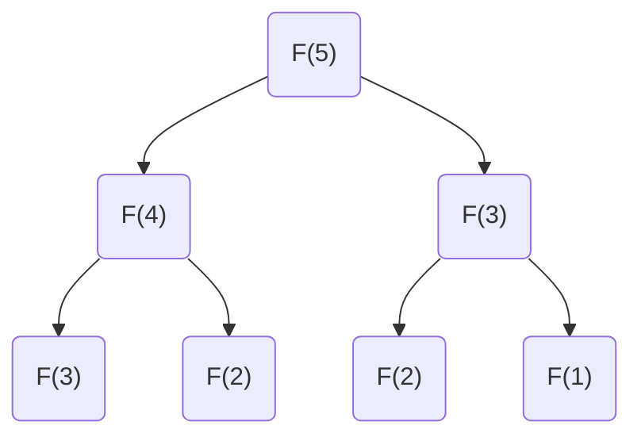

import Slide from 'stack-site-builder/components/Slide.astro';
import SearchDemo from '@components/SearchDemo.astro';

{/* 슬라이드 작성 규칙은 docs/writing-rules.md의 "슬라이드 규칙"을 따릅니다. */}

<Slide class="cover">

# 소개와 탐색

주제 01 · 1주차

*고급알고리즘 · 2026-2*

</Slide>

<Slide>

## 알고리즘은 무엇을 하는가
::sub[문제를 푸는 절차를 유한한 단계로 명확히 적은 것]

- 같은 입력에 같은 출력을 냅니다.
- 반드시 끝나야 합니다.

<br/>

그런데 "푼다"는 것만으로는 부족합니다.  
같은 문제를 푸는 절차는 대개 **여러 개** 있습니다.

</Slide>

<Slide class="center">

### 우리가 배우는 것은
### **그중 무엇을 고를지 판단하는 법**입니다

</Slide>

<Slide>

### 문제 · 입력 · 인스턴스

| 말 | 뜻 | 예 |
| --- | --- | --- |
| **문제** | 답을 구하려는 질문 | 정렬된 배열에서 값 하나 찾기 |
| **입력** | 문제가 받는 것 | 배열 `A`, 찾는 값 `key` |
| **인스턴스** | 입력에 구체적 값을 넣은 것 | `A = [6, 13, …]`, `key = 51` |

<br/>

알고리즘은 **문제**를 풀도록 설계하고,  
성능은 **인스턴스**에서 측정합니다.

</Slide>

<Slide>

## 트레이드오프
::sub[가장 좋은 알고리즘은 대개 없습니다]

태블릿을 하나 산다고 해 봅시다.

- 화면: 해상도, 주사율
- CPU · 용량 · 펜 민감도
- **가격**

<br/>

성능이 올라가면 가격도 올라갑니다.  
결국 **무엇을 포기할지** 정하는 일입니다.

</Slide>

<Slide>

### 뺄셈 두 가지

```plaintext
    361            361
-   192        -   192
-------        -------
    169            (2)(-3)(-1)  →  200 + (-30) + (-1) = 169
```

| | 자리 내림 | 음수 허용 |
| --- | --- | --- |
| 자리별 계산 | 순차적 | **병렬 가능** |
| 자리 사이 의존 | 있음 | 없음 |
| 마무리 | 없음 | 합치는 단계 |

둘 다 맞는 답을 냅니다. **어디서 돌릴 것인가**가 고릅니다.

</Slide>

<Slide class="compact">

### 두 검색을 나란히
::sub[같은 배열에서 51을 찾습니다]

<SearchDemo compact values={[6, 13, 14, 25, 33, 43, 51, 53, 64, 72, 84, 93, 95, 96, 101]} target={51} />

흐려진 칸은 **더 볼 필요가 없어진 범위**입니다.

</Slide>

<Slide class="compact">

### 없는 값을 찾으면
::sub[50을 찾습니다]

<SearchDemo compact values={[6, 13, 14, 25, 33, 43, 51, 53, 64, 72, 84, 93, 95, 96, 101]} target={50} />

순차 검색은 **15번을 다 세고** 나서야 없다고 답합니다.

</Slide>

<Slide>

### 차이는 n이 커질 때 드러난다

| 요소 개수 | 순차 검색 | 이진 검색 | 차이 |
| --- | --- | --- | --- |
| 1,000 | 23.88 μs | 2.27 μs | 10.5배 |
| 10,000 | 202.31 μs | 2.23 μs | 90.9배 |
| 100,000 | 1,847.54 μs | 6.40 μs | 288.7배 |
| 1,000,000 | 24,519.73 μs | 9.15 μs | **2,679.8배** |

O(n)과 O(log n)의 차이입니다.

</Slide>

<Slide class="center">

### 공짜는 아닙니다

이진 검색은 **배열이 정렬되어 있어야** 합니다.

정렬되지 않았다면 **틀린 답**이 나옵니다.  
속도를 얻는 대신 입력에 조건을 겁니다.

</Slide>

<Slide>

### 피보나치: 정의를 그대로 옮기면

```plaintext
F(0) = 0,  F(1) = 1,  F(n) = F(n-1) + F(n-2)
```



`F(3)`이 두 번, `F(2)`가 세 번. **같은 값을 다시 구합니다.**

</Slide>

<Slide class="compact">

### 얼마나 벌어지나

- 결과

```console
 n   재귀 호출 수        재귀(ms)   반복(ms)
--- --------------- ---------- ----------
 10             177       0.00     0.0000
 20           21891       0.01     0.0000
 30         2692537       0.82     0.0000
 40       331160281     120.58     0.0000
```

n이 10 늘 때마다 호출 수가 **약 100배**.  
재귀 O(2ⁿ) · 반복 O(n)

</Slide>

<Slide class="center">

### 재귀는 나쁜 것인가

아닙니다.

느린 원인은 재귀가 아니라 **중복 계산**입니다.  
값을 저장해 두면 재귀도 O(n)이 됩니다.

*주제 14 동적 계획법에서 다시 만납니다.*

</Slide>

<Slide>

## 남길 것

1. **최선의 알고리즘은 대개 없습니다.** 무엇을 내줄지 정할 뿐입니다.
2. **차이는 입력이 커질 때** 드러납니다.
3. **빠름에는 조건이 따릅니다.** 이진 검색은 정렬을 요구합니다.
4. **코드의 모양이 성능을 바꿉니다.** O(2ⁿ)과 O(n)으로 갈립니다.

</Slide>

<Slide class="center">

### 실습

`src/topic-01-intro-search/`

파일을 열고 **▶ 버튼**을 누르세요.  
각 예제의 README에 **바꿔 볼 것**이 있습니다.

</Slide>
