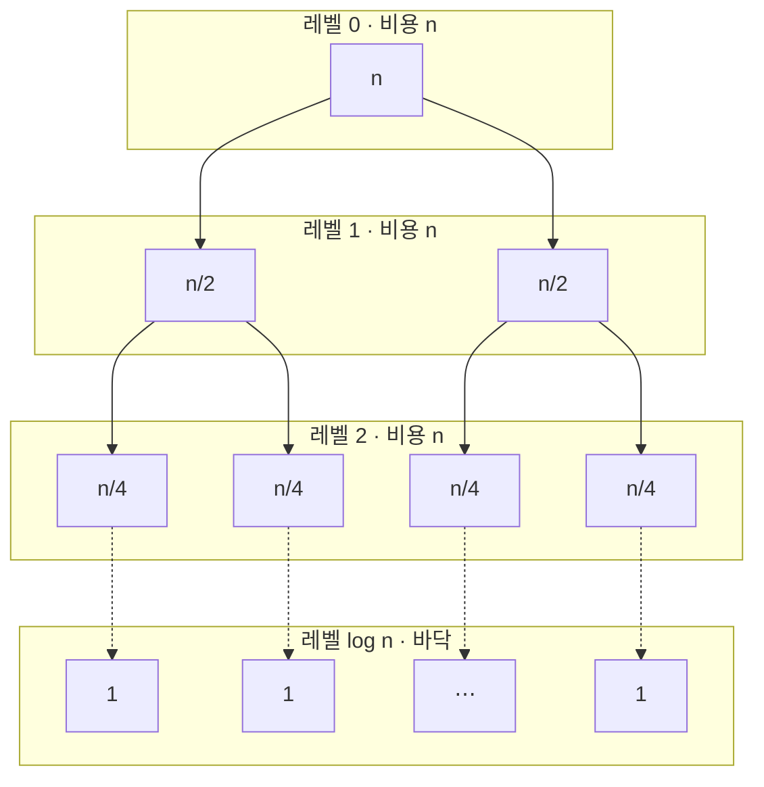
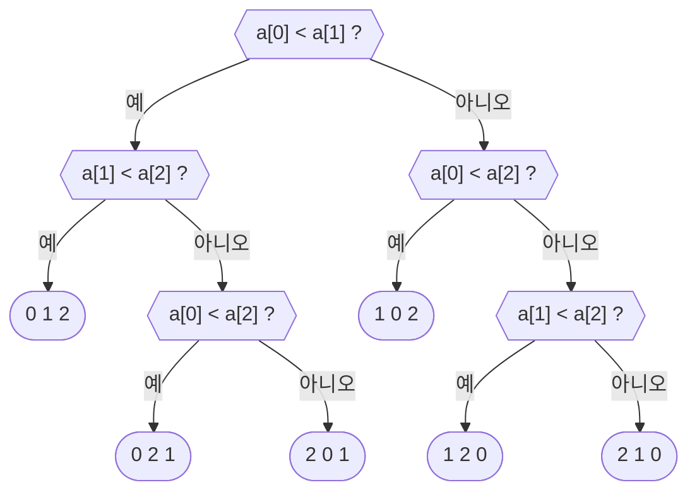

import Slide from 'stack-site-builder/components/Slide.astro';
import MergeDemo from '@components/MergeDemo.astro';
import CountingDemo from '@components/CountingDemo.astro';
import MergeTrace from '@components/MergeTrace.astro';
import ParallelMergeDemo from '@components/ParallelMergeDemo.astro';

{/* 슬라이드 작성 규칙은 docs/writing-rules.md의 "슬라이드 규칙"을 따릅니다.
    예제마다 데모 → 절차 → 코드 → 분석 순서로 갑니다. 코드는 algorithm-code
    저장소 파일을 옮긴 것이므로, 저장소가 바뀌면 여기도 함께 고칩니다.
    데모의 카운터는 코드 실행 결과와 같은 숫자에 도착합니다. */}

<Slide class="cover">

# 분할 정복과 머지 정렬

주제 03

*고급알고리즘*

</Slide>

<Slide>

## 지난 주제의 벽
::sub[네 정렬 모두 최악이 O(n²)이었습니다]

| 정렬 | 최악 | 정렬 | 최악 |
| --- | --- | --- | --- |
| 선택 정렬 | $$O(n^2)$$ | 셸 정렬 | $$O(n^2)$$ |
| 삽입 정렬 | $$O(n^2)$$ | 버블 정렬 | $$O(n^2)$$ |

<br/>

이번 주제는 이 벽을 **두 번** 넘습니다.

- 한 번은 **문제를 나눠서**
- 또 한 번은 **아예 비교하지 않아서**

</Slide>

<Slide>

## 나누면 왜 빨라지는가
::sub[도미노 천 개를 세운다면]

- **혼자**: 한참 걸립니다.
- **열 명이 백 개씩**: 금방 끝납니다.

<br/>

조별 과제도 같습니다.

- 회사 조사, 인터뷰, 발표 준비를 나눠 맡습니다.
- 마지막에 합칩니다.

</Slide>

<Slide>

#### 여기까지는 놀랍지 않다
::sub[주제 01에서 이미 본 이야기입니다]

- 사람이 열 배니 빨라지는 것은 **병렬**입니다.
- 주제 01의 병렬 덧셈이 이것이었습니다.
  - 숫자 열여섯 개, 첫 단계의 덧셈 여덟 개를 한꺼번에 시켰습니다.

<br/>

이 주제의 놀라움은 다른 데 있습니다.

</Slide>

<Slide class="center">

### 혼자 해도 빨라집니다
### 일꾼이 늘어서가 아니라 **일 자체가 줄어서**입니다

</Slide>

<Slide>

### 분할 정복
::sub[divide and conquer · 세 단계]

- **분할(divide)**
  - 문제를 같은 꼴의 작은 문제로 나눕니다.
- **정복(conquer)**
  - 작은 문제를 풉니다.
  - 충분히 작으면 그냥 풀고, 아니면 또 나눕니다.
- **결합(combine)**
  - 작은 답들을 합쳐 전체 답을 만듭니다.

</Slide>

<Slide>

#### 사실 처음이 아니다
::sub[주제 01의 이진 검색이 분할 정복이었습니다]

- **분할**: 가운데를 기준으로 반으로 나눕니다.
- **정복**: 답이 있을 수 있는 **한쪽만** 팝니다.
- **결합**: 할 것이 없습니다.

<br/>

이번에는 **양쪽을 다** 정복하고, 결합도 해야 하는 경우입니다.

</Slide>

<Slide>

#### 어떻게 나눌 것인가
::sub[1부터 100까지 100개를 두 명이 나눠 정렬한다면]

<div class="aas-split">
<div>

- **값으로 나누기**
  - 50 이하 / 51 이상
  - 각자 정렬하면 **이어 붙이면 끝**
  - 결합이 공짜
  - 대신 나눌 때 전부 분류해야

</div>
<div>

- **위치로 나누기**
  - 앞 50개 / 뒤 50개
  - 반으로 자르면 끝
  - 나누기가 공짜
  - 대신 **섞어 합치는 일**이 남음

</div>
</div>

</Slide>

<Slide class="center">

### 나누기가 쉬우면 결합이 어렵고
### 결합이 쉬우면 나누기가 어렵습니다

병합 정렬은 **위치로**, 다음 주제의 퀵 정렬은 **값으로** 나눕니다.

</Slide>

<Slide>

#### 참고: 곱셈도 나눌 수 있다
::sub[카라추바(Karatsuba) · 큰 곱셈을 작은 곱셈으로]

$$
1234 \times 5678 = (12 \cdot 100 + 34)(56 \cdot 100 + 78)
$$

$$
= a \cdot 10^4 + b \cdot 10^2 + c
$$

<br/>

- $$a = 12 \times 56$$
- $$b = 12 \times 78 + 34 \times 56$$
- $$c = 34 \times 78$$

<br/>

그대로 계산하면 두 자리 곱셈이 **4번** 필요합니다.

</Slide>

<Slide>

#### 곱셈 4번을 3번으로
::sub[b를 a와 c로 바꿔치기합니다]

$$
b = (12 + 34)(56 + 78) - a - c
$$

- $$a$$와 $$c$$는 어차피 구하는 값입니다.
- 새 곱셈은 $$(12+34)(56+78) = 46 \times 134$$ **하나**뿐입니다.

<br/>

- 재귀로 반복하면 $$O(n^2)$$이 $$O(n^{\log_2 3}) \approx O(n^{1.585})$$가 됩니다.
- 검산: $$672 \cdot 10^4 + 2840 \cdot 10^2 + 2652 = 7{,}006{,}652$$

</Slide>

<Slide class="center">

## 예제 1. 병합 정렬
::sub[반으로 나눠 각각 정렬하고, 정렬된 두 절반을 합친다]

</Slide>

<Slide>

### 엔진은 병합이다
::sub[앞 절반과 뒤 절반은 각각 정렬되어 있습니다. **한 걸음**을 눌러 보세요]

<MergeDemo slide mode="merge" />

</Slide>

<Slide>

#### 비교 9번이면 충분하다
::sub[정렬되어 있다는 사실이 비교를 아껴 줍니다]

- 두 묶음의 **맨 앞끼리** 비교해서 작은 쪽을 꺼냅니다.
- 각 묶음에서 맨 앞만 보면 됩니다.
- 한쪽이 바닥나면 남은 쪽은 비교 없이 부어 넣습니다.

<br/>

원소 10개를 합치는 데 비교 9회, 이동 20회였습니다.  
temp로 열 번, 제자리로 열 번입니다.

</Slide>

<Slide>

### 전체 정렬
::sub[그 병합을 재귀에 태웁니다. `ms(0, 9)` 칩이 지금의 호출입니다]

<MergeDemo slide mode="sort" />

</Slide>

<Slide>

#### 한눈에 펼치면
::sub[분할·병합 트리 · 위가 나누기, 아래가 합치기, 가운데가 재귀의 바닥]

<MergeTrace slide />

</Slide>

<Slide>

#### 병합은 동시에 할 수 있다
::sub[같은 레벨의 병합은 구간이 겹치지 않습니다 · 주제 01의 병렬 덧셈과 같은 그림]

<ParallelMergeDemo slide />

</Slide>

<Slide>

#### 일은 같고, 단계가 줄어든다
::sub[분할 정복의 두 번째 선물]

- 병합은 아홉 번 그대로입니다.
- 혼자면 **9단계**, 레벨마다 동시에 하면 **4단계**(레벨 수)입니다.
- 나누면 일이 줄고(비교 22회), 나눈 조각은 **동시에 돌릴 수도** 있습니다.

<br/>

다만 마지막 병합은 혼자 원소 전체를 다룹니다.  
코어가 아무리 많아도 이 단계가 벽시계 시간의 바닥을 정합니다.

</Slide>

<Slide>

#### 절차로 적으면
::sub[원소 하나는 이미 정렬. 거기가 재귀의 바닥입니다]

```plaintext
ALGORITHM MergeSort(A, lo, hi)
    if lo >= hi then return          // 원소 하나면 이미 정렬
    mid <- (lo + hi) / 2
    MergeSort(A, lo, mid)            // 왼쪽 절반
    MergeSort(A, mid+1, hi)          // 오른쪽 절반
    Merge(A, lo, mid, hi)            // 정렬된 두 절반을 합친다
```

주제 01의 피보나치처럼 **자기 자신을 부르는 정의**입니다.  
다른 점: 왼쪽과 오른쪽은 겹치지 않아, 같은 값을 두 번 계산하지 않습니다.

</Slide>

<Slide class="compact">

#### 코드로 옮기면 1. merge
::sub[`01_merge_sort/` · `<=`라서 같은 값이면 왼쪽이 먼저: 안정]

<div class="aas-split">
<div>

- `mergeSort.c`

```c
static void merge(int a[], int lo, int mid,
                  int hi, int temp[],
                  int *comparisons, int *moves) {
    int i = lo;
    int j = mid + 1;
    int k = lo;
    while (i <= mid && j <= hi) {
        (*comparisons)++;
        if (a[i] <= a[j]) {
            temp[k++] = a[i++];
        } else {
            temp[k++] = a[j++];
        }
        (*moves)++;
    }
    while (i <= mid) {
        temp[k++] = a[i++];
        (*moves)++;
    }
    while (j <= hi) {
        temp[k++] = a[j++];
        (*moves)++;
    }
    for (k = lo; k <= hi; k++) {
        a[k] = temp[k];
        (*moves)++;
    }
}
```

</div>
<div>

- `merge_sort.py`

```python
def _merge(a, lo, mid, hi, temp, counts):
    i, j, k = lo, mid + 1, lo
    while i <= mid and j <= hi:
        counts[0] += 1
        if a[i] <= a[j]:
            temp[k] = a[i]
            i += 1
        else:
            temp[k] = a[j]
            j += 1
        counts[1] += 1
        k += 1
    while i <= mid:
        temp[k] = a[i]
        i += 1; k += 1
        counts[1] += 1
    while j <= hi:
        temp[k] = a[j]
        j += 1; k += 1
        counts[1] += 1
    for k in range(lo, hi + 1):
        a[k] = temp[k]
        counts[1] += 1
```

</div>
</div>

</Slide>

<Slide class="compact">

#### 코드로 옮기면 2. mergeSort
::sub[`01_merge_sort/` · 재귀는 절차를 그대로 옮긴 것입니다]

<div class="aas-split">
<div>

- `mergeSort.c`

```c
void mergeSort(int a[], int lo, int hi,
               int temp[],
               int *comparisons, int *moves) {
    if (lo >= hi) {
        return;
    }
    int mid = lo + (hi - lo) / 2;
    mergeSort(a, lo, mid,
              temp, comparisons, moves);
    mergeSort(a, mid + 1, hi,
              temp, comparisons, moves);
    merge(a, lo, mid, hi,
          temp, comparisons, moves);
}
```

</div>
<div>

- 실행 결과

```console
before: 2 8 5 9 1 10 7 6 4 3
after : 1 2 3 4 5 6 7 8 9 10
comparisons = 22, moves = 68
```

데모의 카운터가 도착한 숫자와 같습니다.

</div>
</div>

</Slide>

<Slide>

#### 왜 n log n인가
::sub[어느 레벨이든 병합되는 원소의 합은 n입니다]



- 반씩 나누므로 레벨은 $$\log_2 n$$개입니다.
- 레벨마다 비용이 $$n$$이니 전체는 $$O(n \log n)$$입니다.

</Slide>

<Slide>

#### 입력을 바꾸면
::sub[최선도 평균도 최악도 O(n log n)입니다]

| 입력 | 비교 횟수 | 이동 횟수 |
| --- | --- | --- |
| 예제 배열 | $$22$$ | $$68$$ |
| 이미 정렬됨 | $$19$$ | $$68$$ |
| 역순 | $$15$$ | $$68$$ |

<br/>

- **이동은 언제나 68회입니다.** 병합마다 구간 전체가 temp를 왕복합니다.
- **역순이 정렬됨보다 비교가 적습니다.** 한쪽이 일찍 바닥나서,
  남은 쪽을 비교 없이 부어 넣기 때문입니다.

</Slide>

<Slide>

#### 내주는 것
::sub[공짜는 아닙니다]

- **공간 $$O(n)$$**
  - 임시 배열 temp가 필요합니다.
  - 주제 02의 네 정렬은 모두 $$O(1)$$이었습니다.
- **안정 정렬**
  - `merge`의 `<=` 덕에 같은 값이면 왼쪽이 먼저 나옵니다.
  - `<`로 바꾸면 정답은 그대로지만 안정성이 깨집니다.

</Slide>

<Slide>

#### 다섯 정렬을 나란히
::sub[같은 배열 `2 8 5 9 1 10 7 6 4 3`에서]

| 정렬 | 비교 | 이동 | 최악 |
| --- | --- | --- | --- |
| 선택 정렬 | 45 | 21 | $$O(n^2)$$ |
| 삽입 정렬 | 33 | 43 | $$O(n^2)$$ |
| 셸 정렬 | 30 | 57 | $$O(n^2)$$ |
| 버블 정렬 | 45 | 75 | $$O(n^2)$$ |
| **병합 정렬** | **22** | 68 | $$O(n \log n)$$ |

</Slide>

<Slide>

#### 차이는 n이 커질 때
::sub[n = 10억이면]

- $$n^2 = 10^{18}$$
- $$n \log_2 n \approx 3 \times 10^{10}$$

<br/>

**3천만 배** 차이입니다.

- 주제 02의 표에서 삽입 정렬이 317년, 병합 정렬이 18분이던 이유입니다.
- 컴퓨터를 바꾸는 것으로는 이 차이를 못 넘습니다.

</Slide>

<Slide class="compact">

#### 지금 해 볼 것
::sub[예제 1. 병합 정렬]

[lec-algorithm/algorithm-code](https://github.com/lec-algorithm/algorithm-code/tree/main) · `src/topic-03-divide-conquer/`  
파일을 열고 편집기 오른쪽 위 **▶ 버튼**을 누르면 실행됩니다.

1. **정렬된 배열과 역순 배열을 넣어 봅니다.**
   - 비교는 19회와 15회로 달라집니다.
   - 이동은 늘 68회입니다. 왜 그런지 코드에서 찾아봅니다.
2. **`merge`의 `<=`를 `<`로 바꿔 봅니다.**
   - 정답은 그대로지만 안정성이 깨집니다.
3. **배열을 20개로 늘려 봅니다.**
   - 레벨이 하나 늘어나는 것을 비교 횟수로 확인합니다.

</Slide>

<Slide class="center">

## 비교로는 여기까지
::sub[병합 정렬보다 빠른 비교 정렬을 만들 수 있을까요]

</Slide>

<Slide>

### 결정 트리
::sub[정렬이 하는 비교를 나무로 그립니다 · n = 3]



- 마디마다 비교 하나, 가지는 그 결과입니다.
- 잎은 정렬 결과(순열)입니다. $$3! = 6$$가지가 다 있습니다.

</Slide>

<Slide>

#### 잎은 n!개, 높이는 비교 횟수
::sub[세 줄짜리 증명입니다]

1. 잎이 **적어도 $$n!$$개** 있어야 합니다.
   - 순열 하나라도 빠지면 그 입력에서 틀립니다.
2. 높이 $$h$$인 이진 트리의 잎은 **많아야 $$2^h$$개**입니다.
3. 그러므로 $$2^h \geq n!$$, 즉 $$h \geq \log_2(n!)$$입니다.

<br/>

$$h$$는 **최악의 경우 비교 횟수**입니다.

</Slide>

<Slide>

#### 하한: Ω(n log n)
::sub[스털링 근사로 마무리합니다]

$$
\log_2(n!) \approx n \log_2 n
$$

- **어떤 비교 정렬도 최악의 경우 $$\Omega(n \log n)$$번 비교해야 합니다.**
- 병합 정렬은 이 하한에 차수가 닿아 있습니다.
  - 그 이상 좋아질 수 없는 정렬입니다.

</Slide>

<Slide>

#### 숫자로 재 보면
::sub[n = 10]

- $$\lceil \log_2 10! \rceil = 22$$
- 원소 10개를 비교로 정렬하려면 최악의 경우 **22번**은 비교해야 합니다.
- 우리 병합 정렬이 예제 배열에서 쓴 비교가 마침 **22회**였습니다.

</Slide>

<Slide class="center">

### 이 증명에는 조건이 붙어 있습니다
### **"비교로 정렬하는 한"**

비교하지 않고 정렬할 수 있다면 어떻게 될까요.

</Slide>

<Slide class="center">

## 예제 2. 카운팅 정렬
::sub[값마다 몇 개 있는지 세면, 자리를 계산할 수 있다]

</Slide>

<Slide>

### 카운팅 정렬
::sub[비교 카운터가 끝까지 0에 머뭅니다. **한 걸음**을 눌러 보세요]

<CountingDemo slide />

</Slide>

<Slide>

#### 절차로 적으면
::sub[세고, 누적하고, 뒤에서부터 놓습니다]

```plaintext
ALGORITHM CountingSort(A, n, k)
    // 1) 세기: 값마다 몇 개 있는지
    for v <- 0 to k do count[v] <- 0
    for i <- 0 to n-1 do
        count[A[i]] <- count[A[i]] + 1

    // 2) 누적: 값 v가 끝나는 위치(개수 합)
    for v <- 1 to k do
        count[v] <- count[v] + count[v-1]

    // 3) 배치: 뒤에서부터 읽어 제자리에 놓는다
    for i <- n-1 downto 0 do
        count[A[i]] <- count[A[i]] - 1
        B[count[A[i]]] <- A[i]
```

</Slide>

<Slide class="compact">

#### 코드로 옮기면
::sub[`02_counting_sort/` · 값이 0 이상 k 이하의 정수일 때만]

<div class="aas-split">
<div>

- `countingSort.c`

```c
void countingSort(const int a[], int b[],
                  int n, int count[],
                  int *moves) {
    for (int v = 0; v <= MAX_KEY; v++) {
        count[v] = 0;
    }
    for (int i = 0; i < n; i++) {
        count[a[i]]++;
    }
    for (int v = 1; v <= MAX_KEY; v++) {
        count[v] += count[v - 1];
    }
    for (int i = n - 1; i >= 0; i--) {
        count[a[i]]--;
        b[count[a[i]]] = a[i];
        (*moves)++;
    }
}
```

</div>
<div>

- 실행 결과

```console
before: 1 0 1 5 4 3 1 4 5 2 1
after : 0 1 1 1 1 2 3 4 4 5 5
comparisons = 0, moves = 11
```

**비교 0회.**  
원소 11개가 11번의 이동만으로
제자리를 찾았습니다.

</div>
</div>

</Slide>

<Slide>

### 왜 뒤에서부터인가
::sub[같은 값에 이름표를 붙이면 보입니다. 가나다 순서가 유지됩니다]

<CountingDemo
  slide
  values={[2, 1, 2, 0, 1]}
  maxKey={2}
  labels={['가', '나', '다', '라', '마']}
/>

</Slide>

<Slide>

#### 안정성이 지켜지는 이유
::sub[누적 배열은 "그 값의 마지막 자리"를 압니다]

- 누적값은 값 $$v$$ 구간의 **끝 위치**입니다.
- 뒤에서부터 읽으면 같은 값 중 **뒤의 것이 뒤 자리**를 받습니다.
  - 원래 순서가 유지됩니다. **안정 정렬**입니다.
- 앞에서부터 읽도록 바꾸면 정렬은 되지만 순서가 뒤집힙니다.
  - 실습 코드의 **바꿔 보기**가 이것을 안내합니다.

</Slide>

<Slide>

#### 분석
::sub[하한을 어긴 것이 아니라, 하한의 전제 밖에 있습니다]

- 세기 $$O(n)$$, 누적 $$O(k)$$, 배치 $$O(n)$$ → 전체 $$O(n + k)$$
- $$k$$가 $$n$$과 비슷하면 사실상 $$O(n)$$입니다.
- $$\Omega(n \log n)$$은 **비교 정렬**의 하한입니다.
  - 비교를 하지 않으니 결정 트리 논증이 적용되지 않습니다.

</Slide>

<Slide>

#### 내주는 것
::sub[공짜는 아닙니다]

- **키가 좁은 범위의 정수여야 합니다.**
  - 실수, 문자열, 범위를 모르는 값에는 못 씁니다.
  - 비교 정렬은 비교만 되면 무엇이든 정렬합니다.
- **공간 $$O(n + k)$$**
  - `MAX_KEY`를 백만으로 올리면, 원소 11개에 백만 칸이 생깁니다.

<br/>

점수(0\~100), 나이, 월(1\~12)처럼 **좁고 촘촘한 정수 키**가
카운팅 정렬의 자리입니다.

</Slide>

<Slide class="compact">

#### 지금 해 볼 것
::sub[예제 2. 카운팅 정렬]

[lec-algorithm/algorithm-code](https://github.com/lec-algorithm/algorithm-code/tree/main) · `src/topic-03-divide-conquer/`  
파일을 열고 편집기 오른쪽 위 **▶ 버튼**을 누르면 실행됩니다.

1. **3단계를 앞에서부터 읽도록 바꿔 봅니다.**
   - 정렬 결과는 같지만 같은 값의 순서가 뒤집힙니다.
2. **`MAX_KEY`를 1000000으로 올려 봅니다.**
   - 원소 11개에 백만 칸이 생깁니다.
   - $$O(n + k)$$의 $$k$$가 무엇인지 보입니다.
3. **값에 음수를 넣어 봅니다.**
   - 어디서 어떻게 깨지는지 관찰합니다.

</Slide>

<Slide>

### 여섯 정렬을 나란히
::sub[무엇을 내주고 무엇을 얻는가]

| 정렬 | 최선 | 평균 | 최악 | 공간 | 안정성 | 구분 |
| --- | --- | --- | --- | --- | --- | --- |
| 선택 | $$O(n^2)$$ | $$O(n^2)$$ | $$O(n^2)$$ | $$O(1)$$ | 불안정 | 비교 |
| 삽입 | $$O(n)$$ | $$O(n^2)$$ | $$O(n^2)$$ | $$O(1)$$ | 안정 | 비교 |
| 셸 | $$O(n \log n)$$ | $$O(n^{1.5})$$ | $$O(n^2)$$ | $$O(1)$$ | 불안정 | 비교 |
| 버블 | $$O(n^2)$$ | $$O(n^2)$$ | $$O(n^2)$$ | $$O(1)$$ | 안정 | 비교 |
| 병합 | $$O(n \log n)$$ | $$O(n \log n)$$ | $$O(n \log n)$$ | $$O(n)$$ | 안정 | 비교 |
| 카운팅 | $$O(n+k)$$ | $$O(n+k)$$ | $$O(n+k)$$ | $$O(n+k)$$ | 안정 | 비-비교 |

<br/>

병합은 시간의 벽을 넘는 대신 **공간**을, 카운팅은 비교를 버리는 대신
**키의 종류**를 내주었습니다.

</Slide>

<Slide>

## 남길 것

1. **분할 정복은 일 자체를 줄입니다.**
   - 나누고, 풀고, 합칩니다. 혼자 해도 빨라집니다.
   - 나눈 조각은 겹치지 않아 동시에 돌릴 수도 있습니다.
2. **나누기와 결합은 시소입니다.**
   - 병합 정렬은 나누기가 공짜, 퀵 정렬은 결합이 공짜입니다.
3. **병합 정렬: 레벨마다 n, 레벨 수 log n.**
   - 최선·평균·최악이 같고 안정적입니다. 공간 $$O(n)$$을 내줍니다.
4. **비교 정렬의 하한은 $$\Omega(n \log n)$$입니다.**
   - 결정 트리의 잎이 $$n!$$개는 있어야 하기 때문입니다.
5. **카운팅 정렬은 하한의 전제 밖에 있습니다.**
   - 좁은 범위의 정수 키라면 비교 없이 $$O(n + k)$$입니다.

</Slide>
