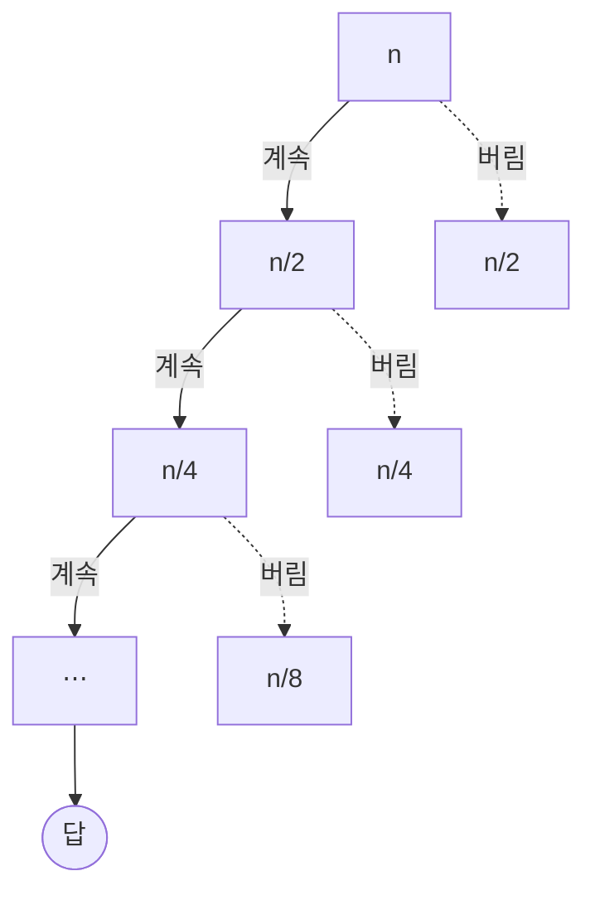

import Slide from 'stack-site-builder/components/Slide.astro';
import QuickDemo from '@components/QuickDemo.astro';
import ParallelQuickDemo from '@components/ParallelQuickDemo.astro';

{/* 슬라이드 작성 규칙은 docs/writing-rules.md의 "슬라이드 규칙"을 따릅니다.
    예제마다 데모 → 절차 → 코드 → 분석 순서로 갑니다. 코드는 algorithm-code
    저장소 파일을 옮긴 것이므로, 저장소가 바뀌면 여기도 함께 고칩니다.
    데모의 카운터는 코드 실행 결과와 같은 숫자에 도착합니다. */}

<Slide class="cover">

# 랜덤과 퀵 정렬

주제 04

*고급알고리즘*

</Slide>

<Slide>

## 시소의 반대편
::sub[주제 03에서 나누기와 결합은 시소라고 했습니다]

<div class="aas-split">
<div>

- **병합 정렬**
  - 나누기: 반으로 자르면 끝. 공짜
  - 결합: 병합. 여기서 일합니다.

</div>
<div>

- **이번 주제의 정렬**
  - 나누기: **값으로** 가릅니다. 여기서 일합니다.
  - 결합: 이어 붙이면 끝. 공짜

</div>
</div>

<br/>

그 나누기를 지키는 재료로 **랜덤**이 등장합니다.

</Slide>

<Slide>

## 재료: 랜덤
::sub[컴퓨터의 랜덤은 어디서 오는가]

- `rand()`가 만드는 것은 **유사난수**(pseudorandom)입니다.
- 시드(seed)라는 입력을 받아 **함수를 돌린 출력**입니다.
- 함수이므로 **입력이 같으면 출력이 같습니다.**

<br/>


</Slide>

<Slide class="compact">

#### 같은 시드, 같은 수열
::sub[`01_random/` · 라이브러리 대신 같은 종류의 생성기(minstd)를 직접 만듭니다]

<div class="aas-split">
<div>

- `randomProgram.c`

```c
static int64_t state = 1;

/* srand처럼 시드를 바꾼다. */
void setSeed(int64_t seed) {
    state = seed;
}

/* rand처럼 다음 수를 만든다. */
int64_t nextRandom(void) {
    state = state * 16807
          % 2147483647;
    return state;
}
```

</div>
<div>

- 실행 결과

```console
seed = 1 : 16807 282475249 1622650073
seed = 1 : 16807 282475249 1622650073
seed = 2 : 33614 564950498 1097816499
```

- 시드 1을 두 번: **완전히 같은 수열**
- 바뀌는 것은 시드를 바꿀 때뿐입니다.
- 실전 관용구: `srand(time(NULL))`

</div>
</div>

</Slide>

<Slide>

#### 랜덤이 필요한 곳
::sub[유튜브 영상 ID는 왜 순차 번호가 아닐까요]

- 매초 수많은 영상이 **여러 서버, 여러 데이터베이스**(샤딩)에 올라옵니다.
- ID는 절대 겹치면 안 됩니다.
- 순차 번호는 서버끼리 조율을 요구합니다. 쓸 수 없습니다.
- 그래서 **랜덤에 기반한 ID**를 씁니다.
  - 다음 번호를 예측할 수 없다는 성질도 덤입니다.

</Slide>

<Slide class="center">

### 이 주제에서 랜덤이 맡는 일은
### **피벗을 고르는 일**입니다

왜 그 일에 랜덤이 필요한지는 최악을 본 뒤에 돌아옵니다.

</Slide>

<Slide class="center">

## 예제 1. 퀵 정렬
::sub[피벗을 제자리에 놓고, 양쪽을 각각 정렬한다]

</Slide>

<Slide>

### 엔진은 파티션이다
::sub[피벗(파랑)보다 작은 것이 청록 구간으로 모입니다. **한 걸음**을 눌러 보세요]

<QuickDemo slide mode="partition" />

</Slide>

<Slide>

#### 피벗의 자리는 확정된다
::sub[파티션 한 번의 결과]

- 비교 9회로 **자리 하나가 확정**됐습니다.
- 왼쪽은 피벗보다 작은 것들, 오른쪽은 나머지입니다.
- 양쪽을 각각 정렬하면 끝입니다. 결합은 필요 없습니다.

<br/>

이번 피벗 `2`는 거의 최솟값이라 왼쪽에 `1` 하나만 남았습니다.  
좋은 피벗과 나쁜 피벗의 이야기가 여기서 이미 시작됩니다.

</Slide>

<Slide>

### 전체 정렬
::sub[그 파티션을 재귀에 태웁니다. `qs(0, 9)` 칩이 지금의 호출입니다]

<QuickDemo slide mode="sort" />

</Slide>

<Slide>

#### 절차로 적으면
::sub[병합과 뼈대가 같은 재귀. 일하는 자리가 다릅니다]

```plaintext
ALGORITHM QuickSort(A, lo, hi)
    if lo >= hi then return          // 원소 하나면 이미 정렬
    p <- Partition(A, lo, hi)        // 피벗을 제자리에 놓는다
    QuickSort(A, lo, p-1)            // 피벗 왼쪽
    QuickSort(A, p+1, hi)            // 피벗 오른쪽
```

- 병합은 **재귀에서 돌아온 뒤**(결합)에 일했습니다.
- 퀵은 **재귀에 들어가기 전**(분할)에 일합니다.

</Slide>

<Slide class="compact">

#### 코드로 옮기면
::sub[`02_quick_sort/` · 파티션이 전부입니다]

<div class="aas-split">
<div>

- `quickSort.c`

```c
static int partition(int a[], int lo, int hi,
                     int *comparisons, int *moves) {
    int pivot = a[lo];
    int i = lo;
    for (int j = lo + 1; j <= hi; j++) {
        (*comparisons)++;
        if (a[j] < pivot) {
            i++;
            swap(a, i, j, moves);
        }
    }
    swap(a, lo, i, moves);
    return i;
}

void quickSort(int a[], int lo, int hi,
               int *comparisons, int *moves) {
    if (lo >= hi) {
        return;
    }
    int p = partition(a, lo, hi,
                      comparisons, moves);
    quickSort(a, lo, p - 1,
              comparisons, moves);
    quickSort(a, p + 1, hi,
              comparisons, moves);
}
```

</div>
<div>

- `quick_sort.py`

```python
def _partition(a, lo, hi, counts):
    pivot = a[lo]
    i = lo
    for j in range(lo + 1, hi + 1):
        counts[0] += 1
        if a[j] < pivot:
            i += 1
            _swap(a, i, j, counts)
    _swap(a, lo, i, counts)
    return i


def quick_sort(a, lo=None, hi=None,
               counts=None):
    if lo is None:
        lo, hi = 0, len(a) - 1
        counts = [0, 0]
    if lo >= hi:
        return tuple(counts)
    p = _partition(a, lo, hi, counts)
    quick_sort(a, lo, p - 1, counts)
    quick_sort(a, p + 1, hi, counts)
    return tuple(counts)
```

</div>
</div>

</Slide>

<Slide>

#### 좋은 피벗이면 반씩
::sub[병합 정렬과 같은 레벨 그림이 됩니다]

- 피벗이 가운데쯤 떨어지면 배열이 반씩 나뉩니다.
- 레벨마다 파티션 비용의 합이 $$n$$, 레벨은 $$\log n$$개.
- 그래서 **평균 $$O(n \log n)$$입니다.**

- 실행

```console
before: 2 8 5 9 1 10 7 6 4 3
after : 1 2 3 4 5 6 7 8 9 10
comparisons = 25, moves = 21
```

</Slide>

<Slide>

#### 최선: 피벗이 늘 한가운데
::sub[일부러 짠 배열입니다. 트리가 완전한 균형이 됩니다]

<QuickDemo slide mode="sort" values={[5, 1, 3, 4, 2, 8, 7, 6, 9, 10]} />

</Slide>

<Slide>

#### 최악: 이미 정렬된 입력
::sub[피벗이 매번 최솟값. 왼쪽이 늘 비고 트리가 외길이 됩니다]

<QuickDemo slide mode="sort" values={[1, 2, 3, 4, 5, 6, 7, 8, 9, 10]} />

</Slide>

<Slide>

#### 입력을 바꾸면
::sub[최선 19회는 이 크기의 최소, 최악 45회는 n(n-1)/2]

| 입력 | 비교 횟수 | 이동 횟수 |
| --- | --- | --- |
| 최선을 만드는 배열 | $$19$$ | $$9$$ |
| 예제 배열 (평균쯤) | $$25$$ | $$21$$ |
| 이미 정렬됨 (최악) | $$45$$ | $$0$$ |
| 역순 | $$45$$ | $$15$$ |

<br/>

- 정렬된 입력: 첫 원소 피벗이 **매번 최솟값**이 됩니다.
- 왼쪽은 비고 오른쪽만 하나 줄어듭니다.
- 레벨이 $$n$$개가 되어 $$\frac{n(n-1)}{2} = 45$$회, 즉 $$O(n^2)$$입니다.

</Slide>

<Slide class="center">

### 정렬된 입력이 퀵의 최악입니다
### 삽입 정렬(최선 9회)과 **정반대**입니다

어떤 입력이 좋은 입력인지도 알고리즘마다 다릅니다.

</Slide>

<Slide>

#### 피벗을 어떻게 고르나
::sub[최악을 피하는 열쇠]

- **옵션 1. 랜덤**
  - 파티션마다 피벗을 무작위로 고릅니다.
  - 어떤 입력이 와도 **기대 $$O(n \log n)$$**
  - 최악이 "특정 입력"에서 "입력과 난수의 조합"으로 바뀝니다.
  - 앞에서 준비한 랜덤이 여기에 쓰입니다.
- **옵션 2. 셋 중 가운데 (median-of-3)**
  - 앞·가운데·뒤 셋 중 중앙값을 피벗으로 삼습니다.
  - 정렬된 입력의 함정을 값싸게 피합니다.

</Slide>

<Slide>

#### 평균 · 중앙값 · 최빈값
::sub[중앙값이 나온 김에 구분해 둡니다]

| 이름 | 뜻 |
| --- | --- |
| 평균값 (mean) | 다 더해서 개수로 나눈 값 |
| 중앙값 (median) | 줄 세웠을 때 가운데 값 |
| 최빈값 (mode) | 가장 자주 나오는 값 |

<br/>

피벗으로 이상적인 것은 **중앙값**입니다.  
배열을 정확히 반으로 가르기 때문입니다.

</Slide>

<Slide>

#### 병합과 나란히
::sub[같은 배열에서 서로가 내준 것]

| | 비교 | 이동 | 추가 공간 | 최악 | 안정성 |
| --- | --- | --- | --- | --- | --- |
| 병합 정렬 | 22 | 68 | temp $$O(n)$$ | $$O(n \log n)$$ | 안정 |
| 퀵 정렬 | 25 | 21 | 스택 $$O(\log n)$$ | $$O(n^2)$$ | 불안정 |

<br/>

- 퀵은 비교 셋을 더 쓰는 대신 **이동이 3분의 1**, temp가 없습니다.
- 내준 것: 최악 $$O(n^2)$$의 위험, 그리고 안정성.
- 실전 라이브러리들이 퀵 계열을 즐겨 쓰는 이유가 이 표에 있습니다.

</Slide>

<Slide>

#### 파티션도 동시에 할 수 있다
::sub[같은 레벨의 파티션은 구간이 겹치지 않습니다 · 병합의 병렬과 방향만 반대]

<ParallelQuickDemo slide />

</Slide>

<Slide>

#### 일은 같고, 단계가 줄어든다
::sub[그리고 벽시계의 바닥은 반대편에 있습니다]

- 파티션은 여섯 번 그대로, 단계는 **6에서 3**(트리 깊이)이 됩니다.
- 병합은 아래에서 위로: **마지막 병합**이 혼자 전체를 다룹니다.
- 퀵은 위에서 아래로: **첫 파티션**이 혼자 전체를 다룹니다.

<br/>

트리가 외길이 되면(정렬된 입력) 레벨마다 파티션이 하나뿐이라  
**병렬 이득도 0**입니다. 좋은 피벗은 병렬로 돌릴 자리도 만듭니다.

</Slide>

<Slide class="compact">

#### 지금 해 볼 것
::sub[예제 1. 퀵 정렬]

[lec-algorithm/algorithm-code](https://github.com/lec-algorithm/algorithm-code/tree/main) · `src/topic-04-quick-sort/`  
파일을 열고 편집기 오른쪽 위 **▶ 버튼**을 누르면 실행됩니다.

1. **이미 정렬된 `1 2 … 10`을 넣어 봅니다.**
   - 비교가 45회로 뜁니다. 최악의 모양을 봅니다.
2. **피벗을 `01_random`의 난수로 고르게 바꿔 봅니다.**
   - 정렬된 입력의 함정이 사라집니다.
3. **시드를 `time(NULL)`로 바꿔 봅니다.**
   - 돌릴 때마다 다른 수열이 나옵니다.

</Slide>

<Slide class="center">

## 예제 2. 퀵 선택
::sub[다 정렬하지 않고 k번째로 작은 값을 찾는다]

</Slide>

<Slide>

### 퀵 선택
::sub[답이 없는 쪽은 통째로 버립니다. 버린 쪽은 흐려진 채 남습니다]

<QuickDemo slide mode="select" k={5} />

</Slide>

<Slide>

#### 절차로 적으면
::sub[퀵 정렬과 같은 파티션. 다른 점은 하나뿐입니다]

```plaintext
ALGORITHM QuickSelection(A, n, k)
    lo <- 0, hi <- n-1
    loop
        p <- Partition(A, lo, hi)    // 퀵 정렬과 같은 파티션
        if p = k-1 then              // 피벗이 정확히 k번째 자리
            return A[p]
        else if p > k-1 then
            hi <- p-1                // 답은 왼쪽에. 오른쪽은 버린다
        else
            lo <- p+1                // 답은 오른쪽에. 왼쪽은 버린다
```

- 퀵 정렬은 **양쪽을 다** 팠고, 퀵 선택은 **한쪽만** 팝니다.
- 이진 검색이 절반을 버렸던 것과 같은 동작입니다.

</Slide>

<Slide class="compact">

#### 코드로 옮기면
::sub[`03_quick_selection/` · after 줄을 보세요]

<div class="aas-split">
<div>

- `quickSelection.c`

```c
int quickSelection(int a[], int n, int k,
                   int *comparisons,
                   int *moves) {
    int lo = 0;
    int hi = n - 1;
    while (1) {
        int p = partition(a, lo, hi,
                          comparisons, moves);
        if (p == k - 1) {
            return a[p];
        }
        if (p > k - 1) {
            hi = p - 1;
        } else {
            lo = p + 1;
        }
    }
}
```

</div>
<div>

- 실행 결과

```console
before: 2 8 5 9 1 10 7 6 4 3
after : 1 2 3 4 5 10 7 6 9 8
k = 5 -> value = 5
comparisons = 16, moves = 15
```

- 앞 다섯 자리만 잡혔습니다.
- 뒤는 뒤섞인 그대로입니다.
- **다 정렬하지 않고 답을 얻었습니다.**
- 다 정렬하면 25회, 선택은 16회입니다.

</div>
</div>

</Slide>

<Slide>

#### 왜 O(n)인가
::sub[버린 쪽은 다시 만지지 않습니다]



$$
n + \frac{n}{2} + \frac{n}{4} + \cdots \leq 2n
$$

</Slide>

<Slide>

#### 정렬과 선택
::sub[같은 파티션, 다른 쓰임]

| | 파는 쪽 | 평균 | n = 10에서 비교 |
| --- | --- | --- | --- |
| 퀵 정렬 | 양쪽 다 | $$O(n \log n)$$ | 25 |
| 퀵 선택 | 한쪽만 | $$O(n)$$ | 16 |

<br/>

- 최악은 여전히 $$O(n^2)$$입니다. 여기서도 랜덤 피벗이 해독제입니다.
- **"몇 번째"를 찾는 도구**이지 "값"을 찾는 도구가 아닙니다.
  - 값 찾기는 주제 01의 검색이 맡습니다.

</Slide>

<Slide class="compact">

#### 지금 해 볼 것
::sub[예제 2. 퀵 선택]

[lec-algorithm/algorithm-code](https://github.com/lec-algorithm/algorithm-code/tree/main) · `src/topic-04-quick-sort/`  
파일을 열고 편집기 오른쪽 위 **▶ 버튼**을 누르면 실행됩니다.

1. **`k`를 1과 10으로 바꿔 봅니다.**
   - 비교 9회와 20회. 어느 쪽이든 다 정렬(25회)보다 쌉니다.
2. **after 줄을 관찰합니다.**
   - k가 커질수록 얼마나 더 정렬돼 있는지 봅니다.
3. **특정 값을 찾는 데 써 보려고 하면 왜 안 되는지 생각해 봅니다.**
   - 그 일은 검색의 몫입니다.

</Slide>

<Slide>

### 일곱 정렬을 나란히
::sub[정렬 하나를 고르는 일이 곧 트레이드오프를 고르는 일입니다]

| 정렬 | 최선 | 평균 | 최악 | 공간 | 안정성 | 구분 |
| --- | --- | --- | --- | --- | --- | --- |
| 선택 | $$O(n^2)$$ | $$O(n^2)$$ | $$O(n^2)$$ | $$O(1)$$ | 불안정 | 비교 |
| 삽입 | $$O(n)$$ | $$O(n^2)$$ | $$O(n^2)$$ | $$O(1)$$ | 안정 | 비교 |
| 셸 | $$O(n \log n)$$ | $$O(n^{1.5})$$ | $$O(n^2)$$ | $$O(1)$$ | 불안정 | 비교 |
| 버블 | $$O(n^2)$$ | $$O(n^2)$$ | $$O(n^2)$$ | $$O(1)$$ | 안정 | 비교 |
| 병합 | $$O(n \log n)$$ | $$O(n \log n)$$ | $$O(n \log n)$$ | $$O(n)$$ | 안정 | 비교 |
| 카운팅 | $$O(n+k)$$ | $$O(n+k)$$ | $$O(n+k)$$ | $$O(n+k)$$ | 안정 | 비-비교 |
| 퀵 | $$O(n \log n)$$ | $$O(n \log n)$$ | $$O(n^2)$$ | $$O(\log n)$$ | 불안정 | 비교 |

</Slide>

<Slide>

## 남길 것

1. **컴퓨터의 랜덤은 유사난수입니다.**
   - 시드가 같으면 수열이 같습니다. 그래서 재현할 수 있습니다.
2. **퀵 정렬은 나누기에서 일합니다.**
   - 파티션으로 피벗의 자리를 확정하고, 결합은 공짜입니다.
   - 평균 $$O(n \log n)$$, 이동이 적고 제자리입니다.
3. **정렬된 입력이 퀵의 최악입니다.**
   - 삽입 정렬과 정반대입니다. 좋은 입력은 알고리즘마다 다릅니다.
4. **최악의 해독제가 랜덤 피벗입니다.**
   - 어떤 입력이 와도 기대 $$O(n \log n)$$이 됩니다.
   - 트리를 균형 있게 만들어 병렬로 돌릴 자리도 살립니다.
5. **퀵 선택은 한쪽만 파서 평균 $$O(n)$$입니다.**
   - 다 정렬하지 않고 k번째 값을 얻습니다.

</Slide>
