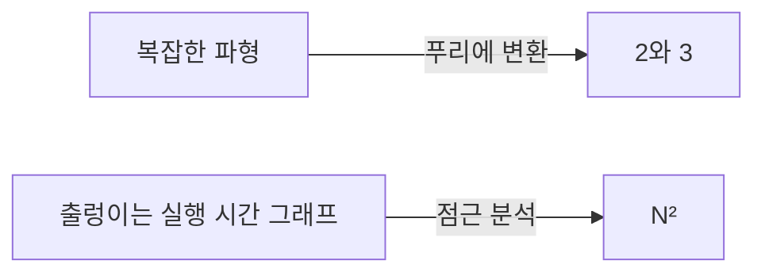

import Slide from 'stack-site-builder/components/Slide.astro';
import GrowthDemo from '@components/GrowthDemo.astro';

{/* 슬라이드 작성 규칙은 docs/writing-rules.md의 "슬라이드 규칙"을 따릅니다.
    수치는 실습 코드(threeSum)의 실행 결과와 같습니다. */}

<Slide class="cover">

# 알고리즘 성능 분석

주제 05

*고급알고리즘*

</Slide>

<Slide>

## 이미 쓰고 있던 언어
::sub[주제 01부터 04까지, 표마다 등장했습니다]

- 순차 검색 $$O(n)$$, 이진 검색 $$O(\log n)$$
- 삽입 정렬 최선 $$O(n)$$, 최악 $$O(n^2)$$
- 병합 정렬 $$O(n \log n)$$, 비교 정렬의 하한 $$\Omega(n \log n)$$
- 퀵 선택 평균 $$O(n)$$

<br/>

이번 주제는 그 **언어 자체**를 다집니다.  
어디서 왔고, 정확히 무엇을 뜻하고, 어떻게 쓰는 것이 맞는지입니다.

</Slide>

<Slide>

## 요약이라는 언어
::sub[도전: 복잡하게 출렁이는 파형 그래프를 설명해 보세요]

- 수식으로도, 말로도 쉽지 않습니다.
- 그런데 이 파형이 사실 **2Hz와 3Hz 신호의 합**이라면?
- 푸리에 변환을 거친 그래프에는 **2와 3, 두 자리에만 막대**가 섭니다.
- 설명이 두 숫자로 끝납니다.

<br/>

파형 이야기는 3Blue1Brown의
[푸리에 변환 영상](https://www.youtube.com/watch?v=spUNpyF58BY)에 있습니다.

</Slide>

<Slide>

#### 이 주제가 만드는 것
::sub[같은 종류의 요약 언어입니다]



측정점 수천 개짜리 그래프를 **한 마디로** 요약합니다.

</Slide>

<Slide>

## 첫 번째 길: 재기
::sub[물음표를 채울 수 있을까요]

| $$N$$ | 250 | 500 | 1,000 | 2,000 | 4,000 | 8,000 | 16,000 |
| --- | --- | --- | --- | --- | --- | --- | --- |
| 시간 (초) | 0.0 | 0.0 | 0.1 | 0.8 | 6.4 | 51.1 | ? |

</Slide>

<Slide>

#### 배가 실험
::sub[N을 두 배로 했을 때의 비율이 차수의 지문입니다]

- $$0.8 \to 6.4 \to 51.1$$, 매번 **약 8배**입니다.
- $$2^3 = 8$$이므로 시간은 $$N^3$$을 따릅니다.
- 물음표는 $$51.1 \times 8 \approx 409$$초로 예측됩니다.

<br/>

재고, 두 배로 하고, 비율을 봅니다.  
×2는 선형, ×4는 2차, ×8은 3차입니다.

</Slide>

<Slide>

#### 재기의 한계
::sub[강력하지만 셋이 아쉽습니다]

- **기계와 언어에 묶입니다.**
  - 주제 01부터 반복한 그대로, 밀리초는 기계마다 다릅니다.
- **가 보지 못한 N은 모릅니다.**
  - 다음 칸은 7분, 그다음 칸은 한 시간을 기다려야 합니다.
- **왜 그런지 설명하지 못합니다.**
  - 8배라는 사실은 주지만, 이유는 코드가 알고 있습니다.

</Slide>

<Slide class="center">

## 두 번째 길: 세기
::sub[시간을 재는 대신 연산을 셉니다]

</Slide>

<Slide>

#### 1-sum: 연산을 전부 세면
::sub[배열에서 0인 원소 세기]

<div class="aas-split">
<div>

```c
int count = 0;
for (int i = 0; i < N; i++)
    if (a[i] == 0)
        count++;
```

</div>
<div>

| 연산 | 빈도 |
| --- | --- |
| 변수 선언 | $$2$$ |
| 할당 | $$2$$ |
| `<` 비교 | $$N + 1$$ |
| `==` 비교 | $$N$$ |
| 배열 접근 | $$N$$ |
| 증가 | $$N$$ \~ $$2N$$ |

</div>
</div>

<br/>

증가가 범위인 이유: `count++`는 입력에 따라 0\~$$N$$번입니다.

</Slide>

<Slide>

#### 2-sum: 세는 것도 일이다
::sub[합이 0이 되는 쌍 세기]

<div class="aas-split">
<div>

```c
int count = 0;
for (int i = 0; i < N; i++)
    for (int j = i+1; j < N; j++)
        if (a[i] + a[j] == 0)
            count++;
```

</div>
<div>

| 연산 | 빈도 |
| --- | --- |
| 변수 선언 | $$N + 2$$ |
| 할당 | $$N + 2$$ |
| `<` 비교 (안쪽) | $$\dfrac{N(N+1)}{2}$$ |
| `==` 비교 | $$\dfrac{N(N-1)}{2}$$ |
| 배열 접근 | $$N(N-1)$$ |

</div>
</div>

<br/>

정확하지만 무겁습니다. **세는 일 자체를 간소화해야 합니다.**

</Slide>

<Slide>

#### 간소화
::sub[두 가지 약속으로 표가 한 줄이 됩니다]

- **비용 모델**
  - 연산을 전부 세지 않고 **대표 연산 하나**만 셉니다.
  - 여기서는 배열 접근입니다.
- **틸드 표기**
  - 최고차항만 남깁니다.
  - $$N(N-1) = N^2 - N$$은 $$\sim N^2$$으로 적습니다.

</Slide>

<Slide>

#### 실습 코드가 모델을 검증한다
::sub[`01_three_sum/` · 배가 실험이 기계와 무관하게 4와 8에 꽂힙니다]

- 실행

```console
N = 100
1-sum: count = 1, accesses = 100
2-sum: count = 19, accesses = 9900
3-sum: count = 642, accesses = 485100

doubling N: accesses ratio
     N        2-sum        3-sum
   200         4.02         8.12
   400         4.01         8.06
```

$$9900 = N(N-1)$$, $$485100 = 3\binom{N}{3}$$.  
재기가 51.1초를 주었다면, 세기는 **왜 8배인지**까지 줍니다.

</Slide>

<Slide class="center">

## 점근 분석
::sub[N이 충분히 클 때의 성장률만 남깁니다]

</Slide>

<Slide>

### 성장 등급 일곱
::sub[**n 두 배로**를 눌러 보세요. 배율 배지가 등급의 지문입니다]

<GrowthDemo slide />

</Slide>

<Slide>

#### 이미 다 만난 등급들
::sub[일곱 등급 모두 이 과목에서 나왔습니다]

| 등급 | 이미 만난 곳 |
| --- | --- |
| $$1$$ | 카운팅 정렬의 자리 계산 (주제 03) |
| $$\log n$$ | 이진 검색 (주제 01) |
| $$n$$ | 순차 검색 (주제 01), 퀵 선택 (주제 04) |
| $$n \log n$$ | 병합 정렬 (주제 03), 퀵 정렬 평균 (주제 04) |
| $$n^2$$ | 선택·삽입·버블 정렬 (주제 02), 2-sum |
| $$n^3$$ | 3-sum (이 주제) |
| $$2^n$$ | 재귀 피보나치 (주제 01) |

</Slide>

<Slide>

#### 시대가 바뀌어도 등급은 남는다
::sub[몇 분 안에 풀 수 있는 문제 크기 · 세지윅의 표를 각색]

| 증가율 | 1970년대 | 1980년대 | 1990년대 | 2000년대 |
| --- | --- | --- | --- | --- |
| $$n$$ | 수백만 | 수천만 | 수억 | 수십억 |
| $$n \log n$$ | 수십만 | 수백만 | 수백만 | 수억 |
| $$n^2$$ | 수백 | 수천 | 수천 | 수만 |
| $$n^3$$ | 백 | 수백 | 천 | 수천 |
| $$2^n$$ | 20쯤 | 20대 | 20대 | 30쯤 |

<br/>

컴퓨터가 수천 배 빨라지는 동안 $$2^n$$의 줄은 20에서 30으로 갔을 뿐입니다.

</Slide>

<Slide class="center">

### 등급의 차이는 하드웨어로 메울 수 없습니다

주제 02의 317년, 주제 03의 3천만 배와 같은 결론입니다.

</Slide>

<Slide>

## 표기법 네 가지
::sub[이 언어의 문법입니다]

| 표기 | 예 | 뜻 | 쓰임 |
| --- | --- | --- | --- |
| 틸드 $$\sim$$ | $$\sim 10n^2$$ | 최고차항을 **상수까지** 남김 | 근사 모델 |
| 빅 세타 $$\Theta$$ | $$\Theta(n^2)$$ | 정확히 그 성장률 | 알고리즘 분류 |
| 빅 오 $$O$$ | $$O(n^2)$$ | 그 성장률 **이하** (상한) | 상한 보장 |
| 빅 오메가 $$\Omega$$ | $$\Omega(n^2)$$ | 그 성장률 **이상** (하한) | 하한 증명 |

</Slide>

<Slide>

#### O는 울타리다
::sub[안에 무엇이 들어가는지 보면 뜻이 잡힙니다]

- $$O(n^2)$$에는 $$10n^2$$도, $$100n$$도, $$22n \log n$$도 들어갑니다.
  - "$$n^2$$보다 빠르게 자라지는 않는다"는 울타리입니다.
- $$\Omega$$는 반대 방향의 울타리입니다.
  - 주제 03의 하한, **어떤 비교 정렬도 $$\Omega(n \log n)$$이 이것이었습니다.**
- $$\Theta$$는 위아래 울타리가 만난 경우입니다.

</Slide>

<Slide>

#### 흔한 오해
::sub[빅 오는 "최악의 경우"라는 뜻이 아닙니다]

- **최선·평균·최악**: 어떤 입력을 보는가의 축
- **$$O \cdot \Theta \cdot \Omega$$**: 성장률을 어느 방향에서 울타리 치는가의 축
- 별개의 두 축이라 자유롭게 조합됩니다.
  - "퀵 정렬의 **평균**은 $$O(n \log n)$$, **최악**은 $$O(n^2)$$" ← 정확한 어법

<br/>

관례: 실무에서는 $$\Theta$$ 자리에 $$O$$를 흔히 씁니다.  
상한이 사실이니 틀린 말은 아니고, 이 과목도 그 관례를 따랐습니다.

</Slide>

<Slide class="center">

## 퀴즈
::sub[배운 문법으로 세 문제]

</Slide>

<Slide>

#### 문제 1
::sub[이 코드의 시간 복잡도는?]

```c
for (int i = 0; i < 2*n; i++)
    for (int j = n-1000; j < n; j++)
        for (int k = n/2; k < n; k++)
            sum++;
```

</Slide>

<Slide>

#### 답 1: O(n²)
::sub[3중 루프라고 O(n³)이 아닙니다]

```c
for (int i = 0; i < 2*n; i++)        // 2n번
    for (int j = n-1000; j < n; j++) // 1,000번 고정
        for (int k = n/2; k < n; k++) // n/2번
            sum++;
```

$$2n \cdot 1000 \cdot \dfrac{n}{2} = 1000n^2$$

<br/>

**상수로 묶인 루프는 차수를 만들지 않습니다.**

</Slide>

<Slide>

#### 문제 2
::sub[최솟값을 찾아 모두에게서 빼는 함수는?]

```c
void reduce(int vals[], int n) {
    int minIndex = 0;
    for (int i = 0; i < n; i++)
        if (vals[i] < vals[minIndex])
            minIndex = i;
    int minVal = vals[minIndex];
    for (int i = 0; i < n; i++)
        vals[i] = vals[i] - minVal;
}
```

</Slide>

<Slide>

#### 답 2: O(n)
::sub[루프 두 개가 나란히 있습니다]

- 첫 루프 $$O(n)$$, 둘째 루프 $$O(n)$$
- 나란한 루프는 **더해집니다**: $$O(n) + O(n) = O(n)$$
- **겹친 루프만 곱해집니다.**

</Slide>

<Slide>

#### 문제 3
::sub[두 원소의 차의 최댓값은?]

```c
int maxDifference(int vals[], int n) {
    int max = 0;
    for (int i = 0; i < n; i++)
        for (int j = 0; j < n; j++)
            if (vals[i] - vals[j] > max)
                max = vals[i] - vals[j];
    return max;
}
```

</Slide>

<Slide>

#### 답 3: O(n²), 그런데
::sub[겹친 두 루프, 각각 n번]

- 이 코드는 $$O(n^2)$$입니다.
- 그런데 최댓값과 최솟값을 따로 찾으면 $$O(n)$$으로 풀립니다.

<br/>

**분석은 현재 코드의 성적표이지, 문제 자체의 한계가 아닙니다.**  
문제의 한계를 말하려면 주제 03의 하한 논증 같은 도구가 필요합니다.

</Slide>

<Slide class="compact">

#### 지금 해 볼 것
::sub[연산 세기와 배가 실험]

[lec-algorithm/algorithm-code](https://github.com/lec-algorithm/algorithm-code/tree/main) · `src/topic-05-complexity/`  
파일을 열고 편집기 오른쪽 위 **▶ 버튼**을 누르면 실행됩니다.

1. **`doubling_time.py`로 실제 시간을 재 봅니다.**
   - 숫자는 기계마다 달라도 비율은 4와 8 근처로 모입니다.
2. **3-sum에 가지치기를 넣어 봅니다.**
   - 비율은 여전히 8 근처입니다. 상수는 줄어도 차수는 그대로입니다.
3. **주제 01의 피보나치로 배가 실험을 해 봅니다.**
   - n을 하나 늘릴 때마다 시간이 몇 배가 되는지, 지수의 지문을 봅니다.

</Slide>

<Slide>

## 남길 것

1. **성능을 아는 길은 둘입니다.**
   - 재기는 빠르지만 기계에 묶이고, 세기는 이유까지 줍니다.
2. **배가 실험의 비율이 차수의 지문입니다.**
   - ×2는 선형, ×4는 2차, ×8은 3차, 제곱은 지수입니다.
3. **비용 모델과 틸드로 간소화합니다.**
   - 대표 연산 하나, 최고차항 하나면 충분합니다.
4. **$$O$$는 상한, $$\Omega$$는 하한, $$\Theta$$는 둘이 만난 것입니다.**
   - 최선·평균·최악과는 별개의 축입니다.
5. **상수 루프는 차수를 만들지 않습니다.**
   - 나란한 루프는 더해지고, 겹친 루프만 곱해집니다.

</Slide>
