import Slide from 'stack-site-builder/components/Slide.astro';
import HuffmanDemo from '@components/HuffmanDemo.astro';
import LzwDemo from '@components/LzwDemo.astro';
import TreeFigure from '@components/TreeFigure.astro';

{/* 슬라이드 작성 규칙은 docs/writing-rules.md의 "슬라이드 규칙"을 따릅니다.
    수치는 실습 코드(topic-06-greedy)의 실행 결과와 같습니다. */}

<Slide class="cover">

# 그리디와 허프만 코드

주제 06

*고급알고리즘*

</Slide>

<Slide>

## 두 번째 전략
::sub[주제 03·04는 쪼개기, 주제 05는 비용을 재는 언어였습니다]

- **분할 정복**: 문제를 쪼개 풀고 합친다.
- **그리디**: 지금 가장 좋아 보이는 것을 고르고, **다시는 돌아보지 않는다.**

<br/>

이 단순한 태도가 언제 최적이 되고 언제 틀리는지 봅니다.  
그리고 그 태도로 데이터를 압축하는 허프만 코드까지 갑니다.

</Slide>

<Slide class="center">

## 그리디 알고리즘
::sub[현재 가능한 최선의 옵션을 선택하여 문제를 해결하는 접근 방식]

</Slide>

<Slide>

#### 그리디 접근 방식
::sub[영화 「아저씨」의 "난 오늘만 산다"]

- **지역 최적해**(local optimum)를 고릅니다.
- **지금 상황만 보고** 판단합니다.
  - 과거의 선택도, 미래의 선택도 보지 않습니다.
- **한 번 고른 것은 되돌리지 않습니다.**
- 그래서 단순하고 빠릅니다.

<br/>

지금의 최선이 전체의 최선으로 이어질지는 따지지 않습니다.

</Slide>

<Slide>

#### 가장 큰 수 만들기
::sub[숫자 카드 3 9 5 9 7 1]

$$
\text{LargestNumber}(3, 9, 5, 9, 7, 1) = 9 \,\|\, \text{LargestNumber}(3, 5, 9, 7, 1)
$$

<br/>

- 맨 앞에 가장 큰 카드를 놓는 것이 그 순간의 최선입니다.
- 남은 카드로 같은 질문을 다시 던집니다.
- 답은 `997531`, 여기서는 그리디가 그대로 정답입니다.

<br/>

이 주제의 질문은 **언제나 그런가**입니다.

</Slide>

<Slide class="center">

## 예제 1. 동전 거스름돈
::sub[Coin Change Problem]

</Slide>

<Slide>

#### 동전 문제
::sub[가장 큰 동전부터 냅니다]

- **문제**: 특정 금액을 만드는 데 필요한 동전 개수의 최솟값
- **동전**: 500원, 100원, 50원, 10원
- **그리디 전략**: 남은 금액 이하의 **가장 큰 동전부터** 낸다.

<br/>

1260원 = 500×2 + 100×2 + 50×1 + 10×1, **6개**  
이것이 최적입니다.

</Slide>

<Slide class="compact">

#### 코드로 옮기면
::sub[`01_coin_change/coinChange.c` · 동전 단위를 한 번씩 보므로 O(m)]

```c
int coinChange(const int coins[], int m, int amount, int used[]) {
    int count = 0;
    for (int i = 0; i < m; i++) {
        used[i] = amount / coins[i];      // 이 단위로 몇 개까지 (몫)
        count += used[i];
        amount -= used[i] * coins[i];     // 남은 금액 (나머지)
    }
    return count;
}
```

</Slide>

<Slide class="compact">

#### 40원짜리 동전이 있다면
::sub[같은 코드, 동전 단위만 바꿉니다]

- 실행

```console
coins = {500, 100, 50, 10}, amount = 1260
greedy: 500x2 100x2 50x1 10x1 -> 6 coins

coins = {50, 40, 10}, amount = 80
greedy: 50x1 10x3 -> 4 coins
```

그리디는 **4개**, 그런데 40원 두 개면 **2개**입니다.  
절차는 그대로인데 최적이 깨졌습니다.

</Slide>

<Slide>

#### 우리 동전에서는 왜 되는가
::sub[우연이 아닙니다]

- 500은 100의 배수, 100은 50의 배수, 50은 10의 배수입니다.
- **큰 동전 하나가 작은 동전 여럿을 정확히 대신합니다.**
  - 큰 것을 먼저 내서 손해 보는 일이 없습니다.
- 50원은 40원의 배수가 아니라서 이 관계가 깨집니다.

<br/>

배수 관계는 **충분조건**일 뿐입니다.  
미국 동전(25, 10, 5, 1센트)은 배수 관계가 아니어도 그리디가 최적입니다.

</Slide>

<Slide class="center">

## 예제 2. 활동 선택
::sub[Activity Selection Problem]

</Slide>

<Slide>

#### 회의실 하나, 회의는 최대한 많이
::sub[그리디 전략: 가장 일찍 끝나는 회의부터]

```mermaid
%%{init: {"gantt": {"useWidth": 1100, "barHeight": 44, "barGap": 12, "fontSize": 22, "sectionFontSize": 22, "leftPadding": 150, "gridLineStartPadding": 40}, "themeVariables": {"activeTaskBkgColor": "#22c55e", "activeTaskBorderColor": "#16a34a", "doneTaskBkgColor": "#d4d4d8", "doneTaskBorderColor": "#a1a1aa", "taskTextDarkColor": "#111827", "taskTextColor": "#111827"}}}%%
gantt
  dateFormat x
  axisFormat %s
  tickInterval 1second
  section 끝 시각 순
  (1, 3) 고름 : active, t1, 1000, 3000
  (2, 5) 겹침 : done, t2, 2000, 5000
  (4, 6) 고름 : active, t3, 4000, 6000
  (6, 7) 고름 : active, t4, 6000, 7000
  (5, 8) 겹침 : done, t5, 5000, 8000
  (8, 9) 고름 : active, t6, 8000, 9000
```



끝 시각 순으로 늘어놓고, 앞 회의와 겹치지 않는 것만 고릅니다.  
(4, 6) 다음 (6, 7)처럼 끝나는 시각에 시작하면 겹치지 않습니다.

</Slide>

<Slide>

#### 왜 "일찍 끝나는 것"인가
::sub[일찍 끝날수록 남는 시간이 많습니다]

- **일찍 시작하는 것부터**라면?
  - (0, 10) 같은 종일 회의 하나가 나머지를 전부 밀어냅니다.
- **짧은 것부터**라면?
  - 짧은 회의 하나가 긴 회의 두 개의 경계에 걸치면 하나를 얻고 둘을 잃습니다.

<br/>

그리디는 **무엇을 먼저 고르느냐**가 전부입니다.

</Slide>

<Slide class="compact">

#### 절차와 실행
::sub[`02_activity_selection/` · 정렬 O(n log n) + 한 번 훑기 O(n)]

```plaintext
A를 끝 시각 오름차순으로 정렬
selected <- [A[0]],  lastEnd <- A[0].end
for i <- 1 to n-1 do
    if A[i].start >= lastEnd then      // 앞 활동이 끝난 뒤에 시작하면
        selected에 A[i] 추가,  lastEnd <- A[i].end
```

- 실행

```console
input   : (5,8) (1,3) (8,9) (2,5) (6,7) (4,6)
by end  : (1,3) (2,5) (4,6) (6,7) (5,8) (8,9)
selected: (1,3) (4,6) (6,7) (8,9)
count = 4
```

</Slide>

<Slide class="center">

## 예제 3. 분할 배낭
::sub[Fractional Knapsack Problem]

</Slide>

<Slide>

#### 무한리필 뷔페에 가면
::sub[배는 정해져 있습니다. 무엇부터 먹을까요?]

<div class="aas-split">
<div>

- **문제**: 용량이 정해진 배낭에 담는 가치를 최대로
- **조건**: 물건을 **쪼갤 수 있다.**
- **그리디 전략**: **단위 무게당 가치**가 높은 물건부터 담는다.

</div>
<div>

| 물건 | 무게 | 가치 | 가치/무게 |
| --- | --- | --- | --- |
| 1 | 10 | 60 | 6 |
| 2 | 20 | 100 | 5 |
| 3 | 30 | 120 | 4 |

</div>
</div>

<br/>

용량 15: 물건 1 통째로(60) + 물건 2를 4분의 1(25) = **85**

</Slide>

<Slide class="compact">

#### 실행
::sub[`03_fractional_knapsack/` · 마지막 줄은 쪼갤 수 없게 바꾼 경우]

- 실행

```console
capacity = 15
  take (w=10, v=60, v/w=6.0) x 1.00
  take (w=20, v=100, v/w=5.0) x 0.25
  total value = 85.00

capacity = 50
  take (w=10, v=60, v/w=6.0) x 1.00
  take (w=20, v=100, v/w=5.0) x 1.00
  take (w=30, v=120, v/w=4.0) x 0.67
  total value = 240.00

0/1 greedy, capacity = 50
  total value = 160
```

</Slide>

<Slide>

#### 쪼갤 수 없다면
::sub[0/1 배낭: 같은 순서가 최적을 놓칩니다]

- 용량 50에 물건 1과 2를 담으면 남은 20에 물건 3(무게 30)이 안 들어갑니다.
  - 그리디는 **160**에서 멈춥니다.
- 물건 2와 3을 담으면 **220**입니다.

<br/>

쪼갤 수 있으면 남는 자리 없이 채우므로 "알찬 것부터"가 최적입니다.  
쪼갤 수 없으면 알찬 물건이 남긴 빈자리가 손해가 됩니다.  
이 문제는 주제 14의 동적 계획법이 풉니다.

</Slide>

<Slide>

#### 스케줄링: 기준이 답을 정한다
::sub[CPU 하나, 작업 다섯 개 · T = \{10, 2, 1, 100, 5\}]

| 기준 | 실행 순서 | 대기 시간 | 평균 |
| --- | --- | --- | --- |
| 도착한 순서대로 | $$J_1 J_2 J_3 J_4 J_5$$ | 0, 10, 12, 13, 113 | $$29.6$$ |
| 가장 긴 것 먼저 | $$J_4 J_1 J_5 J_2 J_3$$ | 0, 100, 110, 115, 117 | $$88.4$$ |
| 가장 짧은 것 먼저 | $$J_3 J_2 J_5 J_1 J_4$$ | 0, 1, 3, 8, 18 | $$6$$ |

<br/>

**가장 짧은 것 먼저**(Shortest Job First)가 그리디이고, 최적입니다.

</Slide>

<Slide>

#### 왜 짧은 것 먼저인가
::sub[앞에 선 작업의 시간은 뒤의 모든 작업에 더해집니다]

$$
\text{대기 시간의 합} = 4t_1 + 3t_2 + 2t_3 + 1t_4 + 0t_5
$$

<br/>

- $$t_k$$는 $$k$$번째로 실행되는 작업의 시간입니다.
- 맨 앞 작업의 시간은 네 번, 맨 뒤 작업의 시간은 한 번도 더해지지 않습니다.
- **가장 많이 곱해지는 자리에 가장 짧은 작업**을 둡니다.

</Slide>

<Slide class="center">

### 기준 하나를 정해 정렬하고, 앞에서부터 집는다

동전, 회의, 배낭, 작업이 모두 같은 모양입니다.  
그리디를 설계한다는 것은 대부분 그 기준을 찾는 일입니다.

</Slide>

<Slide>

#### 가장 긴 경로 찾기
::sub[루트에서 잎까지, 지나는 수의 합을 최대로 · 갈림길마다 큰 쪽을 고르면?]

<TreeFigure tree={{ v: "20", l: { v: "2", l: { v: "7" }, r: { v: "10" } }, r: { v: "3", r: { v: "1" } } }} slide />

</Slide>

<Slide>

#### 그리디는 아래를 보지 않는다
::sub[작아 보였던 2 뒤에 10이 숨어 있었습니다]

<div class="aas-split">
<div>

<TreeFigure tree={{ v: "20", tone: "eval", l: { v: "2", tone: "eval", l: { v: "7" }, r: { v: "10", tone: "eval" } }, r: { v: "3", tone: "focus", r: { v: "1", tone: "focus" } } }} slide />

</div>
<div>

- **그리디**: 갈림길마다 큰 쪽을 고릅니다.
  - 20 → 3 → 1, 합 **24**
- **정답**: 20 → 2 → 10, 합 **32**

<br/>

한 번 3을 고르면 2 쪽은 다시 보지 않습니다.

</div>
</div>

</Slide>

<Slide>

#### 그리디가 통하는 조건
::sub[두 성질을 갖추어야 최적이 보장됩니다]

- **탐욕 선택 속성**(greedy choice property)
  - 지금 고른 최선을 포함하는 최적해가 반드시 있다.
- **최적 부분 구조**(optimal substructure)
  - 하나를 고르고 남은 문제의 최적해에 그 선택을 더하면 전체의 최적해가 된다.

<br/>

활동 선택은 둘 다 갖추었고, 가장 긴 경로는 첫 성질이 없습니다.  
증명이 없으면 그리디는 **빠른 근사**일 뿐입니다.

</Slide>

<Slide>

#### 다른 전략과 나란히
::sub[그리디 vs. 분할 정복 vs. 동적 계획법]

| 특징 | 그리디 | 분할 정복 | 동적 계획법 |
| --- | --- | --- | --- |
| 선택 방식 | 지금의 최선 하나 | 부분 문제를 풀어 합침 | 모든 경우를 고려 |
| 시간 | 빠름 | 중간 | 느림 |
| 최적해 보장 | 조건을 갖출 때만 | 문제에 따라 | 항상 |
| 메모리 | 적음 | 중간 (재귀 스택) | 많음 (표) |
| 구현 | 쉬움 | 중간 | 어려움 |
| 대표 예 | 거스름돈, 활동 선택 | 병합 정렬, 퀵 정렬 | 0/1 배낭, LCS |

<br/>

프림과 다익스트라도 그리디입니다. 주제 12에서 만납니다.

</Slide>

<Slide class="center">

## 데이터 압축
::sub[파일이나 데이터의 크기를 줄이는 것]

</Slide>

<Slide>

#### 압축
::sub[목적과 쓰이는 곳]

- **목적**
  - 저장할 때 공간을 아낍니다.
  - 보낼 때 시간을 아낍니다.
- **일반 파일**: GZIP, BZIP2, 7z, 파일 시스템(NTFS, ZFS)
- **멀티미디어**: 이미지(GIF, JPEG), 소리(MP3), 영상(MPEG)

</Slide>

<Slide class="compact">

#### 런 렝스 인코딩
::sub[같은 값이 이어지는 구간의 길이만 적습니다]

```plaintext
0000000000000001111111000000011111111111      40비트
 15   7    7    11
1111 0111 0111 1011                           16비트
```

- **길이를 몇 비트로 적을까?** 가장 긴 런에 따라 다릅니다. 여기서는 4비트입니다.
- **런이 그보다 길면?** 길이 0인 런을 끼워 넣습니다.
- 압축률은 높지 않지만 쉽고 빠릅니다. 흑백 이미지, 팩스에 씁니다.

</Slide>

<Slide>

#### 고정 길이 코드
::sub[유전체는 A, C, T, G 네 글자뿐입니다]

| 문자 | ASCII (8비트) | 2비트 코드 |
| --- | --- | --- |
| A | 01000001 | 00 |
| C | 01000011 | 01 |
| T | 01010100 | 10 |
| G | 01000111 | 11 |

<br/>

$$8N$$비트가 $$2N$$비트가 됩니다. $$k$$비트 코드는 $$2^k$$개의 문자를 담습니다.  
**자주 나오는 문자에 더 짧은 코드를 주면?** 가변 길이 코드입니다.

</Slide>

<Slide>

#### 가변 길이 코드의 모호성
::sub[모스 부호로 받은 신호: ···−−−···]

- `···` `−−−` `···` → **SOS**
- `···−` `−−···` → **V7**
- `··` `·−` `−−` `··` `·` → **IAMIE**
- `·` `·` `·−−` `−·` `··` → **EEWNI**

<br/>

한 문자가 끝나는 곳과 다음 문자가 시작되는 곳이 분명하지 않습니다.  
"친구가방에"는 "친구가 방에"일까요, "친구 가방에"일까요?

</Slide>

<Slide>

#### 모호성 해결
::sub[코드워드가 다른 코드워드의 접두사인지 확인합니다]

1. **고정 길이 코드**
   - 몇 비트마다 끊을지 정해져 있습니다.
2. **구분 문자**
   - 코드워드마다 끝을 알리는 문자를 붙입니다. 모스 부호의 쉼입니다.
3. **접두사 없는 코드**(prefix-free code)
   - 어떤 코드워드도 다른 코드워드의 앞부분이 되지 않게 만듭니다.

</Slide>

<Slide class="compact">

#### 접두사 없는 코드
::sub[A=0, B=10, C=110, D=111 · 0111110010110은?]

```plaintext
0 111 110 0 10 110
A  D   C  A B   C
```

- 앞에서부터 읽다가 코드워드가 완성되는 순간 바로 끊습니다.
- 0이면 A뿐이고, 1로 시작하면 아직 아무것도 아니므로 더 읽습니다.
- **구분 문자 없이도 끊을 자리가 하나로 정해집니다.** 답은 ADCABC입니다.

</Slide>

<Slide>

#### 왜 쓸모 있는가
::sub[문자 빈도가 고르지 않으면 평균이 줄어듭니다]

| 문자 | 빈도 | 고정 길이 | 가변 길이 (접두사 없음) |
| --- | --- | --- | --- |
| A | 60% | 00 | 0 |
| B | 25% | 01 | 10 |
| C | 10% | 10 | 110 |
| D | 5% | 11 | 111 |

<br/>

문자당 평균: 고정 **2.0**비트, 가변 **1.55**비트

</Slide>

<Slide>

#### 코드를 트리로: 접두사 있음
::sub[A=0, B=01, C=10, D=1 · 왼쪽 가지 0, 오른쪽 가지 1]

<TreeFigure bits tree={{ l: { v: "A", filled: true, note: "0", r: { v: "B", filled: true, note: "01" } }, r: { v: "D", filled: true, note: "1", l: { v: "C", filled: true, note: "10" } } }} slide />

</Slide>

<Slide>

#### 코드를 트리로: 접두사 없음
::sub[A=0, B=10, C=110, D=111 · 문자가 모두 잎에 있습니다]

<TreeFigure bits tree={{ l: { v: "A", filled: true, note: "0" }, r: { l: { v: "B", filled: true, note: "10" }, r: { l: { v: "C", filled: true, note: "110" }, r: { v: "D", filled: true, note: "111" } } } }} slide />

</Slide>

<Slide>

#### 트리로 보면
::sub[접두사란 한 노드가 다른 노드의 조상이라는 뜻입니다]

- **접두사 없음 ⇔ 문자가 잎에만 있다.**
- **디코딩**
  - 루트에서 비트대로 내려가다 잎에 닿으면 그 문자를 내보냅니다.
  - 루트로 돌아가 다시 시작합니다. 잎에만 문자가 있으니 모호할 수 없습니다.
- 문자 $$i$$의 코드 길이 = 트리에서 $$i$$의 **깊이**

</Slide>

<Slide>

#### 가장 좋은 트리 찾기
::sub[문자 i의 확률이 p_i일 때]

$$
L(T) = \sum_{i \in \Sigma} p_i \cdot \text{depth}_T(i)
$$

<br/>

이 평균 코드 길이를 가장 작게 만드는 트리 $$T$$는 무엇일까요.  
앞의 두 트리는 $$L = 2$$와 $$L = 1.55$$입니다.

</Slide>

<Slide class="compact">

#### 첫 시도: 섀넌-파노
::sub[위에서 아래로, 빈도의 합이 비슷하도록 나눕니다]

```plaintext
A B C D E         15 7 6 6 5
A B | C D E       22 | 17          왼쪽 0, 오른쪽 1
A | B             C | D E
                      D | E
결과: A=00  B=01  C=10  D=110  E=111
```

총 $$15 \cdot 2 + 7 \cdot 2 + 6 \cdot 2 + 6 \cdot 3 + 5 \cdot 3 = 89$$비트  
그럴듯하지만 최선이 아닙니다. 위에서 정한 분할이 아래에서 무슨 일을 만들지 모릅니다.

</Slide>

<Slide class="center">

## 예제 4. 허프만 코드
::sub[Huffman Code · 아래에서 위로]

</Slide>

<Slide>

#### 허프만의 생각
::sub[1951년 MIT 대학원생, 수업의 교수는 바로 그 파노였습니다]

가장 드문 문자는 어차피 가장 깊이, 가장 긴 코드를 받습니다.  
그러니 **가장 드문 두 문자를 먼저 형제로 묶어** 버립니다.

1. 문자마다 잎 하나짜리 트리를 만든다. 가중치는 빈도다.
2. 가중치가 가장 작은 트리 둘을 꺼내 하나로 합친다.
3. 트리가 하나 남을 때까지 2를 되풀이한다.

<br/>

매번 "지금 가장 가벼운 둘"만 봅니다. **그리디입니다.**

</Slide>

<Slide>

### 한 걸음씩: ABRACADABRA!
::sub[**한 걸음**을 눌러 보세요. 맨 왼쪽 두 그루가 다음에 합쳐집니다]

<HuffmanDemo slide />

</Slide>

<Slide>

#### 같은 가중치는 어떻게 고르나
::sub[실습 코드와 데모가 같은 답을 내도록 정한 규칙]

- 가중치가 같으면 **트리 안의 가장 작은 문자**가 먼저입니다.
  - 코드값 순이라 `!`가 A보다 앞입니다.
- 먼저 꺼낸 쪽이 **왼쪽**(0)입니다.

<br/>

규칙이 달라도 총 비트 수는 같습니다.  
허프만 코드는 하나가 아니지만 그 길이는 언제나 최적입니다.

</Slide>

<Slide>

### 섀넌-파노를 이긴다
::sub[같은 빈도 A 15, B 7, C 6, D 6, E 5 · 섀넌-파노는 89비트]

<HuffmanDemo freq={{ A: 15, B: 7, C: 6, D: 6, E: 5 }} slide />

</Slide>

<Slide class="compact">

#### 실행
::sub[`04_huffman_code/` · 데모와 같은 합치기 다섯 번]

- 실행

```console
merge 1: !(1) + C(1) -> !C(2)
merge 2: D(1) + !C(2) -> D!C(3)
merge 3: B(2) + R(2) -> BR(4)
merge 4: D!C(3) + BR(4) -> D!CBR(7)
merge 5: A(5) + D!CBR(7) -> AD!CBR(12)

codes: !=1010 A=0 B=110 C=1011 D=100 R=111
encoded = 0110111010110100011011101010
bits: huffman 28, fixed 3-bit 36, ascii 96
decoded = ABRACADABRA!
```

</Slide>

<Slide>

#### 12글자를 적는 비트
::sub[접두사가 없다는 것만으로는 최선이 아닙니다]

| 방법 | 비트 |
| --- | --- |
| ASCII (8비트 고정) | 96 |
| 3비트 고정 길이 (문자 6종) | 36 |
| 아무 접두사 없는 코드 (A=0, D=100, …, B=1111) | 30 |
| 허프만 코드 | 28 |

</Slide>

<Slide>

#### 분석
::sub[문자 k종, 글자 n개]

- **최적성**: 문자 단위 접두사 없는 코드 중 평균 길이가 가장 짧습니다.
  - 탐욕 선택 속성: 가장 드문 두 문자가 형제인 최적 트리가 있습니다.
  - 최적 부분 구조: 묶은 뒤에는 문자가 하나 줄어든 같은 문제가 남습니다.
- **시간**: 합치기 $$k - 1$$번
  - 매번 훑으면 $$O(k^2)$$, 우선순위 큐(힙, 주제 12)면 $$O(k \log k)$$
  - 빈도 세기와 인코딩은 $$O(n)$$
- **트리도 보내야 합니다.** 짧은 글에서는 그 몫이 이득을 잡아먹습니다.

</Slide>

<Slide class="center">

## 예제 5. LZW 압축
::sub[Lempel-Ziv-Welch · 문자가 아니라 문자열에 코드를]

</Slide>

<Slide>

#### LZW의 생각
::sub[글에는 문자보다 큰 반복이 있습니다: the, tion, 습니다]

- 표는 ASCII 한 글자 256개(코드 0\~255)로 시작합니다.
- 읽으면서 처음 보는 문자열마다 256, 257, … 새 코드를 붙입니다.
- 코드는 모두 같은 길이입니다. 이 예는 9비트면 충분합니다.
  - 실제 구현은 표가 커지면 12비트 이상으로 폭을 넓혀 갑니다.

<br/>

**인코딩**: P+C가 표에 있으면 더 길게 잇고,  
없으면 P의 코드를 내보내고 P+C를 표에 올립니다.

</Slide>

<Slide>

### 인코딩: BABAABAAA
::sub[P는 파랑, C는 주황, 새로 생긴 코드는 초록]

<LzwDemo mode="encode" slide />

</Slide>

<Slide>

### 디코딩: 표는 받지 않는다
::sub[코드만 읽으며 인코더와 같은 표를 스스로 만듭니다]

<LzwDemo mode="decode" slide />

</Slide>

<Slide>

#### 한 걸음 늦은 디코더
::sub[마지막 코드 260이 왔을 때 표에는 259까지만 있습니다]

- 디코더는 늘 인코더보다 **한 걸음 늦게** 표를 채웁니다.
- 인코더가 260을 만들자마자 바로 썼습니다.
- 그런 문자열은 언제나 "OLD의 번역 + 그 첫 글자" 꼴입니다.
  - 여기서는 A + A = AA

<br/>

인코더는 **지금 표에서 가장 긴 일치**를 고릅니다. 이것도 그리디입니다.

</Slide>

<Slide class="compact">

#### 실행
::sub[`05_lzw/` · 인코더의 add 열과 디코더의 add 열이 같은 표입니다]

- 실행

```console
codes: 66 65 256 257 65 260

decode
  OLD   NEW   S     C   add
              B
  66    65    A     A   256 = BA
  65    256   BA    B   257 = AB
  256   257   AB    A   258 = BAA
  257   65    A     A   259 = ABA
  65    260   AA    A   260 = AA  (NEW not in table yet)
decoded = BABAABAAA

bits: ascii 9 x 8 = 72, lzw 6 x 9 = 54
```

</Slide>

<Slide>

#### LZW 정리
::sub[적응형 모델]

- 글을 읽으면서 모델(표)을 배우고 고칩니다.
  - **정적 모델**(ASCII, 모스 부호), **동적 모델**(허프만)과 다릅니다.
  - 표를 보내지 않는 대신, 디코딩은 **반드시 처음부터** 해야 합니다.
- **가족**: LZ77, LZ78, LZW
  - LZW는 미국에서 2003년 6월 20일에 특허가 끝났습니다.
  - ZIP, gzip, PNG의 Deflate = **LZ77 변형 + 허프만**

</Slide>

<Slide>

#### 장점과 단점

| | 장점 | 단점 |
| --- | --- | --- |
| 압축률 | 반복이 많은 텍스트에서 높다 | 이미지·영상에는 덜 효과적이다 |
| 속도 | 압축 해제가 빠르다 | 큰 파일은 표를 고치느라 압축이 느려질 수 있다 |
| 범용성 | 표를 보내지 않고, 지원이 넓다 | 사전을 유지할 메모리가 필요하다 |

</Slide>

<Slide>

#### 압축을 정리하면

- **무손실 압축**
  - 허프만: **고정 길이 기호**를 **가변 길이 코드**로
  - LZW: **가변 길이 문자열**을 **고정 길이 코드**로
- **손실 압축**: JPEG, MPEG, MP3
  - 푸리에 변환의 친척(이산 코사인 변환), 웨이블릿
- **한계**: 섀넌 엔트로피(Shannon entropy)
  - 어떤 영리한 알고리즘도 평균적으로 그 아래로는 내려가지 못합니다.

</Slide>

<Slide class="compact">

#### 지금 해 볼 것
::sub[그리디가 틀리는 자리와 압축이 이득인 자리 찾기]

[lec-algorithm/algorithm-code](https://github.com/lec-algorithm/algorithm-code/tree/main) · `src/topic-06-greedy/`  
파일을 열고 편집기 오른쪽 위 **▶ 버튼**을 누르면 실행됩니다.

1. **동전 `{50, 40, 10}`으로 그리디가 틀리는 금액을 더 찾아봅니다.**
   - 80원 말고도 있습니다.
2. **활동 선택의 기준을 "일찍 시작하는 것"으로 바꿔 봅니다.**
   - `(0, 10)` 회의를 하나 넣으면 1개만 고르게 됩니다.
3. **허프만과 LZW에 다른 문자열을 넣어 봅니다.**
   - 빈도가 고르지 않을수록, 반복이 많을수록 압축이 이득입니다.

</Slide>

<Slide>

## 남길 것

1. **그리디는 지금의 최선을 고르고 되돌리지 않습니다.**
   - 대개 기준 하나로 정렬하고 앞에서부터 집는 모양입니다.
2. **기준이 답을 정합니다.**
   - 일찍 끝나는 회의, 단위 무게당 가치, 짧은 작업
3. **최적이려면 탐욕 선택 속성과 최적 부분 구조가 필요합니다.**
   - 40원 동전, 0/1 배낭, 가장 긴 경로에서는 틀립니다.
4. **가변 길이 코드는 접두사가 없어야 모호하지 않습니다.**
   - 코드 트리에서 문자가 잎에만 있다는 뜻입니다.
5. **허프만은 가장 드문 둘부터 합치고, LZW는 문자열에 코드를 줍니다.**
   - 허프만은 문자 단위 최적, LZW는 표를 보내지 않습니다.

</Slide>
