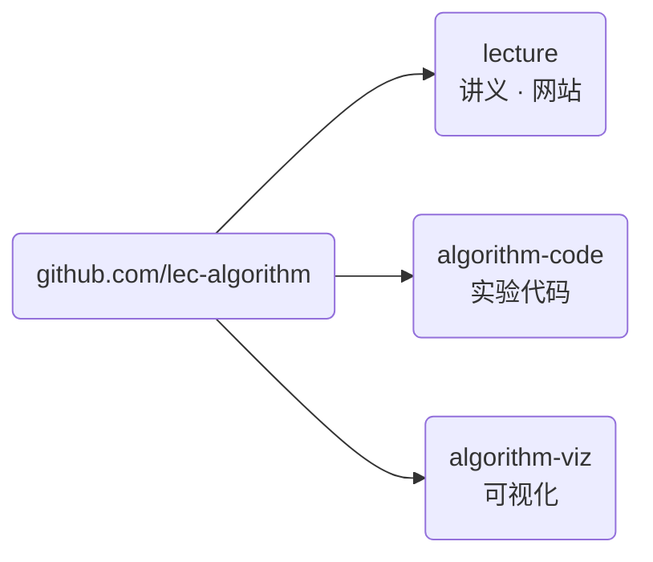

import Slide from 'stack-site-builder/components/Slide.astro';
import Screenshot from '@components/Screenshot.astro';
import envTemplate from '@assets/slides/orientation/github-repo-1.png';
import envCreate from '@assets/slides/orientation/github-repo-2.png';
import codeCodespace from '@assets/slides/orientation/algo-code-setup-1.png';
import codeRunning from '@assets/slides/orientation/algo-code-setup-2.png';

{/* 幻灯片规范遵循 docs/writing-rules.md 的「슬라이드 규칙」一节。 */}

<Slide class="cover">

# 高级算法

2026学年第二学期 · SIT2001-01

*李泰奎 · 延世大学融合工程学部*

</Slide>

<Slide>

## 这门课要做什么
::sub[从排序、分治到图与动态规划]

- 计算机算法以及**它们背后的逻辑**
- 多种排序算法、分治法、动态规划
- **如何判断**算法的复杂度

</Slide>

<Slide>

## 授课方式
::sub[一份伪代码，两种实现]

- 每个算法先用**伪代码**定义。
  - C 与 Python 版本都是它的转写。
- 这不是一门教语言的课。
  - 而是看同一段流程如何呈现为两种形态。
- 运行环境用**容器固定**。
  - 只需安装 Git 与 Docker，用 Codespaces 连这两样也不用装。
- 讲授 50% · 实验 50%

</Slide>

<Slide>

### 三个仓库



- [github.com/lec-algorithm/lecture](https://github.com/lec-algorithm/lecture)
- [github.com/lec-algorithm/algorithm-code](https://github.com/lec-algorithm/algorithm-code)
- [github.com/lec-algorithm/algorithm-viz](https://github.com/lec-algorithm/algorithm-viz)

</Slide>

<Slide class="center">

### 各仓库的用途

| 仓库 | 你要做的事 |
| --- | --- |
| `lecture` | 阅读网站（讲义与幻灯片） |
| `algorithm-code` | 创建副本并亲自运行 |
| `algorithm-viz` | 在幻灯片中观看 |

</Slide>

<Slide>

## 课程准备
::sub[有浏览器就够了]

| 方式 | 需要什么 |
| --- | --- |
| **GitHub Codespaces**（推荐） | 一个 [GitHub 账号](https://github.com/signup) |
| 在本地运行 | [Git](https://git-scm.com/downloads) · [Docker Desktop](https://www.docker.com/get-started/) |

<br/>

不需要安装编译器和 Python。  
两种方式都在**同一个容器内**运行。

</Slide>

<Slide>

## 两个仓库，用法不同
::sub[一个要复制，另一个不要复制]

| 仓库 | 用于 | 怎么用 |
| --- | --- | --- |
| `algorithm-env` | 作业 · 个人项目 | 用 **Use this template** 创建自己的仓库 |
| `algorithm-code` | 课堂示例 | **直接在这里创建 Codespace** |

<br/>

`algorithm-code` 在学期中会不断添加主题。  
复制之后就没有办法接收新主题。

</Slide>

<Slide class="compact">

### 自己的仓库 ①
::sub[在 algorithm-env 上点 Use this template]

<Screenshot src={envTemplate} alt="lec-algorithm/algorithm-env 仓库上的 Use this template 按钮，以及下方展开的 Create a new repository 菜单" maxHeight="46vh" />

`algorithm-env` 是 **template 仓库**。  
**Use this template** → **Create a new repository**

</Slide>

<Slide class="compact">

### 自己的仓库 ②
::sub[取名并创建]

<Screenshot src={envCreate} alt="Create a new repository 界面。Start with a template 处选择了 lec-algorithm/algorithm-env，仓库名填写 my-algorithm-code" maxHeight="62vh" />

取一个容易辨认的名字。  
点击 **Create repository** 后，副本会出现在自己账号下。

</Slide>

<Slide class="compact">

### 课堂示例用 Codespace
::sub[不要复制 algorithm-code]

<Screenshot src={codeCodespace} alt="在 lec-algorithm/algorithm-code 仓库点击 Code 按钮，Codespaces 标签页中出现 Create codespace on main" maxHeight="56vh" />

**Code** → **Codespaces** → **Create codespace on main**

</Slide>

<Slide class="compact">

### 创建好的 Codespace
::sub[它挂在 main 分支上]

<Screenshot src={codeRunning} alt="Codespaces 标签页中列出的 codespace，处于 Active 状态并挂在 main 分支" maxHeight="52vh" />

稍等片刻，浏览器中会打开 VS Code。  
**那个终端就是容器内部。**

</Slide>

<Slide class="compact">

### 容器里有什么
::sub[不需要安装编译器和 Python]

- 执行

```sh
gcc --version | head -1
python3 --version
```

- 结果

```console
gcc (Debian 14.2.0-19) 14.2.0
Python 3.13.5
```

<br/>

这样就消除了各操作系统之间的差异。  
无论你的笔记本是什么，容器内部都完全一样。

</Slide>

<Slide class="compact">

### 运行一个示例

- 执行

```sh
cd topic-01-intro-search/01_sequential_search
gcc -o sequentialSearch.out sequentialSearch.c && ./sequentialSearch.out
python3 sequential_search.py
```

- 结果

```console
n = 15, key = 51
index = 6, comparisons = 7
```

两种实现输出相同，说明准备完成。

</Slide>

<Slide class="compact">

### 在本地运行
::sub[不用 Codespaces，而在自己的电脑上]

- 执行

```sh
git clone https://github.com/<你的账号>/my-algorithm-code.git
cd my-algorithm-code
docker compose up -d
docker compose exec lab bash
```

- 结果

```console
root@d38ddee8c2a8:/work#
```

<br/>

提示符变化之后，一切**与上面相同**。  
Codespaces 用的是同一份 `compose.yml`。

</Slide>

<Slide>

## 评分
::sub[采用绝对评分]

| 项目 | 比重 |
| --- | --- |
| 期中考试（10 月 23 日 周五） | 20% |
| 期末考试（12 月 18 日 周五） | 40% |
| 作业 1 · 作业 2 | 5% + 5% |
| 个人项目 | 25% |
| 出勤 | 5% |

- **作业与个人项目必须以 GitHub 仓库提交。**
- 个人项目另有中期提交：仓库与十页左右的幻灯片。

</Slide>

<Slide class="center">

### 缺席三分之一即为 F

缺席达到实际课时的三分之一以上，  
无论考试结果如何都会得到 F 或 NP。

</Slide>

<Slide>

### 学期进度

| 周次 | 内容 |
| --- | --- |
| 1\~2 | 导论与查找、基本排序 |
| 3\~5 | 分治、快速排序、性能分析 |
| 5\~7 | 贪心与哈夫曼、二叉搜索树 |
| 8 | **期中考试** |
| 9\~11 | 哈希、基数排序、字典树、K-均值 |
| 12\~13 | 图、正则表达式 |
| 14\~15 | 最短路径、动态规划 |
| 16 | **期末考试** |

</Slide>

<Slide>

## 教材

| 类别 | 书名 |
| --- | --- |
| 主教材 | 算法（Sedgewick，Gilbut 2018） |
| 参考教材 | Introduction to Algorithms（韩光学术 2014） |

推荐先修课程：Computer Programming

</Slide>

<Slide class="center">

### 开始吧

课程材料发布在本站，  
课务通知发布在 LearnUs。

请先完成**实验环境准备**。

</Slide>
