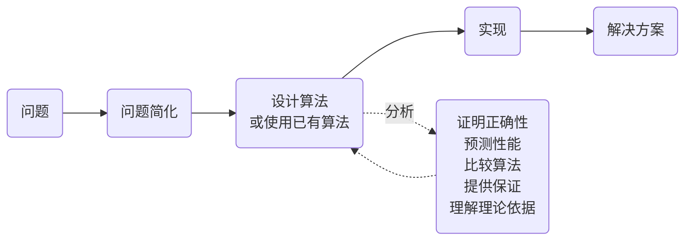

import Slide from 'stack-site-builder/components/Slide.astro';
import SearchDemo from '@components/SearchDemo.astro';
import SearchTrace from '@components/SearchTrace.astro';
import RecursionDemo from '@components/RecursionDemo.astro';
import ParallelSumDemo from '@components/ParallelSumDemo.astro';

{/* 遵循 docs/writing-rules.md 的幻灯片规则。
    每个例子按 步骤 → 代码 → 运行 → 练习 的顺序。代码是从 algorithm-code
    仓库搬过来的，仓库改了这里也要一起改。
    长行按两栏宽度折行，被裁掉就读不了了。 */}

<Slide class="cover">

# 导论与查找

主题 01

*高级算法*

</Slide>

<Slide>

## 算法做的是什么
::sub[把解决问题的步骤用有限且明确的步骤写下来]

- 相同输入产生相同输出。
- 必须终止。

<br/>

但只是"能解出来"还不够。  
解决同一个问题的步骤通常**不止一种**。

</Slide>

<Slide class="center">

### 本课程要学的是
### **如何判断该选哪一种**

</Slide>

<Slide>

### 算法与数据结构
::sub[两者互相需要]

- **算法运行在合适的数据结构之上。**
  - 正因为有"有序数组"这个结构，二分查找才能每次丢掉一半。
- **实现数据结构又需要算法。**
  - 哈希表里有哈希函数，堆里有上浮和下沉的步骤。

<br/>

> "Algorithms + Data Structures = Programs"  
> （Niklaus Wirth）

</Slide>

<Slide>

### 问题 · 输入 · 实例

| 用语 | 含义 | 例子 |
| --- | --- | --- |
| **问题** | 想要得到答案的提问 | 在有序数组中找出一个值 |
| **输入** | 问题接收的东西 | 数组 `A`、要找的值 `key` |
| **实例** | 给输入填上具体值 | `A = [6, 13, …]`、`key = 51` |

<br/>

算法是为解决**问题**而设计的，  
性能却是在**实例**上测量的。

</Slide>

<Slide class="compact">

### 我们要做的事



设计与分析不是各走一次的阶段，而是互相反馈。  
分析发现慢，就重新设计，再分析一次。

</Slide>

<Slide>

#### 分析回答的五件事

| 要做的事 | 回答什么 |
| --- | --- |
| 证明正确性 | 这个步骤**每一次**都给出正确答案吗 |
| 预测性能 | 输入变大后要花多久 |
| 比较算法 | 两者中哪一个更适合这个问题 |
| 提供保证 | 最坏情况下也有不会越过的界线吗 |
| 理解理论依据 | 能否断言根本不存在更快的方法 |

前三件今天就会用到。  
后两件会随着大 O 和下界，在整个学期里不断回来。

</Slide>

<Slide>

## 权衡
::sub["最好的算法"通常并不存在]

假设你要买一台平板。

- 屏幕：分辨率、刷新率
- CPU · 容量 · 笔的压感
- **价格**

<br/>

性能上去了，价格也上去。  
最后还是**决定放弃什么**。

</Slide>

<Slide>

### 必须按顺序的事，和不必的事
::sub[把十六个数相加。看看每一步加了几次]

<ParallelSumDemo slide />

</Slide>

<Slide>

#### 同样的工作，不同的时间

| | 逐个相加 | 成对相加 |
| --- | --- | --- |
| 加法次数 | 15 | 15 |
| 步数 | 15 | **4** |
| 每一步需要的核心 | 1 | 最多 8 |

**工作量相同，减少的是时间。**  
能这样只有一个原因：各对之间不用互相等待。

逐个相加要先有前一个和，才能加下一个。  
**什么在等什么**决定了能不能并行。

</Slide>

<Slide>

#### 就算有很多核心
::sub[等待若在算法里面，核心就只能闲着]

- **在八核上跑逐个相加，也只有一个核心在工作。**
  - 其余七个都在等前一个和。
  - 把核心加到十六个，仍然是 15 步。
- **成对相加也不是全程都用满八个。**
  - 会按 8 → 4 → 2 → 1 递减，最后一次是单独完成的。
  - 留下多少顺序的部分，那里就是下限。

<br/>

**于是路分成两条。** 改写算法去配合硬件，或者制造硬件去配合算法。  
GPU 和 NPU 属于后者。

</Slide>

<Slide>

### 准确度与速度
::sub[同样的故事在深度学习里也有]

| | 模型 1 | 模型 2 | 模型 3 |
| --- | --- | --- | --- |
| 准确度 | 0.8 | 0.7 | **0.9** |
| 速度 | 0.5 秒 | **0.1 秒** | 10 分钟 |

需要实时响应就选模型 2，看重准确度的诊断辅助就选模型 3。  
**只有知道问题要求什么，才能做出选择。**

</Slide>

<Slide>

## 例题 1. 两种查找
::sub[在有序数组中找出一个值的位置]

| **索引** | 0 | 1 | 2 | 3 | 4 | 5 | **6** | 7 | 8 | 9 | 10 | 11 | 12 | 13 | 14 |
| --- | --- | --- | --- | --- | --- | --- | --- | --- | --- | --- | --- | --- | --- | --- | --- |
| **值** | 6 | 13 | 14 | 25 | 33 | 43 | **51** | 53 | 64 | 72 | 84 | 93 | 95 | 96 | 101 |

要找的值是 `51`。  
它在索引 6。

</Slide>

<Slide>

### 顺序查找
::sub[从头开始逐个看。请按**单步**]

<SearchDemo slide mode="sequential" values={[6, 13, 14, 25, 33, 43, 51, 53, 64, 72, 84, 93, 95, 96, 101]} target={51} />

从索引 0 开始逐个查看。  
`51` 在索引 6，所以第七次才碰到。

</Slide>

<Slide class="compact">

#### 写成步骤
::sub[从头开始逐个比较]

```plaintext
ALGORITHM SequentialSearch(A, n, key)
    for i <- 0 to n-1 do
        if A[i] = key then
            return i
    return -1
```

从索引 0 到 6 逐个看了一遍，所以比较 **7 次**才找到。

</Slide>

<Slide class="compact">

#### 写成代码
::sub[`01_sequential_search/`]

<div class="aas-split">
<div>

- `sequentialSearch.c`

```c
int sequentialSearch(const int a[], int n, int key,
                     int *comparisons) {
    for (int i = 0; i < n; i++) {
        (*comparisons)++;
        if (a[i] == key) {
            return i;
        }
    }
    return -1;
}
```

</div>
<div>

- `sequential_search.py`

```python
def sequential_search(a, key):
    comparisons = 0
    for i, value in enumerate(a):
        comparisons += 1
        if value == key:
            return i, comparisons
    return -1, comparisons
```

</div>
</div>

只多了一行用来数比较次数，步骤和伪代码完全一样。

</Slide>

<Slide>

#### 最好：第一个元素就是要找的值
::sub[`key = 6`]

<SearchDemo slide mode="sequential" values={[6, 13, 14, 25, 33, 43, 51, 53, 64, 72, 84, 93, 95, 96, 101]} target={6} />

**一次**就结束。数组再长也一样。

</Slide>

<Slide>

#### 平均：在中间某处
::sub[`key = 53`]

<SearchDemo slide mode="sequential" values={[6, 13, 14, 25, 33, 43, 51, 53, 64, 72, 84, 93, 95, 96, 101]} target={53} />

**八次**。十五个元素时 $$\dfrac{n+1}{2} = 8$$。  
若要找的值位置均匀分布，平均就在这里。

</Slide>

<Slide>

#### 最坏：最后一个，或者根本不在
::sub[`key = 101`]

<SearchDemo slide mode="sequential" values={[6, 13, 14, 25, 33, 43, 51, 53, 64, 72, 84, 93, 95, 96, 101]} target={101} />

**十五次**，把整个数组数完。  
找数组里没有的值，同样是十五次。

</Slide>

<Slide>

#### 比较多少次
::sub[取决于要找的值在哪里]

| | 比较次数 | 时间 | 什么时候 |
| --- | --- | --- | --- |
| 最好 | $$1$$ | $$O(1)$$ | 第一个元素就是 `key` |
| 平均 | $$\dfrac{n+1}{2}$$ | $$O(n)$$ | **值在数组里**且位置分布均匀 |
| 最坏 | $$n$$ | $$O(n)$$ | 是最后一个元素，或根本不在 |

找不存在的值，永远要数满 n 次。这就是平均要加条件的原因。  
**谈性能的时候，要一并说清楚以哪些实例为前提。**

**空间**三种情况都是 $$O(1)$$，只有一个索引变量。

</Slide>

<Slide class="compact">

### 二分查找
::sub[看中间，把不必再看的一半丢掉]

<SearchTrace slide values={[6, 13, 14, 25, 33, 43, 51, 53, 64, 72, 84, 93, 95, 96, 101]} target={51} />

四次就到达 `51`。  
变淡的格子就是那一步丢掉的范围。

</Slide>

<Slide class="compact">

#### 写成步骤
::sub[先看中间。它利用了数组已经有序这个事实]

```plaintext
ALGORITHM BinarySearch(A, n, key)
    lo <- 0
    hi <- n - 1
    while lo <= hi do
        mid <- lo + (hi - lo) / 2
        if A[mid] = key then return mid
        else if A[mid] < key then lo <- mid + 1
        else hi <- mid - 1
    return -1
```

要找的值比中间大，就**把左半边整个丢掉**。

</Slide>

<Slide class="compact">

#### 写成代码
::sub[`02_binary_search/`]

<div class="aas-split">
<div>

- `binarySearch.c`

```c
int binarySearch(const int a[], int n, int key,
                 int *comparisons) {
    int lo = 0;
    int hi = n - 1;
    while (lo <= hi) {
        int mid = lo + (hi - lo) / 2;
        (*comparisons)++;
        if (a[mid] == key) {
            return mid;
        } else if (a[mid] < key) {
            lo = mid + 1;
        } else {
            hi = mid - 1;
        }
    }
    return -1;
}
```

</div>
<div>

- `binary_search.py`

```python
def binary_search(a, key):
    lo, hi = 0, len(a) - 1
    comparisons = 0
    while lo <= hi:
        mid = lo + (hi - lo) // 2
        comparisons += 1
        if a[mid] == key:
            return mid, comparisons
        elif a[mid] < key:
            lo = mid + 1
        else:
            hi = mid - 1
    return -1, comparisons
```

</div>
</div>

是 `lo + (hi - lo) / 2`，不是 `(lo + hi) / 2`。  
两个值都很大时，加法可能超出类型范围。

</Slide>

<Slide>

#### 最好：中间恰好就是要找的值
::sub[`key = 53`]

<SearchDemo slide mode="binary" values={[6, 13, 14, 25, 33, 43, 51, 53, 64, 72, 84, 93, 95, 96, 101]} target={53} />

**一次**就结束，和顺序查找的最好情况一样。

</Slide>

<Slide>

#### 平均：大约三次
::sub[`key = 43`]

<SearchDemo slide mode="binary" values={[6, 13, 14, 25, 33, 43, 51, 53, 64, 72, 84, 93, 95, 96, 101]} target={43} />

**三次**。把十五个位置都量一遍，平均是 $$49/15 \approx 3.3$$。

</Slide>

<Slide class="compact">

#### 最坏：一直分到底
::sub[`key = 51` · 把前面的四步写成数字]

| 比较 | lo | hi | mid | `A[mid]` | 判断 |
| --- | --- | --- | --- | --- | --- |
| 1 | 0 | 14 | 7 | 53 | 53 > 51 → 往左 |
| 2 | 0 | 6 | 3 | 25 | 25 < 51 → 往右 |
| 3 | 4 | 6 | 5 | 43 | 43 < 51 → 往右 |
| 4 | 6 | 6 | 6 | **51** | 找到 |

**4 次**，对比顺序查找的 7 次。  
**时间** $$O(\log n)$$ · **空间** $$O(1)$$

</Slide>

<Slide>

#### 比较多少次
::sub[二分查找按位置不同，介于 1 次和 4 次之间]

| | 比较次数 | 时间 | 什么时候 |
| --- | --- | --- | --- |
| 最好 | $$1$$ | $$O(1)$$ | 中间恰好是 `key` |
| 平均 | 约 $$\log_2 n$$ | $$O(\log n)$$ | 无论在哪里 |
| 最坏 | $$\lfloor \log_2 n \rfloor + 1$$ | $$O(\log n)$$ | 最深的格子，或根本不在 |

十五个元素时是 1 次 · 约 3.3 次 · 4 次。  
和顺序查找的 1 次 · 8 次 · 15 次比一比。

**空间**三种情况都是 $$O(1)$$，只有 `lo`、`hi`、`mid` 三个变量。

</Slide>

<Slide>

### 两种查找并排看
::sub[在同一个数组里找 51]

<SearchDemo slide values={[6, 13, 14, 25, 33, 43, 51, 53, 64, 72, 84, 93, 95, 96, 101]} target={51} />

变淡的格子是**已经没必要再看的范围**。

</Slide>

<Slide>

### 找数组里没有的值
::sub[找 50]

<SearchDemo slide values={[6, 13, 14, 25, 33, 43, 51, 53, 64, 72, 84, 93, 95, 96, 101]} target={50} />

顺序查找要**数满十五次**才能回答"不存在"。

</Slide>

<Slide class="compact">

#### 跑一下看看
::sub[同样的数组，同样的 key]

- 顺序查找

```console
n = 15, key = 51
index = 6, comparisons = 7
```

- 二分查找

```console
n = 15, key = 51
index = 6, comparisons = 4
```

答案相同，比较次数不同。  
手数出来的 7 和 4 原样打印出来。

</Slide>

<Slide>

### 差别在 n 变大时显现

| 元素个数 | 顺序查找 | 二分查找 | 实测 | 理论值 $$n / \lceil \log_2 n \rceil$$ |
| --- | --- | --- | --- | --- |
| 1,000 | 23.88 μs | 2.27 μs | 10.5 倍 | 100 |
| 10,000 | 202.31 μs | 2.23 μs | 90.9 倍 | 714 |
| 100,000 | 1,847.54 μs | 6.40 μs | 288.7 倍 | 5,882 |
| 1,000,000 | 24,519.73 μs | 9.15 μs | **2,679.8 倍** | 50,000 |

这就是 $$O(n)$$ 和 $$O(\log n)$$ 的差别。  
实测低于理论是因为缓存。**大 O 说的是增长率，不是时间。**

</Slide>

<Slide class="center">

### 不是免费的

二分查找需要**数组是有序的**。

不是有序的话会得到**错误答案**。  
它用给输入加条件的方式换取速度。

</Slide>

<Slide class="compact">

#### 可以改的地方
::sub[`02_binary_search/` · 数组和 key 在这里]

<div class="aas-split">
<div>

- `binarySearch.c`

```c
int main(void) {
    int a[] = {6, 13, 14, 25, 33, 43, 51, 53,
               64, 72, 84, 93, 95, 96, 101};
    int n = (int)(sizeof(a) / sizeof(a[0]));
    int key = 51;
    int comparisons = 0;

    int index = binarySearch(a, n, key, &comparisons);

    printf("n = %d, key = %d\n", n, key);
    printf("index = %d, comparisons = %d\n",
           index, comparisons);
    return 0;
}
```

</div>
<div>

- `binary_search.py`

```python
if __name__ == "__main__":
    a = [6, 13, 14, 25, 33, 43, 51, 53,
         64, 72, 84, 93, 95, 96, 101]
    key = 51

    index, comparisons = binary_search(a, key)

    print(f"n = {len(a)}, key = {key}")
    print(f"index = {index}, "
          f"comparisons = {comparisons}")
```

</div>
</div>

`comparisons` 之所以用指针传，原因在这里。  
C 函数只返回一个值，要同时拿到索引和比较次数，就得让其中一个由外部填。  
Python 用元组把两个一起返回。

</Slide>

<Slide class="compact">

#### 现在动手试试
::sub[例题 1. 两种查找]

[lec-algorithm/algorithm-code](https://github.com/lec-algorithm/algorithm-code/tree/main) · `src/topic-01-intro-search/`  
打开文件，按编辑器右上角的 **▶ 按钮**即可运行。

1. **把 `key` 改成第一个值和最后一个值。**
   - `6` 时顺序查找比较 1 次，`101` 时 15 次。
   - 比较一下二分查找找同样的值要几次。
2. **找数组里没有的值。**
   - `key = 50` 时两者都返回 `-1`。
   - 但到达那里的比较次数不同。
3. **只把二分查找的数组打乱。**
   - 答案会错。
   - 顺序查找在同一个数组上依然正确。
   - 快所要求的代价，在这里显现出来。

</Slide>

<Slide class="center">

## 例题 2. 递归与迭代
::sub[用两种方式实现同一个公式]

$$
F(n) = \begin{cases}
0 & n = 0 \\
1 & n = 1 \\
F(n-1) + F(n-2) & n > 1
\end{cases}
$$

依次是 0、1、1、2、3、5、8、13、21、34、……

</Slide>

<Slide class="compact">

### 把定义原样搬过来
::sub[用递归写出来，代码和定义看上去几乎一样]

```plaintext
ALGORITHM FibonacciRecursive(n)
    if n <= 1 then return n
    return FibonacciRecursive(n-1) + FibonacciRecursive(n-2)
```

好读，也忠于定义。  
可是把 `F(5)` 展开，问题就出来了。

</Slide>

<Slide>

#### 栈堆起来又退下去
::sub[按单步，看看 $$F(5)$$ 是怎么跑的]

<RecursionDemo slide n={5} />

</Slide>

<Slide class="center">

#### 调用 15 次，不同的值只有 6 个

深度**与 n 成正比**地增长。这就是递归占用 $$O(n)$$ 空间的原因。  
调用次数**每分叉一次就翻倍**。这就是时间为 $$O(2^n)$$ 的原因。

<br/>

红色的格子是**把已经算过的值又算了一遍**的地方。

</Slide>

<Slide class="compact">

### 只带着前两项往前走

```plaintext
ALGORITHM FibonacciIterative(n)
    if n <= 1 then return n
    prev <- 0
    curr <- 1
    for i <- 2 to n do
        next <- prev + curr
        prev <- curr
        curr <- next
    return curr
```

求下一项需要的只有**前面两项**。  
每一项只算一次。

</Slide>

<Slide class="compact">

#### 写成代码
::sub[`03_fibonacci/fibonacci.c` · 把两个函数并排放]

<div class="aas-split">
<div>

- 递归

```c
long fibonacciRecursive(int n) {
    calls++;
    if (n <= 1) {
        return n;
    }
    return fibonacciRecursive(n - 1)
         + fibonacciRecursive(n - 2);
}
```

</div>
<div>

- 迭代

```c
long fibonacciIterative(int n) {
    if (n <= 1) {
        return n;
    }
    long prev = 0, curr = 1;
    for (int i = 2; i <= n; i++) {
        long next = prev + curr;
        prev = curr;
        curr = next;
    }
    return curr;
}
```

</div>
</div>

`calls` 是用来数递归分叉多少次的。比起时间，这个数字更能说明原因。

</Slide>

<Slide>

#### 差距有多大

| n | 递归调用次数 | 递归（ms） | 迭代（ms） |
| --- | --- | --- | --- |
| 10 | 177 | 0.00 | 0.0000 |
| 20 | 21,891 | 0.01 | 0.0000 |
| 30 | 2,692,537 | 0.82 | 0.0000 |
| 40 | **331,160,281** | 120.58 | 0.0000 |

n 每增加 10，调用次数大约变成 **100 倍**。  
调用次数在哪里跑都一样，**毫秒则因机器而异。**  
递归 $$O(2^n)$$ · 迭代 $$O(n)$$

</Slide>

<Slide class="compact">

#### 一共算了多少项
::sub[$$O(2^n)$$ 和 $$O(n)$$ 是结论，依据是项数]

- **迭代算 $$n + 1$$ 项。**
  - 从 $$F(0)$$ 到 $$F(n)$$ 各一次。
- **递归至少算 $$2^{n/2}$$ 项。**
  - 调用次数 $$C(n) = 2F(n+1) - 1$$，且 $$n \ge 2$$ 时 $$F(n) \ge 2^{n/2-1}$$。

```plaintext
C(100) = 2 × F(101) - 1
       = 1,146,295,688,027,634,168,201        约 1.1 × 10^21 次
```

即使一次调用只算 1 纳秒，也要 **3 万 6 千年**。  
迭代算完 101 项就结束了。

</Slide>

<Slide class="center">

### 那么递归就是坏的吗

不是。

慢的原因不是递归，而是**重复计算**。  
把值存起来，递归也是 $$O(n)$$。

*主题 14 动态规划会再见到它。*

</Slide>

<Slide class="compact">

#### 可以改的地方
::sub[`03_fibonacci/` · 计量的部分在这里]

<div class="aas-split">
<div>

- `fibonacci.c`

```c
for (int n = 10; n <= 40; n += 10) {
    long rec, itr;

    calls = 0;
    double tRec = timeIt(fibonacciRecursive, n, &rec);
    double tItr = timeIt(fibonacciIterative, n, &itr);

    printf("%3d %15ld %10.2f %10.4f %10ld\n",
           n, calls, tRec, tItr, itr);

    if (rec != itr) {
        printf("  !! 值不一致: %ld vs %ld\n",
               rec, itr);
    }
}
```

</div>
<div>

- `fibonacci.py`

```python
# n=40 时递归大约要 12 秒
for n in (10, 20, 30, 35):
    calls = 0
    rec, t_rec = time_it(fibonacci_recursive, n)
    itr, t_itr = time_it(fibonacci_iterative, n)

    print(f"{n:3d} {calls:15,d} {t_rec:10.2f} "
          f"{t_itr:10.4f} {itr:10d}")

    if rec != itr:
        print(f"  !! 值不一致: {rec} vs {itr}")
```

</div>
</div>

每一轮都检查 `rec != itr`。  
让代码自己验证两个实现给出同样的答案，就不必怀疑跑得快的那个是不是错了。

</Slide>

<Slide class="compact">

#### 现在动手试试
::sub[例题 2. 递归与迭代]

[lec-algorithm/algorithm-code](https://github.com/lec-algorithm/algorithm-code/tree/main) · `src/topic-01-intro-search/03_fibonacci/`  
打开文件，按编辑器右上角的 **▶ 按钮**即可运行。

1. **把 C 那边的 `n <= 40` 提到 45、50。**
   - 看看调用次数能涨到哪里。
   - 看看从什么时候开始等不下去。
2. **Python 那边停在 `(10, 20, 30, 35)`。**
   - 同样的步骤，却慢得多。
   - **在哪里停下来也是观察的一部分。**
3. **看看迭代那边的 `n` 提到多少仍然瞬间结束。**
   - 顺便也能看到 `long` 溢出的位置。

</Slide>

<Slide>

## 要记住的

1. **最好的算法通常并不存在。**
   - 存在的只是决定放弃什么。
2. **差别在输入变大时才显现。**
   - 输入小的时候用什么都差不多。
3. **快是有条件的。**
   - 二分查找要求数组有序。
   - 不确认就用，会得到错误答案。
4. **代码的形状会改变性能。**
   - 同一个公式会分成 $$O(2^n)$$ 和 $$O(n)$$。

</Slide>

<Slide>

### 怎样跟上这门课

- **以伪代码为基准。**
  - 每个例子都是一个 `.pseudo` 文件配上 C 和 Python。
  - 目的不是学语言，而是看**同一个步骤在两种语言里长成什么样**。
- **不要只是读。**
  - 例子会连同比较次数和调用次数一起打印。
  - 改改数字再跑一遍，表里的复杂度就变得具体了。
- **卡住了就在容器里确认。**
  - 回答提问时以练习容器为准。

<br/>

代码放在 [lec-algorithm/algorithm-code](https://github.com/lec-algorithm/algorithm-code/tree/main)
仓库的 `src/topic-01-intro-search/`。  
运行方法请参考[准备练习环境](/article/setup-guide/)。

</Slide>
