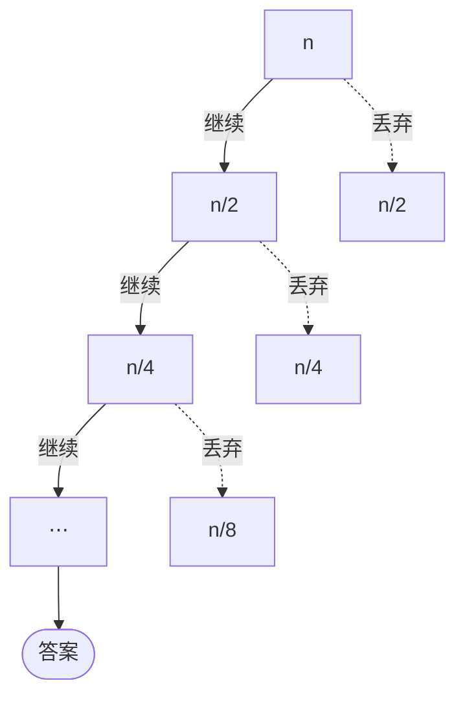

import Slide from 'stack-site-builder/components/Slide.astro';
import QuickDemo from '@components/QuickDemo.astro';
import ParallelQuickDemo from '@components/ParallelQuickDemo.astro';

{/* 幻灯片规则见 docs/writing-rules.md 的"슬라이드 규칙"。
    每个例子按 演示 → 过程 → 代码 → 分析 的顺序。代码与 algorithm-code
    仓库一致，那边改了这里也要跟着改。演示的计数器会落在代码打印的数字上。 */}

<Slide class="cover">

# 随机与快速排序

主题 04

*高级算法*

</Slide>

<Slide>

## 跷跷板的另一端
::sub[主题 03 说过，拆与合是跷跷板]

<div class="aas-split">
<div>

- **归并排序**
  - 拆：对半一切。免费
  - 合：归并。活在这里

</div>
<div>

- **本主题的排序**
  - 拆：**按值**分。活在这里
  - 合：接起来。免费

</div>
</div>

<br/>

守住这个"拆"的材料，是**随机**。

</Slide>

<Slide>

## 材料：随机
::sub[计算机的随机是从哪来的]

- `rand()` 产出的是**伪随机数**。
- 接受一个叫种子（seed）的输入，跑**一个函数**。
- 函数意味着**输入相同，输出就相同。**

<br/>


</Slide>

<Slide class="compact">

#### 同种子，同序列
::sub[`01_random/` · 亲手实现同一类生成器（minstd）]

<div class="aas-split">
<div>

- `randomProgram.c`

```c
static int64_t state = 1;

/* 像 srand 一样换种子。 */
void setSeed(int64_t seed) {
    state = seed;
}

/* 像 rand 一样产出下一个数。 */
int64_t nextRandom(void) {
    state = state * 16807
          % 2147483647;
    return state;
}
```

</div>
<div>

- 运行结果

```console
seed = 1 : 16807 282475249 1622650073
seed = 1 : 16807 282475249 1622650073
seed = 2 : 33614 564950498 1097816499
```

- 种子 1 两遍：**一模一样的序列**
- 只有换种子，序列才会变。
- 实战惯用：`srand(time(NULL))`

</div>
</div>

</Slide>

<Slide>

#### 哪里需要随机
::sub[YouTube 视频 ID 为什么不是顺序号]

- 每秒大量视频落到**许多服务器、许多数据库**（分片）。
- ID 绝不能重复。
- 顺序号要求服务器之间协调。行不通。
- 所以用**基于随机的 ID**。
  - "下一个号猜不出来"是白送的。

</Slide>

<Slide class="center">

### 本主题里随机的岗位是
### **挑基准（pivot）**

为什么需要它，看过最坏情况就明白。

</Slide>

<Slide class="center">

## 例 1. 快速排序
::sub[把基准放到它的位置，再分别排两边]

</Slide>

<Slide>

### 引擎是划分
::sub[比基准（蓝）小的聚进青色区。请按**单步**]

<QuickDemo slide mode="partition" />

</Slide>

<Slide>

#### 基准的位置是最终的
::sub[一次划分买到什么]

- 9 次比较，**定下一个最终位置**。
- 它左边全是更小的，右边是其余的。
- 两边各自排好就完了。不需要合并。

<br/>

这次的基准 `2` 几乎是最小值，左区只有一个 `1`。  
好基准与坏基准的故事从这里开始。

</Slide>

<Slide>

### 完整的排序
::sub[把划分放上递归。`qs(0, 9)` 芯片标出当前调用]

<QuickDemo slide mode="sort" />

</Slide>

<Slide>

#### 写成过程
::sub[归并的骨架，干活的位置换了]

```plaintext
ALGORITHM QuickSort(A, lo, hi)
    if lo >= hi then return          // 单个元素：本来就有序
    p <- Partition(A, lo, hi)        // 把基准放到它的位置
    QuickSort(A, lo, p-1)            // 基准左边
    QuickSort(A, p+1, hi)            // 基准右边
```

- 归并在**递归回来之后**（合并）干活。
- 快排在**进入递归之前**（拆分）干活。

</Slide>

<Slide class="compact">

#### 写成代码
::sub[`02_quick_sort/` · 划分就是全部]

<div class="aas-split">
<div>

- `quickSort.c`

```c
static int partition(int a[], int lo, int hi,
                     int *comparisons, int *moves) {
    int pivot = a[lo];
    int i = lo;
    for (int j = lo + 1; j <= hi; j++) {
        (*comparisons)++;
        if (a[j] < pivot) {
            i++;
            swap(a, i, j, moves);
        }
    }
    swap(a, lo, i, moves);
    return i;
}

void quickSort(int a[], int lo, int hi,
               int *comparisons, int *moves) {
    if (lo >= hi) {
        return;
    }
    int p = partition(a, lo, hi,
                      comparisons, moves);
    quickSort(a, lo, p - 1,
              comparisons, moves);
    quickSort(a, p + 1, hi,
              comparisons, moves);
}
```

</div>
<div>

- `quick_sort.py`

```python
def _partition(a, lo, hi, counts):
    pivot = a[lo]
    i = lo
    for j in range(lo + 1, hi + 1):
        counts[0] += 1
        if a[j] < pivot:
            i += 1
            _swap(a, i, j, counts)
    _swap(a, lo, i, counts)
    return i


def quick_sort(a, lo=None, hi=None,
               counts=None):
    if lo is None:
        lo, hi = 0, len(a) - 1
        counts = [0, 0]
    if lo >= hi:
        return tuple(counts)
    p = _partition(a, lo, hi, counts)
    quick_sort(a, lo, p - 1, counts)
    quick_sort(a, p + 1, hi, counts)
    return tuple(counts)
```

</div>
</div>

</Slide>

<Slide>

#### 好基准把数组切成两半
::sub[图景变成归并排序的]

- 基准落在中间附近，数组就近似对半分。
- 每层划分代价之和是 $$n$$，共 $$\log n$$ 层。
- 所以**平均 $$O(n \log n)$$。**

- 运行

```console
before: 2 8 5 9 1 10 7 6 4 3
after : 1 2 3 4 5 6 7 8 9 10
comparisons = 25, moves = 21
```

</Slide>

<Slide>

#### 最好情况：基准总在正中间
::sub[特意构造的数组。树完全平衡]

<QuickDemo slide mode="sort" values={[5, 1, 3, 4, 2, 8, 7, 6, 9, 10]} />

</Slide>

<Slide>

#### 最坏情况：已排序的输入
::sub[基准每次都是最小值。树变成一条独木道]

<QuickDemo slide mode="sort" values={[1, 2, 3, 4, 5, 6, 7, 8, 9, 10]} />

</Slide>

<Slide>

#### 换了输入
::sub[19 次是这个规模的最小值，45 次是 n(n-1)/2]

| 输入 | 比较次数 | 移动次数 |
| --- | --- | --- |
| 最好情况的数组 | $$19$$ | $$9$$ |
| 示例数组（近平均） | $$25$$ | $$21$$ |
| 已排序（最坏） | $$45$$ | $$0$$ |
| 逆序 | $$45$$ | $$15$$ |

<br/>

- 已排序输入：首元素基准**每次都是最小值**。
- 左边空着，右边只缩一个。
- 层数变成 $$n$$，$$\frac{n(n-1)}{2} = 45$$ 次：$$O(n^2)$$。

</Slide>

<Slide class="center">

### 已排序输入是快排的最坏情况
### 和插入排序（最好 9 次）**正相反**

哪种输入算好输入，也因算法而异。

</Slide>

<Slide>

#### 基准怎么挑
::sub[躲开最坏情况的钥匙]

- **选项 1. 随机**
  - 每次划分随机挑基准。
  - 任何输入：**期望 $$O(n \log n)$$**
  - 最坏变成"特定输入撞上特定随机数"。
  - 备好的材料在这里用上。
- **选项 2. 三数取中（median-of-3）**
  - 取首、中、尾三者的中位数当基准。
  - 廉价地躲开已排序输入的陷阱。

</Slide>

<Slide>

#### 平均数 · 中位数 · 众数
::sub[既然提到了中位数]

| 名称 | 含义 |
| --- | --- |
| 平均数 (mean) | 加起来除以个数 |
| 中位数 (median) | 排队后站中间的 |
| 众数 (mode) | 出现最多的值 |

<br/>

理想的基准是**中位数**。  
它把数组正好切成两半。

</Slide>

<Slide>

#### 和归并摆在一起
::sub[同一个数组上，各自付出的东西]

| | 比较 | 移动 | 额外空间 | 最坏 | 稳定性 |
| --- | --- | --- | --- | --- | --- |
| 归并排序 | 22 | 68 | temp $$O(n)$$ | $$O(n \log n)$$ | 稳定 |
| 快速排序 | 25 | 21 | 栈 $$O(\log n)$$ | $$O(n^2)$$ | 不稳定 |

<br/>

- 快排多花三次比较，换来**移动只有三分之一**，还不用 temp。
- 代价：$$O(n^2)$$ 的风险，和稳定性。
- 实战库偏爱快排系的理由都写在这张表里。

</Slide>

<Slide>

#### 划分也可以同时做
::sub[同一层的划分区间互不重叠 · 归并的并行，方向翻转]

<ParallelQuickDemo slide />

</Slide>

<Slide>

#### 活一样多，步数变少
::sub[墙钟的下限在另一头]

- 划分还是六次，步数从 **6 变 3**，也就是树的深度。
- 归并从下往上：**最后一次归并**独自处理整个数组。
- 快排从上往下：**第一次划分**独自处理整个数组。

<br/>

独木道的树（已排序输入）每层只有一个划分，  
**并行收益归零**。好基准造出并行的空间。

</Slide>

<Slide class="compact">

#### 现在动手
::sub[例 1. 快速排序]

[lec-algorithm/algorithm-code](https://github.com/lec-algorithm/algorithm-code/tree/main) · `src/topic-04-quick-sort/`  
打开文件，按编辑器右上角的 **▶ 按钮**运行。

1. **喂它已排序的 `1 2 … 10`。**
   - 比较跳到 45 次。看看最坏长什么样。
2. **把基准改成用 `01_random` 的生成器挑。**
   - 已排序输入的陷阱消失。
3. **用 `time(NULL)` 当种子。**
   - 每次运行序列都不一样。

</Slide>

<Slide class="center">

## 例 2. 快速选择
::sub[不排完，拿到第 k 小的值]

</Slide>

<Slide>

### 快速选择
::sub[没有答案的一边整个丢掉，丢掉的保持变暗]

<QuickDemo slide mode="select" k={5} />

</Slide>

<Slide>

#### 写成过程
::sub[快排的划分。只有一处不同]

```plaintext
ALGORITHM QuickSelection(A, n, k)
    lo <- 0, hi <- n-1
    loop
        p <- Partition(A, lo, hi)    // 和快排相同的划分
        if p = k-1 then              // 基准恰好在第 k 位
            return A[p]
        else if p > k-1 then
            hi <- p-1                // 答案在左边，丢掉右边
        else
            lo <- p+1                // 答案在右边，丢掉左边
```

- 快排**两边都挖**，快选**只挖一边**。
- 这正是二分查找做过的事：丢掉一半。

</Slide>

<Slide class="compact">

#### 写成代码
::sub[`03_quick_selection/` · 看 after 那一行]

<div class="aas-split">
<div>

- `quickSelection.c`

```c
int quickSelection(int a[], int n, int k,
                   int *comparisons,
                   int *moves) {
    int lo = 0;
    int hi = n - 1;
    while (1) {
        int p = partition(a, lo, hi,
                          comparisons, moves);
        if (p == k - 1) {
            return a[p];
        }
        if (p > k - 1) {
            hi = p - 1;
        } else {
            lo = p + 1;
        }
    }
}
```

</div>
<div>

- 运行结果

```console
before: 2 8 5 9 1 10 7 6 4 3
after : 1 2 3 4 5 10 7 6 9 8
k = 5 -> value = 5
comparisons = 16, moves = 15
```

- 只有前五个位置定了。
- 后面还是乱的。
- **没排完就拿到了答案。**
- 全排 25 次，选择 16 次。

</div>
</div>

</Slide>

<Slide>

#### 为什么是 O(n)
::sub[丢掉的一边再也不碰]



$$
n + \frac{n}{2} + \frac{n}{4} + \cdots \leq 2n
$$

</Slide>

<Slide>

#### 排序与选择
::sub[同一个划分，两种用法]

| | 挖哪边 | 平均 | n = 10 时的比较 |
| --- | --- | --- | --- |
| 快速排序 | 两边都挖 | $$O(n \log n)$$ | 25 |
| 快速选择 | 只挖一边 | $$O(n)$$ | 16 |

<br/>

- 最坏仍是 $$O(n^2)$$。这里的解药也是随机基准。
- **找"第几"的工具，不是找"某个值"的工具。**
  - 找值是查找的活，归主题 01 管。

</Slide>

<Slide class="compact">

#### 现在动手
::sub[例 2. 快速选择]

[lec-algorithm/algorithm-code](https://github.com/lec-algorithm/algorithm-code/tree/main) · `src/topic-04-quick-sort/`  
打开文件，按编辑器右上角的 **▶ 按钮**运行。

1. **把 `k` 改成 1 和 10。**
   - 比较 9 次和 20 次。都比全排（25 次）便宜。
2. **观察 after 那一行。**
   - k 越大，排好的部分越多。
3. **想想为什么它找不了特定的值。**
   - 那是查找的活。

</Slide>

<Slide>

### 七种排序并排看
::sub[挑一种排序，就是挑一种权衡]

| 排序 | 最好 | 平均 | 最坏 | 空间 | 稳定性 | 类别 |
| --- | --- | --- | --- | --- | --- | --- |
| 选择 | $$O(n^2)$$ | $$O(n^2)$$ | $$O(n^2)$$ | $$O(1)$$ | 不稳定 | 比较 |
| 插入 | $$O(n)$$ | $$O(n^2)$$ | $$O(n^2)$$ | $$O(1)$$ | 稳定 | 比较 |
| 希尔 | $$O(n \log n)$$ | $$O(n^{1.5})$$ | $$O(n^2)$$ | $$O(1)$$ | 不稳定 | 比较 |
| 冒泡 | $$O(n^2)$$ | $$O(n^2)$$ | $$O(n^2)$$ | $$O(1)$$ | 稳定 | 比较 |
| 归并 | $$O(n \log n)$$ | $$O(n \log n)$$ | $$O(n \log n)$$ | $$O(n)$$ | 稳定 | 比较 |
| 计数 | $$O(n+k)$$ | $$O(n+k)$$ | $$O(n+k)$$ | $$O(n+k)$$ | 稳定 | 非比较 |
| 快速 | $$O(n \log n)$$ | $$O(n \log n)$$ | $$O(n^2)$$ | $$O(\log n)$$ | 不稳定 | 比较 |

</Slide>

<Slide>

## 要带走的

1. **计算机的随机是伪随机。**
   - 种子相同序列就相同。因此可以复现。
2. **快速排序的活干在拆里。**
   - 划分定下基准的位置，合并免费。
   - 平均 $$O(n \log n)$$，移动少，原地进行。
3. **已排序输入是快排的最坏情况。**
   - 和插入排序正相反。好输入因算法而异。
4. **解药是随机基准。**
   - 任何输入下期望 $$O(n \log n)$$。
   - 树平衡了，并行的空间也保住了。
5. **快速选择只挖一边，平均 $$O(n)$$。**
   - 不排完就拿到第 k 小。

</Slide>
