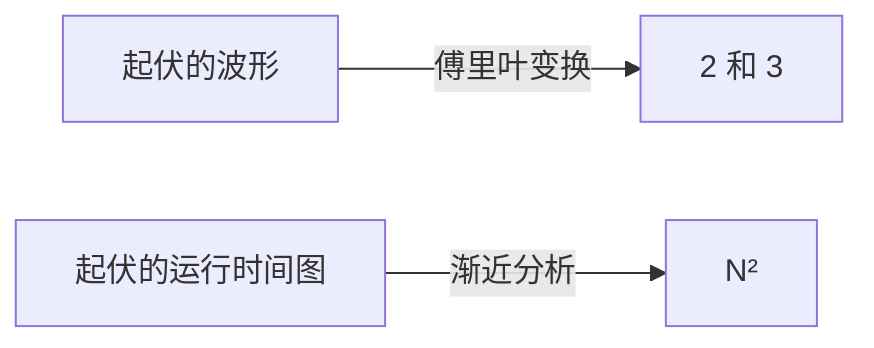

import Slide from 'stack-site-builder/components/Slide.astro';
import GrowthDemo from '@components/GrowthDemo.astro';

{/* 幻灯片规则见 docs/writing-rules.md 的"슬라이드 규칙"。
    数字与实践代码（threeSum）的运行结果一致。 */}

<Slide class="cover">

# 算法性能分析

主题 05

*高级算法*

</Slide>

<Slide>

## 我们早已在说的语言
::sub[主题 01 到 04，每张表里都有它]

- 顺序查找 $$O(n)$$，二分查找 $$O(\log n)$$
- 插入排序最好 $$O(n)$$，最坏 $$O(n^2)$$
- 归并排序 $$O(n \log n)$$，比较排序的下界 $$\Omega(n \log n)$$
- 快速选择平均 $$O(n)$$

<br/>

本主题打牢这门**语言本身**。  
它从哪来，精确含义是什么，怎么用才对。

</Slide>

<Slide>

## 一门做摘要的语言
::sub[挑战：描述一条剧烈起伏的波形]

- 用公式难，用话说也难。
- 但如果它是 **2Hz 与 3Hz 信号的和**呢？
- 傅里叶变换后的图上，**只有 2 和 3 两处立着柱子**。
- 描述缩成两个数字。

<br/>

波形的故事见 3Blue1Brown 的
[傅里叶变换视频](https://www.youtube.com/watch?v=spUNpyF58BY)。

</Slide>

<Slide>

#### 本主题要造的
::sub[同一种摘要语言]



几千个测量点的图，**用一个词**概括。

</Slide>

<Slide>

## 第一条路：测量
::sub[问号填得出来吗]

| $$N$$ | 250 | 500 | 1,000 | 2,000 | 4,000 | 8,000 | 16,000 |
| --- | --- | --- | --- | --- | --- | --- | --- |
| 时间（秒） | 0.0 | 0.0 | 0.1 | 0.8 | 6.4 | 51.1 | ? |

</Slide>

<Slide>

#### 倍增实验
::sub[N 翻倍时的比值是次数的指纹]

- $$0.8 \to 6.4 \to 51.1$$：每步**约 8 倍**。
- $$2^3 = 8$$，所以时间跟着 $$N^3$$ 走。
- 问号：$$51.1 \times 8 \approx 409$$ 秒。

<br/>

测量、翻倍、看比值。  
×2 线性，×4 二次，×8 三次。

</Slide>

<Slide>

#### 测量的局限
::sub[有力，但差三样]

- **被机器和语言绑住。**
  - 主题 01 起反复说的：毫秒因机器而异。
- **没去过的 N 一无所知。**
  - 下一格等七分钟，再下一格等一个小时。
- **说不出为什么。**
  - 它报出 8 倍，但原因在代码里。

</Slide>

<Slide class="center">

## 第二条路：计数
::sub[不测秒，数运算]

</Slide>

<Slide>

#### 1-sum：把运算数个遍
::sub[数数组里 0 的个数]

<div class="aas-split">
<div>

```c
int count = 0;
for (int i = 0; i < N; i++)
    if (a[i] == 0)
        count++;
```

</div>
<div>

| 运算 | 频次 |
| --- | --- |
| 变量声明 | $$2$$ |
| 赋值 | $$2$$ |
| `<` 比较 | $$N + 1$$ |
| `==` 比较 | $$N$$ |
| 数组访问 | $$N$$ |
| 自增 | $$N$$ \~ $$2N$$ |

</div>
</div>

<br/>

自增是范围：`count++` 随输入在 0 到 $$N$$ 次之间。

</Slide>

<Slide>

#### 2-sum：数数本身也是活
::sub[数和为 0 的对]

<div class="aas-split">
<div>

```c
int count = 0;
for (int i = 0; i < N; i++)
    for (int j = i+1; j < N; j++)
        if (a[i] + a[j] == 0)
            count++;
```

</div>
<div>

| 运算 | 频次 |
| --- | --- |
| 变量声明 | $$N + 2$$ |
| 赋值 | $$N + 2$$ |
| `<` 比较（内层） | $$\dfrac{N(N+1)}{2}$$ |
| `==` 比较 | $$\dfrac{N(N-1)}{2}$$ |
| 数组访问 | $$N(N-1)$$ |

</div>
</div>

<br/>

精确但沉重。**数数这件事本身得简化。**

</Slide>

<Slide>

#### 简化
::sub[两条约定让表缩成一行]

- **代价模型**
  - 不数全部运算，只数**一种代表运算**。
  - 这里：数组访问。
- **波浪号记法**
  - 只留最高次项。
  - $$N(N-1) = N^2 - N$$ 写成 $$\sim N^2$$。

</Slide>

<Slide>

#### 实践代码验证模型
::sub[`01_three_sum/` · 倍增比值与机器无关地落在 4 和 8 上]

- 运行

```console
N = 100
1-sum: count = 1, accesses = 100
2-sum: count = 19, accesses = 9900
3-sum: count = 642, accesses = 485100

doubling N: accesses ratio
     N        2-sum        3-sum
   200         4.02         8.12
   400         4.01         8.06
```

$$9900 = N(N-1)$$，$$485100 = 3\binom{N}{3}$$。  
测量给 51.1 秒，计数还给出**为什么是 8 倍**。

</Slide>

<Slide class="center">

## 渐近分析
::sub[只留 N 足够大时的增长率]

</Slide>

<Slide>

### 七个增长等级
::sub[请按 **n 翻倍**。倍率徽章就是指纹]

<GrowthDemo slide />

</Slide>

<Slide>

#### 我们全都遇见过
::sub[七个等级都在这门课里出现过]

| 等级 | 在哪遇见的 |
| --- | --- |
| $$1$$ | 计数排序的位置计算（主题 03） |
| $$\log n$$ | 二分查找（主题 01） |
| $$n$$ | 顺序查找（主题 01）、快速选择（主题 04） |
| $$n \log n$$ | 归并排序（主题 03）、快排平均（主题 04） |
| $$n^2$$ | 选择·插入·冒泡（主题 02）、2-sum |
| $$n^3$$ | 3-sum（本主题） |
| $$2^n$$ | 递归斐波那契（主题 01） |

</Slide>

<Slide>

#### 年代在变，等级不变
::sub[几分钟内能解的问题规模 · 改编自塞奇威克]

| 增长率 | 1970 年代 | 1980 年代 | 1990 年代 | 2000 年代 |
| --- | --- | --- | --- | --- |
| $$n$$ | 数百万 | 数千万 | 数亿 | 数十亿 |
| $$n \log n$$ | 数十万 | 数百万 | 数百万 | 数亿 |
| $$n^2$$ | 数百 | 数千 | 数千 | 数万 |
| $$n^3$$ | 一百 | 数百 | 一千 | 数千 |
| $$2^n$$ | 20 上下 | 20 多 | 20 多 | 30 上下 |

<br/>

计算机快了几千倍，$$2^n$$ 那一行只从 20 挪到 30。

</Slide>

<Slide class="center">

### 等级之差，硬件填不平

和主题 02 的 317 年、主题 03 的三千万倍是同一个结论。

</Slide>

<Slide>

## 四种记法
::sub[这门语言的语法]

| 记法 | 例 | 含义 | 用途 |
| --- | --- | --- | --- |
| 波浪号 $$\sim$$ | $$\sim 10n^2$$ | 最高次项，**连常数一起** | 近似模型 |
| 大 Theta $$\Theta$$ | $$\Theta(n^2)$$ | 恰好这个增长率 | 给算法分类 |
| 大 O $$O$$ | $$O(n^2)$$ | 这个增长率**及以下**（上界） | 保证上限 |
| 大 Omega $$\Omega$$ | $$\Omega(n^2)$$ | 这个增长率**及以上**（下界） | 证明下限 |

</Slide>

<Slide>

#### O 是一道栅栏
::sub[看里面装什么，含义就清楚了]

- $$O(n^2)$$ 里有 $$10n^2$$，也有 $$100n$$ 和 $$22n \log n$$。
  - 栅栏说的是"长得不比 $$n^2$$ 快"。
- $$\Omega$$ 是反方向的栅栏。
  - 主题 03 的下界，**任何比较排序都是 $$\Omega(n \log n)$$**，就是它。
- $$\Theta$$ 是两道栅栏合拢的情形。

</Slide>

<Slide>

#### 常见的误会
::sub[大 O 不是"最坏情况"的意思]

- **最好·平均·最坏**：看哪些输入，这是一条轴
- **$$O \cdot \Theta \cdot \Omega$$**：从哪个方向设栅栏，这是另一条轴
- 两条轴独立，自由组合。
  - "快排**平均** $$O(n \log n)$$，**最坏** $$O(n^2)$$" ← 准确用法

<br/>

惯例：实践中常在该写 $$\Theta$$ 的地方写 $$O$$。  
上界属实，不算错，本课程也沿用了。

</Slide>

<Slide class="center">

## 测验
::sub[用新语法做三道题]

</Slide>

<Slide>

#### 第 1 题
::sub[这段代码的时间复杂度？]

```c
for (int i = 0; i < 2*n; i++)
    for (int j = n-1000; j < n; j++)
        for (int k = n/2; k < n; k++)
            sum++;
```

</Slide>

<Slide>

#### 答 1：O(n²)
::sub[三重循环不等于 O(n³)]

```c
for (int i = 0; i < 2*n; i++)        // 2n 次
    for (int j = n-1000; j < n; j++) // 固定 1,000 次
        for (int k = n/2; k < n; k++) // n/2 次
            sum++;
```

$$2n \cdot 1000 \cdot \dfrac{n}{2} = 1000n^2$$

<br/>

**被常数框住的循环不贡献次数。**

</Slide>

<Slide>

#### 第 2 题
::sub[找最小值并从每个元素里减掉它？]

```c
void reduce(int vals[], int n) {
    int minIndex = 0;
    for (int i = 0; i < n; i++)
        if (vals[i] < vals[minIndex])
            minIndex = i;
    int minVal = vals[minIndex];
    for (int i = 0; i < n; i++)
        vals[i] = vals[i] - minVal;
}
```

</Slide>

<Slide>

#### 答 2：O(n)
::sub[两个循环是并排的]

- 第一个循环 $$O(n)$$，第二个循环 $$O(n)$$
- 并排的循环**相加**：$$O(n) + O(n) = O(n)$$
- **只有嵌套的循环相乘。**

</Slide>

<Slide>

#### 第 3 题
::sub[两元素之差的最大值？]

```c
int maxDifference(int vals[], int n) {
    int max = 0;
    for (int i = 0; i < n; i++)
        for (int j = 0; j < n; j++)
            if (vals[i] - vals[j] > max)
                max = vals[i] - vals[j];
    return max;
}
```

</Slide>

<Slide>

#### 答 3：O(n²)，不过
::sub[两层各 n 次的嵌套循环]

- 这份代码是 $$O(n^2)$$。
- 分别找最大值和最小值，就能 $$O(n)$$ 解决。

<br/>

**分析打分的是手上的代码，不是问题本身的极限。**  
要谈问题的极限，得用主题 03 那样的下界论证。

</Slide>

<Slide class="compact">

#### 现在动手
::sub[数运算与倍增实验]

[lec-algorithm/algorithm-code](https://github.com/lec-algorithm/algorithm-code/tree/main) · `src/topic-05-complexity/`  
打开文件，按编辑器右上角的 **▶ 按钮**运行。

1. **用 `doubling_time.py` 测真实时间。**
   - 数字因机器而异，比值仍聚在 4 和 8 附近。
2. **给 3-sum 加剪枝。**
   - 比值依旧在 8 附近。常数缩小，次数不动。
3. **用主题 01 的斐波那契做倍增实验。**
   - n 每加一，时间变几倍？那是指数的指纹。

</Slide>

<Slide>

## 要带走的

1. **通往性能的路有两条。**
   - 测量快但绑机器，计数还给出原因。
2. **倍增比值是次数的指纹。**
   - ×2 线性，×4 二次，×8 三次，自我平方是指数。
3. **用代价模型和波浪号简化。**
   - 一种代表运算，一个最高次项。
4. **$$O$$ 是上界，$$\Omega$$ 是下界，$$\Theta$$ 是两者合拢。**
   - 与最好·平均·最坏是独立的轴。
5. **常数循环不贡献次数。**
   - 并排相加，只有嵌套相乘。

</Slide>
