import Slide from 'stack-site-builder/components/Slide.astro';
import HuffmanDemo from '@components/HuffmanDemo.astro';
import LzwDemo from '@components/LzwDemo.astro';
import TreeFigure from '@components/TreeFigure.astro';
import CoinDemo from '@components/CoinDemo.astro';
import ActivityDemo from '@components/ActivityDemo.astro';
import KnapsackDemo from '@components/KnapsackDemo.astro';

{/* 幻灯片规则见 docs/writing-rules.md 的"슬라이드 규칙"。
    数字与实践代码（topic-06-greedy）的运行结果一致。 */}

<Slide class="cover">

# 贪心算法与霍夫曼编码

主题 06

*高级算法*

</Slide>

<Slide>

## 第二种策略
::sub[主题 03·04 是拆分，主题 05 是衡量代价的语言]

- **分治**：把问题拆开解，再合并。
- **贪心**：选当下看起来最好的，**再也不回头**。

<br/>

看看这种简单的态度何时最优、何时出错。  
再用同样的态度压缩数据，一直走到霍夫曼编码。

</Slide>

<Slide class="center">

## 贪心算法
::sub[选当前可选的最优选项来解题的方法]

</Slide>

<Slide>

#### 贪心的思路
::sub[电影《大叔》里的"我只为今天而活"]

- 选**局部最优解**（local optimum）。
- **只看眼前的情况**做判断。
  - 过去的选择、未来的选择都不看。
- **选过的就不撤回**。
- 所以它简单又快。

<br/>

它不去考虑当下的最优能否通向整体的最优。

</Slide>

<Slide>

#### 拼出最大的数
::sub[数字卡片 3 9 5 9 7 1]

$$
\text{LargestNumber}(3, 9, 5, 9, 7, 1) = 9 \,\|\, \text{LargestNumber}(3, 5, 9, 7, 1)
$$

<br/>

- 把最大的卡片放在最前面，是那一刻的最优选择。
- 再用剩下的卡片问同一个问题。
- 答案是 `997531`，在这里贪心直接就是正确答案。

<br/>

本主题要问的是**是否总是如此**。

</Slide>

<Slide class="center">

## 例 1. 找零钱
::sub[Coin Change Problem]

</Slide>

<Slide>

#### 硬币问题
::sub[从最大的硬币开始付]

- **问题**：凑出某个金额所需硬币数的最小值
- **硬币**：500 韩元、100 韩元、50 韩元、10 韩元
- **贪心策略**：从不超过剩余金额的**最大硬币开始**付。

<br/>

1260 韩元 = 500×2 + 100×2 + 50×1 + 10×1，共 **6 枚**  
这就是最优。

</Slide>

<Slide>

### 一步一步：1260 韩元
::sub[按**单步**试试。正在看的面额是橙色，付出的硬币会往下飞]

<CoinDemo slide />

</Slide>

<Slide class="compact">

#### 写成代码
::sub[`01_coin_change/coinChange.c` · 每种面值看一次，所以是 O(m)]

```c
int coinChange(const int coins[], int m, int amount, int used[]) {
    int count = 0;
    for (int i = 0; i < m; i++) {
        used[i] = amount / coins[i];      // 这种面值最多几枚（商）
        count += used[i];
        amount -= used[i] * coins[i];     // 剩余金额（余数）
    }
    return count;
}
```

</Slide>

<Slide>

### 加上 40 韩元硬币：80 韩元
::sub[走到最后。贪心的答案会和真正的最小值放在一起]

<CoinDemo coins={[50, 40, 10]} amount={80} slide />

</Slide>

<Slide class="compact">

#### 如果有 40 韩元的硬币
::sub[同一段代码，只换硬币面值]

- 运行

```console
coins = {500, 100, 50, 10}, amount = 1260
greedy: 500x2 100x2 50x1 10x1 -> 6 coins

coins = {50, 40, 10}, amount = 80
greedy: 50x1 10x3 -> 4 coins
```

贪心用了 **4 枚**，可两枚 40 韩元只要 **2 枚**。  
步骤没变，最优却被打破了。

</Slide>

<Slide>

#### 为什么我们的硬币行得通
::sub[这不是巧合]

- 500 是 100 的倍数，100 是 50 的倍数，50 是 10 的倍数。
- **一枚大硬币恰好能顶替若干枚小硬币**。
  - 先付大的不会吃亏。
- 50 韩元不是 40 韩元的倍数，这层关系就断了。

<br/>

倍数关系只是**充分条件**。  
美国硬币（25、10、5、1 美分）没有倍数关系，贪心也是最优的。

</Slide>

<Slide class="center">

## 例 2. 活动选择
::sub[Activity Selection Problem]

</Slide>

<Slide>

### 一步一步：六个会议
::sub[先按结束时刻排队，橙色虚线跟着最后选中的会议的结束时刻走]

<ActivityDemo slide />

</Slide>

<Slide>

#### 一间会议室，会议越多越好
::sub[贪心策略：从最早结束的会议开始]

```mermaid
%%{init: {"gantt": {"useWidth": 1100, "barHeight": 44, "barGap": 12, "fontSize": 22, "sectionFontSize": 22, "leftPadding": 150, "gridLineStartPadding": 40}, "themeVariables": {"activeTaskBkgColor": "#22c55e", "activeTaskBorderColor": "#16a34a", "doneTaskBkgColor": "#d4d4d8", "doneTaskBorderColor": "#a1a1aa", "taskTextDarkColor": "#111827", "taskTextColor": "#111827"}}}%%
gantt
  dateFormat x
  axisFormat %s
  tickInterval 1second
  section 按结束时间
  (1, 3) 选中 : active, t1, 1000, 3000
  (2, 5) 重叠 : done, t2, 2000, 5000
  (4, 6) 选中 : active, t3, 4000, 6000
  (6, 7) 选中 : active, t4, 6000, 7000
  (5, 8) 重叠 : done, t5, 5000, 8000
  (8, 9) 选中 : active, t6, 8000, 9000
```



按结束时刻排好，只挑与前一个会议不重叠的。  
像 (4, 6) 之后的 (6, 7) 那样，在结束时刻开始就不算重叠。

</Slide>

<Slide>

#### 为什么是"最早结束的"
::sub[结束得越早，剩下的时间越多]

- **最早开始的优先**呢？
  - 一个像 (0, 10) 这样开一整天的会议，就把其余会议全挤掉了。
- **最短的优先**呢？
  - 一个短会议若卡在两个长会议的交界上，就是得一失二。

<br/>

贪心的全部，就在于**先选什么**。

</Slide>

<Slide class="compact">

#### 步骤与运行
::sub[`02_activity_selection/` · 排序 O(n log n) + 一次扫描 O(n)]

```plaintext
按结束时刻升序排序 A
selected <- [A[0]],  lastEnd <- A[0].end
for i <- 1 to n-1 do
    if A[i].start >= lastEnd then      // 在前一个活动结束之后开始
        把 A[i] 加入 selected,  lastEnd <- A[i].end
```

- 运行

```console
input   : (5,8) (1,3) (8,9) (2,5) (6,7) (4,6)
by end  : (1,3) (2,5) (4,6) (6,7) (5,8) (8,9)
selected: (1,3) (4,6) (6,7) (8,9)
count = 4
```

</Slide>

<Slide class="center">

## 例 3. 分数背包
::sub[Fractional Knapsack Problem]

</Slide>

<Slide>

#### 去吃无限续餐的自助餐
::sub[胃口是有限的。先吃什么？]

<div class="aas-split">
<div>

- **问题**：让容量固定的背包里装的价值最大
- **条件**：物品**可以分割**。
- **贪心策略**：先装**单位重量价值**高的物品。

</div>
<div>

| 物品 | 重量 | 价值 | 价值/重量 |
| --- | --- | --- | --- |
| 1 | 10 | 60 | 6 |
| 2 | 20 | 100 | 5 |
| 3 | 30 | 120 | 4 |

</div>
</div>

<br/>

容量 15：物品 1 整个（60）+ 物品 2 的四分之一（25）= **85**

</Slide>

<Slide>

### 一步一步：容量 15
::sub[卡片先按单位重量价值排队，然后背包按物品的颜色装满]

<KnapsackDemo slide />

</Slide>

<Slide class="compact">

#### 运行
::sub[`03_fractional_knapsack/` · 最后一行是改成不能分割的情形]

- 运行

```console
capacity = 15
  take (w=10, v=60, v/w=6.0) x 1.00
  take (w=20, v=100, v/w=5.0) x 0.25
  total value = 85.00

capacity = 50
  take (w=10, v=60, v/w=6.0) x 1.00
  take (w=20, v=100, v/w=5.0) x 1.00
  take (w=30, v=120, v/w=4.0) x 0.67
  total value = 240.00

0/1 greedy, capacity = 50
  total value = 160
```

</Slide>

<Slide>

### 不能分割时：容量 50
::sub[同样的顺序，但不分割。最后会显示空位和真正的最优值]

<KnapsackDemo capacity={50} whole slide />

</Slide>

<Slide>

#### 如果不能分割
::sub[0/1 背包：同样的顺序错过了最优]

- 容量 50 装下物品 1 和 2 后，剩下的 20 放不进物品 3（重量 30）。
  - 贪心停在 **160**。
- 装物品 2 和 3 是 **220**。

<br/>

能分割时可以不留空隙地装满，所以"先装最实在的"就是最优。  
不能分割时，实在的物品留下的空位就成了损失。  
这个问题由主题 14 的动态规划来解。

</Slide>

<Slide>

#### 调度：标准决定答案
::sub[一个 CPU，五个作业 · T = \{10, 2, 1, 100, 5\}]

| 标准 | 执行顺序 | 等待时间 | 平均 |
| --- | --- | --- | --- |
| 按到达顺序 | $$J_1 J_2 J_3 J_4 J_5$$ | 0, 10, 12, 13, 113 | $$29.6$$ |
| 最长的优先 | $$J_4 J_1 J_5 J_2 J_3$$ | 0, 100, 110, 115, 117 | $$88.4$$ |
| 最短的优先 | $$J_3 J_2 J_5 J_1 J_4$$ | 0, 1, 3, 8, 18 | $$6$$ |

<br/>

**最短的优先**（Shortest Job First）就是贪心，而且是最优的。

</Slide>

<Slide>

#### 为什么最短的优先
::sub[排在前面的作业时间，会加到后面所有作业上]

$$
\text{等待时间之和} = 4t_1 + 3t_2 + 2t_3 + 1t_4 + 0t_5
$$

<br/>

- $$t_k$$ 是第 $$k$$ 个执行的作业所需的时间。
- 最前面作业的时间被加四次，最后面作业的时间一次也不加。
- 把**最短的作业放在乘得最多的位置**。

</Slide>

<Slide class="center">

### 定一个标准排序，从前往后拿

硬币、会议、背包、作业，都是同一个形状。  
设计贪心，大多就是在找那个标准。

</Slide>

<Slide>

#### 求最长路径
::sub[从根到叶子，让经过的数之和最大 · 每个岔路口都选大的一边会怎样？]

<TreeFigure tree={{ v: "20", l: { v: "2", l: { v: "7" }, r: { v: "10" } }, r: { v: "3", r: { v: "1" } } }} slide />

</Slide>

<Slide>

#### 贪心不往下看
::sub[看起来小的 2 后面藏着 10]

<div class="aas-split">
<div>

<TreeFigure tree={{ v: "20", tone: "eval", l: { v: "2", tone: "eval", l: { v: "7" }, r: { v: "10", tone: "eval" } }, r: { v: "3", tone: "focus", r: { v: "1", tone: "focus" } } }} slide />

</div>
<div>

- **贪心**：每个岔路口都选大的一边。
  - 20 → 3 → 1，和为 **24**
- **正确答案**：20 → 2 → 10，和为 **32**

<br/>

一旦选了 3，就再也不看 2 那边。

</div>
</div>

</Slide>

<Slide>

#### 贪心成立的条件
::sub[具备两条性质才能保证最优]

- **贪心选择性质**（greedy choice property）
  - 一定存在一个包含当前所选最优项的最优解。
- **最优子结构**（optimal substructure）
  - 选定一项后，剩余问题的最优解加上这一选择，就是整体的最优解。

<br/>

活动选择两条都具备，最长路径不具备第一条。  
没有证明，贪心就只是**快速的近似**。

</Slide>

<Slide>

#### 与其他策略并排
::sub[贪心 vs. 分治 vs. 动态规划]

| 特点 | 贪心 | 分治 | 动态规划 |
| --- | --- | --- | --- |
| 选择方式 | 当下最优的一个 | 解子问题再合并 | 考虑所有情况 |
| 时间 | 快 | 中等 | 慢 |
| 最优解保证 | 仅在满足条件时 | 视问题而定 | 总是 |
| 内存 | 少 | 中等（递归栈） | 多（表） |
| 实现 | 容易 | 中等 | 难 |
| 代表例子 | 找零钱、活动选择 | 归并排序、快速排序 | 0/1 背包、LCS |

<br/>

Prim 和 Dijkstra 也是贪心，我们在主题 12 见。

</Slide>

<Slide class="center">

## 数据压缩
::sub[减小文件或数据的大小]

</Slide>

<Slide>

#### 压缩
::sub[目的与用途]

- **目的**
  - 存储时省空间。
  - 传输时省时间。
- **普通文件**：GZIP、BZIP2、7z、文件系统（NTFS、ZFS）
- **多媒体**：图像（GIF、JPEG）、声音（MP3）、视频（MPEG）

</Slide>

<Slide class="compact">

#### 游程编码
::sub[只记同值连续区段的长度]

```plaintext
0000000000000001111111000000011111111111      40 bits
 15   7    7    11
1111 0111 0111 1011                           16 bits
```

- **长度用几位记**？取决于最长的游程。这里是 4 位。
- **游程比这还长呢**？插入长度为 0 的游程。
- 压缩率不高，但简单又快。用于黑白图像和传真。

</Slide>

<Slide>

#### 定长编码
::sub[基因组只有 A、C、T、G 四个字母]

| 字符 | ASCII（8 位） | 2 位编码 |
| --- | --- | --- |
| A | 01000001 | 00 |
| C | 01000011 | 01 |
| T | 01010100 | 10 |
| G | 01000111 | 11 |

<br/>

$$8N$$ 位变成 $$2N$$ 位。$$k$$ 位编码能容纳 $$2^k$$ 个字符。  
**给常出现的字符更短的编码呢**？这就是变长编码。

</Slide>

<Slide>

#### 变长编码的歧义
::sub[用摩尔斯电码收到的信号：···−−−···]

- `···` `−−−` `···` → **SOS**
- `···−` `−−···` → **V7**
- `··` `·−` `−−` `··` `·` → **IAMIE**
- `·` `·` `·−−` `−·` `··` → **EEWNI**

<br/>

一个字符在哪结束、下一个字符从哪开始，并不分明。  
"南京市长江大桥"是"南京市 / 长江大桥"，还是"南京 / 市长 / 江大桥"？

</Slide>

<Slide>

#### 消除歧义
::sub[检查一个码字是不是另一个码字的前缀]

1. **定长编码**
   - 每隔几位切一刀是事先定好的。
2. **分隔符**
   - 给每个码字加上表示结束的符号。就是摩尔斯电码的停顿。
3. **无前缀码**（prefix-free code）
   - 让任何码字都不是另一个码字的开头部分。

</Slide>

<Slide class="compact">

#### 无前缀码
::sub[A=0, B=10, C=110, D=111 · 0111110010110 是什么？]

```plaintext
0 111 110 0 10 110
A  D   C  A B   C
```

- 从前往后读，一旦凑成一个码字就立刻切开。
- 读到 0 只能是 A；以 1 开头还什么都不是，继续往下读。
- **不用分隔符，切分位置也只有一种**。答案是 ADCABC。

</Slide>

<Slide>

#### 这有什么用
::sub[字符频次不均匀时，平均长度会变短]

| 字符 | 频次 | 定长 | 变长（无前缀） |
| --- | --- | --- | --- |
| A | 60% | 00 | 0 |
| B | 25% | 01 | 10 |
| C | 10% | 10 | 110 |
| D | 5% | 11 | 111 |

<br/>

每字符平均：定长 **2.0** 位，变长 **1.55** 位

</Slide>

<Slide>

#### 把编码画成树：有前缀
::sub[A=0, B=01, C=10, D=1 · 左分支 0，右分支 1]

<TreeFigure bits tree={{ l: { v: "A", filled: true, note: "0", r: { v: "B", filled: true, note: "01" } }, r: { v: "D", filled: true, note: "1", l: { v: "C", filled: true, note: "10" } } }} slide />

</Slide>

<Slide>

#### 把编码画成树：无前缀
::sub[A=0, B=10, C=110, D=111 · 字符全都在叶子上]

<TreeFigure bits tree={{ l: { v: "A", filled: true, note: "0" }, r: { l: { v: "B", filled: true, note: "10" }, r: { l: { v: "C", filled: true, note: "110" }, r: { v: "D", filled: true, note: "111" } } } }} slide />

</Slide>

<Slide>

#### 从树来看
::sub[前缀就是一个节点是另一个节点的祖先]

- **无前缀 ⇔ 字符只在叶子上**。
- **解码**
  - 从根按比特往下走，碰到叶子就输出该字符。
  - 回到根重新开始。字符只在叶子上，所以不可能有歧义。
- 字符 $$i$$ 的编码长度 = $$i$$ 在树中的**深度**

</Slide>

<Slide>

#### 找最好的树
::sub[字符 i 的概率为 p_i 时]

$$
L(T) = \sum_{i \in \Sigma} p_i \cdot \text{depth}_T(i)
$$

<br/>

让这个平均编码长度最小的树 $$T$$ 是什么？  
前面两棵树分别是 $$L = 2$$ 和 $$L = 1.55$$。

</Slide>

<Slide class="compact">

#### 第一次尝试：香农-范诺
::sub[自上而下，按频次之和接近的方式切分]

```plaintext
A B C D E         15 7 6 6 5
A B | C D E       22 | 17          left 0, right 1
A | B             C | D E
                      D | E
result: A=00  B=01  C=10  D=110  E=111
```

共 $$15 \cdot 2 + 7 \cdot 2 + 6 \cdot 2 + 6 \cdot 3 + 5 \cdot 3 = 89$$ 位  
看着不错，但不是最好的。在上面定下的切分，不知道会在下面造成什么。

</Slide>

<Slide class="center">

## 例 4. 霍夫曼编码
::sub[Huffman Code · 自下而上]

</Slide>

<Slide>

#### 霍夫曼的想法
::sub[1951 年的 MIT 研究生，那门课的教授正是那位范诺]

最罕见的字符反正要放在最深处、拿最长的编码。  
那就**先把最罕见的两个字符绑成兄弟**。

1. 每个字符做成一棵只有一片叶子的树。权重是频次。
2. 取出权重最小的两棵树合成一棵。
3. 重复 2，直到只剩一棵树。

<br/>

每次只看"眼下最轻的两棵"。**这就是贪心**。

</Slide>

<Slide>

### 一步一步：ABRACADABRA!
::sub[请按 **单步**。最左边的两棵接下来合并]

<HuffmanDemo slide />

</Slide>

<Slide>

#### 权重相同时怎么选
::sub[为让实践代码和演示给出相同答案而定的规则]

- 权重相同时，**树中最小的字符**先取。
  - 按编码值排序，所以 `!` 在 A 前面。
- 先取出的放**左边**（0）。

<br/>

规则不同，总位数也一样。  
霍夫曼编码不唯一，但其长度总是最优的。

</Slide>

<Slide>

### 胜过香农-范诺
::sub[同样的频次 A 15、B 7、C 6、D 6、E 5 · 香农-范诺是 89 位]

<HuffmanDemo freq={{ A: 15, B: 7, C: 6, D: 6, E: 5 }} slide />

</Slide>

<Slide class="compact">

#### 运行
::sub[`04_huffman_code/` · 与演示相同的五次合并]

- 运行

```console
merge 1: !(1) + C(1) -> !C(2)
merge 2: D(1) + !C(2) -> D!C(3)
merge 3: B(2) + R(2) -> BR(4)
merge 4: D!C(3) + BR(4) -> D!CBR(7)
merge 5: A(5) + D!CBR(7) -> AD!CBR(12)

codes: !=1010 A=0 B=110 C=1011 D=100 R=111
encoded = 0110111010110100011011101010
bits: huffman 28, fixed 3-bit 36, ascii 96
decoded = ABRACADABRA!
```

</Slide>

<Slide>

#### 写 12 个字母要多少位
::sub[光是无前缀还不是最好的]

| 方法 | 位数 |
| --- | --- |
| ASCII（8 位定长） | 96 |
| 3 位定长（6 种字符） | 36 |
| 随便一种无前缀码（A=0, D=100, …, B=1111） | 30 |
| 霍夫曼编码 | 28 |

</Slide>

<Slide>

#### 分析
::sub[字符 k 种，字母 n 个]

- **最优性**：在逐字符的无前缀码中，平均长度最短。
  - 贪心选择性质：总有一棵最罕见的两个字符是兄弟的最优树。
  - 最优子结构：绑在一起后，剩下的是少了一个字符的同一问题。
- **时间**：合并 $$k - 1$$ 次
  - 每次扫一遍是 $$O(k^2)$$，用优先队列（堆，主题 12）是 $$O(k \log k)$$
  - 统计频次和编码是 $$O(n)$$
- **树也要一起发送**。短文本里，这部分会吃掉收益。

</Slide>

<Slide class="center">

## 例 5. LZW 压缩
::sub[Lempel-Ziv-Welch · 编码给字符串，而不是给字符]

</Slide>

<Slide>

#### LZW 的想法
::sub[文本里有比字符更大的重复：the、tion、的时候]

- 表从 256 个 ASCII 单字符（编码 0\~255）开始。
- 边读边给每个没见过的字符串依次加上 256、257、… 新编码。
- 编码全部等长。本例用 9 位就够了。
  - 实际实现会随着表变大，把位宽加宽到 12 位甚至更多。

<br/>

**编码**：P+C 在表里就继续延长，  
不在，就输出 P 的编码，把 P+C 登记进表。

</Slide>

<Slide>

### 编码：BABAABAAA
::sub[P 是蓝色，C 是橙色，新生成的编码是绿色]

<LzwDemo mode="encode" slide />

</Slide>

<Slide>

### 解码：表是收不到的
::sub[只读编码，自己建出与编码器相同的表]

<LzwDemo mode="decode" slide />

</Slide>

<Slide>

#### 晚一步的解码器
::sub[最后的编码 260 到来时，表里只到 259]

- 解码器总比编码器**晚一步**填表。
- 编码器刚生成 260 就马上用上了。
- 这种字符串总是"OLD 的字符串 + 其首字符"的形式。
  - 这里是 A + A = AA

<br/>

编码器挑的是**当前表里最长的匹配**。这也是贪心。

</Slide>

<Slide class="compact">

#### 运行
::sub[`05_lzw/` · 编码器的 add 列和解码器的 add 列是同一张表]

- 运行

```console
codes: 66 65 256 257 65 260

decode
  OLD   NEW   S     C   add
              B
  66    65    A     A   256 = BA
  65    256   BA    B   257 = AB
  256   257   AB    A   258 = BAA
  257   65    A     A   259 = ABA
  65    260   AA    A   260 = AA  (NEW not in table yet)
decoded = BABAABAAA

bits: ascii 9 x 8 = 72, lzw 6 x 9 = 54
```

</Slide>

<Slide>

#### LZW 小结
::sub[自适应模型]

- 边读文本边学习、修改模型（表）。
  - 不同于**静态模型**（ASCII、摩尔斯电码）和**动态模型**（霍夫曼）。
  - 不发送表的代价是，解码**必须从头开始**。
- **家族**：LZ77、LZ78、LZW
  - LZW 的美国专利于 2003 年 6 月 20 日到期。
  - ZIP、gzip、PNG 的 Deflate = **LZ77 变体 + 霍夫曼**

</Slide>

<Slide>

#### 优点与缺点

| | 优点 | 缺点 |
| --- | --- | --- |
| 压缩率 | 重复多的文本压缩率高 | 对图像、视频效果较差 |
| 速度 | 解压快 | 大文件要不断修改表，压缩可能变慢 |
| 通用性 | 不发送表，支持广泛 | 需要内存来维护字典 |

</Slide>

<Slide>

#### 压缩小结

- **无损压缩**
  - 霍夫曼：把**定长符号**变成**变长编码**
  - LZW：把**变长字符串**变成**定长编码**
- **有损压缩**：JPEG、MPEG、MP3
  - 傅里叶变换的亲戚（离散余弦变换）、小波
- **极限**：香农熵（Shannon entropy）
  - 再聪明的算法，平均而言也压不到它以下。

</Slide>

<Slide class="compact">

#### 现在动手
::sub[找出贪心出错的地方和压缩划算的地方]

[lec-algorithm/algorithm-code](https://github.com/lec-algorithm/algorithm-code/tree/main) · `src/topic-06-greedy/`  
打开文件，按编辑器右上角的 **▶ 按钮**运行。

1. **用硬币 `{50, 40, 10}` 再找几个贪心出错的金额**。
   - 除了 80 韩元还有别的。
2. **把活动选择的标准改成"最早开始"**。
   - 加一个 `(0, 10)` 会议，结果只会选出 1 个。
3. **给霍夫曼和 LZW 换别的字符串**。
   - 频次越不均匀、重复越多，压缩越划算。

</Slide>

<Slide>

## 要带走的

1. **贪心选当下最优，并且不撤回**。
   - 通常是按一个标准排序、从前往后拿的形状。
2. **标准决定答案**。
   - 最早结束的会议、单位重量价值、最短的作业
3. **要最优，需要贪心选择性质和最优子结构**。
   - 40 韩元硬币、0/1 背包、最长路径上会出错。
4. **变长编码必须无前缀才没有歧义**。
   - 意味着在编码树里字符只在叶子上。
5. **霍夫曼从最罕见的两棵开始合并，LZW 给字符串编码**。
   - 霍夫曼在逐字符编码中最优，LZW 不发送表。

</Slide>
